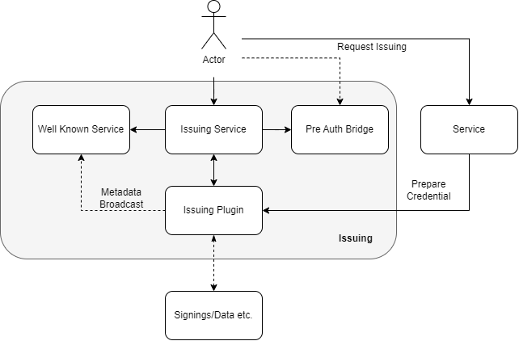
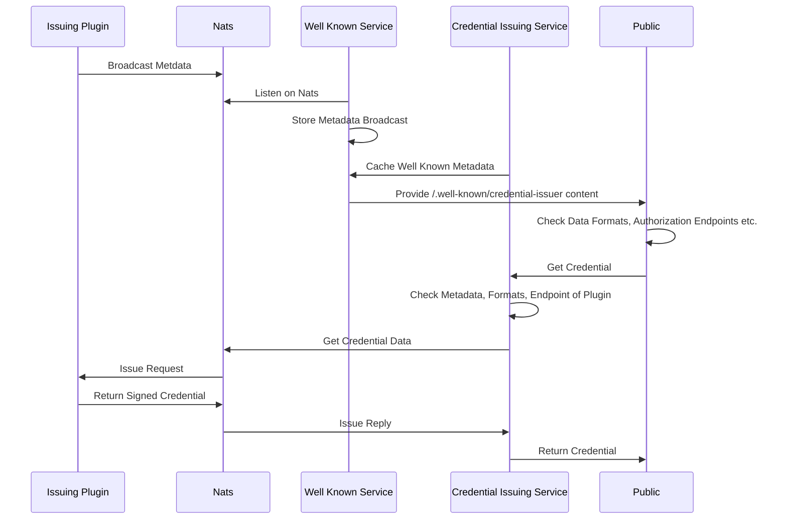
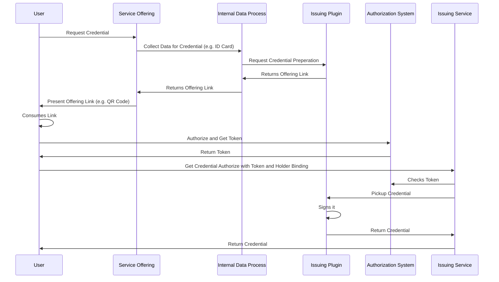
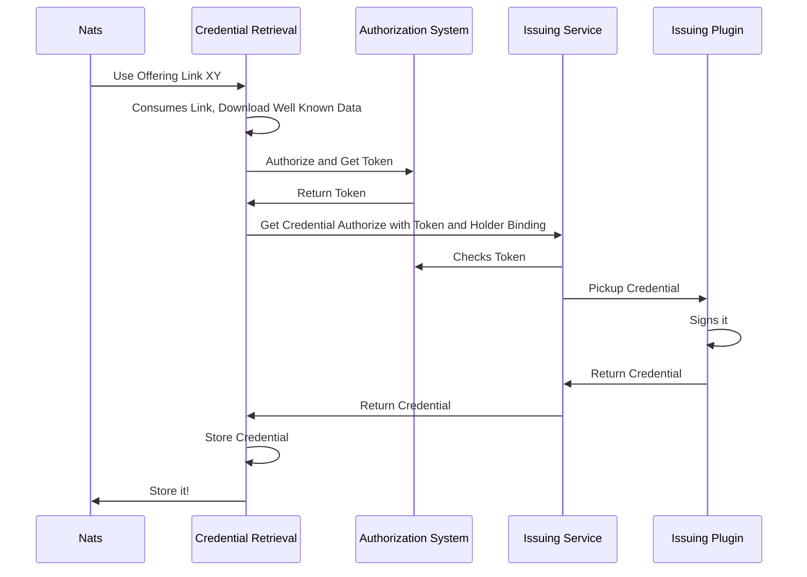
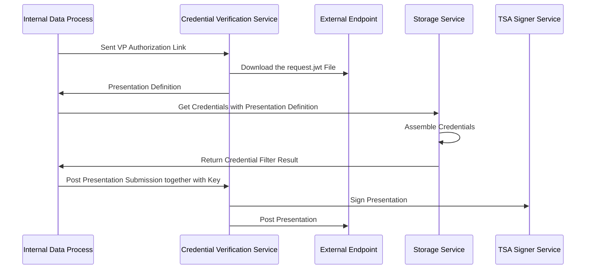
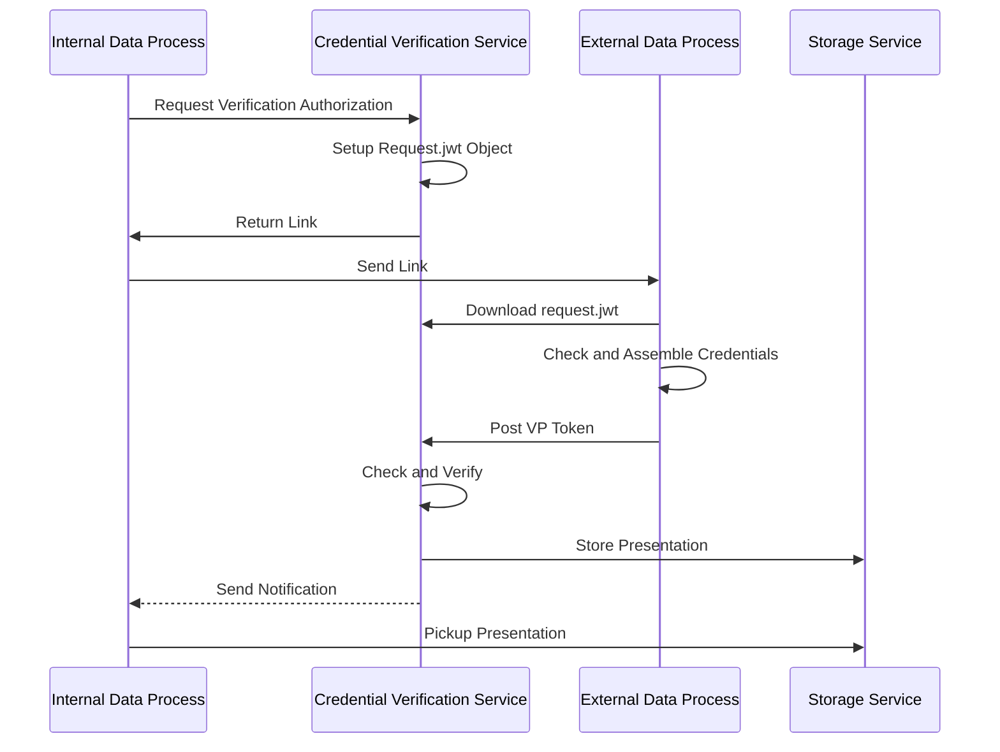
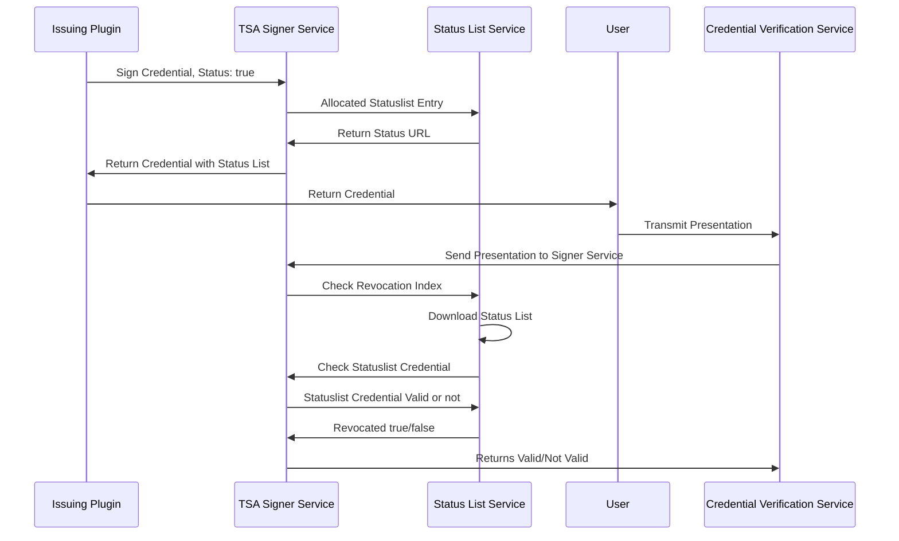
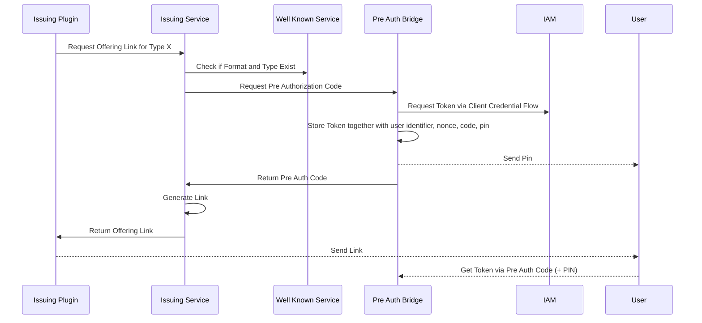
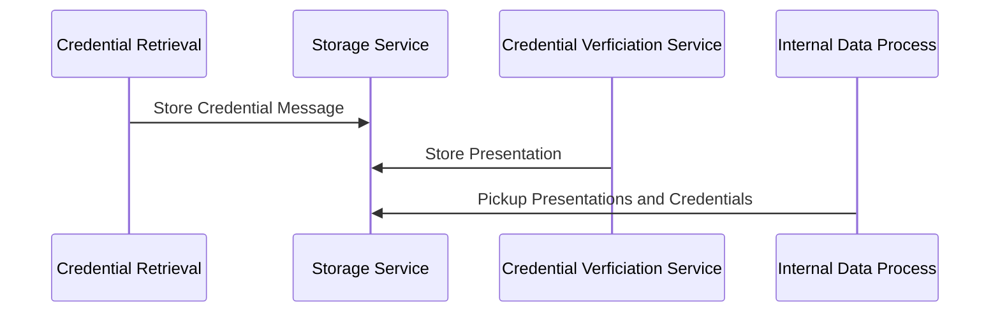

# Introduction

This repository gives an overview about the OCM W-Stack construction, concepts and flows. If anything is missing please create an issue:) 

# Quick Start

Please follow this [instruction](https://gitlab.eclipse.org/eclipse/xfsc/organisational-credential-manager-w-stack/deployment) to get the OCM W-Stack up and running. It includes guide for local bootstrapping.

# Concept

The OCM W-Stack is made for supporting the [OID4VC](https://openid.net/specs/openid-4-verifiable-credential-issuance-1_0.html) and [VP](https://openid.net/specs/openid-4-verifiable-presentations-1_0.html) protocol based on the open id specifications which contain some new flows and endpoints. Actually the entire content of this specification is an extension to existing open id functionality which makes it possible to split the core business of this protocols in various micro service by using the [oid4vip library](https://gitlab.eclipse.org/eclipse/xfsc/libraries/ssi/oid4vip) Means that the OID4VC functionality is seperated from the OID4VP functionality to get an kind of "Cloud Native" OCM which is flexible enough to support a lot of use cases. The OCM W-Stack is therefore split in the domains: issuing, verification, holdership, key management and communication. According to that the OCM W-Stack contains the following services: 

| Service                                                                                                                                                                       |Domain|Hub location (Harbour)|
|-------------------------------------------------------------------------------------------------------------------------------------------------------------------------------|------|------|
| [Credential Issuance Service](https://gitlab.eclipse.org/eclipse/xfsc/organisational-credential-manager-w-stack/credential-issuance/issuance-service)                         |Issuing|https://node-654e3bca7fbeeed18f81d7c7.ps-xaas.io/harbor/projects/8/repositories/issuance-service|
| [Credential Issuance Service Issuer Plugin](https://gitlab.eclipse.org/eclipse/xfsc/organisational-credential-manager-w-stack/credential-issuance/modules/dummycontentsigner) |Issuing|https://node-654e3bca7fbeeed18f81d7c7.ps-xaas.io/harbor/projects/8/repositories/dummycontentsigner|
| [TSA Signer Service](https://gitlab.eclipse.org/eclipse/xfsc/tsa/signer)                                                                                                      |Issuing/Verification/Holdership|https://node-654e3bca7fbeeed18f81d7c7.ps-xaas.io/harbor/projects/16/repositories/signer|
| [Storage Service](https://gitlab.eclipse.org/eclipse/xfsc/organisational-credential-manager-w-stack/storage-service)                                                          |Holdership|https://node-654e3bca7fbeeed18f81d7c7.ps-xaas.io/harbor/projects/8/repositories/storage-service|
| [Credential Retrieval Service](https://gitlab.eclipse.org/eclipse/xfsc/organisational-credential-manager-w-stack/credential-retrieval-service)                                |Holdership|https://node-654e3bca7fbeeed18f81d7c7.ps-xaas.io/harbor/projects/8/repositories/credential-retrieval-service|
| [Credential Verification Service](https://gitlab.eclipse.org/eclipse/xfsc/organisational-credential-manager-w-stack/credential-verification-service)                          |Holdership/Verification|https://node-654e3bca7fbeeed18f81d7c7.ps-xaas.io/harbor/projects/8/repositories/credential-verification-service|
| [Status List Service](https://gitlab.eclipse.org/eclipse/xfsc/organisational-credential-manager-w-stack/status-list-service)                                                  |Issuing/Verification|https://node-654e3bca7fbeeed18f81d7c7.ps-xaas.io/harbor/projects/8/repositories/status-list-service|
| [Well Known Service](https://gitlab.eclipse.org/eclipse/xfsc/organisational-credential-manager-w-stack/well-known-service)                                                    | Issuing|https://node-654e3bca7fbeeed18f81d7c7.ps-xaas.io/harbor/projects/8/repositories/well-known-service|
| [Pre Authorization Bridge](https://gitlab.eclipse.org/eclipse/xfsc/organisational-credential-manager-w-stack/pre-authorization-bridge)                                        | Issuing|https://node-654e3bca7fbeeed18f81d7c7.ps-xaas.io/harbor/projects/8/repositories/pre-authorization-bridge|
| [Didcomm Connector](https://gitlab.eclipse.org/eclipse/xfsc/common-services/didcomm-connector)                                                                                | Communication|https://node-654e3bca7fbeeed18f81d7c7.ps-xaas.io/harbor/projects/14/repositories/didcomm-connector|
| [Universal Resolver](https://gitlab.eclipse.org/eclipse/xfsc/dev-ops/helm-charts/-/tree/main/universalresolver/deployment/helm?ref_type=heads)                                |Communication|https://node-654e3bca7fbeeed18f81d7c7.ps-xaas.io/harbor/projects/15/repositories/universal-resolver|
| [Hashicorp Vault](https://gitlab.eclipse.org/eclipse/xfsc/dev-ops/helm-charts/-/tree/main/hashicorp-vault/deployment/helm?ref_type=heads)                                     |Key Management|https://node-654e3bca7fbeeed18f81d7c7.ps-xaas.io/harbor/projects/15/repositories/hashicorp-vault|
|[Sd-Jwt Service](https://gitlab.eclipse.org/eclipse/xfsc/common-services/sd-jwt-service)|Issuing/Verification|https://node-654e3bca7fbeeed18f81d7c7.ps-xaas.io/harbor/projects/14/repositories/sdjwt-service|
|[OID4VIP Library](https://gitlab.eclipse.org/eclipse/xfsc/libraries/ssi/oid4vip)|Presentation Definition/OID4VC||


All of this service can be seperated by domains, so if just issuing is required, this one can be deployed seperatly. Communication Domain can be simply removed or added so long as the internal communication is handled over the message bus.

# Construction

As written before the structure is realized as micro service structure:


The microservices are build on top of a small [core](https://gitlab.eclipse.org/eclipse/xfsc/libraries/microservice/core) library which contains the basic functions for micro services. In later versions the [goa](https://goa.design/) framework would be an option to make the services more mightfull. 

Some of the micro services are using an cassandra db because storing, presenting or retrieving credentials  can be an high parallel progress, which requires a scalable database in the background. This ensures that each account, user or other entitiy has a quick access to its own credentials/presentations/connections doesnt matter which datacenter is hit by the DNS in a bigger deployment: 


## Key Management

For the key management a [plugin system](https://gitlab.eclipse.org/eclipse/xfsc/libraries/crypto/engine) was designed to be integrated in the components like storage service and tsa signer service dynamically by docker image build. Means each docker build can contain another engine without recompiling or modifiying the service itself. The [interface](https://gitlab.eclipse.org/eclipse/xfsc/libraries/crypto/engine/core#compilation-of-modules) must be implemented and the compilation should consider the libraries of the tsa service (they must be aligned otherwise you see errors during execution).

## Well Known 

The well known handling consists of multiple parts. The well known service which handles the well known credential issuer metadata combined of the plugins, the well known did configuration of the service, the well known did.json, the well known openid configuration of the preauthorization bridge and the well known jwks of the ocm. 


Within the credential issuer metadata the credential issuer is refered over the did json. Within the open id configuration the jwks.json is refered. The credential issuer metadata refer as well to the open id configuration as part of the authorization server list. 

The well known urls itself are created by ingress rules:

- [Signer Service](https://gitlab.eclipse.org/eclipse/xfsc/personal-credential-manager-cloud/deployment/-/blob/main/Well%20Known%20Ingress%20Rules/templates/ingress.yaml?ref_type=heads)
- [Pre Auth Bridge](https://gitlab.eclipse.org/eclipse/xfsc/personal-credential-manager-cloud/deployment/-/blob/main/PreAuthBridge/values.yaml?ref_type=heads)
- [Credential Issuer Metadata](https://gitlab.eclipse.org/eclipse/xfsc/personal-credential-manager-cloud/deployment/-/blob/main/Well%20Known%20Service/values.yaml)

Each ingress rule points to another service, and defines each service as part of ./well-known. From outside looks this as one service.

## Issuing Plugins

The credential issuing service implements the issuance endpoints and checks of the OID4VC protocol, but implements itself no issuing of credentials. This functionality can be collected in "Issuing Plugins" which contain the real signing, data collection and process. The reason for that is that the issuing service protocol itself will never change, just the content collection and credential formats. For example before an offering link is created, there should be data content of the credential which shall be issued. During the credential endpoint selection and authorization checkup, the credential data can be picked up, signed and delivery to the requestor. An example for such a issuing plugin can you see [here](https://gitlab.eclipse.org/eclipse/xfsc/organisational-credential-manager-w-stack/credential-issuance/modules/dummycontentsigner)




## Credential Retrieval Service

The OID4VC Protocol as such has no clear definition how an credential can be retrieved by an machine, because the main assumption is always that a user is doing activly something. This concept was therefore extended by an retrieval service which does the authorization, the get credential request and the storing of a credential in the storage service.


## Pre Authorization Bridge

The pre authorization bridge is a tool to provide the functionalities for the new introduced [pre authorization flow](https://openid.net/specs/openid-4-verifiable-credential-issuance-1_0.html#name-pre-authorized-code-flow) This flow introduces a new grant type which is not yet supported by standard OIDC Servers. Main Idea of the service is to generate pre auth codes + pin for a later exchange against an valid JWT token from an existing authorization server in the backround.


## Storage Service

The storage service is a service which is designed for multiple purposes: 

- Big Data Storage for Credentials (billion scale)
- Multi Tenancy to support user specific storage and access
- Internal and External Usage (e.g. by mobile devices)

By default the storage uses the [crypto engine](https://gitlab.eclipse.org/eclipse/xfsc/libraries/crypto/engine) to encrypt and decrypt credentials on the fly. 

## OID Protocols

The basic data models and processes are defined in the [oid libary](https://gitlab.eclipse.org/eclipse/xfsc/libraries/ssi/oid4vip)

# Flows

This flows describing the conceptional flows of the ocm w-stack. More details about the flows and components in general can you find in the repos of the services.

## Presentation Flows

The OID4VC protocol is split in request and retrieval part to request and receive presentations.

Presentation Request:


Presentation Verification:


## Well Known Flow

This flow describes the well known service in the context of issuing plugins, issuing service and the public users.

Retrieve issuer metadata:

```curl
curl -X GET -H "User-Agent: python-requests/2.32.3" -H "Accept-Encoding: gzip, deflate" -H "Accept: */*" -H "Connection: keep-alive" -d 'None' https://cloud-wallet.xfsc.dev/.well-known/openid-credential-issuer
```



## Credential Issuing Flow

The credential issuing flow works over offering links which are created on an request of any user (natural/machine). After the request the credential data must be prepared for later signing and pickup. The credential itself is not directly signed in cause of missing holder binding.




Example Offering Link:

[openid-credential-offer://?credential_offer=%7B%22credential_issuer%22%3A%22https%3A%2F%2Fcloud-wallet.xfsc.dev%22%2C%22credentials%22%3A%5B%22DeveloperCredential%22%5D%2C%22grants%22%3A%7B%22authorization_code%22%3A%7B%22issuer_state%22%3A%22%22%7D%2C%22urn%3Aietf%3Aparams%3Aoauth%3Agrant-type%3Apre-authorized_code%22%3A%7B%22pre-authorized_code%22%3A%22VpKXRRzgTi23cCC9UUf2%22%2C%22user_pin_required%22%3Afalse%7D%7D%7D](openid-credential-offer://?credential_offer=%7B%22credential_issuer%22%3A%22https%3A%2F%2Fcloud-wallet.xfsc.dev%22%2C%22credentials%22%3A%5B%22DeveloperCredential%22%5D%2C%22grants%22%3A%7B%22authorization_code%22%3A%7B%22issuer_state%22%3A%22%22%7D%2C%22urn%3Aietf%3Aparams%3Aoauth%3Agrant-type%3Apre-authorized_code%22%3A%7B%22pre-authorized_code%22%3A%22VpKXRRzgTi23cCC9UUf2%22%2C%22user_pin_required%22%3Afalse%7D%7D%7D)

Create Offer:
```curl
curl -X PUT -H "User-Agent: python-requests/2.32.3" -H "Accept-Encoding: gzip, deflate" -H "Accept: */*" -H "Connection: keep-alive" -H "Content-Length: 447" -d '{"credential_offer": "openid-credential-offer://?credential_offer=%7B%22credential_issuer%22%3A%22https%3A%2F%2Fcloud-wallet.xfsc.dev%22%2C%22credentials%22%3A%5B%22DeveloperCredential%22%5D%2C%22grants%22%3A%7B%22authorization_code%22%3A%7B%22issuer_state%22%3A%22%22%7D%2C%22urn%3Aietf%3Aparams%3Aoauth%3Agrant-type%3Apre-authorized_code%22%3A%7B%22pre-authorized_code%22%3A%22VpKXRRzgTi23cCC9UUf2%22%2C%22user_pin_required%22%3Afalse%7D%7D%7D"}' https://cloud-wallet.xfsc.dev/api/offering/retrieve/4c216ab0-a91a-413f-8e97-a32eee7a4ef4
```

List Offers:
```curl
curl -X GET -H "User-Agent: python-requests/2.32.3" -H "Accept-Encoding: gzip, deflate" -H "Accept: */*" -H "Connection: keep-alive" -d 'None' https://cloud-wallet.xfsc.dev/api/offering/list/4c216ab0-a91a-413f-8e97-a32eee7a4ef4
```

Accept Offer:
```curl
curl -X DELETE -H "User-Agent: python-requests/2.32.3" -H "Accept-Encoding: gzip, deflate" -H "Accept: */*" -H "Connection: keep-alive" -H "Content-Length: 159" -d '{"accept": true, "holderKey": "23dedadb-ac64-45b0-870c-460778098c3a", "holderNamespace": "accountSpace", "holderGroup": "4c216ab0-a91a-413f-8e97-a32eee7a4ef4"}' https://cloud-wallet.xfsc.dev/api/offering/clear/4c216ab0-a91a-413f-8e97-a32eee7a4ef4/46195de9-0f6b-4ae7-ae3d-ab614a06e3b0
```

## Credential Retrieval Flow

The credential retrieval flow is for retrieving credentials based on an offering link. The service will use a link and does the authorization and the pickup of the credential. The storing of the credential is handled over nats and each storage service behind that can be connected.


## Credential Presentation Flow

The Credential Presentation Flow describes the flow how the components are used to process VP authorization links. Basis for this flow is the oid4vp [cross device flow](https://openid.net/specs/openid-4-verifiable-presentations-1_0.html#name-cross-device-flow).



Example Authorization Link:

[https://cloud-wallet.xfsc.dev/api/presentation/authorize?client_id=mytest&request_uri=https%3A%2F%2Fcloud-wallet.xfsc.dev%2Fapi%2Fpresentation%2Frequest%3FtenantId%3Dtenant_space%26id%3D6e505f33-8fbb-4a30-955b-a190019e6b91%26requestId%3D9fed8a95-79fe-45bb-b2cb-7b3654d04457%26groupId%3D%26ttl%3D604800%26presentationDefinition%3DeyJpZCI6Ijg2YTdkZjRiLWRkMGQtNGEyMi1hNWQxLTU5NTQ0ODAzNjgzMCIsIm5hbWUiOiJ0ZXN0IiwicHVycG9zZSI6Ikkgd2FubmEgc2VlIGl0ISIsImlucHV0X2Rlc2NyaXB0b3JzIjpbeyJpZCI6IjMzNjNhMjQ3LWZmZWUtNDY0Yi05OGFiLTIxY2I2YTVmOTZiYyIsImZvcm1hdCI6eyJsZHBfdnAiOnt9fSwiY29uc3RyYWludHMiOnsiZmllbGRzIjpbeyJwYXRoIjpbIiQuY3JlZGVudGlhbFN1YmplY3QiXSwiZmlsdGVyIjp7InR5cGUiOiIiLCJwYXR0ZXJuIjoiQWwifX1dfX1dLCJmb3JtYXQiOnsibGRwX3ZwIjp7fX19&authUrl=https://cloud-wallet.xfsc.dev/en/wallet/selection](https://cloud-wallet.xfsc.dev/api/presentation/authorize?client_id=mytest&request_uri=https%3A%2F%2Fcloud-wallet.xfsc.dev%2Fapi%2Fpresentation%2Frequest%3FtenantId%3Dtenant_space%26id%3D6e505f33-8fbb-4a30-955b-a190019e6b91%26requestId%3D9fed8a95-79fe-45bb-b2cb-7b3654d04457%26groupId%3D%26ttl%3D604800%26presentationDefinition%3DeyJpZCI6Ijg2YTdkZjRiLWRkMGQtNGEyMi1hNWQxLTU5NTQ0ODAzNjgzMCIsIm5hbWUiOiJ0ZXN0IiwicHVycG9zZSI6Ikkgd2FubmEgc2VlIGl0ISIsImlucHV0X2Rlc2NyaXB0b3JzIjpbeyJpZCI6IjMzNjNhMjQ3LWZmZWUtNDY0Yi05OGFiLTIxY2I2YTVmOTZiYyIsImZvcm1hdCI6eyJsZHBfdnAiOnt9fSwiY29uc3RyYWludHMiOnsiZmllbGRzIjpbeyJwYXRoIjpbIiQuY3JlZGVudGlhbFN1YmplY3QiXSwiZmlsdGVyIjp7InR5cGUiOiIiLCJwYXR0ZXJuIjoiQWwifX1dfX1dLCJmb3JtYXQiOnsibGRwX3ZwIjp7fX19&authUrl=https://cloud-wallet.xfsc.dev/en/wallet/selection)

```

## Credential Presentation Verification Flow: 

This flow describes how a verification authorization is constructed on the basis of the oid4vp [cross device flow](https://openid.net/specs/openid-4-verifiable-presentations-1_0.html#name-cross-device-flow). The request.jwt is dynamically created per link and accessible for external pickup during the lifetime of the internal storage.



## Status List Flow

The status list service provides to the tsa signer service over nats the capability to verify and create status list entries.



Note: The signing can not yet be 100% decoupled over nats, because tsa signer service uses in the moment HTTP calls for retrieving sign requests of credentials. This functionality must be added in later iterations.  


## Pre Authorization Bridge Flow

This flow describes how the pre auth bridge is used to generate offering links and pick up auth tokens.  


Note: This flow is currently using pin and pre auth code. According to current spec, pin is not more used and should be considered as deprecated. 


## Storage Service Flow

The storage service can retrieve events which store presentation and credentials. 



# Cassandra 

Cassandra was used in the most services for a cross dc usage. This can be reached by following common [cassandra guides](https://www.datavail.com/blog/cluster-management-in-cassandra-achieving-scalability-and-high-availability/) for node management. In general it must be decided which topology should be used according to the usecase (rack awareness, dc awareness etc.) This must be considered during the keyspace generation. 

