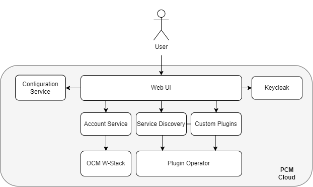
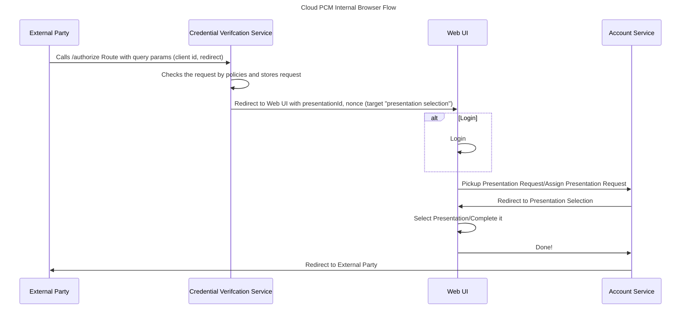

# Architecture Documentation

# Concept

The PCM Cloud is a set of a services which are build on top of the [OCM W-Stack](https://gitlab.eclipse.org/eclipse/xfsc/organisational-credential-manager-w-stack/architecture-documentation) to support user specific operations. This is realized by the following services:

|Service|Purpose|
|-------|-------|
|[Web UI](https://gitlab.eclipse.org/eclipse/xfsc/personal-credential-manager-cloud/web-ui) |User UI for PCM Cloud for issuing, accepting presentations etc.|
|[Plugins](https://gitlab.eclipse.org/eclipse/xfsc/personal-credential-manager-cloud/plugins)| Customization for Web Ui|
|[Plugin Discovery](https://gitlab.eclipse.org/eclipse/xfsc/personal-credential-manager-cloud/plugin-discovery)| Service for Providing Informations about existing plugins|
|[Plugin Kubernetes Operator](https://gitlab.eclipse.org/eclipse/xfsc/personal-credential-manager-cloud/plugin-kubernetes-operator)| Kubernetes Operator for registering plugins|
|[Account Service](https://gitlab.eclipse.org/eclipse/xfsc/personal-credential-manager-cloud/account-service)| Account Management service for users and connector to OCM W-Stack Services|
|Keycloak| IAM System for user registration|
|Kong| Rest API Management for registering plugins|
|TSA Policy Service| Provides Policy Execution for Plugin SDK|
|[Universal Resolver](https://gitlab.eclipse.org/eclipse/xfsc/dev-ops/helm-charts/-/tree/main/universalresolver/deployment/helm?ref_type=heads)| Provides a resolver for the policy service and did core lib|

Main service is here the account service which interacts with the OCM W-Stack and handles processes arround the user creation. This is done in combination with keycloak. The other services supporting the plugin handling/ visualization.

# Construction

The pcm cloud consist of the web ui which is protected by key cloak, the account service, a configuration service, service discovery, a plugin operator and full OCM W-Stack. Each key cloak user represents an account within this tenant. The Web UI acts as controller interface for OCM W-Stack functionality supported by the other services. 

The functionality can be enhanced by custom plugins which can be registered per deployment in namespaces. There are [frontend](https://gitlab.eclipse.org/eclipse/xfsc/personal-credential-manager-cloud/plugins/frontend-template) and [backend](https://gitlab.eclipse.org/eclipse/xfsc/personal-credential-manager-cloud/plugins/backend-template) plugins which must be [deployed](https://gitlab.eclipse.org/eclipse/xfsc/personal-credential-manager-cloud/plugins/deployment) together. The plugin operator will then scan within the configured namespace to find the definitions and registers them into kong where they are readable by the service discovery. The service discovery provides then the endpoint information to the web ui, that each plugin is reachable. 

# User Handling/Account Management

The current system uses a keycloak to login the user. Each user can register himself by the registering function of the keycloak to create a new account. 

# Flows

The PCM cloud flows are mostly the same as in OCM W-Stack, just with some different triggers. The PCM Wallet can be triggered by two differen flows from outside. First one is the browser internal redirect flow

## Browser Internal Redirect Flow

