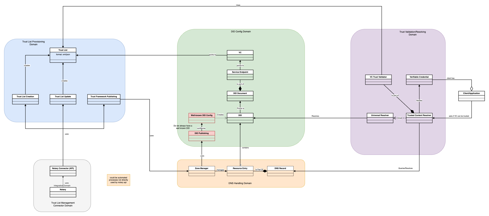
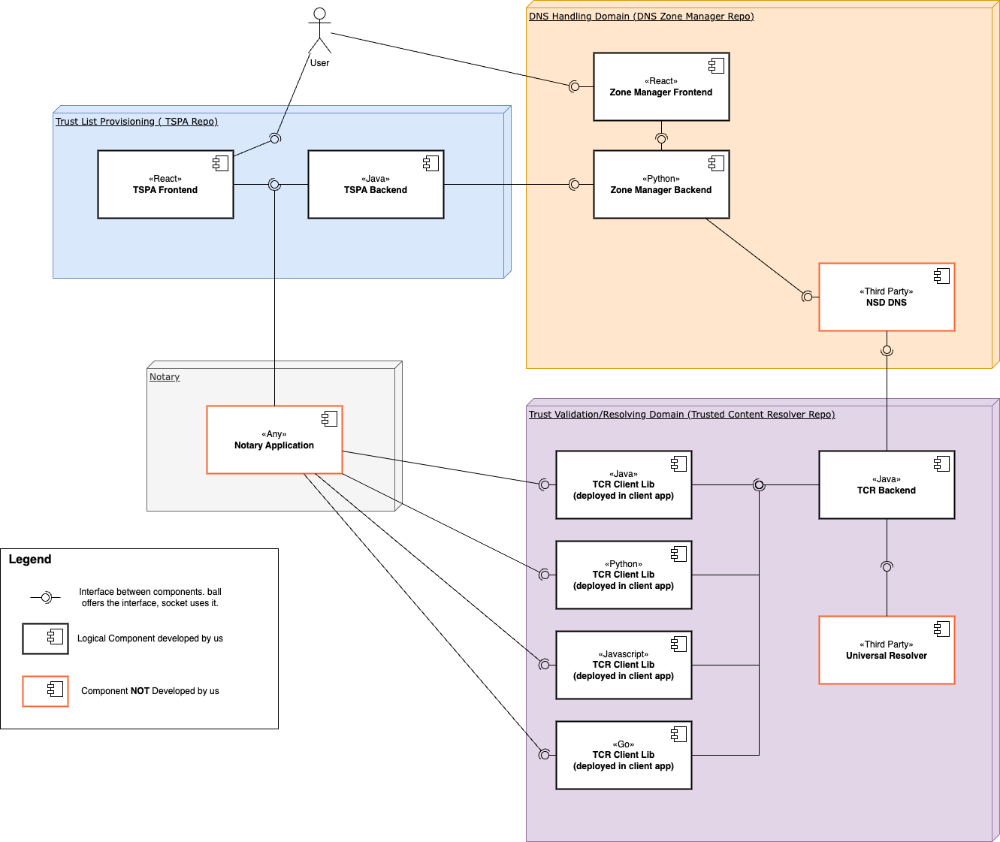

[TOC]

# TRAIN Architecture Documentation

Most of the TRAIN Architecture is defined by the document [Trust Management Infrastructure for Gaia-X Concept Document](./Trust%20Management%20Infrastructure%20for%20GX.pdf)

Some acceptance Criteria need to be documented in an overarching documentation, which also serves do document any Change requests which modify the architecture and concept described in the linked document.

## Components and Interactions
Supplementing the architecture concept we will display the domain model that our TRAIN implementation is based on, as well as shocase the logical components and their interactions.

### Domain Model

Above linked image includes the draw.io diagram.

### Logical components

Above linked image includes the draw.io diagram.

## Documentation

Generally each component contains their own documentation for the following:

- User Manual
- Administration Manual
- Build/Installation Manual

Information on the automatic tests is collected in the BDD repository, or here as part of the [Testing Concept](../concepts/test-concept/Readme.md)

## Scaling
Since Scaling was only required but not specified in the concept document we will explain how each of the components can be scaled, and which ones cannot be scaled and for which reason.

### Trusted Content Resolver & TSPA
Both of those components are considered Stateless, as they do not utilize a database or want to store information persistently. This makes scaling them very simple. Just run the deployment multiple times as part of a scalable deployment. This then also allows autoscaling when necessary.

### NSD Based Zone Manager
The zone Manager is a special case, as it is interwoven with the DNS server deployment which comes with specific considerations.

For the Zonemanager, any DNS subservers that are part of the same DNS zone and should contain redundant data must be present and known at startup. In addition the Zonemanager code can only modify the DNS masters zone configuration file, which means scaling is not possible, as there can only ever be one master, and the zonemanager and nsd server are packaged in the same image.

To still achieve DNS scaling, we propose the following structure:

Setup any number of NSD servers to work as redundant and scaled DNS Servers. These should *NOT* come with the zonemanager backend. Next, setup the zonemanager as the master NSD Server through the configuration options defined in the Zone manager administration manual.
