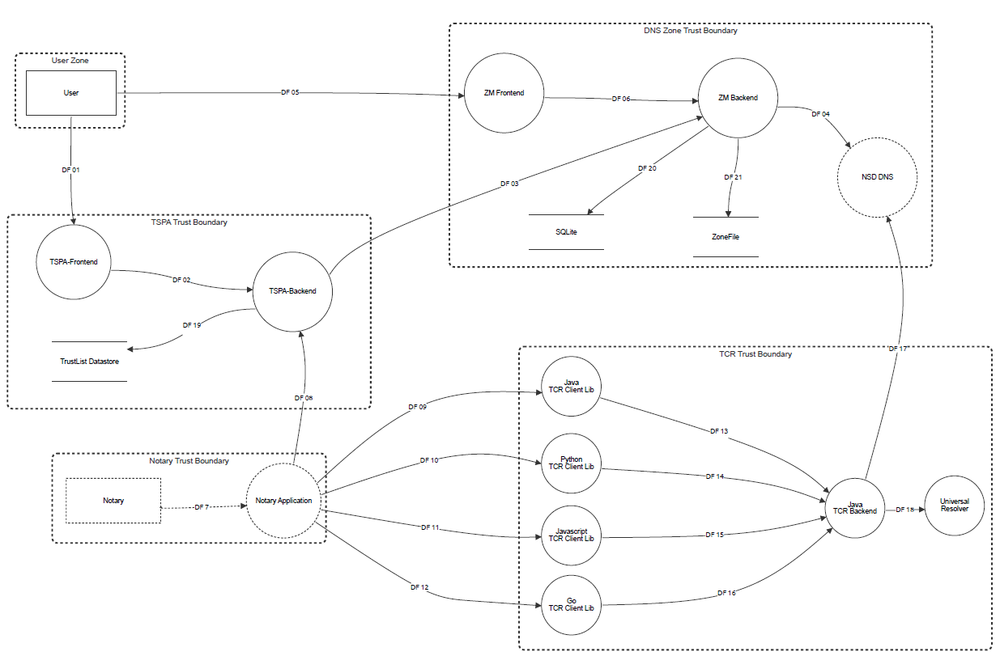
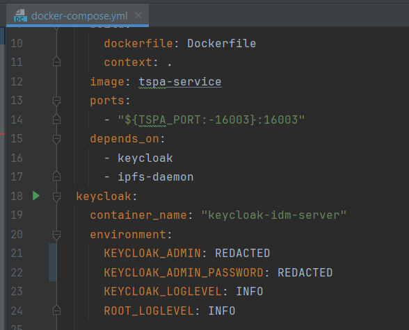

# GAIA-X TRAIN: Security Concept

## Introduction

TRAIN is a protocol for managing trust frameworks, i.e. lists of trust anchors
for the validation of electronic documents. It does so by anchoring these lists
via URI resource record sets in the Domain Name System (DNS) and having issuers
of electronic document link to the relevant trust frameworks via PTR resource
record sets.

To determine the trust in an issuer, one would request the list of trust
frameworks the issuer claims to be part of as PTR records, and for the
application acceptable trust frameworks, verify the issuer's membership by
retrieving the trust anchor list for the framework and verifying the issuer's
presence in this list. Locating the the list in turn is done by first reading
Decentralized Identifiers (DIDs) from the framework's URI records, and then
resolving it into a document.

The purpose of this document is to highlight security considerations when
deploying TRAIN and the present implementation of the components belonging to
TRAIN in particular.

## Structural Analysis
Overall Architecture:

### TSPA

The feature Trust Framework and Trust List Provision is responsible for configuring and managing trust frameworks with its corresponding trust lists.  Other functions include hosting the trust list VC, anchoring the service end points to the DID Document and transferring the data to be anchored in the DNS using the Zone Manager Handler.

### TTV (TCR)

The Trusted Content Resolver feature is responsible for the Trust Discovery and Trust Validation functionalities based on the input from the Verifiable Credential / Verifiable Presentation. The trust discovery process is realized through the DNS Resolver and the Universal DID Resolver. This feature is also able to validate the cryptographic signatures of the VC and the trust list. It is also able to differentiate different trust lists based on the data anchored in the VC. It is able to validate the institutional trust of credentials by using issuer details on the trust list.

### Zone Manager

The DNS Zone Management is the component responsible for managing the DNS zone file and used for anchoring the trust framework DID information into the zone file. It is also responsible for resigning the zone file based on DNSSEC for every new update in the zone file. The zone manager service was designed to serve the Train Trust Framework Manager only. It manages a zone file by:

- Creating an intermediate database for NS, A, PTR and URI records
- Providing authentication mechanism to protect endpoints
- Exposing secure endpoints for managing PTR records (associated with trust frameworks) and URI records (associated with trust lists)
- Updating records and resigning zone file
- Using DNSSEC to provide and additional security layer to the DNS service

## Threat Modeling

Threat modeling is a highly valuable conceptual analysis technique that can be used to identify potential vulnerabilities (or risks) early in the development of applications or services and to derive the necessary measures. In order to accomplish this goal STRIDE as a framework was chosen.

The attacker model that was used includes both an external attacker and an malicious internal actor.

[STRIDE](https://learn.microsoft.com/de-de/azure/security/develop/threat-modeling-tool-threats) is a mature and popular threat modeling technique and mnemonic originally developed by Microsoft employees. To facilitate threat identification, STRIDE groups threats into one of six general categories and prompts modelers to systematically consider how these general threats may materialize within the context of the specific system being evaluated. Each STRIDE category may be considered a violation of a desirable security attribute; the categories and associated desirable attributes are as follows:

|Threat Category |	Violates |	Examples |
| ------------- | ------------- | ------------- |
| Spoofing |	Authenticity |	An attacker steals the authentication token of a legitimate user and uses it to impersonate the user.
| Tampering |	Integrity |	An attacker abuses the application to perform unintended updates to a database.
| Repudiation |	Non-reputability |	An attacker manipulates logs to cover their actions.
| Information Disclosure |	Confidentiality |	An attacker extract data from a database containing user account info.
| Denial of Service	| Availability |	An attacker locks a legitimate user out of their account by performing many failed authentication attempts.
| Elevation of Privileges |	Authorization	| An attacker tampers with a JWT to change their role.

STRIDE provides valuable structure for responding to the question of "what can go wrong". It is also a highly flexible approach and getting started need not be complex. STRIDE categories are also incorporated into popular threat modeling tools such as [OWASP's Threat Dragon](https://github.com/OWASP/threat-dragon) which is used to achieve the threat model for the TRAIN application.
The full document can be found [here](https://gitlab.eclipse.org/schanzen/trusted-content-resolver/-/blob/main/docs/Threat%20Model/Report.pdf).

There are three mayor use cases that are identified in TRAIN:
	1. Initial Setup of the trust list
	2. Trust list enrollment and update
	3. Trust Discovery and validation

For the scope the focus for the STRIDE threat model lies on the main components: TSPA, DNS ZoneManager and TTV and its findings are:

1. Data flow encryption is not mandatory and could be overlooked if Kubernetes is not properly used for deploying the necessary components.
2. If Kubernetes is not in use or not properly configured, denial of service attacks can be performed. The availability of critical components then can't be guaranteed.
3. The TSPA-frontend is used for administrative purposes. It can perform CRUD-operations on the TSPA backend. If an attacker gains control over TSPA or is able to bypass the authorization process, he has full access to TSPA and the DNS-Zone due to dependencies.
4. JWT is used to protect the app from unauthorized access. However, the associated service that provides this is out of scope. The damage that a malicious (spoofed) Notary or TSPA could cause is very high. For this reason a strong authentication is important and therefor special requirements must be developed and documented on this service. 
5. All API-Endpoints are currently exposed outwards, which means that everybody can access the endpoints. The Zone-Manager Backend for example, should only have TSPA as its single client, but is open and accessible to everyone.
6. The SQLite database contains critical information which should not reside there for secure DNSSEC operation. The integrity and confidentiality, especially of critical DNSSEC key material, can't be guaranteed.

## API Endpoint Security 

All API endpoints are secured by means of [Ingress nginx Controller](https://kubernetes.github.io/ingress-nginx/how-it-works/), a Kubernetes resource. It is therefore crucial that the deployment happens with Kubernetes, as there are no other underlying protection mechanisms. The Ingress Controller manages external access to the services in a cluster by exposing HTTP and HTTPS routes from outside to services within the cluster. The nginx Controller - by default - uses only TLS 1.2 and 1.3 (see [here](https://kubernetes.github.io/ingress-nginx/user-guide/nginx-configuration/configmap/#ssl-protocols)), while whitelisting the following ciphers (see [here](https://kubernetes.github.io/ingress-nginx/user-guide/nginx-configuration/configmap/#ssl-ciphers)):
- ECDHE-ECDSA-AES128-GCM-SHA256
- ECDHE-RSA-AES128-GCM-SHA256
- ECDHE-ECDSA-AES256-GCM-SHA384
- ECDHE-RSA-AES256-GCM-SHA384
- ECDHE-ECDSA-CHACHA20-POLY1305
- ECDHE-RSA-CHACHA20-POLY1305
- DHE-RSA-AES128-GCM-SHA256
- DHE-RSA-AES256-GCM-SHA384

This is contradictory, as the ciphers whitelisted are exclusively TLS 1.2 Ciphers (see [RFC](https://www.rfc-editor.org/rfc/rfc5246#appendix-A.5)). TLS 1.3 Ciphers would be according to [RFC](https://www.rfc-editor.org/rfc/rfc8446#appendix-B.4):
- TLS_AES_128_GCM_SHA256 
- TLS_AES_256_GCM_SHA384  
- TLS_CHACHA20_POLY1305_SHA256
- TLS_AES_128_CCM_SHA256
- TLS_AES_128_CCM_8_SHA256

As TLS 1.2 Ciphers can not be used in TLS 1.3 and vice versa (see [RFC](https://www.rfc-editor.org/rfc/rfc8446#appendix-B.4)). It is therefore crucial to extend the [ssl-ciphers](https://kubernetes.github.io/ingress-nginx/user-guide/nginx-configuration/configmap/#ssl-ciphers) to at least include one of the TLS 1.3 ciphers mentioned above - only through that one can guarantee that TLS 1.3 is actually supported.

The TLS 1.2 ciphers used above are all adhering to the perfect forward secrecy (PFS) paradigm and are therefore a good choice for ensuring security in the event of leakage of private keys.

## Crypto Concept
The following use of cryptographic methods were identified within the components and in the overall communication between the components. Note that only explicitly used keys/certificates are described - for example the TLS certificate, which is used for TLS is not mentioned, as this is handled by the nginx ingress controller.

| Component        	| Symmetric       	| Asymmetric          	| Hash functions            	| X.509 Certificates 	| Rollover                                          	|
|------------------	|-----------------	|---------------------	|--------------------------	|--------------------	|---------------------------------------------------	|
| TLS              	| AES-128   AES-256 	| ECDSA RSA           	| SHA-256  SHA-384  POLY1305 	| Not specified     	| Session key rotated automatically on each session 	|
| TSPA             	| -               	| Ed25519 (EdDSA) RSA 	| SHA-256 SHA1             	| -                  	| -                                                 	|
| TTV              	| -               	| -                   	| -                        	| -                  	| -                                                 	|
| DNS Zone Manager 	| -               	| ECDSA (P256)        	| SHA-256   SHA-512          	| -                  	|                                                  	| see "Best practice"

## Best practice and recommendations

### Deployment and configuration

It is strongly recommended to use Kubernetes and following best practices when deploying TRAIN. Make sure that HTTPS is enforced for every data flow and node-balancing can be used if a set pod dies.
Make sure that data storages are encrypted strongly and can only be accessed by an authority with the corresponding rights.
In order to ensure the traceability of actions, appropriate logging is recommended. This must be set up in a tamper-proof manner.

It is generally recommended that components or the entire infrastructure explicitly define acceptable TLS versions, rather than relying on default values provided by libraries or plugins. The same applies to used ciphers; for instance, TLS 1.2 defines "dh_anon" as an acceptable cipher, which excludes any authentication mechanism. This practice enhances the management and oversight of used cryptographic mechanisms, which is useful when certain ciphers become outdated or are found to be vulnerable in certain libraries. To strengthen the defense-in-depth approach, we recommend whitelisting specific cipher suites according to best practices (such as BSI guidelines) and specific TLS versions.

To ensure that possible sensitive information is protected not only through separations by means of docker and Kubernetes, one needs to apply additional security measures. For example, it would be a good practice to sign the logs which are produced by the TRAIN components, even though they are already protected through access controls in Kubernetes.

If sensitive material (keys, certificates) are stored, they must be sufficiently secured, for example by using [Java Keystores](https://docs.oracle.com/javase/8/docs/api/java/security/KeyStore.html) or for high security environments hardware security modules (HSMs).

### TSPA

Instead of relying on files as a primary data store, it is recommended to use dedicated databases like PostgreSQL so that one can add additional transaction safety to the overall system. The communication between TSPA and the database should be encrypted, integrity protected, authorized and authenticated. 

If no dedicated database is used, mechanisms ensuring Integrity, Confidentiality, Authentication and Authorization should be used.

The following secrets/keys were found unencrypted within the TSPA components:
- VcJWKPrivateKey 

*Deployment hint*: Store private keys in Java Keystore - if they have high criticality or high security requirements consider storing them in HSM/TPM.

- WkJWKPrivateKey

*Deployment hint*: Store private keys in Java Keystore - if they have high criticality or high security requirements consider storing them in HSM/TPM.

- KEYCLOAK_ADMIN: <_Login_>
- KEYCLOAK_ADMIN_PASSWORD: <_Password_>

*Deployment hint*: Passwords for use in production should be stored in environment variables and accessed as such.

### Zone Manager / TSPA

Securely implementing DNS Security Extensions (DNSSEC) requires a number of technical measures and precautions.
Ideally, [RFC 6781](https://datatracker.ietf.org/doc/html/rfc6781) is read and followed. 

Recommended best practices for the Zone Manager are:

  - Secure DNSSEC KSK and ZSK Handling:
    
    - An operator should clearly differentiate between Key Signing Key (KSK) and Zone Signing Key (ZSK) roles for an added layer of security. [**Related issue**](https://gitlab.eclipse.org/eclipse/xfsc/train/dns-zone-manager/-/issues/35)
    - Ideally, keep the KSKs offline and create multiple ZSK sets from it that can be used during to perform key rollovers for some time. There are [best practice documents](https://github.com/NLnetLabs/dnssec-ceremony-doc) and [tools](https://github.com/NLnetLabs/dnssec-ceremony-tools/) available to achieve this. [**Related issue**](https://gitlab.eclipse.org/eclipse/xfsc/train/dns-zone-manager/-/issues/35)
    - When possible, store cryptographic keys securely using Hardware Security Modules (HSMs) or secure key management systems.
    - Tools such as [OpenDNSSEC](https://www.opendnssec.org/) support integration with any PKCS#11-based HSM, and it also comes with a software emulator for testing (SoftHSM). [**Related issue**](https://gitlab.eclipse.org/eclipse/xfsc/train/dns-zone-manager/-/issues/35)
    - Enforce stringent access controls and perform regular audits.

  - Key Rollover [RFC 6781, Section 4](https://datatracker.ietf.org/doc/html/rfc6781#section-4): [**Open issue**](https://gitlab.eclipse.org/eclipse/xfsc/train/dns-zone-manager/-/issues/35)

    - Implement automated processes for regular key rollover to reduce risks from human error and enhance security.
    - Plan for both [regular](https://datatracker.ietf.org/doc/html/rfc6781#section-4.1) and [emergency](https://datatracker.ietf.org/doc/html/rfc6781#section-4.2) key rollover.
    - A common tooling option to do so is [OpenDNSSEC](https://www.opendnssec.org/).
    - Differentiation between ZSK and KSK allows for more flexibility with respect to the two recommended rollover procedures for ZSKs [double-signature](https://datatracker.ietf.org/doc/html/rfc6781#section-4.1.1.2) and [pre-publish](https://datatracker.ietf.org/doc/html/rfc6781#section-4.1.1.1) each with their own [pros and cons](https://datatracker.ietf.org/doc/html/rfc6781#section-4.1.1.3).
    - In case the algorithm in use is deprecated or broken, [algorithm rollovers](https://datatracker.ietf.org/doc/html/rfc6781#section-4.1.4) need special care.

  - Robust Algorithm and Key Length Selection: [**Related issue**](https://gitlab.eclipse.org/eclipse/xfsc/train/dns-zone-manager/-/issues/35)

    - Choose state-of-the art, recommended cryptographic algorithms with sufficient key lengths. Stay up to industry standards to ensure resilience against cryptographic threats.

  - Continuous Monitoring and Auditing:
  
    - Employ robust monitoring solutions for real-time detection of unusual activities. Regularly audit DNSSEC configurations, key lifetimes, and usage.

  - Communication and Documentation:
  
    - Maintain clear documentation of DNSSEC configurations, emergency procedures, and contact details for key administrators.
    - Establish effective communication channels for coordination.

Some of the above best practices cannot be implemented at this point as further functionality would have to be implemented in the component first (see linked open issues).
In the mean time, in case of an emergency (such as key compromise or loss), the following steps can be taken to roll the keys:

  1. Get current zone contents via REST API and store as JSON.
  2. Clean/Delete the TDZM Deployment, in particular the Volumes.
  3. Create a new TDZM instance (this will generate new keys).
  4. Replay zone contents from JSON via REST API from 1.

Since the new TDZM instance will then use fresh KSKs, the corresponding Delegation Signer (DS) records will have to be updated within the parent zone again.
Note that this may lead to temporary unavailability of DNS records to verifiers due to DNS cache latency (see also [RFC 6781, Section 1.2](https://datatracker.ietf.org/doc/html/rfc6781#section-1.2) and its use in the document).

### Train Trust Validator

As the TTV relies on authenticated information from the DNS, the following should
be taken into consideration:

  - DNSSEC validation should be performed on all records returned from the DNS.
    This validation can be performed by either
  
    - a public recursive resolver
    - a dedicated recursive resolver
    - the dnsjava library when utilizing the Validating Resolver
  
    Communication between an external validating resolver (if applicable) and the
    TTV needs to be integrity protected. This can be done e.g. by using DNS over
    HTTPS (DoH) or DNS over TLS (DoT). In the case of a dedicated resolver on the
    same machine, it is also possible to utilize the operating system to achieve
    this.
    The configuration option `tcr->dns->dnssec->enabled` MUST be set to `true`
    in production deployments.
  
    When the dnsjava library is not performing DNSSEC validation itself, it needs
    to ensure that an upstream resolver has successfully performed the validation
    as indicated by the DNS AD flag. In this case, the operator of the TTV should
    be aware that the validity of requested records (and thus the validation
    procedure for electronic documents) is at the discretion of the external
    resolver's operator.
  
  - Trust anchors for DNSSEC MUST be properly configured *and* maintained through
    the configuration
    option `tcr->dns->dnssec->rootPath` in the configuration file `application.yml`.
    The current trust
    anchors for the root zone (covering most of the DNS) can be requested from
    https://data.iana.org/root-anchors/root-anchors.xml .
  
    DNS zones can be overwritten by their parents. If this is a concern,
    additional trust anchors for zones corresponding to trust frameworks and
    likely issuers may be provisioned.
  
    Note that any key rollovers will have to be reflected in the setup as
    otherwise the resolution will fail.
  
  - A compromise of DNS zones (including any of their parents) will also compromise
    received records from these zones. As a defense, it is possible for static
    zones to cache them locally indefinitely. The relevant records for the TTV
    include URI and PTR records, but some zones may also allow transfers of the
    entire zone or provide zone files.
  
  - The requested zones and records, and thus potential issuers and trust
    frameworks, can be read by any name servers, recursive resolvers and, in the
    case of unencrypted transport channels, network providers.
    Usage of either DoH or DoT may be appropriate to guard against network
    entities on the path to a recursive resolver. If additional secrecy is
    required, likely issuers and trust frameworks may be cached in advance as
    above.
  
  - Due to a bug in the dnsjava dependency up until version `v3.5.3` (latest
    at the point of writing), it is currently not guaranteed that
    records processed by the TTV originate from the correct zone. Thus, it is
    currently highly recommended to utilize an external recursive resolver
    and establish an integrity protected connection to it, for example using
    a DNS-over-HTTPS-enabled resolver service.
    The current configuration file `application.yml` does not allow to configure
    DoH server, so a local instance of a forwarding or validating recursive resolver
    such as [unbound](https://nlnetlabs.nl/projects/unbound/about/) can be
    used.
    [Related issue](https://gitlab.eclipse.org/eclipse/xfsc/train/trusted-content-resolver/-/issues/59)

#### A note on DIDs

In the TRAIN concept, DNS records may contain any DID as part of a URI record
pointing to a trust list.
DIDs have significantly varying levels of maturity and different security concepts.
Care must be taken when selecting the set of supported DIDs.

The TTV currently **only** fully supports the `did:web` DID method.
While the Universal Resolver component may be configured with additional [DID drivers](https://github.com/decentralized-identity/universal-resolver?tab=readme-ov-file#drivers),
DID Documents behind anything other than `did:web` will **NOT** be validated.
A trust-list resolution will happen, but the integrity of the underlying did-document will not be validated.

In the future, other, vetted and carefully selected DIDs may be supported.
This can only happen after careful consideration of their security properties
and threat model.
