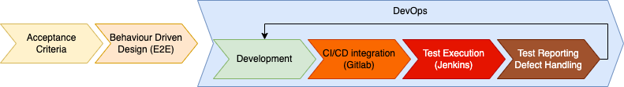

# IDM.TRAIN Test Concept

## Purpose

The purpose of this Testconcept is to describe the general Test Methods and Strategies of the Identity Management and Trust Subcomponent “Trust Management Infrastructure for Gaia-X (TRAIN)”

## Introduction

The trust management infrastructure enables the establishment of a root of trust for entities acting in the Gaia-X ecosystem and credentials issued by these entities. This is achieved through the introduction of Trust Lists combined with anchoring of pointers in the DNS following the TRAIN (Trust Management Infrastructure) concept. These lists, published by Governance Authorities, include entities that are certified according to a certain Trust Framework that is maintained by the respective governance authority. This, for example, supports verifying entities in examining the trustworthiness of Issuers through inclusion in Trust Lists under a specific Trust Framework that is administered by a specific governance authority.
Gaia-X Federations and other entities are supported in the sovereign publication and administration of Trust Lists for specific Trust Frameworks.

## Strategy

The Test Concept is following the best practice as follows:

1. Strategy and derivation of principles and core measures
2. Defining Roles and Responsibilities of test driven and test related measures and follow up processes
3. Definition of target infrastructure
4. Derivation of test cases and process description of how to derive test cases
5. Defect Handling and Handover to DevOps Cycle

### Principles

The testing strategy is driven by the aim to enable for automated E2E-Testing, concretely aiming to fulfill the following principles:
- Behaviour Driven Design (BDD) is used to describe how Acceptance Criteria can be tested
- E2E Testing to be used to demonstrate coverage of acceptance criteria defined in the tender requirements document
- BDD to be used to describe preliminary state on a non technical level
- Automated testing to be used as far as possible to show capabilities
- CI/CD integration to be used to enable showcasing on a clean and sanitized test environment
- Automated testing to be used also for regression testing
- Test Reports will be used to Report on test completeness
- Test Reports to also cover test coverage reporting for compliance
- Relation between features, test cases and potential defects to be used for consistent test and improvement cycle
- Defect Handling Process must connect test execution outcome with the next development iteration, or at least enable another DevOps iteration

### Software Quality Measures in the overall strategy

The Testing Strategy serves the objective to ensure delivery of high quality software. Thus it is to be aligned with other strategic principles, such as clean code or applying cloud native architecture patterns, in order to serve the following software quality requirements / measures:
- Consistent documentation format ([see here](https://gitlab.com/gaia-x/data-infrastructure-federation-services/quality-assurance/-/issues/11))
- Clear Map of flowing Messages ([see here](https://gitlab.com/gaia-x/data-infrastructure-federation-services/quality-assurance/-/issues/10))
- Size of deliverables e.g. Docker Images ([see here](https://gitlab.com/gaia-x/data-infrastructure-federation-services/quality-assurance/-/issues/9))
- Unittest coverage ([see here](https://gitlab.com/gaia-x/data-infrastructure-federation-services/quality-assurance/-/issues/8))
- Compatibility by a common tool stack ([see here](https://gitlab.com/gaia-x/data-infrastructure-federation-services/quality-assurance/-/issues/7))
- Appropriate Logging Output ([see here](https://gitlab.com/gaia-x/data-infrastructure-federation-services/quality-assurance/-/issues/6))
- Microservice Mocking ([see here](https://gitlab.com/gaia-x/data-infrastructure-federation-services/quality-assurance/-/issues/5))
- Automatic update of components ([see here](https://gitlab.com/gaia-x/data-infrastructure-federation-services/quality-assurance/-/issues/4))
- Bootstrap order ([see here](https://gitlab.com/gaia-x/data-infrastructure-federation-services/quality-assurance/-/issues/3))
- Service bootstrap checks / readiness ([see here](https://gitlab.com/gaia-x/data-infrastructure-federation-services/quality-assurance/-/issues/2))
- Harmonization (of Swagger Files) ([see here](https://gitlab.com/gaia-x/data-infrastructure-federation-services/quality-assurance/-/issues/1))

### Application of Measures and Requirements by the testing strategy

Among the above listed software quality requirements, the testing strategy must consider a subset as follows:

| Software Quality Requirement | Addressed in the test concept as follows |
|---|---|
| Consistent documentation format | Test documentation applies conceptual documentation in the implicitly required markdown format and produces test reports in a streamlined way, so it can be understood accross all product domains and all building blocks |
| Clear Map of flowing Messages | Component Testing is implemented applying standardized message flows, while the event driven architecture of the overall system allows checking and tracing of message flows and conformance |
| Unittest coverage | While BDD supports mainly E2E Testing, common test coverage reporting, incorporated into the CI/CD pipeline can be utlized to check and improve unit test coverage |
| Compatibility by a common tool stack | By adding E2E tests and component tests into the CD pipeline, automated build and deployment enforces streamlining, thus compatibility via common toolstack |
| Appropriate Logging Output | BDD Tests will also cover negative test cases, which regularly are evaluated for appropriateness of their output. When logging output is checked by BDD szenarios, appropriateness is checked implicitly. |
| Microservice Mocking | As Python Behave or similar are used to implement the BDD test cases, microservices are to be mocked until they are acutally implemented. |
| Service bootstrap checks / readiness | E2E Tests written in BDD feature files, typically define given steps, that check services for readiness initially, but also check the service status after tests are executed by checking the service status or http return code after test execution again. |

## Testing Layers

Following testing levels and measures are to be considered in order to enable test driven software quality enablement as described above:

- Technical Testing on different layers (unit, component, integration)
- E2E-Tests for functional requirements using automated BDD methodology
- Branch Model
- Patch Management
- Code Quality Verification
- Performance Tests for Up/Down Scale

Following measures are to be incorporated into the E2E Test Automation based on BDD:
- Technical Testing - Component Test, Integration Test
- E2E Test for functional requirements

Following measures are to be included in the CI/CD Process, which is close to the automated E2E testing, but remains responsibility of Development:
- Unit Testing
- Branching Model (to follow Eclipse Foundation Gitlab Branching Model)
- Code Quality Verification (following clean code best practices, e.g. Merge Request Review best practice, Automated Code and vulnerabilities Scanning / Sonarqube e.g.)

Following measures are responsibiliy of operations on customer side, but can be prepared by pre-applying a meaningful minimum set of test executions on the test environment already:
- Performance Tests

## Process description: Enablement of automatic E2E-Tests

The overall strategy, incorporating the different testing layers results in the following testing process

1. The acceptance criteria of the functional requirements based on Software Requirements Specification for IDM.TRAIN-Document will be selected and transformed to testcases in BDD-Syntax, i.e. to tests written in a natural language style
2. The BDD testcases will be implemented using and integrated with Python behave to automatic Testscripts
3. Gitlab is to be used to deploy and trigger the Jenkins Pipeline
4. Jenkins sets up the Testing Environment and creates Test Status Reports
5. Following the Reports, Defects are created after manual review and a standard gitlab defects handling process is followed the gitlab (Eclipse Foundation - Open Source) Standards Flow to enable another DevOps iteration for defect resolution. The final resolution will incorporate regressive testing of the original test cases.

## Components

Subject of the IDM TRAIN Project are following components:

- DNS Zone Manager
- Trust Scheme Publication Authority
- Trusted Content Resolver

All components are based on Open Source standard products. The following OS products are used for the above components list:

| GXFS Component | Base OS Component |
|---|---|
| DNS Zone Manager | https://github.com/H2020LIGHTest/ZoneManager |
| Trust Scheme Publication Authority | https://github.com/H2020LIGHTest/TrustSchemePublicationAuthority |
| Trusted Content Resolver | https://github.com/decentralized-identity/universal-resolver |

The IDM.TRAIN Project targets on delivering Open Source Components in the Eclipse Foundation Gitlab for reuse by any GXFS related party. Thus the testing will be able to deliver artifacts to a test environment, but at the time of development, there is no clear target environment specified beyond the given test systems. This is, why load and performance testing can only be executed, up to a certain extend. However, based on the well defined Acceptance Criteria the BDD driven E2E testing can be automated to a vast extend, based on the forseen CI/CD pipelines incorporating test automation platforms - here Jenkins.

## Functions

The IDM TRAIN project scope is to extend the standard products for certain features. The following list is a comprehensive overview of functions to be added to the below components as features, that can be tested using the the above described BDD driven testing concept:

1. Provision of a Trust Framework and Trust Lists (TSPA Manager is responsible for this functionality):
- Allows for configuration of a Trust Framework
- Allows for Trust List Management
- Provides federation/organization/participant specific Trust Lists in different formats
2. Anchoring a Trust Framework and Trust List into the DNS (Zone Manager is responsible for this functionality):
- Allows for global discovery based on an established and trusted infrastructure
- Trust Frameworks are anchored in DNS Pointer Resource Record (PTR RR)
- Trust List URI DID is anchored in DNS URI Resource Record (URI RR)
- DNSSEC allows for chain of trust
3. Enrollment of trusted entities into the Trust Framework (TSPA connector is responsible for this functionality):
- Notary (via the Notarization API) uses the TSPA connector to enroll trusted entities to the Trust Lists
4. Verifying the Institutional Trust of Verifiable Credentials:
- Trusted Content Resolver is responsible for this functionality
- Allows Global Discovery of Trust Frameworks through DNS Resolver
- The content from terms of Use of the verifiable credential will be used for trust discovery
- Verification of issuer details of the credential with the information of the Trust List
- Verification of the Integrity of VC
- Validation of the Integrity of the chain of trust of DNSSEC
