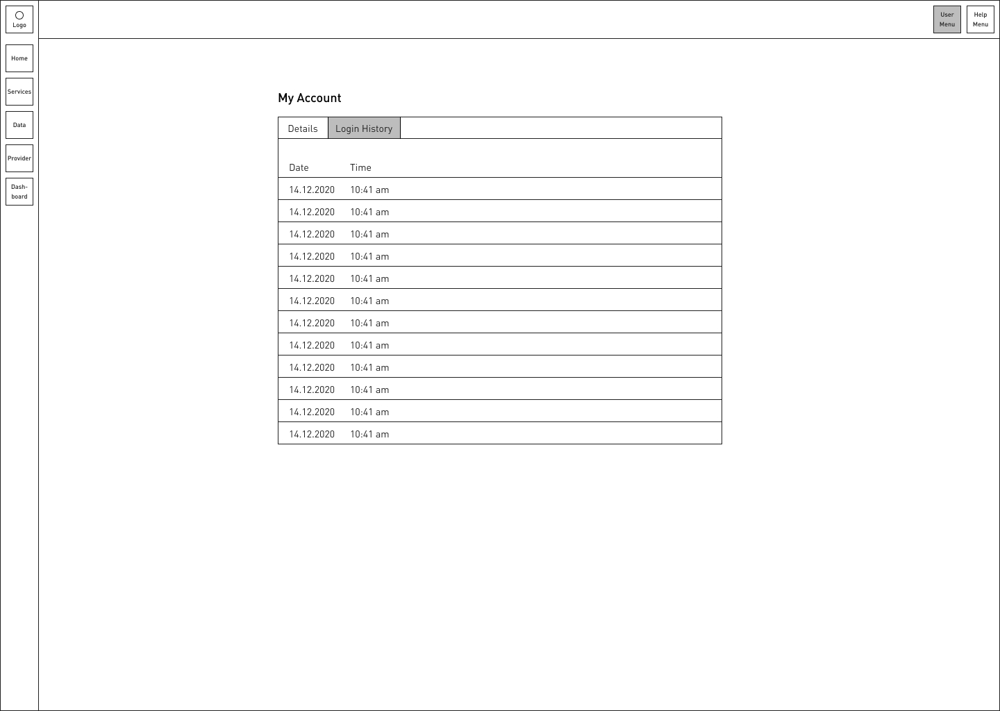
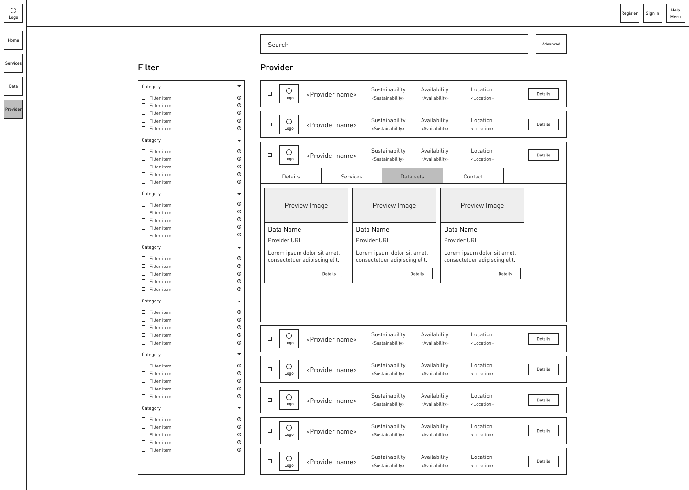
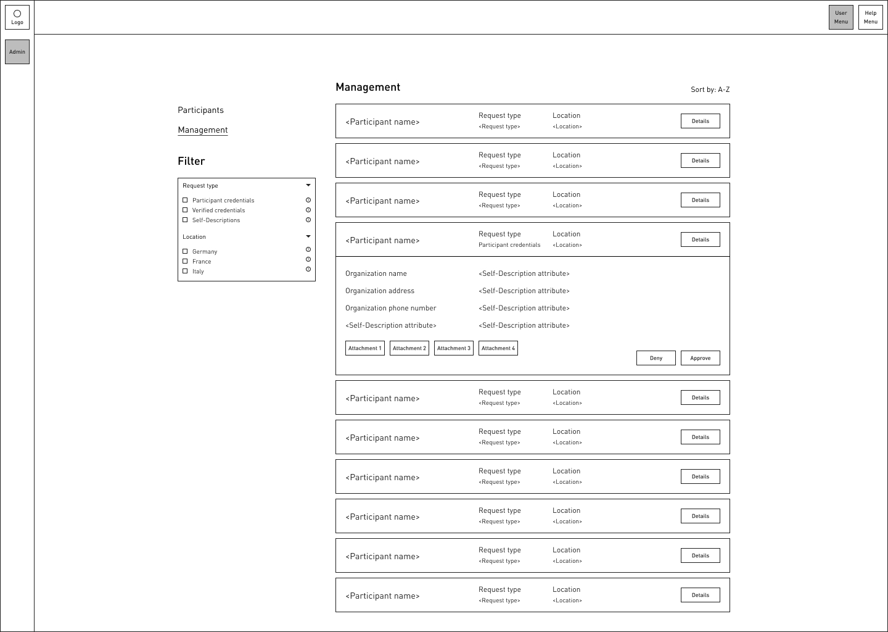

<!--
**Software Requirements  
Specification**

**for**

**Gaia-X Federation Services**

**Integration & Portal  
Portal**

**Published by**

eco – Association of the Internet Industry (eco – Verband der
Internetwirtschaft e.V.)

Lichtstrasse 43h

50825 Cologne

Germany

**Copyright**

© 2021 Gaia-X European Association for Data and Cloud AISBL

This work is licensed under the Creative Commons Attribution 4.0
International License. To view a copy of this license, visit
<http://creativecommons.org/licenses/by/4.0/> or send a letter to
Creative Commons, PO Box 1866, Mountain View, CA 94042, USA

# Table of Content

# 

[Table of Content iii](#table-of-content)

[List of Figures iv](#list-of-figures)

[List of Tables vi](#list-of-tables)

[1 Introduction 1](#introduction)

[1.1 References 1](#references)

[1.2 User Classes and Characteristics
2](#user-classes-and-characteristics)

[1.3 Abbreviations 3](#abbreviations)

[1.4 User personas 3](#user-personas)

[1.5 Structure tree 7](#_Toc75795035)

[1.6 Enterprise Architecture Model 8](#enterprise-architecture-model)

[2 User Interfaces 9](#user-interfaces)

[2.1 Home 10](#home)

[2.2 Registration process 15](#registration-process)

[2.2.1 Registration process of an organization 15](#_Toc75795043)

[2.2.2 Registration process of a natural person (customer)
28](#registration-process-of-a-natural-person-customer)

[2.3 Login Process 39](#login-process)

[2.4 User account 44](#user-account)

[2.4.1 Provider Account 44](#provider-account)

[2.4.2 Customer Account (Account of a natural person)
58](#customer-account-account-of-a-natural-person)

[2.5 Discovery 62](#discovery)

[2.6 Solution packaging 87](#solution-packaging)

[2.7 Self-Description 96](#self-description)

[2.8 Dashboard 103](#dashboard)

[2.9 Admin 107](#admin)

[3 API requirements & Documentation
112](#api-requirements-documentation)

[3.1 Format 112](#format)

[3.2 Latency 112](#latency)

[3.3 Fairness 112](#fairness)

[3.4 Documentation 112](#documentation)

[4 General Security Requirements 113](#general-security-requirements)

[Appendix A: Glossary 114](#appendix-a-glossary)

[Appendix B: Overview GXFS Work Packages
114](#appendix-b-overview-gxfs-work-packages)

# List of Figures

[Figure 1: UX Flow Structure Tree 8](#_Toc75793875)

[Figure 2: Enterprise Architectural Model 9](#_Toc75793876)

[Figure 3: UX Flow Home 11](#_Toc75793877)

[Figure 4: Wireframe Home 12](#_Toc75793878)

[Figure 5: Wireframe Home Advanced Search 13](#_Toc75793879)

[Figure 6: Wireframe Home Error Message 14](#_Toc75793880)

[Figure 7: UX Flow Registration Process Organization 17](#_Toc75793881)

[Figure 8: Wireframe Register Organization Step 1 18](#_Toc75793882)

[Figure 9: Wireframe Register Organization Step 2 19](#_Toc75793883)

[Figure 10: Wireframe Register Organization Step 3 Email-link
20](#_Toc75793884)

[Figure 11: Wireframe Register Organization Step 3 Submit
21](#_Toc75793885)

[Figure 12: Wireframe Register Organization Step2 Proof of Onboarding
Authorization 22](#_Toc75793886)

[Figure 13: Wireframe Register Organization Step2 Credentials are
missing 23](#_Toc75793887)

[Figure 14: Wireframe Register Organization Step 2 No DID
24](#_Toc75793888)

[Figure 15: Wireframe Register Organization Step 3 Display VC
25](#_Toc75793889)

[Figure 16: Wireframe Register Organization Step 3 Compliance Check.
26](#_Toc75793890)

[Figure 17: Wireframe Register Organization Registration Status
27](#_Toc75793891)

[Figure 18: UX Flow Registration Process Participant (Natural Person)
30](#_Toc75793892)

[Figure 19: Wireframe Register Natural Person Step 1 31](#_Toc75793893)

[Figure 20: Wireframe Register Natural Person Step 2 32](#_Toc75793894)

[Figure 21: Wireframe Register Natural Person Step 3 Email Link
33](#_Toc75793895)

[Figure 22: Wireframe Register Natural Person Step 3 Submit
34](#_Toc75793896)

[Figure 23: Wireframe Register Natural Person Step 2 QR-Code
35](#_Toc75793897)

[Figure 24: Wireframe Register Natural Person Step 2 QR-Code No DID
36](#_Toc75793898)

[Figure 25: Wireframe Register Natural Person Step 3 Display VC
37](#_Toc75793899)

[Figure 26: Wireframe Register Natural Person Step 3 Completed
38](#_Toc75793900)

[Figure 27: UX Flow Login process Consumer 40](#_Toc75793901)

[Figure 28: Wireframe Login 41](#_Toc75793902)

[Figure 29: Wireframe Login Failed 43](#_Toc75793903)

[Figure 30: UX Flow Provider Account 46](#_Toc75793904)

[Figure 31: Wireframe Provider Account View Mode 47](#_Toc75793905)

[Figure 32: Wireframe Provider Account Edit Mode 48](#_Toc75793906)

[Figure 33: Wireframe Provider Account Edit Mode Dialog Upload
49](#_Toc75793907)

[Figure 34: Wireframe Provider Account Edit Mode Dialog Upload Completed
50](#_Toc75793908)

[Figure 35: Wireframe Provider Account Edit Mode Dialog Remove Account
51](#_Toc75793909)

[Figure 36: Wireframe Provider Account Login History 52](#_Toc75793910)

[Figure 37: Wireframe Provider Account Credentials 53](#_Toc75793911)

[Figure 38: Wireframe Provider Account Credentials Expanded View Mode
54](#_Toc75793912)

[Figure 39: Wireframe Provider Account Credentials Expanded Edit Mode
55](#_Toc75793913)

[Figure 40: Wireframe Provider Account Credentials Expanded Edit Mode
Remove User Dialog 56](#_Toc75793914)

[Figure 41: Wireframe Provider Account Credentials Expanded Add User
57](#_Toc75793915)

[Figure 42: UX Flow Customer account (Natural person) 59](#_Toc75793916)

[Figure 43: Wireframe Customer Account 60](#_Toc75793917)

[Figure 44: Wireframe Customer Account Login History 61](#_Toc75793918)

[Figure 45: UX Flow Discovery 65](#_Toc75793919)

[Figure 46: Wireframe Discovery Home Enter Search Query
66](#_Toc75793920)

[Figure 47: Wireframe Discovery Service 67](#_Toc75793921)

[Figure 48: Wireframe Discovery Provider 68](#_Toc75793922)

[Figure 49: Wireframe Discovery Data 69](#_Toc75793923)

[Figure 50: Wireframe-Discovery-Service-Basic-Expanded-Details
70](#_Toc75793924)

[Figure 51: Wireframes Discovery Provider Expanded Details
71](#_Toc75793925)

[Figure 52: Wireframe Discovery Data Expanded Details 72](#_Toc75793926)

[Figure 53: Wireframe Discovery Service Basic Expanded Price
73](#_Toc75793927)

[Figure 54: Wireframe Discovery Provider Expanded Services
74](#_Toc75793928)

[Figure 55: Wireframe Discovery Data Expanded Price 75](#_Toc75793929)

[Figure 56: Wireframe Discovery Service Basic Expanded Screenshots
76](#_Toc75793930)

[Figure 57: Wireframe Discovery Provider Expanded Data
77](#_Toc75793931)

[Figure 58: Wireframe Discovery Data Expanded Sample Record
78](#_Toc75793932)

[Figure 59: Wireframe Discovery Service Basic Expanded Contact
79](#_Toc75793933)

[Figure 60: Wireframe Discovery Provider Expanded Contact
80](#_Toc75793934)

[Figure 61: Wireframe Discovery Data Expanded Contact 81](#_Toc75793935)

[Figure 62: Wireframe Discovery Service Composite Expanded Details
82](#_Toc75793936)

[Figure 63: Wireframe Discovery Service Composite Expanded Price
83](#_Toc75793937)

[Figure 64: Wireframe Discovery Service Composite Expanded Screenshots
84](#_Toc75793938)

[Figure 65: Wireframe Discovery Service Composite Expanded Contact
85](#_Toc75793939)

[Figure 66: Wireframe Discovery Service Error 86](#_Toc75793940)

[Figure 67: UX Flow Solution Packaging 89](#_Toc75793941)

[Figure 68: Wireframe Solution Packaging Step 1 90](#_Toc75793942)

[Figure 69: Wireframe Solution Packaging Step 2 91](#_Toc75793943)

[Figure 70: Wireframe Solution Packaging Step 2 Dialog Details
92](#_Toc75793944)

[Figure 71: Wireframe Solution Packaging Step 3 93](#_Toc75793945)

[Figure 72: Wireframe Solution Packaging Step 4 94](#_Toc75793946)

[Figure 73: Wireframe Solution Packaging Step 4 Dialog Name
95](#_Toc75793947)

[Figure 74: UX Flow Self-Description 98](#_Toc75793948)

[Figure 75: Wireframe Self-Description Provide 99](#_Toc75793949)

[Figure 76: Wireframe Self-Description Provide Template Step 1
100](#_Toc75793950)

[Figure 77: Wireframe Self-Description Provide Template Step 2
101](#_Toc75793951)

[Figure 78: Wireframe Self-Description Provide Template Step Final
102](#_Toc75793952)

[Figure 79: UX Flow Dashboard 105](#_Toc75793953)

[Figure 80: Wireframe Dashboard 106](#_Toc75793954)

[Figure 81: UX Flow Admin 109](#_Toc75793955)

[Figure 82: Wireframe Admin Participants 110](#_Toc75793956)

[Figure 83: Wireframe Admin Management 111](#_Toc75793957)

# List of Tables

[Table 1: User Classes and Characteristics 3](#_Toc75793963)

[Table 2: Persona 1: Marion Schwertner (VR) 4](#_wzsylha213fy)

[Table 3: Persona 2: Dario Perez (PCR) 6](#_hpn1jt37hi7x)

[Table 4: Persona 3: Luc Michaux (PPR) 7](#_Toc75793966)

[Table 5: Functional Requirements Portal - Orchestration
87](#_Toc75793967)
-->

# Introduction

To get general information regarding Gaia-X and the Gaia-X Federation
Services please refer to \[TAD\] and \[PRD\].

Within the Gaia-X Federation Services Project (GXFS), a Minimal Viable
Gaia-X (MVG) as a reference implementation should be designed,
implemented, and deployed. The core functionalities offered by the MVG
are presented as a portal with a web-based user interface. This will be
the main touchpoint for everyone interested in using Gaia-X. To
distinguish between different functional levels for the web user
interface, there are several defined roles: visitor (VR), participant
(PR), and federator (FR). There are two different roles for a PR, that
of a consumer (PCR) using Gaia-X offerings and that of a provider (PPR)
being able to also offer services and data.

The main functionalities of the Portal are searching, exploring, and
displaying content of the Gaia-X Federated Catalogue. You can also
register and onboard new PRs. The PR area allows for editing PR details
and a special federator section enables the AISBL to access new Gaia-X
member’s onboarding information. Eventually, they can approve a
registration request and issue verified credentials. A Gaia-X PR can
also orchestrate services for instantiation through the portal. This
will require PPRs to offer service instantiation templates as part of
the service Self Descriptions (SDs) that are accessible through the
Federated Catalogue (WP2[1]).

Next to the requirements stated in this document, the requirements
regarding the Technical Environment/ Development \[TDR\] must be also
met where applicable.

## References

| **Abbreviation, Title** | **Description**                                                                            | **Link**                                                           |
|-------------------------|--------------------------------------------------------------------------------------------|--------------------------------------------------------------------|
| \[IDM.AO\]              | Gaia-X WP1 (2021), Architecture Overview                                                   | Please refer to annex “GX\_IDM\_AO”                                |
| \[TAD\]                 | Gaia-X European Association for Data and Cloud, AISBL (2021): Gaia-X Architecture Document | Please refer to annex “Gaia-X\_Architecture\_Document\_2103”       |
| \[PRD\]                 | Gaia-X European Association for Data and Cloud, AISBL (2021): Gaia-X Policy Rules Document | Please refer to annex “Gaia-X\_Policy Rules\_Document\_2104”       |
| \[IP.ORC\]              | Gaia-X Federation Services Integration & Portal Orchestration                              | Please refer to annex “SRS\_GXFS\_IP\_ORC”                         |
| \[TDR\]                 | Gaia-X Federation Services Technical Development Requirements                              | Please refer to annex “GXFS\_Technical\_Development\_Requirements” |
| \[SPBD\]                | Gaia-X Federation Service Non-functional Requirements Security & Privacy by Design         | Please refer to annex “GXFS\_Nonfunctional\_Requirements\_SPBD”    |

## User Classes and Characteristics

<table>
<thead>
<tr class="header">
<th><strong>Roles</strong></th>
<th><strong>Description</strong></th>
</tr>
</thead>
<tbody>
<tr class="odd">
<td>Federator 
(FR)</td>
<td>Federators are legal entities who are entitled to manage a set of Federation Services for the specific Federation according to Gaia-X standards and principles controlled by the AISBL.  The AISBL MAY a Federator. A Federator approves Participants requests for accreditation, manages Participants for its specific federation, sends notifications to Participants, assures QoS of the catalogue and can offer an API Gateway to expose publicly available Gaia-X APIs. </td>
</tr>
<tr class="even">
<td>
Consumer

(PCR)
</td>
<td>A role of a Gaia-X Participant with users &amp; devices, searching/ordering services and maintaining a business relationship to Providers. A Consumer consumes Service Instances but can also provide them to their End-Users.</td>
</tr>
<tr class="odd">
<td>End-User</td>
<td>A natural person not being Principal, using Gaia-X Service Instances from a Consumer. End-Users own an identity within the Consumer context.</td>
</tr>
<tr class="even">
<td>
Participant

(PR)
</td>
<td>A Participant is a legal person/entity that can take on one or multiple of the following roles: Provider, Consumer</td>
</tr>
<tr class="odd">
<td>Principal</td>
<td>Either a natural person or a digital representation which acts on behalf of a Gaia-X Participant.</td>
</tr>
<tr class="even">
<td>Principal@Provider</td>
<td>Principal of a Gaia-X Participant in the context of the Provider role.</td>
</tr>
<tr class="odd">
<td>Principal@Consumer</td>
<td>Principal of a Gaia-X Participant in the context of the Consumer role.</td>
</tr>
<tr class="even">
<td>
Provider

(PPR)
</td>
<td>A role of a Participant, responsible for making an Asset available to the Gaia-X ecosystem.</td>
</tr>
<tr class="odd">
<td>
Visitor

(VR)
</td>
<td>Anonymous, non-registered entity (natural person, bot, ...) browsing a Gaia-X Catalogue.</td>
</tr>
<tr class="even">
<td>
Natural Person

(Customer)
</td>
<td>A natural person can be part of Gaia-X as a VR or as a PR. To become a participant the person has to be accredited either by a participating organization or by the AISBL as the federator that handles accreditation requests for natural persons that are not associated with any organization.</td>
</tr>
</tbody>
</table>

Table 1: User Classes and
Characteristics

## Abbreviations

|     |                         |
|-----|-------------------------|
| DID | Distributed Identifier  |
| FR  | Federator               |
| PCR | Consumer                |
| PPR | Provider                |
| PR  | Participant             |
| SD  | Self Description        |
| SSI | Self Sovereign Identity |
| VC  | Verifiable Credential   |
| VR  | Visitor                 |

## User personas

Personas were designed to identify characteristics of user groups that
are relevant for the specification to the user interface. The results of
the persona descriptions are based on assumptions, not on research data.

The users are classified into three groups: VRs, PCRs, and PPRs:

-   VRs are not registered in the system and therefore browse the portal
    unlogged.
-   PCRs are registered users who book offers from the catalogue.
-   PPRs are also registered users who, in addition to being able to
    book offers, supply services, or data themselves.

#### Persona 1: Marion Schwertner (VR)

<table>
<tbody>
<tr class="odd">
<td></td>
<td></td>
</tr>
<tr class="even">
<td><strong>Name</strong></td>
<td>Marion Schwertner</td>
</tr>
<tr class="odd">
<td><strong>Age</strong></td>
<td>46</td>
</tr>
<tr class="even">
<td><strong>Language</strong></td>
<td>German</td>
</tr>
<tr class="odd">
<td><strong>Location</strong></td>
<td>Darmstadt, Germany</td>
</tr>
<tr class="even">
<td><strong>Archetype</strong></td>
<td>Details oriented, meticulous</td>
</tr>
<tr class="odd">
<td><strong>Job domain</strong></td>
<td>Health</td>
</tr>
<tr class="even">
<td><strong>Job title</strong></td>
<td>Purchasing manager technology &amp; 
infrastructure</td>
</tr>
<tr class="odd">
<td><strong>User group</strong></td>
<td>VR</td>
</tr>
<tr class="even">
<td><strong>User story</strong></td>
<td>As a VR, I want to browse through the Gaia-X 
Service Catalogue, compare three Services, 
and decide to book one.</td>
</tr>
<tr class="odd">
<td><strong>Tech-savvy</strong></td>
<td>Middle</td>
</tr>
<tr class="even">
<td><strong>Goals/ Motivation</strong></td>
<td>The security in handling our patient data is of 
central importance. That's why my top priority 
is a secure and trustworthy data infrastructure.</td>
</tr>
<tr class="odd">
<td><strong>Why does the persona register?</strong></td>
<td>As a buyer for technology and infrastructure, 
the Gaia-X platform provides a selection of 
trusted cloud offers.</td>
</tr>
<tr class="even">
<td><strong>Why does the persona use the product?</strong></td>
<td>I quickly get an overview of trusted PPRs who 
have a solution to my problem at hand. I can 
rely on the information at Gaia-X. That will save 
me a lot of headaches afterward.</td>
</tr>
<tr class="odd">
<td><strong>Needs/ Disabilities</strong></td>
<td>I wear glasses. The font size must fit the 
detailed technical information. At Gaia-X, 
information from different PPRs is all listed in 
the same fashion.</td>
</tr>
<tr class="even">
<td><strong>Frustrations/ Pain Points</strong></td>
<td>I expect clear user guidance and well- 
structured forms. When text fields have no 
labels or easy to understand symbols, I just 
don't get it.</td>
</tr>
</tbody>
</table>

Table 2: Persona 1:
Marion Schwertner (VR)

#### Persona 2: Dario Perez (PCR)

<table>
<tbody>
<tr class="odd">
<td></td>
<td></td>
</tr>
<tr class="even">
<td><strong>Name</strong></td>
<td>Dario Perez</td>
</tr>
<tr class="odd">
<td><strong>Age</strong></td>
<td>56</td>
</tr>
<tr class="even">
<td><strong>Language</strong></td>
<td>Spanish</td>
</tr>
<tr class="odd">
<td><strong>Location</strong></td>
<td>Sevilla, Spain</td>
</tr>
<tr class="even">
<td><strong>Archetype</strong></td>
<td>Needs convincing</td>
</tr>
<tr class="odd">
<td><strong>Job domain</strong></td>
<td>Industry 4.0</td>
</tr>
<tr class="even">
<td><strong>Job title</strong></td>
<td>Assistant Production Line Manager</td>
</tr>
<tr class="odd">
<td><strong>User group</strong></td>
<td>PCR</td>
</tr>
<tr class="even">
<td><strong>User story</strong></td>
<td>As a PCR, I would like to find all the provided 
services of the sector "Industry 4.0". I would 
like to be able to filter them according to 
certain criteria and also save them for my 
further searches.</td>
</tr>
<tr class="odd">
<td><strong>Tech-savvy</strong></td>
<td>High</td>
</tr>
<tr class="even">
<td><strong>Goals/ Motivation</strong></td>
<td>I need to have a fast and cost-effective 
deployment of services in my processes - 
without the effort &amp; time to build it ourselves, 
and with strong security guarantees/aspects 
and the imminent flexibility in the choice of 
PPRs /easy of switching PPRs.</td>
</tr>
<tr class="odd">
<td><strong>Why does the persona register?</strong></td>
<td>Interest to find and potentially leverage 
services around analytics, IoT, AI that can help 
optimize production process - in a secure and 
trustworthy manner, so my company's 
competitive advantage (being the pride of the 
company) is not exposed by the use of such 
cloud-based services and the corresponding 
sharing of some company data by using this 
cloud service (with competing peer 
organizations in the same industry 
subsegment).</td>
</tr>
<tr class="even">
<td><strong>Why does the persona use the product?</strong></td>
<td>I believe and expect that Gaia-X can support 
me in my pursuit of (a) innovative solutions, 
that can help my company to further 
strengthen our competitive leadership, 
combined with (b) our need for a more self- 
determined approach for the use and sharing 
of data and services (digital sovereignty) in 
our industry ecosystem.</td>
</tr>
<tr class="odd">
<td><strong>Needs/ Disabilities</strong></td>
<td>While I have a solid technical background, I 
expect a clear organization and 
representation of the services and 
functionalities offered in the UI - in my 
domain-specific language, as this provides a 
convincing understanding of my industry 
context. Focus on a business need, for 
which supporting underlying capabilities are 
shown (a "business need pull" view of 
technology) and not a wide collection of 
technical capabilities without the direct 
mapping to the business need (a "technology 
push" view or "solution in search of a 
problem" view).</td>
</tr>
<tr class="even">
<td><strong>Frustrations/ Pain Points</strong></td>
<td>I expect explicit and domain-relevant 
information, no generics, or high abstraction 
level info only. An immediate and obvious 
value add to my particular interest is key for 
my acceptance of the Gaia-X UI. Being 
impatient by nature, I'll lose interest and 
won't come back if I experience a simple 
forward linking to generic supplier websites.</td>
</tr>
</tbody>
</table>

Table 3: Persona 2: Dario
Perez (PCR)

#### Persona 3: Luc Michaux (PPR)

<table>
<tbody>
<tr class="odd">
<td></td>
<td></td>
</tr>
<tr class="even">
<td><strong>Name</strong></td>
<td>Luc Michaux</td>
</tr>
<tr class="odd">
<td><strong>Age</strong></td>
<td>35</td>
</tr>
<tr class="even">
<td><strong>Language</strong></td>
<td>French</td>
</tr>
<tr class="odd">
<td><strong>Location</strong></td>
<td>Paris, France</td>
</tr>
<tr class="even">
<td><strong>Archetype</strong></td>
<td>Quick comprehension</td>
</tr>
<tr class="odd">
<td><strong>Job domain</strong></td>
<td>Smart Living</td>
</tr>
<tr class="even">
<td><strong>Job title</strong></td>
<td>Software Developer</td>
</tr>
<tr class="odd">
<td><strong>User group</strong></td>
<td>PPR</td>
</tr>
<tr class="even">
<td><strong>User story</strong></td>
<td>As a PPR, I want to register my services quickly 
and easily and receive feedback if I have made 
a mistake.</td>
</tr>
<tr class="odd">
<td><strong>Tech-savvy</strong></td>
<td>High</td>
</tr>
<tr class="even">
<td><strong>Goals/ Motivation</strong></td>
<td>Gaia-X finally allows me and my company to 
offer our services transparently and securely 
in Europe.</td>
</tr>
<tr class="odd">
<td><strong>Why does the persona register?</strong></td>
<td>I register to Gaia-X to provide our services in 
single data infrastructure.</td>
</tr>
<tr class="even">
<td><strong>Why does the persona use the product?</strong></td>
<td>I have been waiting for a long time for a 
European alternative to the American 
hyperscalers.</td>
</tr>
<tr class="odd">
<td><strong>Needs/ Disabilities</strong></td>
<td>I expect the Gaia-X system to give me direct 
feedback on my actions. Being a software 
developer myself, I pay special attention to 
this. I want the content in the portal to load 
quickly so that I don't lose time to reach my 
goal. Since I want to offer all our services via 
the portal, I expect a clear presentation and 
management.</td>
</tr>
<tr class="even">
<td><strong>Frustrations/ Pain Points</strong></td>
<td>I get annoyed when input errors are not 
described correctly, let alone not even listed.</td>
</tr>
</tbody>
</table>

Table 4: Persona 3: Luc
Michaux (PPR)

#### Derived requirements

The following requirements can be derived from the persona-description
of Marion Schwertner:

-   The offers shall have a visual feature that indicates their
    certification and security.
-   The font size shall be at least 14 pixels.
-   The font and background color shall have high contrast.
-   The presentation of information details shall be consistent for
    services, data sets, and PPRs.
-   Forms shall be structured.
-   Text fields shall always contain placeholder text
-   Text fields shall have a label that is visible at least when the
    mouse focuses the input.
-   Icons and icon buttons shall have a descriptive tooltip.

The following requirements can be derived from the persona-description
of Dario Perez:

-   The deployment of services or data sets should be done in two ways:
    automatically by the PPR or manually by the PCR.
-   It shall be marked if a PPR change of services and or data set is
    allowed.
-   The information on the offers shall not be generic.

The following requirements can be derived from the persona-description
of Lux Michaux:

-   The system shall provide asynchronous and synchronous feedback on
    user actions.
-   The system shall provide asynchronous feedback by sending email
    notifications.
-   The system shall provide synchronous feedback by using dialogs and
    input helper texts.

Other requirements:

-   To guarantee the accessibility of the portal, the development of the
    interface shall be done according to WCAG 2.1 standard[2].
-   The portal shall be accessible in different languages and support
    UTF-16. Therefore, an easy-to-handle translation process shall be
    implemented. The default language is English.

## 1.5 Structure tree

The Gaia-X Portal includes the following core functions:

-   Registration process
-   Login process
-   User account
-   Discovery
-   Solution packaging
-   Self-Description
-   Dashboard

The structure tree is used to create an overview of all pages, subpages,
and sections relevant to the portal. At the navigation level, the pages
are divided into header and side navigation. Based on the role level,
they are organized into a VR, logged-in PR and
FR.

Figure 1: UX Flow
Structure Tree

## 1.6 Enterprise Architecture Model

The Enterprise Architectural Model is a schematic depiction of the
portal components and their relationship to each other. The workflow
engine [3] serves as a central orchestration mechanism to mediate between
the service functions and to manage the sequence of necessary steps to
handle a specific task.

Each functional service consists of a microservice that provides the
actual programming logic to process a request. This microservice is
interacting with a user interface on a screen via an API. The user can
access and interact with the service using this screen-based interface.
There are a varying number of service functions that a specific service
provides, like uploading, editing, sorting, or searching. The sum of
these functions and their graphical representation on the screen make up
the portal.

The Architectural Model consists of these services:
-   The Workflow Engine Service as an overall orchestrator.
-   The Discovery service to search for services, providers, and
    datasets.
-   The Dashboard service to manage and monitor service usage.
-   The Solution Packaging Service to create and edit service solutions
    consisting of services that work together to provide a more
    comprehensive solution.
-   The User Account Service to manage PR profiles.
-   The Onboarding Service to manage participant registration and
    accreditation.
-   The SD Service to enter and edit SD of all assets in Gaia-X.
-   The Compliance Service to handle the notary service process for
    AISBL based Verifiable Credential (VC) assignment (based on the Self
    Sovereign Identity (SSI) process).

Figure 2: Enterprise
Architectural Model

# 2 User Interfaces

The user interfaces are described based on the core functions. This
section includes a description of the use case, the goal, input and
output, the main scenario, pre-conditions, steps, and post-conditions.
Also, a UX flow and wireframes with the corresponding API input and
outputs are presented for better illustration.

## 2.1 Home

The portal's home page offers VRs to start a search query or explore new
assets or topics related to Gaia-X.

#### Name

Home

#### Goal

The system shall allow VRs to search directly from the home page.

The system shall allow VRs to get to know what's new in the Gaia-X
Portal.

The system shall allow VRs to learn more about Gaia-X in general.

#### Input

-   Search
    -   Text field
    -   Advanced button
    -   Clickable chips
-   Links to new assets (services, data, PPRs)
-   Links to articles

#### Output

-   Search query is passed to the system.
-   Links direct to the “about Gaia-X” pages.
-   Links direct to external websites.

#### Main Scenario

A VR wants to search for a PPR located in a certain country.

#### Pre-condition

The VR must be connected to the system with a supported web browser.

#### Steps

-   The VR enters the URL in his browser.
-   The VR enters the portal through the home screen.
-   The VR clicks on the advanced button next to the search field.
-   The system displays chips that the VR can click on to compose a
    search query.
-   The VR first clicks on “provider”.
-   “Provider” appears in the search field.
-   The list of chips updates based on the chip selected.
-   The VR clicks on “located in”.
-   “Located in” appears in the search field.
-   The list of chips updates based on the chip selected.
-   The VR clicks on “Country”.
-   “Country” appears in the search field.
-   The VR submits the search query.

#### Post-condition

The VR is directed to the PPR page with a list of search results.

#### Exceptional Scenario

##### In case the VR has entered a search term that could not be found in the system, a corresponding message will be displayed.

#### UX Flow

The following figure shows the UX Flow of home. Each step is illustrated
as a screen. The arrows display the connections between the screens.

Figure 3: UX Flow Home

#### Wireframes and API

The following wireframes show a schematic representation of the content
required for the home screens. To display the content, a screen size of
1440 x 1024 pixels is assumed here.

The layout of the portal is as follows:

The header is located on top. It contains three buttons: Register,
login, and a help menu. If a PR is logged in, the registration and login
buttons are hidden and replaced by the PRs avatar. The help menu
contains the language picker, the support and about page.

The page navigation bar is positioned on the left. The following
elements can be found in it:

The Gaia-X logo, home, services, data, and PPR buttons. If the PR is
logged in, provide and dashboard buttons are also displayed. If a FR is
logged in, only the admin button is displayed.

The content area of the home page has a maximum width of 960 pixels. All
other pages have a maximum width of 1280 pixels.

#### Home

The welcoming and the search field are located at the top left. The
search field gets such a prominent position because searching is the
main action of the home screen. Below one can find the "What's new" and
the "What is Gaia-X" section.

This search bar is intended to search for Gaia-X services.

Figure 4: Wireframe Home

#### API

-   **API input**
    -   n/a

-   **API output**
    -   “What’s new” information (text, images, etc.)

#### Home – Advanced search

By clicking on the advanced button next to the search field, the chips
area is displayed below the input.

Figure 5: Wireframe Home
Advanced Search

#### API

-   **API input**
    -   n/a

-   **API output**
    -   category filter (for services)

#### Home – Error message

In case the VR enters a search term that could not be found in the
database, an error message is displayed.

Figure 6: Wireframe Home
Error Message

#### API 

-   **API input**
    -   search term, filter list

-   **API output**
    -   (paginated) service list (with all information needed according
        to the wireframes) with service id per line.

## 2.2 Registration process

The registration process includes the onboarding of an organization on
the one hand and the onboarding of a natural person on the other. For
detailed information please see the \[IDM.AO\].

### Registration process of an organization

The registration process of an organization involves a person belonging
to the organization and who is authorized acting on behalf of the
organization.

There are two ways to register an organization:

1.  In the first case, the person has no DID and therefore no VC. They
    must first have these created by an Identity Provider (IdP) or the
    FR. After acquiring both, the onboarding process can continue. The
    FR issues the PR credentials, when the compliance check was
    successful. The organization is then registered.

2.  In the second case, the authorized person has already a DID for
    which VC have been entered. In this so-called express registration,
    the onboarding request must only be recognized by the FR.

#### Name

Registration Process: Participant (organization)

#### Goal

The system shall allow authorized persons, belonging to an organization,
register their organizations.

#### Input

-   Wizard steps
-   PPR radio button
-   Customer radio button
-   Submit button
-   Upload button
-   Organization text field
-   Email address text field
-   Registration via DID button
-   QR code for proof of onboarding authorization
-   I don’t have a DID button
-   List of Identity Providers

#### Output

-   If the organization has to request VC first, the output by the FR
    would be VC.
-   If the organization has a valid DID and entered VC, the FR issues PR
    credentials for the organization, after accepting the onboarding
    request.

#### Main scenario

An organization wants to register to act as a PPR.

#### Pre-condition

The VR must be connected to the system with a supported web browser. He
must have valid documents of his organization (e.g. commercial register
excerpt, certifications).

#### Steps

###### **Process 1 – Request of VC and DID creation**

In this process the VR has to create VC at the FR and a DID.

-   The VR has access to the registration on every screen of the system.
-   The VR clicks on the register button.
-   The VR is shown the registration screen.
-   The VR selects “provider” as his future role within Gaia-X.
-   The VR submits.
-   The VR uploads his organization details (e.g. commercial register
    excerpt, certifications)
-   The VR enters his organization’s name and email address.
-   The VR submits.
-   The VR gets an email with a confirmation link.
-   The VR confirms his email address.
-   The system informs him that the FR will issue a DID with VC.
-   The FR gets the request of DID and VC.
-   The FR checks the organization’s details within the Notary Service.
-   The FR accepts the notarization.
-   The FR issues organization VC’s and a DID.
-   The FR sends the onboarding status via email.
-   The VR clicks on the link provided in the email.
-   The VR gets to the “Proof of onboarding authorization”.
-   The VR scans the QR code.
-   The system checks if the organization has VC.
-   The VR is shown the VC.
-   The VR submits.
-   The system informs him about the pending compliance check by the FR.
-   The VR enters his email address to receive status updates of his
    onboarding.
-   The FR gets the onboarding request.
-   The FR accepts the request.
-   The FR issues PR credentials on the organization’s DID.
-   The FR sends the onboarding status via email.

###### **Process 2 – Registration via DID**

In this process the VR has VC and a DID.

-   The VR has access to the registration on every screen of the system.
-   The VR clicks on the register button.
-   The VR is shown the registration screen.
-   The VR selects “provider” as his future role within Gaia-X.
-   The VR submits.
-   The VR clicks on “Registration via DID”
-   The VR is shown a QR code, which he has to scan to prove that he is
    an authorized person acting on behalf of his organization.
-   The system checks if the organization has VC.
-   The VR is shown the VC.
-   The VR submits.
-   The system informs him about the pending compliance check by the FR.
-   The VR enters his email address to receive status updates of his
    onboarding.
-   The FR gets the onboarding request.
-   The FR accepts the request.
-   The FR issues PR credentials on the organization’s DID.
-   The FR sends the onboarding status via email.

#### Post-condition

The organization is registered. The VR is now a PPR.

#### UX Flow

The following figure shows the UX flow of the registration process of an
organization. Each step is illustrated as a screen. The arrows display
the connections between the screens.

#### 

Figure 7: UX Flow
Registration Process Organization

####  

#### Wireframes and API

The following wireframes show a schematic representation of the content
required for the registration process screens. To display the content, a
screen size of 1440 x 1024 pixels is assumed here.

The registration process is presented within a dialog. It is divided
into two areas:

On the left are the Gaia-X logo and a welcome message for brand
recognition. Underneath, space is provided for descriptions of each
step. The steps are placed directly to the right. Thus, they contribute
to the visual separation of the two areas.

In the right area, all elements required for the current registration
step are positioned. Each step starts with a headline that informs the
user what to do to move forward in the registration process. To do this,
at least one button to continue is provided at the bottom right of the
dialog.

###### **Registration Process – Step 1 – Select registration type**

The VR is requested to select the registration type: PPR or Customer.

Figure 8: Wireframe
Register Organization Step 1

######  

###### **Registration Process – Step 2 – Supply organization details**

The VR wants to become a PPR. For this, the VR must upload details of
his organization, specify the organization name and a valid email
address. On submit the notary service of the FR will be triggered.

Figure 9: Wireframe
Register Organization Step 2

#### API

-   **API input**
    -   SD (file upload)
    -   organization name
    -   Email address
    -   “apply for AISBL membership”-flag

-   **API output**
    -   “success” or error codes (e.g. in case of validation errors)

###### **Registration Process – Step 3 – Confirmation link**

After the VR has successfully uploaded and entered the data, the VR gets
an email with a confirmation link, on which he has to click.

Figure 10: Wireframe
Register Organization Step 3 Email-link

######  

###### **Registration Process – Step 3**

After confirming the email address, the system informs the VR that the
FR will check the uploaded documents to issue VC and a DID. When the FR
has issued both, the VR will receive a confirmation email with a link
that redirects him to the proof of onboarding authorization.

Figure 11: Wireframe
Register Organization Step 3 Submit

#### API

-   **API input**
    -   unique ID (from the link in the mail)

-   **API output**
    -   “success” or error codes (e.g. in case the unique ID is invalid
        or expired)
        -   In the success case the API has to start the backend
            onboarding process.

###### **Registration Process – Step 2 – Proof of onboarding authorization**

If the VR clicks on the link in the email or on the “Registration via
DID” button (Step 2 – Supply organization details, page 21), he will be
asked to scan a QR code. Here the onboarding Procura credentials are
requested.

Figure 12: Wireframe
Register Organization Step2 Proof of Onboarding Authorization

#### API

-   **API input**
    -   n/a

-   **API output**
    -   QR-Code
    -   link for browser-based DID wallet
    -   Poll URL or Session to check status of QR-Code Flow

######  

###### **Registration Process – Step 2 – Credentials are missing**

If no Procura credentials are available, the system displays a dialog
with the message below.

Figure 13: Wireframe
Register Organization Step2 Credentials are missing

#### API

-   **API input**
    -   session information

-   **API output**
    -   info whether sufficient VCs are available

###### **Registration Process – Step 2 – No DID**

If the VR does not have a DID and clicks on the "I don't have a DID"
button, he will be provided with a list of IdP. Once he has selected an
IdP, he should follow the instructions on the external website.

Figure 14: Wireframe
Register Organization Step 2 No DID

#### API

-   **API input**
    -   n/a

-   **API output**
    -   DID service PPR list containing name, logo and link

######  

###### **Registration Process – Step 3 – Display organization’s details**

If the VR has a DID on which VC are issued, his VC are displayed in the
next step.

Figure 15: Wireframe
Register Organization Step 3 Display VC

#### API

-   **API input**
    -   session information

-   **API output**
    -   organization details from VCs

###### **Registration Process – Step 3 – Message regarding compliance check**

The VR has to fill in his email address to receive status updates. His
onboarding request will be checked by the FR. After clicking on the
finish button, the VR gets directed to the home page.

Figure 16: Wireframe
Register Organization Step 3 Compliance Check.

#### API

-   **API input**
    -   Email address
    -   DID or session information

-   **API output**
    -   n/a

###### **Registration Process – Registration status**

The VR gets this message, if he has already triggered the compliance
check.

Figure 17: Wireframe
Register Organization Registration Status

#### API

-   **API input**
    -   DID

-   **API output**
    -   registration status

####  

### Registration process of a natural person (customer)

As part of the registration process of a natural person (customer), VRs
who do not belong to any organization can also register.

#### Name

Registration process: Natural person (Customer)

#### Goal

The system shall allow VRs to register themselves as natural persons
(customers).

#### Input

-   Wizard steps
-   PPR radio button
-   Customer radio button
-   Submit button
-   First name text field
-   Last name text field
-   Email address text field
-   Address text field
-   Phone number text field
-   Registration via DID button
-   QR code
-   I don’t have a DID button
-   List of IdP

#### Output

-   If the natural person (customer) has to request VC, the output by
    the FR would be issued VC.
-   If the natural person (customer) has already a DID with entered VC,
    the output would be a successful registration.

#### Main Scenario

A natural person wants to register as a customer.

#### Pre-condition

The natural person must be connected to the system with a supported web
browser.

#### Steps

###### **Process 1 – Request of VC and DID creation**

In this process the VR has to create VC at the FR and a DID at a IdP.

-   The VR has access to the registration on every screen of the system.
-   The VR clicks on the register button.
-   The VR is shown the registration screen.
-   The VR selects “customer” as his future role within Gaia-X.
-   The VR submits.
-   The VR enters his account details.
-   The VR submits.
-   The system informs him that the FR will issue VC.
-   The FR gets the request of VC.
-   The FR checks the account details within the Notary Service.
-   The FR accepts the notarization.
-   The FR issues VC’s.
-   The FR sends the onboarding status via email.
-   The VR clicks on the link provided in the email.
-   The VR gets to the QR code.
-   The VR clicks on the I don’t have a DID button.
-   The VR is shown a list of IdP.
-   The VR selects one and creates VC externally.
-   The VR returns to the QR code screen.
-   The VR scans the QR code with his wallet app.
-   The system shows the VC.
-   The VR finishes the onboarding.

###### **Process 2 – Registration via DID**

In this process the VR has VC and a DID.

-   The VR has access to the registration on every screen of the system.
-   The VR clicks on the register button.
-   The VR is shown the registration screen.
-   The VR selects “customer” as his future role within Gaia-X.
-   The VR submits.
-   The VR clicks on “Registration via DID”
-   The VR is shown a QR code.
-   The VR scans the code with his wallet app.
-   The system checks if he has VC.
-   The VR is shown the VC.
-   The VR finishes the onboarding.

#### Post-condition

The VR is successfully onboarded as a customer.

#####  

#### UX Flow

The following figure shows the UX flow of the registration process for a
natural person. Each step is illustrated as a screen. The arrows display
the connections between the screens.

Figure 18: UX Flow
Registration Process Participant (Natural Person)

#####  

#### Wireframes and API

The following wireframes show a schematic representation of the content
required for the registration process of a natural person screens. To
display the content, a screen size of 1440 x 1024 pixels is assumed
here.

###### **Registration Process – Step 1 – Select registration type**

The VR is requested to select the registration type: PPR or Customer.

Figure 19: Wireframe
Register Natural Person Step 1

###### **Registration Process – Step 2 – Supply account details**

The VR wants to become a customer. For this, the VR must enter its
account details. On submit the system ends an email with a confirmation
link.

Figure 20: Wireframe
Register Natural Person Step 2

#### API

-   **API input**
    -   first name
    -   last name
    -   Email address
    -   Street and number
    -   ZIP and country
    -   phone number

-   **API output**
    -   “success” or error codes (e.g. in case of validation errors)

###### **Registration Process – Step 3 – Confirmation link** 

After the VR has successfully entered the data, he gets an email with a
confirmation link, on which he has to click.

Figure 21: Wireframe
Register Natural Person Step 3 Email Link

######  

###### **Registration Process – Step 3**

After confirming the email address, the system informs the VR that the
FR will check the uploaded documents to issue VC and a DID. When the FR
has issued the VC and a DID, the VR will receive a confirmation email
with a link that redirects him to the QR code scan.

Figure 22: Wireframe
Register Natural Person Step 3 Submit

#### API

-   **API input**
    -   unique ID (from the link in the mail)

-   **API output**
    -   “success” or error codes (e.g. in case the unique ID is invalid
        or expired)
        -   In the success case the API has to start the backend
            onboarding process.

###### **Registration Process – Step 2 – QR code scan**

If the VR clicks on the link in the email or on the registration via DID
button (Step 2 – Supply account details, page 33), he will be asked to
scan a QR code.

Figure 23: Wireframe
Register Natural Person Step 2 QR-Code

#### API

-   **API input**
    -   n/a

-   **API output**
    -   QR-Code
    -   link for browser-based DID wallet
    -   Poll URL or session to check status of QR code flow

###### **Registration Process – Step 2 – No DID**

If the VR does not have a DID and clicks on the "I don't have a DID"
button, he will be provided with a list of IdP. Once he has selected an
IdP, he should follow the instructions on the external website.

Figure 24: Wireframe
Register Natural Person Step 2 QR-Code No DID

#### API

-   **API input**
    -   n/a

-   **API output**
    -   DID service PPR list containing name, logo and link

###### **Registration Process – Step 3 – Display account details**

If the VR has a DID on which VC are issued, his VC are displayed in the
next step.

Figure 25: Wireframe
Register Natural Person Step 3 Display VC

#### API

-   **API input**
    -   session information

-   **API output**
    -   account details from VCs

###### **Registration Process – Last step – Onboarding completed**

In the last step, the system provides a “Onboarding completed” message.
From there the customer can navigate to the login screen.

Figure 26: Wireframe
Register Natural Person Step 3 Completed

## Login Process

To book an offering, the PR must be logged in under the premise that he
has a valid account.

To login, the PR can scan the provided QR code with his smartphone. His
mobile wallet app opens and verifies his credentials.

The PR can alternatively click on a login button. If so, his browser
wallet extension opens and verifies his credentials.

This process is implemented using SSI, which follows the Identity
management from WP1[4]. After the system has verified the credentials
successfully, the PR gets access to book the offers.

#### Name

Login

#### Goal

The system shall allow PRs and natural persons to login.

#### Input

-   QR code
-   Login button
-   Register button
-   FAQ & Support button

#### Output

The PR or natural person is either told that his login credentials are
invalid or that his login has been successful.

#### Main Scenario

A PR wants to book a service. Before he can do so he has to login to the
system.

#### Pre-condition

The PR must be connected to the system with a current web browser. The
PR must also have a valid account.

#### Steps

-   The PR has access to the login on every screen of the system.
-   The PR clicks on login.
-   The PR is shown the login screen.
-   The PR either scans the QR code with his mobile device or clicks on
    the login button.
-   The system checks the PRs VC.
-   The PR is successfully logged in.

#### Post-condition

The PR is granted access to the system.

#### Exceptional Scenario

In the case that the PR does not have a valid account, he will be denied
access to the system. The error message will only specify that the PCR
has no valid account.

#### UX Flow

The following figure shows the UX Flow of the login process. Each step
is illustrated as a screen. The arrows display the connections between
the screens.

Figure 27: UX Flow Login
process Consumer

#####  

#### Wireframes and API

The following wireframes show a schematic representation of the content
required for the login process screen. To display the content, a screen
size of 1440 x 1024 pixels is assumed here.

#### Login Process

In the center of the login screen is a dialog in which the elements
required for the user login are placed.

The Gaia-X logo and welcome greeting contribute to brand recognition. As
a subheading, the PCR or PPR is asked to log in. Underneath, the PR
finds a QR code which he can scan and a button to login. In case he has
no valid account, he can navigate to the registration page by clicking
on the provided register button.

Below the login dialog is a link to the FAQ & Support page.

Figure 28: Wireframe Login

#### API Step 1 (QR-Code)

-   **API input**
    -   n/a

-   **API output**
    -   QR-Code
    -   link for browser-based DID wallet

#### API Step 2 (Login successful)

-   **API input**
    -   DID Auth Information

-   **API output**
    -   Session/token
    -   rights set of the authenticated user

#####  

#### Login Process – Login failed

When the PR clicks on the login button but has no wallet browser
extension installed, the system provides the error message: “You need to
install a wallet browser extension to login with your credentials.”

Figure 29: Wireframe Login
Failed

#### API

-   **API input**
    -   DID Auth Information

-   **API output**
    -   error code

## User account

The user account is separated into PPR account and account of a natural
person (customer account).

### Provider Account

A registered and logged in PPR has access to his account details. On the
account page, he can view and edit his data. If the PPR changes his
data, he needs to upload a new SD, which is released via an
accreditation process by the FR.

Another feature is the login history. The PPR can view a detailed list,
including date and time of past logins.

Furthermore, a PPR can manage his employee's rights.

#### Name

Provider Account

#### Goal

The system shall allow PPRs to view and edit their personal account,
furthermore to upload a new SD.

#### Input

View mode:

-   Edit button

Edit mode:

-   Close button
-   Save button
-   Cancel button
-   Upload SD button

#### Output

In case of a newly uploaded SD, the document is checked in the
background using the accreditation procedure. The PPR is then informed
about the correctness or incompleteness.

#### Main Scenario

A PPR wants to update his SD.

#### Pre-condition

The PPR must be connected to the system with a supported web browser.
The PPR must also have a valid account. The PPR has filled out a valid
SD.

#### Steps

-   The PPR has access to his account on every screen of the system.
-   The PPR clicks on his avatar in the header.
-   A menu opens.
-   The PPR clicks on “My Account”.
-   The PPR is shown the account screen.
-   The PPR clicks on the edit button.
-   The PPR clicks on the upload SD button.
-   A dialog opens.
-   The PPR chooses his SD from the file system.
-   The PPR clicks on OK.
-   The SD is sent to the FR.
-   The FR checks the SD.
-   The FR approves the SD.
-   An email notification is sent to the PPR.
-   The PPR sees his new SD in his account.

#### Post-condition

After the FR has approved the new SD, the PPR sees his new SD attributes
in his account.

#### Exceptional scenario

If the FR declines the new SD, an email notification is sent to the PPR.

#####  

#### UX Flow

The following figure shows the UX Flow of the PPR account. Each step is
illustrated as a screen. The arrows display the connections between the
screens.

Figure 30: UX Flow
Provider Account

#####  

#### Wireframes and API

The following wireframes show a schematic representation of the content
required for the PPR account screens. To display the content, a screen
size of 1440 x 1024 pixels is assumed here.

Also, the PPR account screen consists of a panel with three tabs.

###### **Provider Account – Details – View mode**

The first tab “Details" displays the account information. It contains a
preview of the profile picture and all filled-in mandatory fields as
well as optional fields that the PPR can still fill in. To enter the
edit mode, the PPR must click on the edit button. It is located in the
upper right corner of the panel.

Figure 31: Wireframe
Provider Account View Mode

#### API

-   **API input**
    -   DID Auth Information
    -   DID

-   **API output**
    -   Account data (Id, email, name, avatar, link, ...)

######  

###### **Provider Account – Details – Edit mode**

When switching to the edit mode, the PPR can upload a new SD by clicking
on the upload self-description button.

Figure 32: Wireframe
Provider Account Edit Mode

#### API

-   **API input**
    -   DID Auth Information
    -   DID 
    -   Account data (Email, name, avatar, link, ...)

-   **API output**
    -   Account data (Email, name, avatar, link, ...)

####  

###### **Provider Account – Details – Edit mode – Upload SD**

A dialog opens where the PPR can choose his SD from his file system.

Figure 33: Wireframe
Provider Account Edit Mode Dialog Upload

######  

###### **Provider Account – Details – Edit mode – Upload SD**

After the SD has been successfully uploaded, the PPR gets the message
that the AISBL first has to approve the SD. After the approval, the SD
will be added to the catalogue.

Figure 34: Wireframe
Provider Account Edit Mode Dialog Upload Completed

#### API

-   **API input**
    -   SD
    -   DID Auth Information

-   **API output**
    -   Upload and verification status

######  

###### **Provider Account – Details – Edit mode – Remove Account**

To remove his account, the PPR must press the remove account button in
edit mode. A dialog will be called, which he must confirm.

Figure 35: Wireframe
Provider Account Edit Mode Dialog Remove Account

#### API

-   **API input**
    -   DID Auth Information

-   **API output**
    -   removal status

###### **Provider Account – Details – Login history**

The second tab shows the login history in tabular form. The table
consists of three columns: Date, time, and PPR name.

Figure 36: Wireframe
Provider Account Login History

#### API

-   **API input**
    -   DID Auth Information

-   **API output**
    -   Login history (List of (Id, date, time, name) triples ordered by
        time)

###### **Provider Account – Credentials – Default view**

In the credentials tab, the PPR can manage the users who should have
access to the Gaia-X system and act on behalf of the registered
organization. A table with the users already entered is displayed.

Figure 37: Wireframe
Provider Account Credentials

#### API

-   **API input**
    -   DID Auth Information

-   **API output**
    -   List of all users belonging to the PPR account (Name, role)

######  

###### **Provider Account – Credentials – View mode**

If the PPR clicks on the chevron at the end of the line, the entry is
expanded and further details such as the first name, last name, email
address, and role are displayed.

Figure 38: Wireframe
Provider Account Credentials Expanded View Mode

#### API

-   **API input**
    -   DID Auth Information

-   **API output**
    -   List of all users belonging to the PPR account (Name, role)

###### **Provider Account – Credentials – Edit mode**

To edit an entry, the PPR must click on the edit button at the bottom
right. The read-only text fields will change to editable text fields.
The PPR can save his changes, cancel them, or delete the entry
permanently.

Figure 39: Wireframe
Provider Account Credentials Expanded Edit Mode

#### API Step 1 (load)

-   **API input**
    -   DID Auth Information
    -   User Id

-   **API output**
    -   List of roles
    -   User data (Id, first name, last name, email, role)

#### API Step 2 (save)

-   **API input**
    -   DID Auth Information
    -   Changed user data (Id, first name, last name, email, role)

-   **API output**
    -   Save status

######  

###### **Provider Account – Credentials – Edit mode – Remove user**

When removing a user, a dialog opens which has to be confirmed.

Figure 40: Wireframe
Provider Account Credentials Expanded Edit Mode Remove User Dialog

######  

###### **Provider Account – Credentials – Add user**

To create a new user, the PPR must click on the add button at the top
right. A new row will be appended to the existing table at the bottom.
The empty text fields must now be filled in and saved.

Figure 41: Wireframe
Provider Account Credentials Expanded Add User

#### API

-   **API input**
    -   DID Auth Information
    -   New user data (First name, last name, email, role)

-   **API output**
    -   Created user data

####  

### Customer Account (Account of a natural person)

A registered and logged in natural person has access to his account
details. On the account page, he can only view his data. The customer
can’t edit his account details. If he wants to do that, he has to change
his VC at his IdP.

Another feature is the login history. The customer can view a detailed
list, including date and time of past logins.

#### Name

Customer Account

#### Goal

The system shall allow customers to view their personal account.

#### Input

-   Read-only text fields of VC

#### Output

--

#### Main Scenario

A customer wants to see his account details.

#### Pre-condition

The customer must be connected to the system with a supported web
browser. The customer must also have a valid account. And he has to be
logged in.

#### Steps

-   The customer has access to his account on every screen of the
    system.
-   The customer clicks on his avatar in the header.
-   A menu opens.
-   The customer clicks on “My Account”.
-   The customer is shown the account screen.

#### Post-condition

The customer has seen his account data.

#####  

#### UX Flows

The following figure shows the UX Flow of the customer account. Each
step is illustrated as a screen. The arrows display the connections
between the screens.

Figure 42: UX Flow
Customer account (Natural person)

#####  

#### Wireframes and API

The following wireframes show a schematic representation of the content
required for the PCR account. To display the content, a screen size of
1440 x 1024 pixels is assumed here.

###### **Customer Account – Details**

The first tab “Details" displays the account information. It contains an
avatar with the first letter of the PCR’s name and all attributes of its
VC.

Figure 43: Wireframe
Customer Account

#### API

-   **API input**
    -   DID Auth Information

-   **API output**
    -   Account data (Id, email, name, avatar, link)

###### **Customer Account – Login history**

The second tab shows the login history in tabular form. The table
consists of two columns: date and time.

Figure 44: Wireframe
Customer Account Login History

#### API

-   **API input**
    -   DID Auth Information

-   **API output**
    -   Login history (List of (ID, date, time, name) triples ordered by
        time)

## Discovery

A PR can either enter a simple search term (e.g., "storage") as a search
query or make a complex search query (e.g., "storage located in France")
that is executed in the background using an ontology. The PR can compose
a complex search query based on terms dynamically suggested by the
ontology.

The search results can then be customized using various filter criteria.
Filtering the search results narrows down the search result list.

Each search result contains information that should enable the PR to
identify particular differentiators at a glance. To see all details of
an offer, the search result can be expanded.

#### Name

Discovery

#### Goal

The system shall allow PRs to search for a service, data set, or PPR,
select filters and view detailed information of its search result.

#### Input

-   Search
    -   Text field
    -   Advanced button (not visible on the home screen)
    -   Clickable chips

-   Filter categories that are dynamically loaded using the SD could be:
    -   Location
    -   Industry
    -   Price range
    -   Protocol
    -   Regulation
    -   Service / data provided by

The following attributes are shown in a basic service or data set search
result:

-   Service or data set name
-   PPR logo
-   PPR name
-   PPR location
-   Security
-   Protocol
-   API

The following attributes are shown in a PPR search result:

-   PPR logo
-   PPR name
-   Location
-   Sustainability
-   Availability

The user can expand the search result to discover more. Each search
result has different tabs that bundle information.

The search result of a basic service has the following tabs:

-   **Details**
Detailed information from the SD is displayed, such as preview image,
description, features, tags, category, stack, security, location of
the PPR, availability, sustainability, last updated, terms of use

-   **Price**
The pricing model from the SD is displayed. The user can book the
service. The presentation of the price description needs a detailed
specified procurement model. Since this has not yet been elaborated,
it is advisable to hide the price tab.

-   **Screenshots**
Screenshots of the service or data set are displayed as a carousel.

-   **Contact**
Contact information of the PPR such as technical email address and
phone number and support email address and phone number are displayed.

The tabs of a composite service differ in the detail tab:

-   **Details**
In addition to the data of a basic service, the services included in
the solution package are listed. Furthermore, the user can navigate to
the solution packaging (builder) in order to replace the included
services.

The search result of a PPR has the following tabs:

-   **Details**
Detailed information from the SD is displayed, description,
certificates, location, last updated, member since, availability,
sustainability

-   **Services**
All services supplied by the PPR are listed.

-   **Data**
All data sets supplied by the PPR are listed.

-   **Contact**
Contact information such as technical email address and phone number
and support email address and phone number are displayed.

The search result of data set has the following tabs:

-   **Details**
Detailed information from the SD is displayed, short description,
description, tags, category, location of the PPR, data set source,
frequency of updates, last updated, terms of use, cloud service

-   **Price**
The pricing model from the SD is displayed. The user can book the data
set. The presentation of the price description needs a detailed
specified procurement model. Since this has not yet been elaborated,
it is advisable to hide the price tab.

-   **Sample record**
Samples of the data set is displayed.

-   **Contact**
Contact information of the PPR such as technical email address and
phone number and support email address and phone number are displayed.

#### Output

The search query is passed to the system and the corresponding results
are displayed. The PR can refine the search results list using filters.
Each selection of filters affects the appearance, the list is narrowed
down accordingly.

#### Main Scenario

A VR wants to search for GDPR compliant AI services whose PPRs are
located in a certain country.

#### Pre-condition

The VR must be connected to the system with a supported web browser.

#### Steps

-   The VR accesses the home page of the portal.
-   The VR enters the search query “AI service” in the search field.
-   The VR presses the enter key on his keyboard.
-   The system searches for the query.
-   The system navigates to the services page.
-   The search result list contains only elements that include an “AI”
    in their name or are tagged with the keyword “AI”.
-   The filter configuration indicates that “AI” is selected under
    “Categories”.
-   The VR selects “GDPR” under “Regulation” in the filter
    configuration.
-   The system narrows down the search result list.
-   The VR selects “Country” under “Location” in the filter
    configuration.
-   The system narrows down the search result list.
-   The VR expands a service to see its details.
-   The VR clicks on the screenshots tab to view the screenshots of the
    service.

#### Post-condition

The VR has successfully searched for an AI service considering the
selected filters.

#### Exceptional Scenario

The system gives feedback to the user if the term he is looking for
could not be found.

#### UX Flow

The following figure shows the UX Flow of the discovery. Each step is
illustrated as a screen. The arrows display the connections between the
screens.

Figure 45: UX Flow
Discovery

#### Wireframes and API

The following wireframes show a schematic representation of the content
required for the discovery screens. To display the content, a screen
size of 1440 x 1024 pixels is assumed here.

##### Discovery – Home – Enter search query

The VR is initially on the home page. There he enters his search term
into the search field.

Figure 46: Wireframe
Discovery Home Enter Search Query

#### API (1)

-   **API input**
    -   n/a

-   **API output**
    -   “What’s new” information

#### API (2)

-   **API input**
    -   n/a

-   **API output**
    -   category filter (for services)

##### Discovery – Services

After confirming the search query with the enter key, the VR navigates
to the services page.

The services page consists of two areas. The left column contains the
filter selection options. The filter criteria are summarized by category
headings. The blocks can be expanded and collapsed individually. The
filters are selected via the checkboxes. The number positioned on the
right edge of the line shows the amount of available services.

In the middle, the VR will find a search field. Below that, all services
are listed vertically using tiles. In this use case, a search query has
already been made, so the services found are shown accordingly. Each
result tile contains the SD attributes defined under "Input". The
details button expands the tiles.

Composite services are distinguished from basic services by two vertical
lines on the left side of the tile.

Figure 47: Wireframe
Discovery Service

#### API (step 1, filter list)

-   **API input**
    -   n/a

-   **API output**
    -   category filter

#### API (step 2, service list)

-   **API input:**
    -   search term, filter list

-   **API output:**
    -   (paginated) service list (with all information needed according
        to the wireframes) with service id per line.

##### Discovery – Provider

If the VR searches for a PPR, he will be redirected to the PPR page.
Here, the filter bar will also be visible on the left and the PPR search
results list in the center. A PPR search result differs in that other
relevant attributes appear, as illustrated here "Sustainability" and
"Availability". Furthermore, only the PPR name is displayed, and no URL.
The link to the PPR website is made via the logo.

Figure 48: Wireframe
Discovery Provider

#### API (step 1, filter list)

-   **API input**
    -   n/a

-   **API output**
    -   category filter

#### API (step 2, PPR list)

-   **API input**
    -   search term, filter list

-   **API output**
    -   (paginated) PPR list (with all information needed according to
        the wireframes) with PPR id per line.

##### Discovery – Data

Figure 49: Wireframe
Discovery Data

#### API (step 1, filter list)

-   **API input**
    -   n/a

-   **API output**
    -   category filter

#### API (step 2, data list)

-   **API input**
    -   search term, filter list

-   **API output**
    -   (paginated) data list (with all information needed according to
        the wireframes) with data id per line.

##### Discovery – Basic service – Details – expanded

If the VR expands a basic service, he first sees the details tab.
Available SD attributes are displayed here (see "Inputs").

Figure 50:
Wireframe-Discovery-Service-Basic-Expanded-Details

#### API

-   **API input**
    -   service id

-   **API output**
    -   service details (including dependent services)

#####  

##### Discovery – Provider – Details – expanded

Figure 51: Wireframes
Discovery Provider Expanded Details

#### API

-   **API input**
    -   PPR id

-   **API output**
    -   PPR details

#####  

##### Discovery – Data – Details – expanded

Figure 52: Wireframe
Discovery Data Expanded Details

#### API

-   **API input**
    -   data id

-   **API output**
    -   data details

#####  

##### Discovery – Basic service – Price – expanded

In the price tab can be found price information. Furthermore, the book
button is located here.

Figure 53: Wireframe
Discovery Service Basic Expanded Price

#### API

-   **API input**
    -   service id

-   **API output**
    -   service price information

##### Discovery – Provider – Services – expanded

Figure 54: Wireframe
Discovery Provider Expanded Services

#### API

-   **API input**
    -   PPR id

-   **API output**
    -   (paginated) servicelist (with all information needed according
        to the wireframes) of services from this PPR

#####  

##### Discovery – Data – Price – expanded

In the data asset SD is stored whether the participant is allowed to
book the asset or to request it first. Depending on this, the button is
adjusted.

Figure 55: Wireframe
Discovery Data Expanded Price

#### API

-   **API input**
    -   data id

-   **API output**
    -   data price information

If the participant can book the data asset, the "Making a Contract API"
is triggered. If the participant can only request, the "Contract
Negotiation API" is triggered.

##### Discovery – Basic service – Screenshots – expanded

Service screenshots can be viewed in the third tab. The images are
displayed based on a carousel.

Figure 56: Wireframe
Discovery Service Basic Expanded Screenshots

#### API

-   **API input**
    -   service id

-   **API output**
    -   service screenshots

#####  

##### Discovery – Provider – Data – expanded 

Figure 57: Wireframe
Discovery Provider Expanded Data

#### API

-   **API input**
    -   PPR id

-   **API output**
    -   (paginated) data-list (with all information needed according to
        the wireframes) of data from this PPR

##### Discovery – Data – Sample Records – expanded

Figure 58: Wireframe
Discovery Data Expanded Sample Record

#### API

-   **API input**
    -   data id

-   **API output**
    -   data sample records

##### Discovery – Basic service – Contact – expanded

The last tab contains the contact information of the provider.

Figure 59: Wireframe
Discovery Service Basic Expanded Contact

#### API

-   **API input**
    -   service id

-   **API output**
    -   service contact list

##### Discovery – Provider – Contact – expanded 

Figure 60: Wireframe
Discovery Provider Expanded Contact

#### API

-   **API input**
    -   PPR id

-   **API output**
    -   PPR contact list

##### Discovery – Data – Contact – expanded

Figure 61: Wireframe
Discovery Data Expanded Contact

#### API

-   **API input**
    -   data id

-   **API output**
    -   data contact list

##### Discovery – Composite service – Details – expanded

The details tab of a composite service differs from the basic service in
that it shows the additional services that are included in the solution
package. At the bottom right is the build button, which is used to
navigate to the solution packaging tool.

Figure 62: Wireframe
Discovery Service Composite Expanded Details

#### API

-   **API input**
    -   service id

-   **API output**
    -   service details (including dependent services)

##### Discovery – Composite service – Price – expanded

In the price tab can be found price information. Furthermore, the book
button is located here.

Figure 63: Wireframe
Discovery Service Composite Expanded Price

#### API

-   **API input**
    -   service id

-   **API output**
    -   service price information

#####  

##### Discovery – Composite service – Screenshots – expanded

Service screenshots can be viewed in the third tab. The images are
displayed based on a carousel.

Figure 64: Wireframe
Discovery Service Composite Expanded Screenshots

#### API

-   **API input**
    -   service id

-   **API output**
    -   service screenshots

#####  

##### Discovery – Composite service – Contact – expanded

The last tab contains the contact information of the PPRs.

Figure 65: Wireframe
Discovery Service Composite Expanded Contact

#### API

-   **API input**
    -   service id

-   **API output**
    -   service contact list

##### Discovery – No results found

In case the system couldn’t find any results, a message is displayed.
This also applies to the PPR and data page.

Figure 66: Wireframe
Discovery Service Error

#### API

API exists because of normal search flow.

## Solution packaging

Solution packaging provides an interface with selection and combination
functions for grouping services for the catalogue to address specific
use cases. Requirements with regards to the portal can be found in Table
5. For further understanding of the packaging and orchestration process
please refer to \[IP.ORC\].

<table>
<tbody>
<tr class="odd">
<td>

ID

</td>
<td>

Description

</td>
</tr>
<tr class="even">
<td>P-CRUD-1</td>
<td>

The Portal MUST be able to fetch logs, current state, and access information of the GX Service from the LCM Engine.

</td>
</tr>
<tr class="odd">
<td>P-CRUD-2</td>
<td>

The Portal MUST be able to communicate with the LCM Engine to request the creation of GX Services using the orchestration instructions provided by the PPR, if provided

</td>
</tr>
<tr class="even">
<td>P-CRUD-3</td>
<td>

The Portal MUST be able to communicate with the LCM Engine to request the update of GX Services using the orchestration instructions provided by the PPR, if provided

</td>
</tr>
<tr class="odd">
<td>P-CRUD-4</td>
<td>

The Portal MUST be able to communicate with the LCM Engine to request the deletion of GX Services.

</td>
</tr>
<tr class="even">
<td>P-DT-1</td>
<td>

Before booking a GX service, the Portal MUST suggest LCM Services which support the deployments technologies supported by the GX service.

</td>
</tr>
<tr class="odd">
<td>P-DT-2</td>
<td>

Before booking a solution packaging, the Portal MUST suggest LCM Services which support the deployments technologies supported by each one of the GX services inside the packaging.

</td>
</tr>
<tr class="even">
<td>P-DT-3</td>
<td>

The PCR MUST be able to choose from this list his/her preferred LCM service for each different GX Service.

</td>
</tr>
<tr class="odd">
<td>P-Man-1</td>
<td>

The PCR MAY decide not to use an LCM Service for the management of the GX Service. In that case, the management of the GX Service is done manually by the PPR.

</td>
</tr>
<tr class="even">
<td>P-Form-1</td>
<td>

For each GX service, the Portal MUST be able to prepare a form for the PCR to add or modify the default deployment configuration provided by the PPR in the Self-Description file for the GX Service.

</td>
</tr>
<tr class="odd">
<td>P-Form-2</td>
<td>

This form MUST validate each given input with the metadata read from the GX Service's Self-Description.

</td>
</tr>
</tbody>
</table>

Table 5: Functional
Requirements Portal - Orchestration

#### Name

Solution Packaging

#### Goal

The system shall allow VRs to manage services in existing solution
packages.

The system shall allow PRs to manage services in existing solution
packages, save and book them.

#### Input

-   Used service slots
    -   Each slot has a remove button
-   Free service slots
    -   Each slot has an add button
-   Search text field
-   Filter
-   Service carousel
    -   Each carousel has forward and back buttons
    -   Each service in the carousel has a details button
    -   Each service in the carousel has a select button
-   Details dialog
    -   Close button
    -   Select button
-   Save button
-   Book button
-   Reset button
-   Dialog for assigning solution package name
    -   Name text input
    -   Save button

#### Output

After compiling services, a new solution package is created and saved in
the PRs dashboard.

#### Main Scenario

A PR wants to book a composite service. After seeing its details, he
wants to add two services to the solution package.

#### Pre-condition

The PR must be connected to the system with a supported web browser. The
PR must also have a valid account. And he has to be logged in.

#### Steps

-   The PR accesses the home page of the portal.
-   The PR navigates to the services page.
-   The PR selects various filters.
-   The PR expands a composite service to see its details.
-   The PR sees the services that are included in the solution package.
-   The PR clicks on the build button.
-   The system navigates to the solution packaging screen.
-   The PR clicks on the add button in the first slot.
-   The “select your service” section appears.
-   The carousel loads 6 new services.
-   The PR selects “GDPR” under “regulation” in the filter
    configuration.
-   The service carousel updates the items.
-   The PR clicks on the details button of a service.
-   A dialog opens with the detailed service description.
-   The PR clicks on the select button.
-   The dialog closes.
-   The selected service appears in the second slot of the composite
    service.
-   The PR clicks on the add button in the third slot.
-   The carousel loads 8 new services.
-   The PR enters “AI” in the search text field.
-   The carousel updates its items.
-   The PR selects an AI service.
-   The selected service appears in the third slot of the composite
    service.
-   The PR clicks on the save button.
-   A dialog opens.
-   The PR enters a name for his solution package.
-   The PR clicks on the save button.
-   The system saves the solution package in his dashboard.
-   The PR is now able to book the saved solution package via his
    dashboard.

#### Post-condition

The PR has customized the composite service according to his wishes and
can book it after successfully saving it.

#### Exceptional Scenario

If the executing user is a VR, he can customize the solution package but
not save it.

#### UX Flow

The following figure shows the UX Flow of the solution packaging. Each
step is illustrated as a screen. The arrows display the connections
between the screens.

Figure 67: UX Flow
Solution Packaging

#####  

#### Wireframes and API

The following wireframes show a schematic representation of the content
required for the solution packaging screens. To display the content, a
screen size of 1440 x 1024 pixels is assumed here.

##### Solution Packaging – Builder – Step 1

The first screen shows the composite service in a detailed form. The SD
attributes and the associated services are displayed with the available
services in each case. The actions book, save and reset are located at
the bottom right of the panel.

Figure 68: Wireframe
Solution Packaging Step 1

#### API 

-   **API input**
    -   service id

-   **API output**
    -   service details (with information about type of dependent
        services)
    -   number of available services per dependent service

####  

##### Solution Packaging – Builder – Step 2

The entire area below the panel appears if the PR clicks on the add
button of the second slot. When the PR clicks on the add button of the
second slot, the entire area below the panel appears.

Figure 69: Wireframe
Solution Packaging Step 2

#### API

-   No specific API required
-   APIs for service search are reused

##### Solution Packaging – Builder – Step 2 – Details dialog 

By clicking on the details button of a service, a dialog opens with its
details. The PR can choose to either close the dialog or select the
service for the slot.

Figure 70: Wireframe
Solution Packaging Step 2 Dialog Details

#### API

-   No specific API required
-   APIs for service search are reused

##### Solution Packaging – Builder – Step 3

After selecting the service, it appears in the second slot of the
composite service. The number of available services to replace decreased
from 6 to 5.

Figure 71: Wireframe
Solution Packaging Step 3

##### Solution Packaging – Builder – Step 4

The PR clicks on the add button of the third slot. The service carousel
updates its items. He selects one of the services and it is displayed in
the third slot.

Figure 72: Wireframe
Solution Packaging Step 4

#### API

-   No specific API required
-   APIs for service search are reused

##### Solution Packaging – Builder – Step 4 – Save dialog

Whether booking or saving, a dialog opens first in which the PR must
assign a name to the composite service. The system saves the composite
service in the PRs dashboard.

Figure 73: Wireframe
Solution Packaging Step 4 Dialog Name

#### API 

-   **API input**
    -   name of solution package
    -   configuration of solution package (IDs of chosen services)

-   **API output**
    -   n/a

    1.  ## Self-Description

Self-Description represents the management of SDs for all PPRs, nodes,
services, and data assets in the system. The registration of SDs is done
via a data upload which is accompanied by a plausibility check on the
data field level.

#### Name

Self-Description

#### Goal

The system shall allow PPRs to offer services, nodes, and data assets.

#### Input

-   Provide service button
-   Provide data button
-   Provide node button
-   Upload SD button
-   Wizard steps
-   Back button
-   Continue button
-   Show mandatory only toggle
-   Read-only text fields with filled in SD attributes
-   Go to dashboard button

#### Output

After the approval by the FR, the service or node or data SD is
available.

#### Main Scenario

A PPR wants to supply a service.

#### Pre-condition

The PPR must be connected to the system with a supported web browser. He
must also have a valid account. And he needs to be logged in.

#### Steps

-   The PPR accesses the Service registration by clicking on the provide
    button in the side navigation bar.
-   The PPR clicks on provide service in the first step.
-   The PPR clicks on the upload button to upload his service SD.
-   The system displays all SD attributes in read-only text fields.
-   The PPR clicks on the send button.
-   The SD is sent to the admin area of the FR.
-   The FR has to approve the SD.
-   After the approval, the service SD is available via the catalogue
    and the PPR has access to it via his dashboard.

#### Post-condition

After the FR has approved the service SD, the service is available in
the catalogue.

#### Exceptional Scenario 1

After uploading the service SD, the system displays all attributes in
read-only text fields. The PPR can now toggle the view to all mandatory
fields. If some mandatory fields were missed to fill in, the system
provides visual feedback. The PPR can’t send the SD. He has to upload an
updated version if it's SD.

#### Exceptional Scenario 2

If the service registration is denied by the FR, the PPR will be
informed via email.

#### Exceptional Scenario 3

If a PPR wants to edit SDs he has to navigate to his dashboard. All SDs
are available there. When clicking on the edit button he gets directed
to the provide page. There he is asked to upload a new SD.

#### UX Flow

The following figure shows the UX Flow of the self-description. Each
step is illustrated as a screen. The arrows display the connections
between the screens.

Figure 74: UX Flow
Self-Description

#####  

#### Wireframes and API

The following wireframes show a schematic representation of the content
required for the self-description screens. To display the content, a
screen size of 1440 x 1024 pixels is assumed here.

##### Self-Description – Provide

The PPR must click on "Provide" in the left navigation bar to register a
service, node, or data set. The system will ask him what he wants to
provide.

Figure 75: Wireframe
Self-Description Provide

#### API

-   **API input**
    -   n/a

-   **API output**
    -   n/a 

##### Self-Description – Provide – Step 1

In the first step, the PPR is requested to upload his service, node, or
data set SD.

Figure 76: Wireframe
Self-Description Provide Template Step 1

#### API

-   **API input**
    -   PR id, self-description

-   **API output**
    -   n/a

##### Self-Description – Provide – Step 2

After uploading the document, the text fields are filled in with the
provided data from the SD. Since the attributes are divided into
different categories, several steps are displayed in the wizard. It
ensures clarity. On the last preview of the SD, the PPR must click on
the send button.

Figure 77: Wireframe
Self-Description Provide Template Step 2

#### API

-   **API input**
    -   PR id, self-description

-   **API output**
    -   n/a

##### Self-Description – Provide – Final step

When all mandatory fields have been filled in, the SD is sent to the
admin area of the FR, who has to approve it. After the approval the PPR
finds his services, nodes, or data sets in the dashboard.

Figure 78: Wireframe
Self-Description Provide Template Step Final

#### API

-   **API input**
    -   PR id, self-description

-   **API output**
    -   n/a

## Dashboard

The dashboard is a representation of all active and inactive offers that
a PR accesses in the system. It contains a monitoring feature of his
booked services, data sets, or solution packages. The PR is greeted with
a welcome message to personalize the dashboard. The date and time are
also displayed. Furthermore, there is an area where all his recent
transactions are listed. The system provides news and the latest offers
to emphasize the marketing aspect of the portal.

#### Name

Dashboard

#### Goal

The system shall allow PRs to get an overview of their booked offers and
to retrieve monitoring data.

#### Input

If available the dashboards displays the following sections:

-   My services
-   My data sets
-   My solution packages
-   Reporting
-   News
-   My transactions
-   Organization link: directs to the user account (if the logged in
    user is a natural person, the organization link is not displayed)
-   Activate button
-   Edit button (only visible for PPRs)
-   Sort select input

#### Output

-   Activation of asset
-   If clicking on the edit button as a PPR, the system redirect to the
    provide page.
-   Booking of saved solution package

#### Main Scenario

A PR wants to activate a service.

#### Pre-condition

The PR must be connected to the system with a supported web browser. He
must also have a valid account with which he has already booked a
service. And he needs to be logged in.

#### Steps

-   The PR navigates to his dashboard by clicking on the dashboard
    button in the side navigation bar.
-   The PR clicks on the activate button which is located in his booked
    service card.

#### Post-condition

The PR can access the offer after he has activated it.

#####  

#### UX Flow

The following figure shows the UX Flow of the dashboard. Each step is
illustrated as a screen. The arrows display the connections between the
screens.

Figure 79: UX Flow
Dashboard

#### Wireframes and API

The following wireframes show a schematic representation of the content
required for the dashboard. To display the content, a screen size of
1440 x 1024 pixels is assumed here.

##### Dashboard

The dashboard is divided into three sections:

On the left side, the PR will find personal data, such as his name, his
last transactions, and the time and date.

In the middle, all his booked services, data sets, solution packages,
and related statistics are displayed.

On the right side, he will find news about the Gaia-X portal.

In this case, the PPR sees booked services/data sets and own
services/datasets. Own assets are recognizable by the edit button at the
bottom right of the asset card. Furthermore, the assets have no traffic
light icon to show whether the asset is activated or not.

Figure 80: Wireframe
Dashboard

## Admin

The administration serves the FR to keep track of request for
participation, approval of participation, managing PR interaction,
assign/approve PR credentials and additionally track QoS of SD.

#### Name

Admin

#### Goal

The system shall allow FRs to see an overview of all Gaia-X PRs.

The system shall allow FRs to accept onboarding requests, issue VCs and
release SDs.

#### Input

-   PRs button
-   Management button
-   Filter
    -   PPR checkbox
    -   PCR checkbox
    -   Natural person checkbox
    -   PR credentials checkbox
    -   VC checkbox
    -   SD checkbox
    -   Checkboxes for all locations found in the database
-   List items
    -   Details button on list items
    -   Approve button
    -   Deny button
    -   Attachment preview button
-   Sort by select input

#### Output

After the FR issues PR credentials to the organizations, the
organization's onboarding is completed.

After the FR issues organizations VC, organizations can continue their
registration process.

After the FR has approved the SDs, they are published in the catalogue.

#### Main Scenario

A FR wants to issue PR credentials to an organization.

#### Pre-condition

The FR must be connected to the system with a supported web browser. The
FR must also have a valid account.

#### Steps

-   The FR accesses the admin area by clicking on the admin button in
    the side navigation on the left.
-   The FR navigates to the management area by clicking on the
    management button.
-   The FR selects “participant credentials” in the filter section.
-   The FR expands a list entry from the request list.
-   The FR reviews the provided organization data.
-   The FR clicks on the approve button.

#### Post-condition

The FR has successfully issued PR credentials to the organization. The
organization receives an email notification. The organization can now
login.

#### UX Flow

The following figure shows the UX Flow of the admin user interface. Each
step is illustrated as a screen. The arrows display the connections
between the screens.

Figure 81: UX Flow Admin

#### Wireframes and API

The following wireframes show a schematic representation of the content
required for the admin screens. To display the content, a screen size of
1440 x 1024 pixels is assumed here. The admin area is divided into two
sections. On the left side, two buttons navigate to the list or the
management. Below are filter options. In the middle, either the list or
the management area is displayed.

##### Admin – List of PRs

The first screen of the admin area shows a list of all Gaia-X PRs. The
FR can expand a list item to view more details about the PR.

Figure 82: Wireframe Admin
Participants

#### API (step 1, load filters)

-   API input
    -   n/a

-   API output
    -   filter list

#### API (step 2, load PRs)

-   API input
    -   filters

-   API output
    -   (paginated) PR list (with all information needed according to
        the wireframes)

##### Admin – Management

The second screen shows the management. It includes onboarding requests,
the notary service and SD approval. All items can be filtered. Expanding
an entry, allows the FR to either issue PR credentials, issue
organization VC or approve SDs. The SD attributes and attachments depend
on what the future participant has uploaded. The required uploads depend
on the requirements defined by WP4[5].

Figure 83: Wireframe Admin
Management

#### API (step 1, load filters)

-   **API input**
    -   n/a

-   **API output**
    -   filter list

#### API (step 2, load onboarding requests)

-   **API input**
    -   filters

-   **API output**
    -   (paginated) onboarding requests list (with all information
        needed according to the wireframes)

#### API (step 3, deny/approve onboarding requests)

-   **API input**
    -   onboarding request id, deny/approve

-   **API output**
    -   n/a

# API requirements & Documentation

There are some general requirements on the provided APIs to make them
usable by the Portal.

## Format

The APIs should be REST APIs accessible via http(s). The responses
should be formatted as JSON.

In case of errors, the specific reason should be signaled by the
appropriate HTTP status code. If applicable, an additional error code
should be provided in the response body.

If an endpoint can potentially return more than one item, there should
be a mechanism to paginate the requested items.

## Latency

To provide a great user experience, the API calls have to return their
results within a specific time. Unless otherwise stated, 98% of the
requests issued to a specific endpoint should complete within 500ms.

## Fairness

In case any measures regarding fairness have to be taken, this has to be
done by the APIs. For example, this could mean randomizing the order of
the result items.

## Documentation

For every API endpoint, there should exist at least human-readable
documentation. All supported query parameters and all possible response
types (including all error codes) should be described.

Documentation MUST be provided for the usage of the Workflow Engine and
the Business Process Management as well as for the deployment,
configuration and operation of the same. It MUST allow users and
developers to understand the mode of operation of the Workflow Engine
and its configuration as well as the operation during runtime. Same for
the business process management. It MUST be easily understandable to
further develop add-ons, as well as integrate and connect into a wider
systems landscape via APIs. It MUST also allow a business user to
understand how to start and use the Workflow Engine and Business Process
Management.

Documentation MUST be provided for each of the relevant components. It
MUST also allow a user to understand how to develop a client or a server
using the respective API specifications.

The documentation MUST follow best practices in the software engineering
field, such as keeping language simple, using plain English, explaining
technical terms and jargon if they must be used, and making sure that
individual needs are catered.

Further requirements regarding the documentation can be found in
\[TDR\].

# General Security Requirements

    The Portal MUST meet the requirements stated in the document
    “Specification of non-functional Requirements Security and Privacy
    by Design” \[SPBD\].

# Appendix A: Glossary 

The glossary is part of the Gaia-X Architecture Document \[TAD\].

# Appendix B: Overview GXFS Work Packages

The project “Gaia-X Federation Services” (GXFS) is an initiative funded
by the German Federal Ministry of Economic Affairs and Energy (BMWi) to
develop the first set of Gaia-X Federation Services, which form the
technical basis for the operational implementation of Gaia-X.

The project is structured in five Working Groups, focusing on different
functional areas as follows:

Work Package 1 (WP1): Identity & Trust

Identity &Trust covers authentication and authorization, credential
management, decentral Identity management as well as the verification of
analogue credentials.

Work Package 2 (WP2): Federated Catalogue

The Federated Catalogue constitutes the central repository for Gaia-X
Self-Descriptions to enable the discovery and selection of Providers and
their Service Offerings. The Self-Description as expression of
properties and Claims of Participants and Assets represents a key
element for transparency and trust in Gaia-X.

Work Package 3 (WP3): Sovereign Data Exchange

Data Sovereignty Services enable the sovereign data exchange of
Participants by providing a Data Agreement Service and a Data Logging
Service to enable the enforcement of Policies. Further, usage
constraints for data exchange can be expressed by Provider Policies as
part of the Self-Description

Work Package 4 (WP4): Compliance

Compliance includes mechanisms to ensure a Participant’s adherence to
the Policy Rules in areas such as security, privacy transparency and
interoperability during onboarding and service delivery.

Work Package 5 (WP5): Portal & Integration

Gaia-X Portals and API will support onboarding and Accreditation of
Participants, demonstrate service discovery, orchestration and
provisioning of sample services.

All together the deliverables of the first GXFS project phase are
specifications for 17 lots, that are being awarded in EU-wide tenders:

Further general information on the Federation Services can be found in
\[TAD\].

# Notes

[1] Please refer to appendix B for an overview and explanation of the
Work Packages (WP).

[2] https://www.w3.org/TR/WCAG21/

[3] The Workflow Engine will be developed separately

[4] Please refer to appendix B for an overview and explanation of the
Work Packages (WP).

[5] Please refer to appendix B for an overview and explanation of the
Work Packages (WP).
