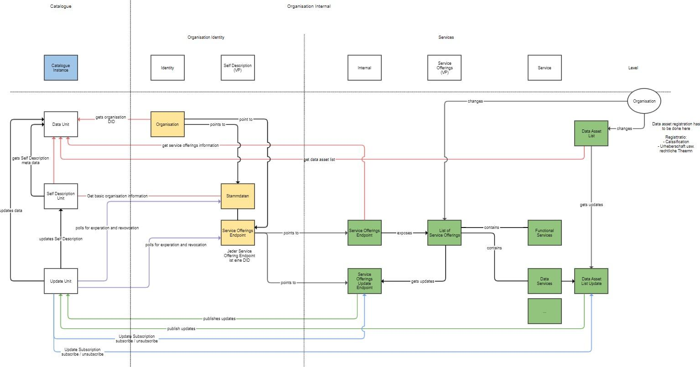

<!--

**Table of Contents**

[1. Assumptions / Prerequisites](#assumptions--prerequisites)
[1.1 Focus](#focus)	
[1.2 Decentralization](#decentralization)	
[1.3 Sovereignty](#sovereignty)	
[1.4 Trust](#trust)
[1.5 Open Development](#open-development)
[1.6 GXFS Side Conditions](#gxfs-side-conditions)
[1.7 GXFS Acceptance](#gxfs-acceptance)	
[1.8 Open interoperable IdM standards and Access Management](#open-interoperable-idm-standards-and-access-management)	
[1.9 W3C, IEEE and DIF Specifications](#w3c-ieee-and-dif-specifications)
[1.10 Trust over IP](#trust-over-ip)
[1.11 European Standards](#european-standards)
[1.11.1 eIDAS](#eidas)
[1.11.2 European Self-Sovereign Identity Framework (ESSIF)](#european-self-sovereign-identity-framework-essif)
[1.12 GaiaX Community](#gaiax-community)
[1.13 IDUnion (former SSI4DE)](#idunion-former-ssi4de)
[1.14 Specification Target](#specification-target)
[2. Core Concepts (IDM & Trust Vision)](#core-concepts-idm--trust-vision)
[2.1 Introduction: Definition of Identity](#introduction-definition-of-identity)
[2.2 Introduction: Evolution of Identity](#introduction-evolution-of-identity)
[2.2.1 Central Identity & Service Management](#central-identity--service-management)
[2.2.2 Federated IDM7](#federated-idm)
[2.2.3 Self-Sovereign Identity / Decentralized Identity](#self-sovereign-identity--decentralized-identity)
[2.3 Decentralized Identity Management & Trust](#decentralized-identity-management--trust)
[2.3.1 Triangle of Trust](#triangle-of-trust)	
[2.3.2 Decentralized Concept](#decentralized-concept)	
[2.3.3 Authentication](#authentication)
[2.3.4 Public Profile](#public-profile)	
[2.3.5 Authorization](#authorization)	
[2.3.6 Access Control Architecture](#access-control-architecture)	
[2.4 Notarization API](#notarization-api)	
[2.5 Policy Driven Trust](#policy-driven-trust)	
[2.6 Trust Anchor](#trust-anchor)	
[2.7 Interoperability (central vs decentral)](#interoperability-central-vs-decentral)	
[2.7.1 Integration with existing OIDC-based IDM Systems for Authentication and Authorization](#integration-with-existing-oidc-based-idm-systems-for-authentication-and-authorization)
[2.7.2 Integration with existing IDM Systems for Issuance of Verifiable Credentials](#integration-with-existing-idm-systems-for-issuance-of-verifiable-credentials)	
[3. Business Architecture](#business-architecture)	
[3.1 Solution Building Blocks](#solution-building-blocks)	
[3.1.1 IDM & Trust Framework](#idm--trust-framework)	
[3.1.2 Personal Credential Manager (see IDM.PCM)](#personal-credential-manager-see-idmpcm)	
[3.1.3 Organization Credential Manager (see IDM.OCM)](#organization-credential-manager-see-idmocm)	
[3.1.4 Authorization & Access Management (see IDM.AA)](#authorization--access-management-see-idmaa)	
[3.1.5 Trust Services (see IDM.TS)](#trust-services-see-idmts)	
[3.2.6 Separation of Identity](#separation-of-identity)	
[3.2.6.1 Overview](#overview)	
[3.2.6.2 Trust Relation](#trust-relation)	
[3.2.6.3 Springboard Trust Pattern](#springboard-trust-pattern)
[3.2.6.4 Private Participant Context](#private-participant-context)	
[3.2.6.5 Public Participant Context](#public-participant-context)	
[3.2.6.6 Triangle of Trust in GAIA-X](#triangle-of-trust-in-gaia-x)	
[3.2.6.7 Trust Establishment within the Triangle of Trust](#trust-establishment-within-the-triangle-of-trust)	
[3.2.6.8 Assurance Level by Policy](#assurance-level-by-policy)	
[3.2.3 Context aware Trust Policies Compositions](#context-aware-trust-policies-compositions)	
[3.3 Business Processes](#business-processes)	
[3.3.1 Bootstrapping of the Participant Trust Component](#bootstrapping-of-the-participant-trust-component)	
[3.3.2 Onboarding Notarization](#onboarding-notarization)
[3.3.3 Participant Onboarding](#participant-onboarding)	
[3.3.4 Principal Onboarding](#principal-onboarding)	
[3.3.5 Asset Onboarding](#asset-onboarding)	
[3.3.6 Offboarding](#offboarding)
[3.3.7 Automating the OAut Client Registration](#automating-the-oauth2-client-registration)	
[3.3.8 Authentication](#authentication-1)	
[3.3.9 Authorization](#authorization-1)	
[3.3.10 Trust Relationship Establishment](#trust-relationship-establishment)	
[3.3.11 Trust Policy Management](#trust-policy-management)	
[3.3.12 Digital Notarization of physical Credentials](#digital-notarization-of-physical-credentials)	
[3.4 Trust Anchors in GaiaX](#trust-anchors-in-gaiax)	
[3.4.1 verview](#overview-1)	
[3.4.5 eIDAS](#eidas-1)	
[4. Data Architecture](#data-architecture)	
[4.1 W3C Standards](#w3c-standards)	
[4.2 Data Format](#data-format)	
[4.3 DID Basic Architecture](#did-basic-architecture)	
[4.4 Verifiable Data Registry](#verifiable-data-registry)	
[4.4.1 Common](#common-1)	
[4.4.2 Indy](#indy)	
[4.4.3 Options](#options)	
[4.5 DID Identifier and DID Document](#did-identifier-and-did-document)	
[4.5.1 DID Identifier](#did-identifier)	
[4.5.2 DID Document](#did-document)	
[4.5.2.1 Overview](#overview-2)	
[4.5.2.2 Service Endpoints](#service-endpoints)	
[4.5.2.3 DID Document Structure](#did-document-structure)	
[4.5.3 DID Methods](#did-methods)	
[4.6 Schemes](#schemes)	
[4.7 Verifiable Credentials](#verifiable-credentials)	
[4.7.1 Common](#common)	
[4.7.2 Verified Credential LD Proofs](#verified-credential-ld-proofs)	
[4.7.3 GAIA-X Verifiable Credentials](#gaia-x-verifiable-credentials)	
[4.7.3.1 Credential Overview](#credential-overview)	
[4.7.3.2 Credential Compatibility](#credential-compatibility)	
[4.7.3.3 eIDAS compliant Credentials](#eidas-compliant-credentials)	
[4.8 Verifiable Presentation](#verifiable-presentation)
[4.8.1 Common](#common-2)	
[4.8.2 VCs vs VP](#vcs-vs-vp)	
[5. References](#references)	
[6. Appendix](#appendix)
[6.1 Conceptual Model GAIA-X](#conceptual-model-gaia-x)	
[6.2 Trust over IP Governance Stack](#trust-over-ip-governance-stack)	
[6.3 Service Offering/Catalog Process](#service-offeringcatalog-process)	
[6.4 Service Provisioning Example](#service-provisioning-example)	
[6.5 Trust Springboard Example](#trust-springboard-example)	
[6.6 Authentication Flow](#authentication-flow)	
[6.8 Create Identity Flow](#create-identity-flow)

**Table of Figures**

Figure 1: Identity Definition Flow
Figure 2: Service Provider
Figure 3: Federated IDM
Figure 4: Friendship VC
Figure 5: Triangle of Trust
Figure 6: Decentralized Trust
Figure 7: Access Control Architecture
Figure 8: Trust Framework
Figure 9: Outside World - GAIA-X
Figure 10: Participant Trust Relationship
Figure 11: Trust Springboard
Figure 12: Private Participant Context
Figure 13: Public Participant Context
Figure 14: Triangle of Trust
Figure 15: Trust Establishment for Participants
Figure 16: Trust Establishment
Figure 17: Assurance Levels
Figure 18: Trust Policy
Figure 19: Participant Bootstrap
Figure 20: Onboarding Notaries
Figure 21: Participant Onboarding
Figure 22: Principal Onboarding
Figure 23: Asset Onboarding
Figure 24: Offboarding
Figure 25: Automating the OAuth2 Client Registration
Figure 26: Authentication
Figure 27: Authorization
Figure 28: Trust Establishment
Figure 29: Trust Policy Management
Figure 30: Digital Notarization of physical Credentials
Figure 31: The basic components of DID architecture
Figure 32: DID Syntax
Figure 33: Standard Elements of a DID
Figure 34: Usage of the Service property
Figure 35: DID Document Structure
Figure 36: JSON / JSON-LD
Figure 37: Verifiable Presentation
Figure 38: Credentials
Figure 39: Conceptual Model GAIA-X
Figure 40: Trust over IP Technology Stack
Figure 41: Catalogue and IDM Interaction
Figure 42: Service Provisioning Example
Figure 43: Trust Springboard Example
Figure 44: DIDComm or did-SIOP Authentication Flow
Figure 45: Credential Issuing Flow
Figure 46: Create Identity Flow

-->

# IDM & Trust Architecture Overview

# Abstract

The GAIA-X principles of self-sovereignty also include “identity” and more so, identities are the fundamental basis of such an self-sovereign architecture. Therefore, “Self Sovereign Identity” (SSI) is chosen as the identity layer for GAIA-X. The objective is the implementation of a secure and self-sovereign identity management and the creation of trust mechanisms (Security and Privacy by Design).

With the requirement to create a first solution within 12 months and also to integrate traditional provider solutions in GAIA-X, a solution has to be developed to connect well established IAM solutions. The future- oriented solution is being developed on the basis of a decentralized identity management architecture.

On these cornerstones, a bridge to conventional identity management solutions is created for authentication and "Trust Over IP", supporting the GAIA-X goal of the federal cloud network.

The decentralized identity management based on SSI and the usage of the W3C standards for Decentralized Identifiers (DID) and VerifiableCredentials (VC) for GAIA-X are essential to establish the GAIA-X objective of a self-sovereign cloud with European interests and to integrate existing solutions. Based on this, the regulations applicable in the European area, according to the GDPR (DSGVO) can be enforced and consider the protection of identities.

In Gaia-X, we understand “Trust over IP” (ToIP) to define the various aspects of trust, in particular the relationship between participants and assets via their identity on a technical and governance level. Among other things, it defines the authentication and authorization functions based on existing standards.

The “Trust over IP” initiative, maintained by the Linux Foundation, is defining a complete architecture and governance structure for Internet-scale decentral and digital trust that combines both cryptographic trust at the machine layer and human trust at the business, legal and social layers.

This document specifies the basics for the following service functions:
- Decentralized identity management according to SSI and DIF via DID Standard Release 1 relates to existing preparatory work from EU like eSSIF and Bundesministerium für Wirtschaft und Energie (BMWi) projects such as “Schaufenster Sichere Digitale Identitäten” including IDUnion.
- Trust Layer with signature and validation mechanisms
- Service components/features supporting on-/offboarding processes for organizations, participants and principals
- Access management (authentication and authorization)

# TOC

# Table of Figures

# List of Documents/Specifications

| Title | Document Reference/Id |
|-------|-----------------------|
| Architecture Overview  | IDM.AO  |
| Authentication/Authorization | IDM.AA  |
| Organization Credential Manager  | IDM.OCM  |
| Person Credential Manager  | IDM.PCM  |
| Trust Services API  | IDM.TSA  |
| Notarization API  | CMP.NA  |

# Methodology

Methodology requirements as an expression of normative specifications are identified by a unique ID in square brackets (e.g. [IDM.ID.Number](https://tools.ietf.org/html/rfc2119)) and the keywords MUST, MUST NOT, SHOULD, SHOULD NOT, MAY, corresponding to RFC 2119 [RFC 2119], must be written in capital letters.

⏩	IDM.OCM.00001 Title

Text / Description ⏪

The requirement includes all of the content listed within the markers.

# Terminology

The following definitions are used in the context of the IAM framework, aligned with the GAIA-X Technical Architecture Release June 2020. Source: IAM Framework HLD/DLD Document [IAM-FW](https://docs.google.com/document/d/1XCjIVRul_w_6runDn_Rh-8nVdMhSFmMxZTXoQAhtISA/edit#heading%3Dh.hpt1331rqj9v).

| Terms/Definitions  | Description  |
|--------------------|--------------|
| Consumer  | A role of a GAIA-X Participant with users & devices, searching/ordering services and maintaining a business relationship to Providers. A Consumer consumes Service Instances but can also provide them to their End-Users.|
| End-User  | A natural person not being Principal, using GAIA-X Service Instances from a Consumer. End-Users own an identity within the Consumer context.|
| Federated Trust Component  | Component, which ensures trust and trustworthiness between GAIA-X and the interacting Identity System, which automatically includes the GAIA-X Participant. Process to be guaranteed to ensure the trust, involved during the Onboarding Process. This component guarantees identity proofing of the involved Participants to make sure that GAIA-X Participants are who they claim to be. |
| GAIA-X AM | GAIA-X internal Access Management component  |
| Identity  | An Identity is a representation of an entity (Participant/Asset/Resource) in the form of one or more attributes that allow the entity to be sufficiently distinguished within context. An identity may have several Identifiers.  |
| Identity System (IDS)  | An Identity System (IDS) authenticates/provides additional attributes to the identity of the GAIA-X Principal and forwards this identity to the requestor. The Gaia-X IDS follows a hybrid approach and consists of both centralized components, like company identity management systems, and decentralized components like Decentralized Identifiers (DIDs). |
| Participant  | A Participant is a legal person/entity that can take on one or multiple of the following roles: Provider, Consumer  |
| Principal  | Either a natural person or a digital representation which acts on behalf of a GAIA-X Participant.  |
| Principal@Provider  | Principal of a GAIA-X Participant in the context of the Provider role.  |
| Principal@Consumer  | Principal of a GAIA-X Participant in the context of the Consumer role.  |
| Provider  | A role of a Participant, responsible for making an Asset available to the GAIA-X ecosystem. |
| Visitor  | Anonymous, non-registered entity (natural person, bot, ...) browsing a GAIA-X Catalogue.  |

For better understanding, the following terms, aligned with the Glossary chapter of the Technical Architecture Document (TAD) on 8.2.2020, are listed here again.

| Other Terms/Definitions  | Description  |
|--------------------------|--------------|
| Asset  | Assets are static structural elements used to compose the Service Offering. Subclasses of assets are Node, Software Service, Interconnect and Data Asset. (An Asset is an abstract entity. Assets represent probable future economic benefits obtained or controlled by a particular entity as a result of past transactions, developments or events. In contrast to a resource an asset is not exposing behavior and a static element). |
| Federated Catalogue  | Catalogues are the main building block for the publication and discovery of Self-Descriptions of Assets and Participants. The Federated Catalogue describes the Catalogue architecture by the Federation Services and the GAIA-X AISBL.|
| Self-Description  | A Self-Description expresses characteristics of an Asset or Participant and describes properties and claims while being tied to an Identifier.  |
| Service Provider AM  | The Service Ordering Process will involve the Consumer and the Service Provider. The Service Provider will create the Service Instance and will grant access for the Consumer by this component.  |

# Glossary

| Abbreviation  | Explanation  | RFC/Reference  |
|---------------|--------------|----------------|
| GX  | Synonym for GAIA-X  |   |
| DID  | Decentralized Identifiers  | [Decentralized Identifiers (DIDs) v1.0 (w3.org)](https://www.w3.org/TR/did-core/)  |
| DID Resolver  | A DID resolver is a software and/or hardware component that takes a DID (and associated input metadata) as input and produces a conforming DID document (and associated metadata) as output.  | [https://w3c-ccg.github.io/did-resolution/](https://w3c-ccg.github.io/did-resolution/)  |
| DID Method  | DID methods are the mechanism by which a particular type of DID and its associated DID document are created, resolved, updated, and deactivated using a particular verifiable data registry. DID methods are defined using separate DID method specifications  | [https://www.w3.org/TR/did- core/#methods](https://www.w3.org/TR/did-core/#methods) [https://w3c.github.io/did-spec-registries/](https://w3c.github.io/did-spec-registries/)  |
| DID Document  | A DID document contains information associated with the DID, such as ways to cryptographically authenticate the DID controller, as well as services that can be used to interact with the DID subject.  | [https://www.w3.org/TR/did-core/#dfn-did-documents](https://www.w3.org/TR/did-core/#dfn-did-documents) |
| DID Subject  | The subject of a DID is, by definition, the entity identified by the DID. The DID subject may also be the DID controller. Anything can be the subject of a DID: person, group, organization,physical thing, logical thing, etc.| [https://www.w3.org/TR/did-core/#did-subject](https://www.w3.org/TR/did-core/#did-subject)  |
| DIDComm  | DIDComm lets people and software use DIDs to communicate securely and privately over many channels: It works over any transport: HTTP, BlueTooth, SMTP, raw sockets and sneakernet, for example  | [DIDComm Messaging README](https://github.com/decentralized-identity/didcomm-messaging/blob/master/README.md)  |
| eIDAS  | electronic IDentification, Authentication and trust Services  | [L_2014257EN.01007301.xml (europa.eu)](https://eur-lex.europa.eu/legal-content/EN/TXT/HTML/?uri=CELEX%3A32014R0910&from=EN)  |
| VC  | Verifiable Credentials  | [Verifiable Credentials Data Model 1.0 (w3.org](https://www.w3.org/TR/vc-data-model/)  |
| Verifiable Data Registry  | A role a system might perform by mediating the creation and verification of identifiers, keys, and other relevant data, such as verifiable credential schemas, revocation registries, issuer public keys, and so on, which might be required to use verifiable credentials  | [Verifiable Credentials Data Model 1.0 (w3.org)](https://www.w3.org/TR/vc-data-model/#ecosystem-overview)  |
| SSI  | Self-sovereign identity (SSI) is a term used to describe the digital movement that recognizes an individual should own and control their identity without the intervening administrative authorities.  | [What is self-sovereign Identity? - Sovrin](https://sovrin.org/faq/what-is-self-sovereign-identity/)  |
| OIDC  | OpenID Connect  | [OpenID Connect](https://openid.net/connect/)  |
| DID-SIOP (Short: SIOP)  | Self-Issued OpenID Connect Provider | [https://identity.foundation/did-siop/](https://identity.foundation/did-siop/)  |
| ToIP  | Trust over IP  | [Trust Over IP](https://trustoverip.org/)  |
| Verifiable Presentation  | Aggregation of Verifiable Credentials  |   |
| Node | A GAIA-X Node is a compute and storage resource. Nodes are generic in the sense that different Services can be deployed on them. Nodes have a known certification level and geographic location.  |   |
| Service  | A GAIA-X Service is a cloud offering. The term encompasses all of Infrastructure as a Service (IaaS), Platform as a Service (PaaS), Software as a Service (SaaS), Function as a Service (FaaS) and so on.  |   |
| Verifier  | Instance / Service Provider which verifies the Verifiable Presentation  |   |
| Holder  | A role an [entity](https://www.w3.org/TR/vc-data-model/#dfn-entities) might perform by possessing one or more [verifiable credentials](https://www.w3.org/TR/vc-data-model/#dfn-verifiable-credentials) and generating [verifiable presentations](https://www.w3.org/TR/vc-data-model/#dfn-verifiable-presentations)] from them.  | [https://www.w3.org/TR/vc-data-model/#ecosystem-overview](https://www.w3.org/TR/vc-data-model/#ecosystem-overview)  |
| Issuer  | Authority which provides a credential (e.g. DID)  |   |
| Claim  | A claim is a statement about a subject.  | [Verifiable Credentials Data Model 1.0](https://www.w3.org/TR/vc-data-model/#claims)  |
| OnBoarding  | The operations part of GAIA-X, the AISBL, receives the registration request of the GAIA-X Participant. It is validated against a set of policies provided by Compliance and issues a credential on success.  |   |
| Offboarding  | The offboarding process of a Participant or Asset is time-constrained and includes all dependent GAIA-X Participants and Assets. IdM framework is supporting this compliance process with some tools and methods.  |   |
| Organization Credential Manager (Wallet)  | Component to manage organization identities  |   |
| Personal Credential Manager (Wallet)  | Acts as a natural persons (principals) representative securely holding the acquired identities and identity attributes of the person, and provides the technical means to selectively disclose the aforementioned attributes for authentication and service consumption.  |   |
| Participant Credential  | Approved Organization VC signed by GAIA-X AISBL  |   |
| Principal Credential  | Proves the membership/affiliation of the user/employee to the organization (issued by Participant)  |   |
| AISBL  | GAIA-X AISBL (association internationale sans but lucratif under Belgian law) founded by 22 companies and institutions Sept. 2020  | [GAIA-X - Home (data-infrastructure.eu)](https://www.data-infrastructure.eu/GAIAX/Navigation/EN/Home/home.html)  |
| GDPR  | Regulation (EU) 2016/679 of the European Parliament and of the Council of 27 April 2016 on the protection of natural persons with
regard to the processing of personal data and on the free movement of such data, and repealing Directive 95/46/EC. | [https://eur-lex.europa.eu/legal-content/EN/TXT/?uri=CELEX:32016R0679](https://eur-lex.europa.eu/legal-content/EN/TXT/?uri=CELEX:32016R0679)  |

# Assumptions / Prerequisites

## Focus

The main focus of this architecture document is to define a framework specification to fulfil the identity management and trust needs of the distributed and hybrid GAIA-X Ecosystem. To be compliant with the GDPR EU regulation specification IdM & Trust follows the Self Sovereign Identity (SSI) concept based on the Decentralized Identifiers (DIDs) and Verifiable Credentials standards created by the W3C Community Group. It extends the standard and defines an integrative approach on existing and widely used standards like OpenID Connect, oAuth2, JWT, ect. by applying some advanced DID and OpenID Connect concepts borrowed from the Decentralized Identity Foundation (DIF).

The current implementation strategy provides for a minimally viable GAIA-X (MVG). Initially, only the fundamental functions for basic operation are intended for implementation in Phase I. For a coherent understanding we sometimes add Phase II concepts that are not used in the functional specifications or mark as Phase II features right now.

## Decentralization

One of the main aspects in this framework is decentralization. There should be no central trust provider or controler of foreign infrastructure components. Particularly no government authorities should be able to control the ecosystem or influence in a negative sense. This means in fact, that the framework must support the individual sovereignty of all participants with a standardized set of rules and definitions and the related frameworks and tools.

## Sovereignty

A core aspect of the framework is the sovereignty of identities and their self management. Participants must be enabled to check the trust level up from low up to very high as he expects from the selected node or asset provider. This makes it essential to keep the focus in providing different architecture and solution building blocks to enable any ecosystem provider to integrate his own local nodes and assets into the decentralized GAIA-X ecosystem in a trusted manner without disclosing internal identity information or losing control over it. For instance, today commonly used federate identity frameworks with delegated management and identity trust providers like Google, Microsoft, Facebook, GitHub IdP, etc. provided centrally in the cloud are not sovereign in the sense of EU sovereignty endeavors. In usage of non self hosted IdM providers any company or government can take over control in conflicting or spying cases. Eg. any foreign US company would be committed to follow the instructions of the US authorities regardless of his own or contracting interests. For that reason the main intention of GAIA-X is to define a GDPR and eIDAS conform architecture that highlights identity sovereignty and trust that do not stick on old weak architecture approaches.

## Trust

In a sovereign trust architecture the consumer decides by his own which trust level they expect in an individual and context specific manner. Every provider presents attestations and certificates in their possession to other participants. Each participant decides based on their own policies and rules which information to disclose. A participant is able to request specific trustworthy information before consuming services.

This architecture follows the decentral and self sovereign trust model, where no central organisation (e.g. GaiaX Organisation, 3rd Party, Government Institute) is defining the trust model. Instead it provides a trust layer which can be used by participants according to their rules and policies.

One consequence is to enable consumers to check the expected trust level continuously during selection and runtime using provided APIs and standards to establish digital trust. Thus the consumer does not need to only rely on paper attestations.

## Open Development

All specifications, concepts, components and necessary software must follow the AISBL open source license requirements based on Apache Software Licence V2 (ASL2) / CC-BY and should be published on public channels (e.g. github, gitlab) back to the community. The distinct license conditions are given by the AISBL. Each component, concept and everything related to this specification must be free from any third party claims. (except already existing work).

## GXFS Side Conditions

The GAIA-X environment is facing a lot of interests of multiple stakeholders, hence it’s important to define the side conditions to avoid misunderstandings in terms of identity management and trust.

1. GAIA-X AISBL intendens not to host dedicated cloud infrastructure like hyperscalers do
2. No central system or monopolist should manage GaiaX identities.
3. There are no special GAIA-X accounts hosted in a central system. A GAIA-X identity can legitimate their participation by specific Verifiable Credentials (VC) issued by AISBL.
4. The GXFS IdM & Trust System follows the W3C DID Standards and aims to allow interoperability.
5. To ensure compatibility in the ecosystem standards like DIDs or VCs should be used in the suggested unmodified manner.
6. GAIA-X uses the not interchangeable terms identifier and identity. An identifier is a unique pointer like did:sov:1234 owned by an identity. A GAIA-X identity can have one or more identifiers that point to his associated public key material to prove the ownership.
7. Distributed Identifiers (DID’s) and the public ledger networks should not contain any private data to be compliant with the GDPR requirements.
8. The decentralized concept is based on a decentral ledger that holds the public keys associated with the decentral identifier DID of any identity.
9. There is no GAIA-X AISBL central Public Key Infrastructure planned. The ledger (DPKI) is hosted from external trusted parties and not controlled by GAIA-X AISBL.
10. In the first iteration of the IdM & Trust Work Package GAIA-X nodes are not in scope of the attestation/credential management. In a later iteration is it a crucial point to consider the attestation of nodes.
11. In future each item in the GaiaX Cloud (assets, services, nodes, organizations, persons, data, algorithms, contracts, servers etc.) MUST have a decentralized identifier according to W3C DID specification.

## GXFS Acceptance

To generate the acceptance for the GXFS from the first second, one main assumption is that the GAIA-X AISBL will provide software as a service offerings to the participants by external parties. This is one main aspect to establish the ecosystem smoothly and without any limitation by participants. It’s recommended that the GAIA-X AISBL hosts the initial IdM & Trust components in the beginning, to bridge the “hen egg problem”, where no SSI IdM ecosystem and provider is in place. This can be achieved by providing a SSI Tool-Stack as a service. In the long term the decentral IdM approach leads to a descentral and self sovereign hosting and AISBL is only providing a set of tools that can be used to archive the decentral trust.

## Open	interoperable	IdM	standards	and	Access Management

In recent years, the identity standard is moving from a federal identity management towards a decentralized IDM system. The new decentralized identity management concept is known as Self- Sovereign Identity (SSI) to give back the control to the identity 
owner. SSI is instantiated by the working group of the World Wide Web Consortium (W3C) and includes the following standards:
- Decentralized Identifiers (DIDs) - a W3C specification that enables verifiable, decentralized digital identity.
- Verifiable Credentials - W3C specification that provides self- sovereign proof of identity and forms the basis of the “Trust Over IP” standard.

The OpenID Connect and JWT (JSON Web Token) protocol standards are established in access management and are supported by all cloud providers and applications. Since 2019, the European Union is working to incorporate the SSI and DID standards into the eIDAS regulation of digital identity (eID) and designate the SSI model as the preferred target solution (European Commission (n.d.), European Self- Sovereign Identity Framework (ESSIF)). The IdM & Trust Services MUST be designed and implemented on these core SSI architecture principles.

## W3C, IEEE and DIF Specifications

Base of the GXFS identity management implementation MUST be the W3C [DID Core](https://www.w3.org/TR/did-core/) and [Verifiable Credentials](https://www.w3.org/TR/vc-data-model/) specifications. Authentication and decentral identity management extension concepts borrowed from Decentralized Identity Foundation [DIF](https://identity.foundation/) MUST be considered in the aktual working draft version.

## Trust over IP

In GAIA-X, we understand “Trust over IP” (ToIP) to define the various aspects of trust, in particular the relationship between participants and assets via their identity on a technical and governance level. Among other things, it defines the responsibility of authentication and authorization functions and governance aspects based on existing standards.

The “Trust over IP” initiative, maintained by the Linux Foundation, is defining a complete architecture and governance structure for Internet-scale decentral and digital trust that combines both cryptographic trust at the machine layer and human trust at the business, legal and social layers. On the one hand it is about interpersonal trust, on the other hand it is about trust in technology. With ToIP, two parties should be able to immediately check whether the data comes from a trustworthy source when exchanging data. For interoperability purposes all GXFS concepts SHOULD use this framework to specify the interaction in detail on each layer. (see Appendix Figure 40)

## European Standards

### eIDAS

The Regulation (EU) N°910/2014 on electronic identification and trust services for electronic transactions in the internal market (eIDAS Regulation, [eIDAS Regulation](https://ec.europa.eu/futurium/en/content/eidas-regulation-regulation-eu-ndeg9102014)) adopted on 23 July 2014 provides a predictable regulatory environment to enable secure and seamless electronic interactions between businesses, citizens and public authorities.

***Hint**: Unfortunately, there are not many trust frameworks tailored for SSI yet. The European Union establishes eIDAS regulation and rules for members of the European Union. It establishes standards and maintains trusted lists to communicate in secure ways between Member States using certificate authorities, identity issuers, and certificate revocation lists that have furthermore aligned with the SSI standards like DID and VC.*

*Since the SSI eIDAS Integration Standard is not officially committed, an aligned eIDAS approach without the legal conformity is accepted right now. Technically spoken, the existing eIDAS Bridge form eSSIF ([SSI eIDAS Bridge | Joinup](https://joinup.ec.europa.eu/collection/ssi-eidas-bridge)) or any other eIDAS compliant implementation (e.g. proof policies, credential schemas etc.) SHOULD be used in the meantime.*

### European Self-Sovereign Identity Framework (ESSIF)

EBSI provides a common, shared, and open infrastructure based on blockchain technologies aimed at providing a secure and interoperable ecosystem that will enable the development of cross-border digital services in the public sector.[^1]

[^1]: Source: [Mapping of Vision, Mission, and Goals (europa.eu)](https://ec.europa.eu/cefdigital/wiki/display/CEFDIGITALEBSI/Mapping%2Bof%2BVision%2C%2BMission%2C%2Band%2BGoals)

- [Architecture and Governance (europa.eu)](https://ec.europa.eu/cefdigital/wiki/display/CEFDIGITALEBSI/Architecture%2Band%2BGovernance)

- [Understanding the European Self-Sovereign Identity Framework (ESSIF) (slideshare.net)](https://www.slideshare.net/SSIMeetup/understanding-the-european-selfsovereign-identity-framework-essif)

To ensure best interoperability in the EU the implementation MUST consider concepts and interfaces around EBSI and ESSIF as far as they fit to the GAIA-X decrentral architecture approach. Concretely if there is a definition or interface specification it should be used first and only redefined in case there are some interoperability issues in conjunction with GAIA-X definitiones or goals.

Source: https://ec.europa.eu/cefdigital/wiki/display/CEFDIGITAL/ebsi

See also: https://joinup.ec.europa.eu/collection/connecting-europe-facility-cef/solution/cef-european- blockchain-services-infrastructure-ebsi/about

## GaiaX Community

The GaiaX IAM community is a valuable provider for concepts and inputs, therefore is the goal to integrate the community closely to ensure the most benefit between community and GXFS concepts in the near future. A working mode between the IAM community and the GXFS project ensures the exchange of different working results. Some terms and conceptual approaches in this architecture document originate from the [IAM Framework HLD/DLD Document [IAM-FW]](https://docs.google.com/document/d/1XCjIVRul_w_6runDn_Rh-8nVdMhSFmMxZTXoQAhtISA/edit#heading%3Dh.hpt1331rqj9v) maintained by the IAM Community.

## IDUnion (former SSI4DE)

The planned publicly funded project IDUnion project aims to make solutions accessible to business, public administration, and citizens that are equally user-friendly, trustworthy, and economical. The IDunion consortium and its partners are building a decentralized identity ecosystem for individuals, companies, government and machines. This ecosystem will be based on attribute-based identity data, a decentralized network ("distributed ledger") and the principles of SSI. In particular, the IDunion identity ecosystem offers the basis for SSI infrastructure. This provides the integration of sovereign-issued identities, e.g., those of the ID card, as trust anchors for natural persons. Due to the flexible SSI architecture, various possibilities open up for connecting national eID solutions.

From a technological perspective the ecosystem is built on open source frameworks like Hyperledger Ursa (cryptographic library), Hyperledger Indy (blockchain framework) and Hyperledger Aries (agent software framework), which are managed by the Hyperledger Project, an umbrella project for distributed ledger technologies by the Linux Foundation.

To ensure wide adoption of SSI-based solutions, compatibility with conventional identity systems has to be ensured. IDUnion is working on such an integration to legacy-systems. In addition to the planned integration of existing technologies in the identity and authentication environment, IDUnion will also provide an identity network in productive operation during the course of the project, which will be ensured by various partners and a corresponding governance anchoring in a European cooperative. The productive network is expected to be available in a first version in the course of the year 2021.

Due to the very strong technological and also architectural connection to the IDUnion approach, there are many parallels to the specification in GXFS, from which both projects can benefit. The approaches developed within the framework of this specification SHOULD be reused and extended in the research and development work in the open source community, in standardization and in the individual interoperability packages of IDUnion.

Regardless of the postponement of the launch of IDUnion (planned for April), close collaboration during the implementation phase of GXFS is a good idea. In particular, the upcoming far-reaching discussions with the numerous partners represented on possible architecture concepts can be seen as a value-added extension in the architecture concept. In addition, the productive network envisaged within the framework of IDUnion MUST be considered as a basis for the GXFS in order to enable a realistic implementation in the near future.

Specifically, the work packages "Establishment of identity network + governance", "Establishment of identity scheme", "Connection to national eID solution and interoperability", "Joint research and development" can be mentioned here.[^1]

[^1]: https://docs.google.com/document/d/1MXFuAGzdTu7DwGFMIMnxJABKoRm8RrBfccwm-UmPZGU/edit#heading=h.xbf6f4zh60nl 

## Specification Target

The target of the architecture and product specifications is a stack of documents which will be ready for a public tender by different components to realize the GaiaX Ecosystem regarding IDM & Trust. This stack contains definitions and components for the usage of SSI Basics in the GaiaX context. Not part of the scope are custom cryptography algorithms, TLS customizations, network components or any other infrastructure topics.

# Core Concepts (IDM & Trust Vision)

## Introduction: Definition of Identity

To understand the being of an identity, it’s necessary to have a look first at the definition of an identity what this means for the context of this architecture document. An identity is defined in the glossary as follows:

*“An Identity is a representation of an entity (Participant/Asset/Resource) in the form of one or more attributes that allow the entity to be sufficiently distinguished within context. An identity may have several Identifiers.” [[IAM-FW]](https://docs.google.com/document/d/1S7SUoGlYqCMFNRekfTfP_UdVNGUksoLV/edit#heading=h.1tuee74)*

The main focus of this definition is on the aspects of “identifier”, “attributes” and “context” to distinguish an entity representation. An unique identifier references to an distinguished set of attributes within a given context. This is commonly realized over URLs. (e.g. DID, URI, …)

An entity itself is created and controlled by any individual or a technical system which is everytime able to prove the identity ownership.

**Figure 1:** Identity Definition Flow

## Introduction: Evolution of Identity

### Central Identity & Service Management

Since the beginning of multi user systems, a service was mostly hard coupled with a special identity which has the only purpose to use the service. For instance, Terminals, Web Sites or Business Systems. All of them create special identities to manage the access to business data. Sometimes is there also the need to have multiple identities (e.g. different contexts) to get different roles or access rights. However, the big disadvantage is the coupling between identity and business data, because there is a high risk for data leaks, identity theft or simply a big overhead for managing it securely.

**Figure 2:** Service Provider

### Federated IDM

As a consequence of the previous central identity systems, there raised up the need to differentiate between identity and a service. This should minimize the risks for data leaks, identity thefts and the secure management overhead. To realize that, there was a federated trust model established, which is separated into a Relying Party (Service Provider) and a Identity Provider. Both have to trust each other. If a user wants to consume a service, he is redirected to the identity provider which stores the identity data. Gives the user the credentials (e.g username/password, smartcard, scopes etc.) and his consent, the identity provider issues a token to the relying party with the necessary information (normally JWT/SAML). With this information, the relying party can decide what the user has for access rights, roles and accessible features. The user itself never presents his credentials to the relying party. Which solves the problem for multiple accounts, because one account for multiple systems is just a decision of trust between the RP and IdP. If the IdP Data is leaked, the RP can remove the trust and the service provider data is secure. And the secure management of the identity data is outsourced to one specialist. (e.g. google, facebook)

**Figure 3:** Federated IDM

This is now an improvement to the previous state of multiple identity management systems and a big step forward for the users in terms of security and identity management simplicity, but it has still one big disadvantage: it is centralized and monopolised by the influence of internet giants. This fact brings the user maybe not in security trouble, but in the case of the US Cloud Act[^3] was another dimension created by the US government: sovereignty.

[^3]:  https://epic.org/privacy

### Self-Sovereign Identity / Decentralized Identity

In the past it was very hard for a government or a law enforcement agency to get the data of different systems, because they need court orders to get access for each single system. This kind of “decentralization” was a good side effect of IdP coupled with the service itself, because it was a very high effort to get this data. The authority required a court order for each single system. But the influence of some US companies changed the game and the US government was creating the US Cloud Act which allows US law enforcement agencies to access each system owned by a US company all the time. This means that each access to data can be simply forwarded or blocked by them. A potential user of this kind of system is facing two problems: loss of control and loss of sovereignty. Both are bad, because it means your accounts are locked or your data can be stolen or manipulated without your knowledge. To avoid this scenarios two things must happen:

1. The new approach must be decentralized without the feasibility for any user tracking or manipulation.
2. The user needs sovereign control about their identity data.
3. It must be protected and not traceable and correlatable in terms of data privacy including GDPR conformity.

To achieve this, the decentralized approach was established: Self Sovereign Identity (SSI). With this approach, each identity is managed by the user (holder) himself and not by a foreign cloud provider like today. Here is an example of the SSI concept in a fully privacy-preserving way (based on zero knowledge proofs):

A customer wants to buy a bottle of wine in a store. The seller wants to know the age of the customer. By looking at the identity card, he is able to check whether the customer is old enough. BUT he can also see all the other data, such as date of birth, place of residence, height and  much more. This shows that the customer has no control over which additional data the seller receives when he presents his identity card. The identity card reveals more data than is necessary for the age check.

Using the SSI approach, it is conceivable to have some kind of "I am old enough" card that reveals only one piece  of  information,  namely  "the  person  is  old  enough  to  purchase  this  item". How do you get such an ID? Quite simply: the person creates it himself. Why should the seller trust this ID? The seller does not have to trust this ID, just as he does not have to trust the identity card. He trusts the issuer of the card, for example an authority such as a government. If the ID is signed by an authority, he can trust it.

In practice, the seller would present a QR code that asks in a challenge-response procedure whether the customer is old enough. This code can be scanned with a smartphone, for example. This then presents the necessary information and the seller receives the desired information: "old enough" or "not old enough". (A prerequisite is of course that the person who presents the ID is also the person to whom it belongs) see DID-Auth, https://ec.europa.eu/cefdigital/wiki/display/CEFDIGITALEBSI/EBSI+DID+ Auth

As seen in the small example, a potential service needs not all information which is available. Sometimes one bit of information is enough to know if the user can consume a service or not. To provide this kind of functionality a change in the thinking is necessary. In the past the thinkage was like “present me knowledge about your identity and I'll tell you what you can do”. This is literally like that, that your friend let you in your house when you just have the knowledge of the name of the friend and his address. The new thinking should be: prove me that you are my friend and what I allowed you to do. How is that proofable? In reality with the face and your voice. The “rights” know you already. But in the digital world is an asymmetric key pair and some claims necessary.

Following this example of friendship, in a SSI world are two things necessary in the beginning: two identities. These identities can be created by every person by using their own key pair. To make this identity public, the identity must be stored on a “Verifiable Data Registry” which is a decentralized system like a distributed ledger. This is the manipulation proof identity store. Each person is then a “Holder '' of their own identity. The related key pairs are stored in a Wallet called “Repository”. What the person is now doing with their identity is self sovereign. The person can terminate this identity, use it or not. After creating an identity, the user needs the proof of his friend that they have a friendship. Means the friend (A) issues as “Issuer” a “Verifiable Credential” to the other person (B) signed with his own key pair (kA) coupled with the identity of B. If this person (B) later provides this kind of credential during a challenge (to A), the requestor (A) can act as “Verifier” and can check their own signature. If the trust is still there (to B), A is accepting B as a friend, because he provides a credential which was issued by himself (A) and the identity was successfully challenged by the other (B). All necessary things to know are issued in this credential. Maybe additional information like “Jump on my Couch is ok''. So if the credential is provided A knows two things: It’s my friend, and he can jump on my couch”, because A decided to issue that before. If someone else asked “is that really your friend” and is he allowed to jump on the couch? Person B can proof it over the credentials as well to person C. Person C needs no information about users, rights etc. anymore.

**Figure 4:** Friendship VC

Of course the proofs and relations can be more complicated. For instance the issuing of a driver's licence needs maybe the proof of an authority or other agencies. But it already visible what's happening: The users creating a trustul decentralized digital relation which is unmanipulatable or trackable. And this happens completely without the need of any password or any registration for accounts.

## Decentralized Identity Management & Trust

### Triangle of Trust

To reduce the complex system of trust to the core elements for the next chapters, the triangle of trust has to be considered which reflects the main relations of the different parties. Main parts of this triangle are the Holder/Provider, the Issuer and the verifier.

**Figure 5:** Triangle of Trust

Roles and Responsibilities:

| Role  | Responsibility  |
|---|---|
| Holder  | The Holder acts towards the verifier as a provider of verifiable credentials which are requested from the verifier. It’s task is to prove that he holds and owns the credentials.   The Holder acts towards the issuer as a kind of requestor of verifiable credentials. The Holder has to provide all information which is necessary to issue the credential. |
| Issuer  | Issues digital Verifiable Credentials after a challenge to the Holder.  |
| Verifier  | The verifier verifies if the credentials are cryptographically safe and trusted. He also verifies if the presented identity is owned by the holder/provider. In the verification process the verifier can gain trust without contacting the issuer.  |

It’s always to remember that in a Self-Sovereign Identity System an entity can have multiple identities. As an entity working for a company will hold the employee identity with a certain position. Same entity can consume services as a private person within an online shop, where the same entity uses another identity. Any identity needs to be referenceable in the digital world. For that an identifier is required that is unique and resolvable. A presented identity needs proof that he is the owner, for that some special verification methods are required - cryptographic primitives in the digital world. This is fundamental to fulfil the self- sovereignty and GDPR[^4] requirements.

[^4]: https://gdpr-info.eu/

### Decentralized Concept

As seen in the chapters before, the transformation from a central identity management to a decentralized approach is a key for GAIA-X, but in daily practice there are of course some design decisions to make to establish this new kind of identity management. At first it has to be considered that each Holder is at the same time an “Identity Owner”. Means he has to generate and maintain a decentralized identifier over a verifiable data registry of his choice which represents his decentralized identity. Second, the holder needs any kind of trust anchor for initial trust to any verifier or issuer. In practice this can be the good reputation of a company or a cryptographic proof following e.g. eIDAS conformity. The trustworthiness of a verifier and an issuer is also a decision of each party. Difficult to understand is as well, that each Holder can be at the same time also an issuer and a verifier. In practise the roles are changing within the process.

**Figure 6:** Decentralized Trust

The figure above shows in a decentralized way how different parties interact with each other physically and in a logical way. Important here is, that the Self Sovereign User has all the time the choice, if he wants to trust any Credential Provider or if he wants to provide any credentials to a verifier. This fact of self sovereignty is also valid for technical systems like servers and devices, which can do an access and usage control about this concept in a completely different way as before. This affects as well the ways for authentication and access management.

### Authentication

The authentication and authorization in a decentralized concept follows the terms of self-sovereignty. This means that a holder must be able to present his identity just under the site condition to trust the requesting party for authentication and data exchange. This is a relevant change to a centralized approach. In a centralized approach, the user must create an account with any kind of information that the central identity provider owner requests. In this case, the central identity provider is then the controller about the user data. In the decentral approach a service just requests data which is necessary for the service itself. The holder is then a kind of decentralized identity provider which can deliver this information by trusting the requesting party. This changes the way to authenticate. In the past, the authentication happened on the central Identity Provider (IdP), now the authentication is on the holder's side e.g. with a Personal Credential Manager (e.g. Smartphone Wallet) or in the Organisational Credential Manager (Server Wallet) which acts in a decentralized system as identity provider and/or as identity information hub. All the security-related considerations and assurance levels, including but not limited to requirements for multi- factor authentication, must be therefore fulfilled by those self-managed Credential Manager agents. In return the Credential Manager allows for presentation of a proof of control over an Identity identified by its	private/public	keys	to	the	requesting	party. In a similar manner any non-human actor is able to authenticate using its identity data and the related private key material, which is stored in its internal Wallet or respective Server Wallet.

### Public Profile

The Public Profile is an endpoint meant to serve content publicly, in a machine-processable, cryptographically verifiable manner.

This includes, but is not limited to:
- Self-Description of the Participant
- Service-Offerings

The Public Profile can be extended with Ontologies (JSON-LD Contexts) detailed and standardized in other organizations than the GAIA-X AISBL, e.g. Catena-X.

The Public Profile endpoint is mainly used by the Catalog to build up and update its search index.

In a future release, the concept envisions a “Private Profile“ that allows access to restricted parts of the
profile.

### Authorization

Authorization consists of two main aspects, which are covered in this concept in a decentralized way.

The first aspect is the Authorization or consent for the usage of the data linked to the Identity itself, being that the data of the user or any other entity. In a decentralized system the identity data is being managed self-sovereign by the identity holder in a form of verifiable credentials being stored in his/its Wallet. The user or an entity can then in a self-sovereign way decide, whether and to what extent the data is being shared with any third party. Without such explicit authorization, contrary to the traditional IdP model, none of the third parties can reveal the data, just because the data is not stored at any third party at the time.

The second aspect is the authorization of resource usage taking place during API interactions and data exchange. In the traditional model access was always linked to an identity, roles and rights assigned locally at the provider of an API or data storage. In the decentralized model the user or an entity would only use it’s one self-sovereign identity to get access to resources across different security domains. The identity data in a form of verified credentials will be used in order to execute access policies and in the end drive access decisions. In the current concept the credentials will be exchanged during the authentication phase, using DIDComm-based login, or for autonomous systems or application clients a similar credential exchange will be achieved with the means of Dynamic Client Registration backed with DIDComm-based backchannel authentication. At the core of Policy evaluation will be an Attribute Based Access Control system, which will allow for very granular policy expression based on identity data. A traditional Role Based Access Control schema can be achieved by proper mapping of pre-agreed claims included in a well defined verifiable credential schema. It will be left to the application provider to decide on an appropriate model for the use case at hand.

The proposed architecture does not aim to replace any existing authorization solution or protocol, in contrast it will augment the functions of such standard-based systems with aspects of self-sovereign identities and verified-credential based authorization.

In the future evolution, outside of the scope of this specification, it should be possible to be able to request certain verifiable proofs on a level of each single data or resource access, by the means o dynamically loading credentials in the background or credential exchange e.g. a backchannel credential exchange over DIDComm which can have an access token as a result.

### Access Control Architecture

The main goal of the access control architecture is the separation of concerns within an authorization process. In most cases an authorization process decides on different ways, if any client has access to resources or not. This can be for instance a role-permission based model in the application or rule based approach with attribute evaluation at runtime including claim based decision. All of these methods have the disadvantage that they are hard coded in the application to fit in the best way to the functionality. A change of the application rights, e.g. adding of a new additional permission checkup for a special user group, needs to be implemented/configured and tested. To make this more flexible the access control must be prepared for policies and separated in:

| PEP  | Policy Enforcement Point (PEP) implemented at the edge service or within the application framework that calls the PDP for decision making and acts on the received decision as appropriate within the calling context.  |
| PDP  | The Policy Decision Point (PDP) is responsible for evaluating the access object in usage of the administered policy definitions.  |
| PIP  | Policy Information Point (PIP) acts as the attribute value provider used within the decision making process by the PDP. The information values are mostly collected from the outside world, such as VerifiableCredentials or data services.  |
| PAP  | The Policy Administration Point (PAP) is responsible for managing policy updates and delivering matching policies to incoming requests.  |
| PRP  | The Policy Retrieval Point (PRP) is the point where the policies are stored physically. This can be a filesystem or a database.  |

Axiomatics, CC BY 3.0 https://creativecommons.org/licenses/by/3.0, via Wikimedia Commons

**Figure 7:** Access Control Architecture 

Source: XACML Architecture & Flow

As seen in **figure 7**, the access control architecture does a separation of concerns over the different components. Each of them have a special task to fulfill. But where is now the link between a self sovereign system and this access control architecture? This question can be answered, when we go a step back. This access control architecture is part of any kind of service e.g. a REST API. The API itself has an identity and acts in the role of an Holder. This allows any client willing to use the service, to first verify the trustfulness of service, by demanding a presentation of verifiable credentials describing the necessary attributes.

If there is any request to the API itself, the PDP can evaluate a policy which has a restriction to present the correct access tokens. If no token is present the PDP can return a response to demand a proof from the holder on the other side that they have access to this api and fulfills some access criteria e.g. a valid Credit Card. This proof can now be presented with verifiable credentials (e.g. in the next call or over a backchannel) to get a correct access token which allows the PDP to let the call pass. The API acts then as a verifier can check the presented credentials against their own trust criterias. As a result the PDP can let pass the call or generate access tokens. Another option can be as well to use directly the PIP to get the necessary information from the other holder dynamically in the background. It doesn't matter which way is chosen, the API is now a self sovereign entity and can decide who has access or not. A centralized identity management is not anymore necessary and will be replaced by trust policies.

This is the common approach which has to be separated into several suitable components as described in the chapter business architecture.

## Notarization API

The notarization API is required to enable trusted Issuers to issue Verifiable Credentials. Within the notarization API the certified auditor is able to transform physical and unstructured electronic documents into the digitale VC format to establish trustworthiness for onboarding and further business transactions.

The compliance team is responsible for the process of issuing the Verifiable Credentials. The result is embedded or referenced in the Self-Description. This is the basis for building trust from previously unstructured (paper / PDF) certification documents.

## Policy Driven Trust

In order to reach trust in a federated and decentralized system, policies play an important role to define and verify required information and data. This helps interoperating and collaborating between potentially untrusted principals. Components can use policies in order to establish such trust levels between services and multiple principles, ensure trust-chains and enforce strict policies for especially vulnerable functions and disclosure of requested data. Requests are sent towards the policy engine, the required policies evaluate the information and return a policy-driven response. Policy management provides functionalities around the signing, validation, import, export and merge of policies from internal and external policy repositories. Policies SHOULD be manageable via GitOps principles [Gitops] and connections to a secure storage MUST be ensured. This is necessary to ensure that only trusted policies are imported from trusted resources. The feature must help and support the policy administrator in his decisions to trust a policy repository from outside, trust imported policies, sign policies for export, export specific policies and merge changes into the productive repository. This can be automated by a continuous integration system, but it SHOULD include configurable manual reviewing steps to ensure that the signing of policies MUST be done by an authorized person. Policies SHOULD be written in rego.

## Trust Anchor

Trust in the ecosystem is created in a multi-layered way. It starts with the principles and values in the GAIA- X bylaws which are transferred into processes and policies how decisions are made and executed - the GAIA-X Governance. Additionally those principles and values are supported by technical components and measures. The Trust Anchor can be seen as the combination of both, Governance and technical components with their specific implementation for the ecosystem. This includes e.g. a list of trusted notarization issuers and a list of supported DID Methods which are compliant with previously set policies and rules.

## Interoperability (central vs decentral)

### Integration with existing OIDC-based IDM Systems for Authentication and Authorization

For interoperability and easy integration the service function of Authentication and Authorization offers components which bridge between SSI-based authentication and the established OpenID Connect 1.0 specification for authentication and request of claims including related proofs. In the same manner a bridge function is offered to authenticate system-to-system interactions utilising OAuth2 authorisation framework, with Dynamic Client Registration [rfc7591] or establish trustworthy mutual TLS-authentication link [rfc8705] backed by SSI-based self-sovereign and decentralised authentication and authorisation.

### Integration with existing IDM Systems for Issuance of Verifiable Credentials

For a seamless integration into existing user information holding systems, Principal Manager component bridges between internal IdM and SSI. Its core is to authenticate a Principal (user) with an existing internal IdM and based on that, issue a Verifiable Credential to the Principal (user). The Principal stores this credential in their Personal Credential Manager (PCM). Those credentials enable the Principal to act within the GAIA-X ecosystem in the name of the organization (Participant) within certain scopes.

# Business Architecture

## Solution Building Blocks

### IDM & Trust Framework

According to the definition of the architectural scope, a trust framework must contain components which are separate maintain- and developable with a special focus on security and the expert knowledge of different IT companies and areas. This makes it necessary to split the framework in the areas of Identity and Access Management (IAM Systems), SSI Backend System (e.g. Hyperledger Aries, DLT), SSI Clients (e.g. Browser, iOS/Android Mobile Development) and Security functions (e.g. Policy Evaluation, Validation). To realize that, the architectural scope was splitted in four building blocks:

1. Authentication	&	Authorization	[IDM.AA] interacts with an Standard IAM system to integrate existing identity systems into the SSI landscape.

2. Organisation	Credential	Manager	[IDM.OCM] provides a SSI wallet for organisations and automatic systems to manage trusted connections, verifiable credentials  and  services  concerning  issuing  and  verification  of  credentials.

3. Personal	Credential	Manager	[IDM.PCM] runs on a smartphone, tablet or browser, to provide a natural person services for credential management,   credential   proofs   and   their   own   self   sovereign   identities.

4. Trusted	Services	API	[IDM.TSA] ensure a consistent level of trust between GAIA-X participants and components, e.g. creation and validation of digital signatures, managing secure policy evaluations, JSON-LD signing/verification and validation.

All the blocks interact as a trust framework to fulfill the architectural scope, described in the chapter above.

**Figure 8:** Trust Framework

Each defined service functions is covered over this defined components as following:

| Service Function  | Component  |
|-------------------|------------|
| Decentralized identity management  | Personal Credential Manager Organisation Credential Manager  |
| Trust Layer with signature and validation mechanisms  | Trust Services  |
| Service components/features supporting on-
/offboarding processes for organizations, participants and principals | Notarization API
Organisation Credential Manager Personal Credential Manager Authentication & Authorization Trust Services |
| Access management (authentication and authorization)  | Authentication and Authorization  |

### Personal Credential Manager (see IDM.PCM)

In a decentral and self-sovereign identity concept the credentials must be managed by the holder itself. Therefore, the holder requires secure storage and presentation capabilities in the authentication and authorization processes.

The Personal Credential Manager (PCM) as a GAIA-X component is used by a natural person. Within the GAIA-X terminology, such a natural person is named principal. The principal utilizes the PCM in the respective form factor to store Verifiable Credentials issued to him as well as to prove the statements necessary to obtain a service.

The PCM enables users (holders) to interact technically with the DID-based ecosystem in a privacy- preserving way. PCM acts then as a user representative, securely holding the acquired distributed identities and identity attributes, and provides the technical means to selectively disclose the aforementioned attributes for authentication and service consumption. By that, the PCM provides the personal wallet for the user.

The PCM will be realized as a Smartphone-based application, and in the long term also in the form factors of a Browser-based application/addon for stationary PCs and notebooks as well as a cloud-based user agent/wallet, where only the frontend resides at the user side.

### Organization Credential Manager (see IDM.OCM)

The Organization Credential Manager (OCM) as part of the conceptual model of the “Federated Trust
Component” is necessary to establish trust between the different participants within the GAIA-X

ecosystem and to create a level of trust. In order to achieve this goal, components are required which on the one hand allow the management of a participant identity for the creation of signatures for various properties, attributes and documents, and on the other hand enable the verification of external documents. This includes the creation of verifiable credentials with a corresponding digital signature on the basis of an identity, the issuing of verifiable presentations on the basis of existing and already received verifiable credentials, the requesting of verifiable credentials from third parties for the attestation of own attributes, for example, as well as the validation of incoming connection requests and proof requests. The format used for communication is based on the RFCs described in the Hyperledger Indy context and the standards of W3C in order to guarantee a uniform process flow and exchange format. Therefore the Organization Credential Manager (OCM) enables a participant to interact with the SSI-based ecosystem in a trustworthy and secure manner by managing his own identity.

The OCM interacts with the Trust-Service to allow policy enforcement by being the key point for trustful information through verifiable presentations. It can be used by different roles, such as principals and participants, to support their respective processes in terms of digital trust.

Each GAIA-X Participant and the AISBL itself host their own instance in a self-sovereign manner. AISBL especially uses the component to issue membership credentials and act as the root of trust anchor endpoint of all trusted parties.

### Authorization & Access Management (see IDM.AA)

The purpose of this service functions is to enable GAIA-X Participants to authenticate users and systems in a trustworthy and decentralised self-sovereign manner without need for a central source of authority and assure authorization of access and data usage based on such identity data and decentrally managed credentials.

At the core of this enablement stays assurance of compatibility to the existing and well established Authentication protocols such as OpenID Connect and Authorization frameworks like OAuth2 or enabling X.509-based mutual TLS authentication.

The GAIA-X concept of Authentication and Authorization is based on the SSI Standards W3C VerifiableCredentials and decentralized key management (DPKI) defined by the W3C DID Core Specification and extended with Aries Specifications for DID-based message exchange (DIDComm) supported by high level Aries protocols for proof request and presentation.

For interoperability and easy integration the service function offers components which bridge between SSI-based authentication and the established OpenID Connect 1.0 specification for authentication and request of claims including related proofs. In the same manner a bridge function is offered to authenticate system-to-system interactions utilising OAuth2 authorisation framework, with Dynamic Client Registration [rfc7591] or establish trustworthy mutual TLS-authentication link [rfc8705] backed by SSI-based self- sovereign and decentralised authentication and authorisation.

The overall scope of the service functions enables, by application of supporting SSI Shell components, such as SSI OIDC Broker and SSI IAT Provider, to employ any OAuth2/OIDC standards-based local IAM solution for decentralised authentication and authorisation within GAIA-X ecosystem. The components integrate with the other elements of the Identity & Trust package, e.g. Trust Services and Personal Credential Manager in order to fulfill their full scope of function.

### Trust Services (see IDM.TS)

In a sovereign trust architecture, the consumer himself decides what level of trust he requires in an individual and context specific manner. Every provider should present their issued attestations and certificates to the consumer to enable the consumer to make his or her decision by their own policies and rules. In contrast, an external consumer will request specific certificates before consuming the same nodes or assets.

The Trust Services are the technical implementation to enforce such policies for the usage of the decentral and self-sovereign provided capabilities.

The product scope covers the technology functionalities to ensure a consistent level of trust between all participants in GAIA-X can be established. The Trust Services API is used by the other GAIA-X components. Further features are as follows:
- Verification by applying standards like LD Proof Chains/Sets
- Establishing policy driven trust
- Providing the required trust anchors
- Ensuring trust-chains between multiple participants

Furthermore the Trust Services includes necessary tools (e.g. Command Line Scripts) to operate and maintain the created software components in an enterprise environment. The Policy driven approach will utilize the GitOps [Gitops] administration principles to manage the policies.

### Separation of Identity

#### Overview

In GAIA-X, it must be separated between the outside world of service consumers and the “inside world” of GAIA-X Identities. Users outside of GAIA-X, like end users or devices, don’t need to have an identity inside the GAIA-X ecosystem. This means that the external facing service can decide what kind of authentication/authorization mechanisms are used, e.g. certificate authentication for IOT devices or a user/password based access for service consumers.

The inner area of GAIA-X between Participants and the B2B service offering/service consumption is fully SSI based with the integration of legacy identity and access systems. This “Trust Zone” is covered by the triangle of trust.

**Figure 9:** Outside World - GAIA-X

To describe the “Trust Zone” more detailed, some scenarios for identities are following in the next
chapters.

#### Trust Relation

The main part of identity management is built on top of the DIDComm Protocol within the Organisation Credential Manager. This building block is able to exchange credentials after an established connection. Two OCM instances can decide which proofs are requested from the other to establish trust in a special context. The result of this proof can be requested from both participants from the respective OCM to obtain the identity information about the other participant DID. This information can be expanded about the related did document which the identity DID is referring to. Both parties can find in this document additional information about Public Keys (PEM, JWKS etc.), Endpoints etc of the decentralized identifier.

**Figure 10:** Participant Trust Relationship

#### Springboard Trust Pattern

The DID is used to establish Trust. As described in the chapter before, the identity related DID Documents are carrying public information which can be used for other actions after the successful trust establishment. One action can be declared as “Trust Springboard''. Within this action a side channel can upgrade his own trustworthiness by using the trustful identity information of the related DID and the trusted relationship to his responsible OCM within the trust domain. This can be used for instance in a mTLS scenario, where a public key exchange is necessary. In this case, both parties publish their own X.509 Public Key from the client authentication certificate as PEM over the DID Document. After a successful credential exchange, this information is trusted and can be used to trust the incoming client request. This technique can be used as well for other technologies, as long as the public accessible information is trustworthy. To increase the security, the documents can be sealed with proofs to ensure the validity during the usage. (see Appendix **Figure 43**)

**Figure 11:** Trust Springboard

#### Private Participant Context

Within a participant domain the identities are mostly managed by the Participant’s IAM system. In this context, standard OAuth2 can be used to provide identities to private hosted APIs. In this context SSI is possible, but for the moment doesn't make sense, because the Participant knows their own Principals (e.g. employees) and has already well established systems to integrate an application in their own environment

**Figure 12:** Private Participant Context

#### Public Participant Context

In a public context the participant can use the IdM and trust building block to enable SSI for any standard public API which supports OAuth2. This can be realized by a standard OIDC Login flow or by dynamic client registration provided by the SSI Auth Shell. In this context the identity is provided to the Participants IAM system which can create the necessary authorization decisions for the public API. The API itself is consumable using standard OAuth2 Tokens then.

**Figure 13:** Public Participant Context

#### Triangle of Trust in GAIA-X

As described in chapter 2.2.1. Triangle of Trust the triangle of trust establishes a trust relationship between three parties. In the GAIA-X context, the triangle of trust is established between a provider, consumer and the credential Issuers (e.g. GAIA-X AISBL). To realize the trust in an automatic process, solution building blocks of different participants acting in different roles together. Each verifier defines policies which rely on different criterias/credentials and creates with this policy “bricks” for a kind of “wall of trust” (enforcement of policies) which every holder can only pass by presenting the requested credentials of trusted credential issuers. These credential issuers are parties which issue credentials to holders for different purposes (e.g. attestations for correct given tax numbers). The concept itself covers moreless each use case. This can be used within GAIA-X or within a company, therefore one additional peace is necessary: the root of trust. This role fulfills the GAIA-X AISBL, to bring overall an GAIA-X context into this triangle. For this purpose one special credential is necessary: the participant credential. This credential indicates every verifier that he talks to a GAIA-X holder. The AISBL itself is known about the issuer DID which has to be published before issuing any credential.

**Figure 14:** Triangle of Trust

#### Trust Establishment within the Triangle of Trust

To bring trust into the GAIA-X context an ordered process of trust establishment is necessary. The basic step is to bootstrap at first the AISBL and related notarization services with the SSI toolstack. (optionally with eIDAS conform credentials) After this bootstrapping the AISBL and the notarization services can trust each other by issuing credentials. Each participant can be bootstrapped later in the same way. Setup the

toolstack and request a participant credential from the AISBL which is issued after a successful attestation of the participant data.

**Figure 15:** Trust Establishment for Participants

After a successful participant bootstrapping and onboarding, each participant can onboard their own principals. Each Principal can then start the attestation of their own assets.

**Figure 16:** Trust Establishment

#### Assurance Level by Policy

To establish a level of assurance, the SSI approach leads from a role based approach to attribute based control. There it is required to present different kinds of credentials to gain the required role with the associated privileges in the process. By providing trustful attributes using one or more verifiable credentials, a user makes himself or aspects about himself known to a target system. This allows for a dynamic assumption of roles or full-blown attribute based access control (ABAC).

The architecture must support the multi-credential based SSI access control.

**Figure 17:** Assurance Levels

### Context aware Trust Policies Compositions

To ensure that the policy evaluation is flexible, a modular and structured policy design

Modular structured and composed policies evaluating static and runtime parameters. This principle is required to evaluate GAIA-X Self Descriptions in the context of runtime environment.

**Figure 18:** Trust Policy

## Business Processes

The following chapter shows the business processes which are supported by the IdM & Trust toolchain to establish a trustworthy environment for the participants. The implementation of these processes is in scope of each individual organization.

### Bootstrapping of the Participant Trust Component

The result is to establish trust service components in a self hosted environment in order to allow legally compliant processing. This includes the bootstrap of the component itself, the initialization with an decentralized ID and the initialization with an eIDAS compliant self issued credential. This process demonstrates how it can be achieved to establish legally compliant trust. Exact details of this process have to be aligned with eSSIF and eIDAS [see eIDAS Bridge. Use cases and technical specifications (europa.eu)] for SSI.

**Input:** An fresh installed credential manager, a newly created decentralized identity and optional a self signed credential with an qualified electronic signature.

**Output:** A legally compliant initialized credential manager.

**Figure 19:** Participant Bootstrap

### Onboarding Notarization

To gain the desired digital trust of any assertion a participant makes, a proven digital representation of the delivered official paper or unstructured credential is required.

Within GAIA-X we introduce the concept of the notarization API like eSSIF [ESSIF.Notary] suggests as an example, that is backed by a notarization component with that the GAIA-X AISBL or any attested organisations are enabled to issue W3C standard based verifiable credentials in usage of cryptographic primitives. This couples the “old” and “new” world within GAIA-X.

To ensure trust on the onboarded entity a bridge to the eIDAS signature is required. For that the GAIA-X AISBL onboarding process embeds the official qualified eIDAS digital signature and public key into the notarization verifiable credential.

Later on the notarization verifiable credential can be used to prove that the notarization is allowed to issue a digital verifiable carbon copy of the unstructured credential.

**Input:** Requested legal and accreditation documents defined in the GAIA-X policy & rules compliance framework.

**Output:** Notarization credentials include the eIDAS signature and public key in the verifiable credential format.

**Figure 20:** Onboarding Notaries

### Participant Onboarding

Any GAIA-X participant represents a legal or human entity that is allowed to provide or consume services. To ensure only trustable services are published in the GAIA-X ecosystem the participants have to be verified and accept the defined compliance policies & rules. The positive result of the onboarding is the issuing of an GAIA-X Participant Credential.

With the Participant Credential the participant can onboard their own principals in a self sovereign manner.

**Input:** Requested legal documents defined in the GAIA-X policy & rules compliance framework

**Output:** eIDAS compliant Participant Credential and public key in the verifiable credential format.

**Figure 21:** Participant Onboarding

**Figure 21** demonstrates as an example how to receive a legally binding credential integrating a eIDAS compliant signature.

### Principal Onboarding

This process describes the onboarding of a Principal. The credentials are issued by the Participant to their own Principals (their employees) to support processes in the GAIA-X portal or catalog.

**Input:** A Principal request for a Principal credential. 

**Output:** Either a PrincipalCredential or a rejection.

**Figure 22:** Principal Onboarding

### Asset Onboarding

To gain trust on provided assets verifiable information is required within the onboarding process. The Self- Description represents a W3C Verifiable Presentation that is used as the root of information to make the trust decision. This is not in scope of the first implementation and should be considered in future releases.

**Input:** Self-Description with individual attributes based on the GAIA-X Schema catalogue and in addition existing attestations like ISO 27001, Handelsregister Credential, etc. in the verifiable credential format. In case there is only a paper credential, the AISBL orassociated Notaries are enabled with our Notarization- API to issue a Verifiable Credential for the specific attestation in a pre-process.

Each asset will be identified with an unique DID (Decentralized Identifier) that is anchored as a resolvable reference in the self-description together with the delivered digital attests (verifiable credentials). All associated credentials must be resolvable per DID in usage of the service endpoint found inside the DDO (DID Document).

**Output:** In the last step the asset DID and referenced asset credential is published to the network. The catalogue can subscribe to retrieved new DID’s and crawl the associated information form each of the decentralized credential storage to build an adequate search index or to validate content .

**Figure 23:** Asset Onboarding

### Offboarding

The Offboarding process covers the offboarding of participants, principals, notaries and certifiers. The offboarding can be done in different ways:

- Credential Expiration
- Explicit Untrust
- Offboarding Request

This process covers only the explicit untrust and the offboarding request. The principal offboarding is not included in this process, because the assumption is, that the principals are only offboarded on demand of the participant.

**Input:**  A credential for revocation.

**Output:** A credential revocation on the ledger.

**Figure 24:** Offboarding

### Automating the OAuth2 Client Registration

The automated OAuth2 client registration process supports the registration for OAuth2 clients on the basis of the trust relationship created by SSI credentials.

**Input:**  Verifiable Credentials of the consumer and a client registration request.

**Output:** Client access credentials.

**Figure 25:** Automating the OAuth2 Client Registration

### Authentication

To authenticate with a decentralized identity, a credential exchange is necessary. This credential exchange is the basement for an access decision and authorization grant. This can be done over an centralized login flow over didcomm, self issue openID connect provider or any other SSI compatible solutions. The client registration is a special case, which already has authentication credentials received by the client registration flow.

**Input:**  Login request and credentials

**Output:** An access secret for authorization.

**Figure 26:** Authentication

### Authorization

A credential based authorization is a basic goal of this architecture. According to ABAC, RBAC etc. this type of authorization can be called Credential based Access Control (CrBAC). If any credentials are missing, a request for additional credentials is triggered. This is not in the main focus of the first implementation and should be considered in future releases.

**Input:**  Access Request with Credentials

**Output:** Authorization Grant

**Figure 27:** Authorization

### Trust Relationship Establishment

Self Sovereign establishment of trust relationship between participants in the ecosystem. This process can be triggered for instance over an out of band channel (e.g marketplace) to exchange credentials. This results in a trusted connection between each other.

**Input:**  Two DIDs for trust establishment.

**Output:** Exchanged trust credentials.

**Figure 28:** Trust Establishment

### Trust Policy Management

Trust services (IDM.TSA) have to manage the policies in the local environment in a trustworthy manner. Therefore a mechanism is required that allows to store policies in a secure and integer way. The process must support as well the secure and signed

**Input:**  Policy Changes/Policy Imports

**Output:** Productive Policies/Exported Policies

**Figure 29:** Trust Policy Management

### Digital Notarization of physical Credentials

Transition of physical documents and attestations into machine readable digital credentials to allow the automated, digital use in the process.

**Figure 30:** Digital Notarization of physical Credentials

## Trust Anchors in GaiaX

### Overview

GAIA-X policy and rules framework define process depended different trust anchors:

- GAIA-X AISBL as the root of the trust anchor for notaries
- Notaries issue participant credentials and verify the necessary documents to ensure the ownership and identify the legal entity
- GAIA-X AISBL has to issue participant credentials after verifying the VCs issued by the notary
- Participants are able to onboard principals and assets

As for now we suggest using GAIA-X AISBL as the trust anchor for the federated services. Nonetheless the goal is a completely decentralized eco-system, where eIDAS certifications can be used as trust anchors between participants and to get rid of external verification entities and methods. The trust anchor is backed by the eIDAS digital signatures to bridge the gap to the EU trust framework.

### eIDAS

The European regulation on electronic identification and trustworthy services for electronic transactions (in short: eIDAS regulation) defines three levels of the electronic signature:

- the simple electronic signature
- the advanced electronic signature
- the qualified electronic signature

A VC can be considered an electronic document, however they are missing a legal binding. The current legal value depends on the relationship between the holder and the issuer. In cases which require VCs with a legal value, an eIDAS bridge MAY provide such a legal value to VCs. Thereby an electronic seal, integrities and legal certainty can be linked to the VC. This concept is only required for the onboarding processes and attestation of required documents into the GAIA-X federated services. Mostly it is not required for other processes within the federated services.

It is required to analyze such concepts, e.g. mentioned as an eIDAS bridge, which can hold eIDAS credentials in a wallet. These concepts are being elaborated by EBSI and eSSIF [[eIDAS Bridge. Use cases and technical specifications (europa.eu)](https://joinup.ec.europa.eu/sites/default/files/document/2020-04/SSI%20eIDAS%20Bridge%20-%20Use%20cases%20and%20Technical%20Specifications%20v1.pdf)]

# Data Architecture

## W3C Standards

The main structures are defined in the W3C DID Core Specification[^5] and in the Verifiable Credential Data Model[^6] which describe the standardization for DID and VC/VP structures and used formats.

[^5]: https://www.w3.org/TR/did-core/

[^6]: https://www.w3.org/TR/vc-data-model/

## Data Format

As data format for DID Documents and Verifiable Credentials, the JSON-LD Format was chosen, defined by W3C[^7]

[^7]: https://www.w3.org/TR/json-ld11/

## DID Basic Architecture

**Figure 31:** The basic components of DID architecture

Source: [Decentralized Identifiers (DIDs) v1.0 (w3.org)](https://www.w3.org/TR/did-core/#architecture-overview)

## Verifiable Data Registry

### Common

As from the definition in W3C the Verifiable Data Registry maintains identifiers, Schemas, Revocation Registry and related data for verification.[^8]

[^8]: https://www.w3.org/TR/vc-data-model/#dfn-verifiable-data-registries

Various ledger technologies are available as an underlying basis, but the clear focus is on the use of open source software and existing components in order to ensure productive implementation as quickly as possible. Since such a network cannot be created from scratch in a short time and entails corresponding governance and compliance requirements, the first iteration will initially focus on specific implementation. In the second iteration, interoperability is to be ensured from the point of view of decentralization and sovereignty to other identity networks.

### Indy

Hyperledger Indy provides tools, libraries, and reusable components for providing digital identities rooted on blockchains or other distributed ledgers so that they are interoperable across administrative domains, applications, and any other silo.[^9] The Hyperledger Indy is in development and published under the Apache Licence V2.

[^9]: https://hyperledger-indy.readthedocs.io/en/latest/index.html 

### Options

Existing Hyperledger Indy networks

- Sovrin (Main, Builder, Staging)
- BCGov (Testnet)
- IDUnion (Main (expected Q4/21), Testnet)
- esatus (Testnet)

GAIA-X stands for european values, which must also be reflected in every respect in the identities and the associated components. Within the framework of the digital identities showcase projects, such an identity network "IDUnion" is being created, which has european values at its core and will go live in the course of the year. For this reason, this network is a preferred option as the basis for the future architecture in the first expansion stage. Other networks and technologies can be used and must be compliant with the specification. For interoperability requirements the selected technology and network must be implemented based on the W3C standards.

## DID Identifier and DID Document

The wording “DID” can be used in various contexts. To define it more clearly it must be differentiated between the “DID Identifier'', usually the “DID”, and the “DID Document”.

### DID Identifier

A DID Identifier points to a resource, which is represented a DID-scheme conform URI string as defined in
**Figure 32**. It must comply with W3C Did Core [DID].

**Figure 32:** DID Syntax

Source: https://www.w3.org/TR/2021/CR-did-core-20210318/

The did method is a definition of how a specific DID scheme must be implemented to work with the specific verifiable data registry. It specifies the methods of creation, resolvement and deactivation of DIDs, as well as how DID documents are written and updated.

#### DID Identifier requirements
#### DID Identity characteristics

### DID Document

#### Overview

Each DID is linked to a DID document which contains more detailed information about the DID itself.

**Figure 33:** Standard Elements of a DID

Source: https://en.wikipedia.org/wiki/Decentralized_identifiers

The document contains relevant information about the did, but the document must not contain privacy relevant information. All additional information has to be obtained by the additional endpoints.

As seen in **Figure 33** the DID document must contain an identifier, which is used to identify the document and link it to various verifiable credentials.

In order to verify the ownership, the public key is used. Any proof, signed with the private key of the owner, can be validated with such a public key.

A DID document will always be generated before any VC can be attested. DID documents must not contain any private information and must be untrackable.

#### Service Endpoints

To deliver additional information about one DID in a decentralized manner it’s necessary to support service endpoints that can deliver such information to external parties. This area is not explicitly standardized which gives some room for interpretation. Within this architecture the format is defined as follows:

**Figure 34:** Usage of the Service property

Source: https://www.w3.org/TR/did-core/#services

Additionally the service endpoint section MUST contain a public key field “publicKey” with the value of the
expected public key of the signed content with the counter of the used key by this endpoint. 

Example: *"publicKey": "did:sov:111#key-1" (id of the key within the public key section)*

The service section MUST contain, the following endpoints:

| Endpoint Type  | Protocol / Format  | Description  | JSON-LD Schema  | Occurence in DID Document Service Section |
|----------------|--------------------|--------------|-----------------|-------------------------------------------|
| VerifiableCredenti alService  | DIDComm  | This endpoint is the DIDComm Endpoint for secure proof and credential exchange. This endpoint can deliver more information about the holders verifiable credentials and the attestation state.  |   | Mandatory  |
| TrustedList  | HTTP / Verifiable Presentation + JSON-LD Proof | This endpoint delivers trust information of the DID Holder. Result is a JSON-LD signed with JSON-LD signature.   *Only relevant for GAIA-X AISBL for first iteration*| Schema (Issuer/Notaries/Schemas/Catal ogs/Credential)| Optional  |
| PublicProfile  | HTTP / Verifiable Presentation + JSON-LD Proof| Public available Information about the DID Holder. (e.g. OIDC Well Known Config and other Participant Data)  | Self Description  | Mandatory  |
| PrivateProfile  | HTTP / Verifiable Presentation + JSON-LD Proof | Restricted Information about the DID Holder. These endpoints MUST be protected..  | Self Description  | Optional |

#### DID Document Structure

**Figure 35:** DID Document Structure

### DID Methods

“A definition of how a specific DID method scheme is implemented. A DID method is defined by a DID method specification, which specifies the precise operations by which DIDs and DID documents are created,	resolved,	updated,	and	deactivated.” [Source: https://www.w3.org/TR/did-core/#dfn-did-methods]

The syntax of a DID Method is specified in [https://www.w3.org/TR/did-core/#method-syntax]

For all available methods see https://www.w3.org/TR/did-spec-registries/#did-methods

In accordance with the specifications from the architecture, the use of the DID methods as in Hyperledger Indy is recommended.

## Schemes

Schema Definition is not in scope of this document. As a technical requirement for issuing verifiable credentials the schemas need to be registered on the network. The OCM provides an API for schema registration. This includes the transformation from JSON-LD context to ledger specific schemas which must be registered separately.

## Verifiable Credentials

### Common

In the GaiaX Environment, Verifiable Credentials will be used to attestate some facts about a provider, a node or a service etc. in a decentral way, without the need of a central database which holds “information” about identities. Verifiable Credentials itself are defined in the W3C Verifiable Credential Data Model[^10].

[^10]: https://www.w3.org/TR/vc-data-model/

In a short sentence, a Verifiable Credential is a set of attested/signed attributes, which prove any kind of facts, e.g. “Are you over 21?”, “Do you have a licence?”. To fit in the best way to the GaiaX Environment, the Verifiable Credentials should have the following requirements:

- It MUST contain just information which can be attested by the issuing party. (the issuer can not attest a age, when the birthdate is not known)
- It MUST attest a fact in a defined way, independent from “Marketing”, to avoid two class credentials
- It MUST contain no information, which belongs not to the attestation topic. E.g. “are you old enough”, should be responded with yes/no, but not with additional information like request date, city etc.
- It MUST be in JSON LD Format with LD Proofs
- LD Proofs MUST support ProofSets and Proof Chains
- It SHOULD contain a Refresh Service Endpoint
- It MUST contain the mandatory fields: issuer, validTo, validFrom,expirationDate and termsOfUse[^11]
- Every attestation which has an expiring date MUST be a verifiable credential
- These requirements ensure that all scenarios of the trust establishment and self sovereignty are fulfilled.

[^11]: https://www.w3.org/2018/credentials/v1

### Verified Credential LD Proofs

The Verifiable Credentials Data Model is designed to be compatible with a variety of existing and emerging syntaxes and digital proof formats. Each approach has benefits and drawbacks. The following table is intended to summarize a number of these native trade-offs. Focus of our documents is upon JSON-LD and JSON-LD proofs. They offer the most functionalities as seen below.

They also offer two different features:

1. Proof Sets: SHOULD be supported to link multiple entities to the same data, when no order of proof is required. Therefore multiple proofs are attached to the linked data document. This can be useful for contracts or shared policies.

2. Proof Chains: SHOULD be supported to link multiple entities to the same data, when proof sequences are required. This can be useful for notary counter-signing a proof that had been created on a document

The table below compares three syntax and proof format ecosystems; JSON+JWTs, JSON-LD+JWTs, and JSON-LD+LD-Proofs. Readers should be aware that Zero-Knowledge Proofs are currently proposed as a sub-type of LD-Proofs and thus fall into the final column below.

LD Proofs: https://w3c-ccg.github.io/ld-proofs/ (tbc)

**Figure 36:** JSON / JSON-LD

### GAIA-X Verifiable Credentials

Requirements: In order to receive any VC the participant/asset REQUIRES a DID.

#### Credential Overview

The following table summarizes some of the essential credentials required in the GAIA-X ecosystem to establish the federated services.

| Credential  | Issuer  | Receiver  | Descriptions  |
|-------------|---------|-----------|---------------|
| Notarization Credential  | AISBL  | Notaries  | GAIA-X attestates the Notary to act as a GAIA-X trusted notarization institution.  |
| Certifier Credential  | AISBL  | Certifiers  | GAIA-X attestates the Certifier to act as a GAIA-X trusted certifier institution. |
| Organization Credential  | AISBL or Notaries | Participant  | Verified organization Master Data (e.g. Company Address, VAT, DUNS, etc.).  |
| [*]_Certificate Credential  | Notaries and other trusted Issuers  | Participant  | Verified evidence documents. Basis for the onboarding process and other business processes of a Participant.  |
| Participant Credential  | AISBL  | Participant  | Membership proof inside the GAIA-X ecosystem. Issued to a participant after the final master data compliance has been checked and approved.  |
| Principal Credential  | Participant  | Principal  | Issued by the Participant to their own Principals (e.g. employees) referencing the Participant’s DID as the issuer DID.  |
| Asset Credential  | Participant  | Assets  | Issued from the Participant to their own assets.  |
| eIDAS Credential  | Participant  | Participant  | Claim containing an eIDAS Proof of the participant with the purpose to present a legal eIDAS compliant signature.  |

#### Credential Compatibility

Hyperledger Indy is the preferred solution within this architecture, but Indy uses a special type of credentials called Anonymous Credentials (AnonCreds) which is currently not fully JSON-LD compatible,

but the compatibility is currently under development by the community. A temporary bridge option could be here to embed AnonCred metadata into the JSON-LD to allow a verifier out of band proof. Other temporary bridging options SHOULD be considered in alignment with the community process.

This kind of compatibility challenges have for instance some side effects to the eIDAS compatibility, which is currently part of a IDUnion working group too.

#### eIDAS compliant Credentials

In cause of the different working group interpretations of eIDAS compliance and the differences between the technical implementations (W3C Verifiable Credential vs. Anonymous Credentials (AnonCred)), there are several options how an eIDAS compliance could be established. For instance:

| No.  | Technical Variant  | W3C VC  | Anon Cred  | PKI dependency | Out of Band Verification  | Self Sovereign | Site Conditions |
|------|--------------------|---------|------------|----------------|---------------------------|----------------|-----------------|
| 1    | Embedded W3C VC    | yes     | yes        | yes            | yes                       | No             | Inline Parsing  | 
| 2  | AnonCred Metadata in W3C VC  | yes  | no  | Yes | yes  | No  | Out of Band Process required  |
| 3  | Custom Proof Type  | yes  | no  | yes  | No  | No  | Tool necessary  |
| 4  | Credential Attestation  | yes  | yes  | yes  | No  | Semi  | Third Party necessary  |
| 5 | Trust Policies and Proofs  | No  | yes  | No  | No  | Full  | Trusted Issuer must be available  |

*Detailed Explanations:*

1. Embedded W3C VC

A signed W3C VC can be embedded as an AnonCred Attribute or in a claim attribute to transport an eIDAS compliant signature for the attestation over a special attribute in the schema.

2. AnonCred Metadata

The AnonCred metadata (e.g. schema, credential definitions etc.) can be embedded in W3C VC to indicate the verifier which proof he has to request out of band.

3. Custom Proof Type

A W3C VC can be signed with a signature tool (e.g. the eIDAS Bridge) to generate a custom eIDAS compliant proof type. This works only with W3C VCs, because these proofs are generated over the entire credential and not partially created over single attributes.

4. Credential Attestation

Credentials/Credential attributes can be signed by trusted certification service providers like authorities to achieve eIDAS compliance by avoiding PKI relationships. With the help of the third party a kind of eIDAS compliant remote signature can be created.

5. Trust Policies and Proofs

A combination of policies and proofs can achieve eIDAS compliance with AnonCreds (e.g. one credential schema “eIDAS” and three policies for simple, advanced and qualified use case) under the assumption eIDAS compliant issuers are available. This is independent from any PKI infrastructure and is only realized based on principles on how a proof must be presented and which content the proof must contain. For instance a eIDAS compliant policy can look like:
- the attributes “name”,”surname” must be attested by the government
- the DID must be anchored on trusted identity networks
- the used signature algorithm must be XYZ
- the key material was generated by an secure application with key length>3000 bit

If these policies are fulfilled by a proof, the legal eIDAS compliance should be given with full self sovereignty.

All of the points have a very big constraint to legal regulations and community discussions which must be respected during the implementation. As described at the beginning of the document, there is no fully tailored framework for SSI yet implemented (see 1.11.1. eIDAS) and all of the options have to be individually considered. The aim for future iterations should be the full self sovereignty as outlined in point 5.

## Verifiable Presentation

### Common

A verifiable presentation expresses data from one or more verifiable credentials, and is packaged in such a way that the authorship of the data is verifiable. If verifiable credentials are presented directly, they become verifiable presentations. Data formats derived from verifiable credentials that are cryptographically verifiable, but do not of themselves contain verifiable credentials, might also be verifiable presentations.

**Figure 37:** Verifiable Presentation

Source: https://www.w3.org/TR/vc-data-model/#presentations, [Verifiable Credentials Data Model 1.0 (w3.org)](https://www.w3.org/TR/vc-data-model/#credentials)

The data in a presentation is often about the same subject, but might have been issued by multiple issuers. The aggregation of this information typically expresses an aspect of a person, organization, or entity.

### VCs vs VP

Verifiable Credentials is information that has been attested by an issuer, e.g. a university diploma, containing information about the degree. In order to apply for a job, the verifiable credential becomes part of a Verifiable Presentation.

**Figure 38:** Credentials

Source: https://www.w3.org/TR/vc-data-model/#credentials

A Verifiable Presentation can contain multiple different VCs, as well as only present necessary information. For example a shop owner only needs to know, if you as a customer are over the legal age of purchasing alcohol. You can then present a VP, using a VC issued by a bank or the government, that can verify your age. Information about your name or where you live, is left out and will not be presented.

# References

|   |   |
|---|---|
| [IDM.AO]  | **GAIA-X WP1 (2021), Architecture Overview**  |
|   | IDM.AO (Base of functional specification)  |
|   | **Helen DOYLE, Daniela HEYER (2020), EU Login - European Commission Authentication Service**  |
|   | https://webgate.ec.europa.eu/fpfis/wikis/display/NAITDOC/EU+Login+-
+European+Commission+Authentication+Service (Status: 02-17-2021)  |
| [IAM-FW]  | **IAM Group (2020), IAM Framework HLD/DLD**  |
|   | https://docs.google.com/document/d/1XCjIVRul_w_6runDn_Rh- 8nVdMhSFmMxZTXoQAhtISA/edit (Status: 02-18-2021)  |
|   | **GAIA-X Technical Committee (2021), GAIA-X Core Document Technical Concept Architecture**  |
|   | https://gitlab.com/gaia-x/gaia-x-technical-committee/gaia-x-core-document- technical-concept-architecture/ (Status: 02-18-2021) |
| [OIDC.CredProv]  | **Nader Helmy (2020), Introducing OIDC Credential Provider**  |
|   | https://medium.com/mattr-global/introducing-oidc-credential-provider- 7845391a9881 (Status: 02-18-2021)  |
| [ESSIF]  | **European Commission (n.d.), European Self-Sovereign Identity Framework (ESSIF)**  |
|   | https://ec.europa.eu/cefdigital/wiki/pages/viewpage.action?pageId=262505734 (Status: 02-18-2021)  |
| [DID.Method]  | **Bas Kaptijn (2019), X.509 DID method**  |
|   | https://github.com/WebOfTrustInfo/rwot9-prague/blob/master/topics-and-advance- readings/X.509-DID-Method.md (Status: 02-18-2021)  |
| [VC.DataModel]  | **W3C (2019), Verifiable Credentials Data Model 1.0** |
|   | https://www.w3.org/TR/vc-data-model/ (Status: 02-18-2021)  |
|   | **DIF Working Group (n.d.), Self-Issued OpenID Connect Provider DID Profile v0.1**  |
|   | https://identity.foundation/did-siop/ (Status: 02-18-2021)  |
| [Lissi]  | **Main Incubator GmbH (n.d.), Lissi - Identity Wallet and Identity Management solutions**  |
|   | https://lissi.id/ (Status: 02-18-201)  |
| [IDUnion]  | **IDunion (n.d.), IDunion - Ein offenes Ökosystem für vertrauensvolle Identitäten**  |
|   | https://idunion.org/ (Status: 02-18-2021)  |
|   | **BSI (n.d.), TR-03147 Vertrauensniveaubewertung von Verfahren zur Identitätsprüfung natürlicher Personen**  |
|   | https://www.bsi.bund.de/DE/Themen/Oeffentliche-Verwaltung/Elektronische- Identitaeten/Identitaetspruefung/identitaetspruefung_node.html (Status: 02-18-2021)  |
| [CNCF]  | **CNCF (2021), CNCF Cloud Native Interactive Landscape**  |
|   | https://landscape.cncf.io/ (Status: 02-18-2021)  |
| [GDPR]  | **Intersoft Consulting (2019), General Data Protection Regulation GDPR**  |
|   | https://gdpr-info.eu/ (Status: 02-22-2021)  |
| [SSI.Basics]  | **ssimeetup (2020), Self-Sovereign Identity for Everyone (SSI Basics)**  |
|   | https://ssimeetup.org/ (Status: 02-18-2021)  |
|   | **Dr. Markus Richter (2020), Europäisches Ökosystem digitaler Identitäten**  |
|   | https://www.bundesregierung.de/resource/blob/975232/1824788/372199dfb12ff630 da046dae6ae2849d/2020-12-03-europaeisches-oekosystem-digitaler-identitaeten- data.pdf (Status: 03-05-2021)  |
| [EIDAS.Legal]  | **Dr. Ignacio Alamillo Domingo (2020), SSI eIDAS Legal Report**  |
|   | https://joinup.ec.europa.eu/sites/default/files/document/2020- 04/SSI_eIDAS_legal_report_final_0.pdf (Status: 03-08-2021)  |
| [RFC7519]  | **Internet Engineering Task Force (IETF) (2015), JSON Web Token (JWT)**  |
|   | https://tools.ietf.org/html/rfc7519/ (Status 02-26-2021)  |
| [DID]  | **W3C (2021), Decentralized Identifiers (DIDs) v1.0**  |
|   | https://www.w3.org/TR/2021/CR-did-core-20210318/ (Status 03-18-2021)  |
| [URSA]  | **Linux Foundation Project (2021), Hyperledger Ursa**  |
|   | https://www.hyperledger.org/use/ursa (Status: 03-15-2021)  |
| [EBSI]  | **CEF Digital (2021), EBSI**  |
|   | https://ec.europa.eu/cefdigital/wiki/display/CEFDIGITAL/ebsi (Status: 03-15-2021)  |
| [EBSI.Blockchain] | **CEF Digital (2021), CEF European Blockchain Services Infrastructure (EBSI)**  |
|   | https://joinup.ec.europa.eu/collection/connecting-europe-facility-cef/solution/cef- european-blockchain-services-infrastructure-ebsi/about (Status: 03-15-2021)  |
| [EBSI.Vision]  | **CEF Digital (2020), Mapping of Vision, Mission, and Goals**  |
|   | https://ec.europa.eu/cefdigital/wiki/display/CEFDIGITALEBSI/Mapping%2Bof%2BVision%2C%2BMission%2C%2Band%2BGoals (Status: 03-15-2021)  |
| [ISO25000]  | **ISO 25000 Portal (n.d.), ISO/IEC 25010**  |
|   | https://iso25000.com/index.php/en/iso-25000-standards/iso-25010 (Status: 03-17-2021) |
| [Aries.RFC0289]  | **Matthew Davie, Dan Gisolfi, Daniel Hardman, John Jordan, Darrell O'Donnell, Drummond Reed, Oskar van Deventer (2019), 0289: The Trust Over IP Stack**  |
|   | https://github.com/hyperledger/aries-rfcs/tree/master/concepts/0289-toip-stack (Status: 03-17-2021)  |
| [Gitops]  | **Gitlab (2021), What is GitOps?**  |
|   | https://about.gitlab.com/topics/gitops/ (Status: 03-17-2021)  |
| [GAIA-X]  | **(...) (2020), GAIA-X: Technical Architecture**  |
|   | https://www.data-infrastructure.eu/GAIAX/Redaktion/EN/Publications/gaia-x- technical-architecture.html (Status: 03-17-2021)  |
| [GAIA-X.TCA]  | **GAIA-X Technical Committee (2020), GAIA-X Core Document Technical Concept Architecture**  |
|   | https://gitlab.com/gaia-x/gaia-x-technical-committee/gaia-x-core-document- technical-concept-architecture (Status: 03-17-2021)  |
| [ESSIF.Notary]  | **European Commission (n.d.), Notarisation User Stories (ESSIF/EBSI)**  |
|   | https://ec.europa.eu/cefdigital/wiki/display/CEFDIGITALEBSI/Notarisation+User+Stori es (Status: 03-24-2021)  |
| [BBS+]  | **Tobias Looker, Orie Steele (2021),BBS+ Signatures 2020**  |
|   | https://w3c-ccg.github.io/ldp-bbs2020/ (Status: 03-24-2021)  |
| [Indy.Mapping]  | **Daniel Hardman (2020), Hyperledger Indy: Mapping between a Safe Creds Proof and W3C VP**  |
|   | https://github.com/hyperledger/indy- sdk/blob/9fdc472325bfc2fc3f105820dbb645e2e48ddc96/docs/design/014-w3cpreso (Status: 03-24-2021)  |

# Appendix

## Conceptual Model GAIA-X

**Figure 39:** Conceptual Model GAIA-X

## Trust over IP Governance Stack

**Figure 40:** Trust over IP Technology Stack

Source:	Trust over IP Foundation, https://github.com/hyperledger/aries-rfcs/tree/master/concepts/0289-toip-stack

## Service Offering/Catalog Process

**Figure 41:** Catalogue and IDM Interaction

Information regarding service offerings and possible attestations is exchanged between the catalogue and a participant. A participant has its own DID and generates a Self-Description (Verifiable Presentation) based on Verifiable Credentials, which contains master data, further details and a service offering endpoint. The catalogue resolves the Self-Description via the DID and the corresponding DID document and can identify the service offering endpoint. Behind the Service Offerings Endpoint, the Participant provides an Endpoint that offers all Service-Offerings as a Verifiable Presentation for retrieval. The catalogue can use this endpoint to retrieve the current Service-Offerings and subscribe to the update service to receive future updates, if required.

## Service Provisioning Example

**Figure 42:** Service Provisioning Example

The flow shows the process to order a Service form a Provider. It explains how the involved Service Instance Identities are exchanged.

## Trust Springboard Example

**Figure 43:** Trust Springboard Example

## Authentication Flow

The flow describes the general option to outsource it or not. In both cases, either DIDComm or did-SIOP can be used to transfer the VC from the Holder to the Verifier.

The DID SIOP flow is considered to be used in future releases that integrate the standard OpenID Connect flow in an interoperable way, compliant to the final specification including SSI of the OpenID Foundation Workgroup.

**Figure 44:** DIDComm or did-SIOP Authentication Flow

## Create Identity Flow

**Figure 45:** Create Identity Flow
