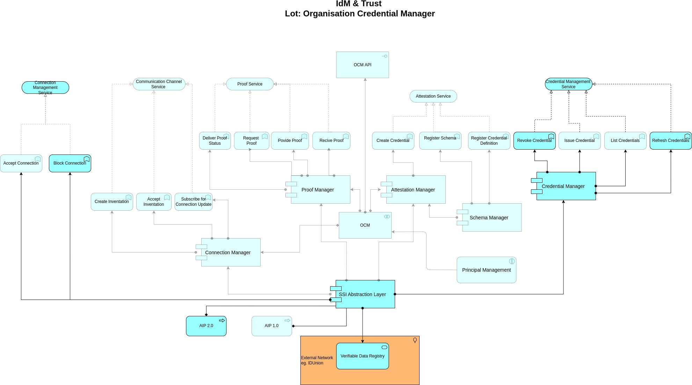
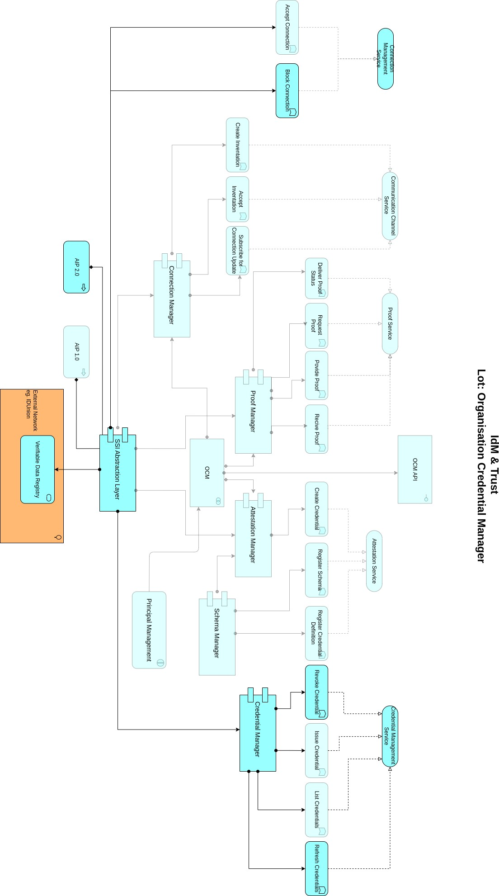

## Software Requirements Specification  for  Gaia-XFederation Services Organization Credential ManagerExtension 1IDM.OCM.E1                                    

Published by

eco -- Association of the Internet Industry (eco -- Verband der Internetwirtschaft e.V.) Lichtstrasse 43h
50825 Cologne, Germany

Copyright

© 2023 eco -- Association of the Internet Industry

This work is licensed under the Creative Commons Attribution 4.0 International License. To view a copy of this license, visit <http://creativecommons.org/licenses/by/4.0/> or send a letter to Creative Commons, PO Box 1866, Mountain View, CA 94042, USA

### 1 [ Introduction ](#introduction)

>##### 1.1  [Document Purpose ](#document-purpose)

>##### 1.2  [Product Scope ](#product-scope)

>##### 1.3  [Definitions, Acronyms and Abbreviations](#definitions-acronyms-and-abbreviations)

>##### 1.4  [References ](#references)

>##### 1.5  [Document Overview ](#document-overview)

### 2  [Product Overview ](#product-overview)

>##### 2.1  [Product Perspective ](#product-perspective)

>##### 2.2  [Product Functions ](#product-functions)

>##### 2.3  [Product Constraints ](#product-constraints)

>##### 2.4  [User Classes and Characteristics](#user-classes-and-characteristics)

>##### 2.5  [Operating Environment ](#operating-environment)

>##### 2.6  [User Documentation ](#user-documentation)

>##### 2.7  [Assumptions and Dependencies ](#assumptions-and-dependencies)

### 3  [Requirements ](#requirements)

>##### 3.1  [External Interfaces ](#external-interfaces)

>>##### 3.1.1  [Software Interfaces ](#software-interfaces)

>>##### 3.1.2  [Communications Interfaces ](#communications-interfaces)

>>>##### 3.1.2.1 [General ](#general)

>>>##### 3.1.2.2 [SSI Abstraction Service](#ssi-abstraction-service)

>##### 3.2  [Functional ](#functional)

>>##### 3.2.1  [Connection Manager ](#connection-manager)

>##### 3.3  [Nonfunctional Requirements ](#nonfunctional-requirements)

>>##### 3.3.1  [Performance Requirements ](#performance-requirements)

>>##### 3.3.2  [Safety Requirements ](#safety-requirements)

>>##### 3.3.3  [Security Requirements ](#security-requirements)

>>##### 3.3.4  [Software Quality Attributes](#software-quality-attributes)

>>##### 3.3.5  [Business Rules ](#business-rules)

>##### 3.4  [Compliance ](#compliance)

>##### 3.5  [Design and Implementation ](#design-and-implementation)

>>##### 3.5.1  [Installation ](#installation)

>>##### 3.5.2  [Configuration ](#configuration)

>>##### 3.5.3  [Distribution ](#distribution)

>>##### 3.5.4  [Service Meshing ](#service-meshing)

>>##### 3.5.5  [Standard Technology ](#standard-technology)

>>##### 3.5.6  [Metrics ](#metrics)

>>##### 3.5.7  [Configurability ](#configurability)

>>##### 3.5.8  [Maintainability ](#maintainability)

>>##### 3.5.9  [Reusability ](#reusability)

>>##### 3.5.10 [Runtime Stability ](#runtime-stability)

>>##### 3.5.11 [High Availability Concepts ](#high-availability-concepts)

>>##### 3.5.12 [Proof of Concept ](#proof-of-concept)

### 4  [System Features ](#system-features)

>##### 4.1  [Attestation Management Service](#attestation-management-service)

>>###### 4.1.1  [Description ](#attestation-management-service-description)

>>###### 4.1.2  [Functional Requirements ](#attestation-management-service-functional-requirements)

>##### 4.2 [Connection Management Service ](#connection-management-service)

>>###### 4.2.1  [Description ](#connection-management-service-description)

>>###### 4.2.2  [Functional Requirements ](#connection-management-service-functional-requirements)

>##### 4.3  [Schema Management Service ](#schema-management-service)

>>###### 4.3.1  [Description ](#schema-management-service-description)

>>###### 4.3.2  [Functional Requirements ](#schema-management-service-functional-requirements)

>##### 4.4  [Credential Management Service](#credential-management-service)

>>###### 4.4.1  [Description ](#credential-management-service-description)

>>###### 4.4.2  [Functional Requirements ](#credential-management-service-functional-requirements)

>##### 4.5  [SSI Abstraction Services ](#ssi-abstraction-services)

>>###### 4.5.1  [Description ](#ssi-abstraction-service-description)

### 5  [Verification ](#verification)

>##### 5.1  [Acceptance Criteria ](#acceptance-criteria)

>>###### 5.1.1  [General ](#general-verification)

>>###### 5.1.2  [Product Constraints ](#product-constraints-verification)

>>###### 5.1.3  [User Documentation ](#user-documentation-verification)

>>###### 5.1.4  [SSI Abstraction ](#ssi-abstraction)

>>###### 5.1.5  [Connection Manager ](#connection-manager-verification)

>>###### 5.1.6  [Attestation Manager ](#attestation-manager-verification)

>>###### 5.1.7  [Schema Manager ](#schema-manager-verification)

>>###### 5.1.8  [Credential Manager ](#credential-manager-verification)

>>###### 5.1.9  [Proof Manager ](#proof-manager-verification)

>##### 5.2  [Support for Kubernetes ](#support-for-kubernetes)

[Appendix A: Glossary ](#appendix-a-glossary)

[Appendix B: Architecture ](#appendix-b-architecture)

## List of Figures 

> Figure 1: Architecture (semi-transparent boxes are out of scope)

## List of Tables 

> Table 1: References

> Table 2: Technology Stack 

> Table 3: Functional Requirements Attestation Manager

> Table 4: Functional Requirements Connection Manager
 
> Table 5: Functional Requirements Schema Manager 

> Table 6: Functional Requirements Credential Manager 

## Introduction

> To get general information regarding Gaia-X and the Gaia-X Federation Services please refer to \[TAD\] and \[PRD\].

### Document Purpose

> The purpose of this document is to specify the requirements of the Identity Management and Trust Subcomponent "Organization Credential Manager Extension 1" with the intention of a European wide public tender for implementing this software extension. Main audience for this document are attendees of the public tender, which are able to supply an open-source software solution for the area of identity and document verification with the purpose to provide digital support for existing certification bodies within Gaia-X.

### Product Scope

> The purpose of this extension is to provide changes to the OCM components to enhance the OCM in its functionality and adopt the latest Gaia-X requirements. The Organization Credential Manager Extension 1 (OCM.E1) enhances the participant's interaction with the SSI-based ecosystem in a trustful and secure environment. This comprises the utilization of the participants digital identity for different functionalities:

-   Extended management of secure and trustable connections with other parties

-   Refreshing and Revocation of verifiable credentials from attesting parties (e.g., Gaia-X Membership credential from a verified notary)

-   Utilization of AIP v2.0 alongside AIP v1.0 by updating the AFJ Framework

-   Provision of verifiable Public Profile

>The described functionalities allow other components in the Identity Management context to interact with the SSI-based ecosystem.

----
> 
>
> If it's required to do code restructurings, modifying the current solution by adding new microservices etc. then this is explicitly allowed.

> Please note, that it is explicitly required to deliver the software up and running. Responsibility for existing code cannot be shifted to previous development teams.

----

### Definitions, Acronyms and Abbreviations

> The IDM and Trust Architecture Overview Document \[IDM.AO\] MUST be considered and applied as the core technical concept that also includes the Terminology and Glossary.

### References

| Reference   | Title                                                            | Link                                                                                                  | Status        |
|-------------|------------------------------------------------------------------|-------------------------------------------------------------------------------------------------------|---------------|
| [AFJ]       | Aries Framework JavaScript                                       | [GitHub - Aries Framework JavaScript](https://github.com/hyperledger/aries-framework-javascript)     |               |
| [BDD]       | Behavior Driven Development                                      | [SpecFlow BDD](https://specflow.org/bdd/)                                                             | Status: 03-18-2023 |
| [DID]       | Decentralized Identifiers (DIDs) v1.0                            | [W3C - DID](https://www.w3.org/TR/did-core/)                                                        | Status: 03-18-2021 |
| [IDM.AO]    | Gaia-X WP1 Identity & Trust Architecture Overview                | Please refer to annex "annex_GX_IDM_AO"                                                              |               |
| [OCM]       | Gaia-X Organization Credential Manager Document                  | Please refer to "annex_Organization Credential Manager" document                                     |               |
| [PRD]       | Gaia-X Policy Rules Document                                     | [Gaia-X PRD](https://docs.gaia-x.eu/policy-rules-committee/policy-rules-labelling/22.11/)           | Status: 08-01-2023 |
| [RFC 2119]  | Key words for use in RFCs to Indicate Requirement Levels         | [RFC 2119](https://tools.ietf.org/html/rfc2119)                                                      |               |
| [TAD]       | Gaia-X Architecture Document                                      | [Gaia-X TAD](https://docs.gaia-x.eu/technical-committee/architecture-document/22.10/federation_service/) |               |
| [TDR]       | Gaia-X Federation Services Technical Development Requirements   | Please refer to annex "GXFS_Technical_Development_Requirements"                                       |               |
| [TSA]       | Gaia-X Trusted Services API Document                             | Please refer to "annex_Trusted Services API" document                                                |               |

>###### Table 1: References

### Document Overview

> This document describes the product perspective, functions, and constraints. Furthermore, it lists the functional and non-functional requirements and defines the system features in detail. The listed requirements are binding. Requirements as an expression of normative specifications are identified by a unique ID in square brackets (e.g. **\[IDM.ID.Number\]**) and the keywords MUST, MUST NOT, SHOULD, SHOULD NOT, MAY, corresponding to RFC 2119 \[RFC 2119\], are written in capital letters (see also \[IDM.AO\] - Methodology).

## Product Overview

### Product Perspective

>Please refer to \[TDR\].

### Product Functions

The functions of the Organization Credential Manager Extension 1 (OCM.E1) component are provided as a runtime component and MUST expose endpoints as REST services and made accessible over the network using encrypted connections (e.g., HTTPS). The scalability of these services MUST be taken into consideration using well-known and tested concepts like a microservice based architecture and load balancing. Since this component is the very core of trust relationships between participants in the Gaia- X ecosystem, security measures MUST be in place accordingly. This includes the protection of exposed service endpoints, data storage protection and access control. The storage for cryptographic material MUST be particularly secured, e.g., by integrating Hardware Security Modules. The overall functionality of the OCM.E1 component and exposed services MUST be auditable (in compliance with GDPR).

> ###### Figure 1: Architecture (semi-transparent boxes are out of scope)

-------

> 

> Please be aware that the semi-transparent boxes are out of scope for further modification but not out of scope for refactoring and problem resolving.
>

-----

> The core functions of the OCM.E1 are:

-   Extended managing of trusted connections between entities(Connections in this context are private, secured, and persistentchannels between entities)

    -   Blocking of Connections

    -   Handling of blocked connections

-   Handling of verifiable credentials exchanges

    -   Refreshing of credentials of participants principals, assets etc.

    -   Revocation of credentials of participants, principals, assets etc.

    -   Handling of revoked credentials

-   Providing publicly visible and verifiable service endpoints within OCM DID Document

    -   Configuration of Public Custom Endpoints

    -   Configuration of Private Custom Endpoints (with DID-Auth/OIDC)

    -   Configuration of Endpoint Mappings to internal/external functionality

> The updated SSI Abstraction Service provides the required SSI functionality to the other components but is not aware of the Gaia-X context. In this document, the context-specific aspects and interaction with Trust Services are implemented in the specific components:

-   Connection Manager

-   Attestation Manager

### Product Constraints

> Please refer to \[OCM\] section 2.3 and \[TSA\] section 2.3.
>
> The intended environment that is used to support the OCM.E1 product is bound to Aries protocols.

### User Classes and Characteristics

> Please refer to \[OCM\] section 2.4.

### Operating Environment

###### \[IDM.OCM.E1.00000\] Kubernetes Environment 

> The product MUST be operable on standard Kubernetes based environments without any hardware restrictions. The reference environment for demonstration and development purposes MUST be on the provided SCS cluster (Sovereign Cloud Stack), that will be provided by the Client.

### User Documentation

###### \[IDM.OCM.E1.00001\] Participant Administration Documentation 

> The documentation MUST contain:

-   Installation Manuals

-   Cryptographic Initialization (if applicable)

-   Description of Deployment/Compile Process

-   Description of the Automatic Tests / Verification

-   How to build the products from source code

###### \[IDM.OCM.E1.00002\] Participant Documentation 

> The documentation MUST contain:

-   Short Software Description (why and for what, when to use, how to use, where to use)

-   Usage guide

-   GDPR design decisions

-   Security concept

-   Operations concept

-   FAQ

-   Keyword Directory 

### Assumptions and Dependencies

> An understanding of the overall Gaia-X architecture and philosophy is necessary as well as understanding of the OCM architecture and implementation details. Please refer to \[TAD\], \[PRD\] and \[OCM\].

>Attendees of the public tender MUST assume responsibility of:

-   The existing code and improvements upon the existing code base (semi-transparent boxes listed on Figure 1)

-   Extending or contributing to the used frameworks in order to provision a way in which realization of the requirements can be achieved

-   Updating dependencies to the latest stable version

-   Refactoring the Software Architecture

----

> Please be aware that extending or contributing to the used frameworks means explicitly to actively make or drive changes if necessary. Driving or making changes could be: creating git issues, discussing with framework contributors and maintainers, making changes in the Codebase.

----

## Requirements

### External Interfaces

#### Software Interfaces

##### General

###### \[IDM.OCM.E1.00003\] General Operation Requirements 

> Every component must be able to run as a container. For scalable deployment e.g., a helm chart must be provided.

> If database connections are used, it must provide options to run the container "stand-alone", e.g., in-memory and with an external, configurable database.

#### Communications Interfaces

##### General

###### \[IDM.OCM.E1.00004\] Event Handling 

> A lot of services within the OCM are publishing and receiving events, events are related to the scope of SSI for the different protocol flows. The way to publish and subscribe these events must be consistent throughout the functionality of the OCM.E1.

##### SSI Abstraction Service

###### \[IDM.OCM.E1.00005\] AIP v2.0 support 

> The current implementation uses version 1.0 of the Aries JavaScript Framework. In order to support AIP v2.0 the SSI Abstraction Service MUST implement the latest stable version of Aries Framework JavaScript [1] \[AFJ\] and handle the necessary changes to the other services accordingly.

###### [1] [<u>[https://github.com/hyperledger/aries-framework-javascript]</u>](https://github.com/hyperledger/aries-framework-javascript)

### Functional

#### Connection Manager

###### \[IDM.OCM.E1.00006\] Block Connection 

> The Connection Manager must provide a Block Connection endpoint. The endpoint should accept either connection ID or DID. It should delete the connection from the SSI Abstraction service and mark it as 'blocked' in the Connection Manager.

###### \[IDM.OCM.E1.00007\] Refuse blocked connections 

> The Connection Manager must refuse connections if they match the connection ID or DID of a connection in the database, which has been marked as 'blocked'. The response of an unsuccessful connection in this case should include the reason for refusal in the response message.

###### \[IDM.OCM.E1.00008\] Auto-accept Connections to Self 

> The Connection Manager must automatically accept connections if they match the DID of the OCM.

###### \[IDM.OCM.E1.00009\] Trusted Connection to Self 

> The Connection Manager must mark connections as "trusted" if they match the DID of the OCM.

###### \[IDM.OCM.E1.00010\] TSA Acception 

> The Connection Manager MUST use TSA to accept/block connections automatically according to the incoming DID.

###### \[IDM.OCM.E1.00011\] Connection List Endpoint 

> The Connection Manager MUST provide an Endpoint to List all existing connections.

##### Attestation Manager

###### \[IDM.OCM.E1.00012\] Responsibilities of components 

> The Attestation Manager is currently responsible for the operations on schemas, credential definitions and credentials. It MUST be separated into two distinct components - Schema manager, which handles schema and credential definition operations, and Credential Manager, which handles credential operations.

###### \[IDM.OCM.E1.00013\] Endpoints for Credential Requests/Proposals 

> The attestation manager MUST provide an endpoint which delivers open credential offerings and credential requests.

##### Schema Manager

###### \[IDM.OCM.E1.00014\] Schemas and Credential Definitions 

> The Schema Manager MUST implement all necessary schema and credential definition operations, including but not limited to the current endpoints in the Attestation Manager of the OCM, responsible for schema and credential definition operations.

##### Credential Manager

###### \[IDM.OCM.E1.00015\] Credentials 

> The Credential Manager MUST implement all necessary credential operations, including but not limited to the current endpoints in the Attestation Manager of the OCM, responsible for issuing and other operations with credentials.

###### \[IDM.OCM.E1.00016\] Credential Revocation 

> The Credential Manager MUST provide a Revoke Credential endpoint. 

###### \[IDM.OCM.E1.00017\] Auto-Reissued Credential 

> Ability for auto-reissuing of a VC MUST be provided. 

###### \[IDM.OCM.E1.00018\] Credential Auto-Revocation 

> The Credential Manager provides Automated Revocation of Credentials, based on the expiration date (if specified), as well as additional parameters describing whether the specific credential should be automatically revoked.

###### \[IDM.OCM.E1.00019\] Credential Refreshing 

> Depending on the autoReissued value of the credential, the Credential Manager reissues the credential with a new expiration date. The refresh option is included in the credential, which would allow the holder to refresh the credential before creating a verifiable presentation.

###### \[IDM.OCM.E1.00020\] Auto-accept Self-issued Credentials 

> The Credential Manager must automatically accept Verifiable Credentials that have been issued by the OCM over a DIDComm connection with itself (self-issuing).

##### Proof Manager

###### \[IDM.OCM.E1.00021\] JSON-LD Mapping 

> When a presentation is made, the presentation can be mapped to a prepared JSON-LD.

##### Common Enhancements

###### \[IDM.OCM.E1.00022\] Custom Service Endpoint Configuration 

> The OCM MUST support the configuration of custom endpoints which are visible in the DID Documents Service Endpoint Section (\[DID\] Section 5.4). It MUST be possible to define either private or public endpoints secured by DID Auth and OIDC, which are configurable in a OCM config.

###### \[IDM.OCM.E1.00023\] DID Configuration Provision 

> The OCM MUST provide to a configured URL an DID Configuration according to the Identity Foundation specification [2].

###### [2] [<u>[https://identity.foundation/specs/did-configuration/]</u>](https://identity.foundation/specs/did-configuration/)

###### \[IDM.OCM.E1.00024\] DID Document Resolving 

> The DID Document of the OCM MUST be resolvable by the Universal Resolver and it MUST contain all key material used by the OCM including all endpoints following this service configuration format by enhancing the W3C spec [3]:

             {
            
             id: {idName}
            
             type: {typeName},
            
             accept: \["didcomm/v2","didcomm/v1",{otherProtocols}\],
            
             serviceEndpoint:\["https://..."\]
            
             }

###### [3] [<u>[https://www.w3.org/TR/did-core/#example-usage-of-the-service-property]</u>](https://www.w3.org/TR/did-core/#example-usage-of-the-service-property)

###### \[IDM.OCM.E1.00025\] Event Restructuring 

> The current structure contains a structure which uses partially NATS Events and partially Rest API calls of the underlying Aries Extensions, but in cause of a micro service approach the entire structure MUST be reorganized for NATS eventing to clean up the communication between the components e.g., "Aries Event Extension".

###### \[IDM.OCM.E1.00026\] Multi Tenancy 

> The component MUST support multi tenancy with possibility to scale down to zero.

###### \[IDM.OCM.E1.00027\] Selective Disclosure JWT 

> The component MUST support Selective Disclosure JWT described in the specification [4].

###### [4] [<u>[https://datatracker.ietf.org/doc/draft-ietf-oauth-selective-disclosure-jwt/]</u>](https://datatracker.ietf.org/doc/draft-ietf-oauth-selective-disclosure-jwt/)

### Nonfunctional Requirements

#### Performance Requirements

###### \[IDM.OCM.E1.00028\] Up/Down Scale 

> All components MUST be able to scale up/down their functionality for undefined amount instances. This requires a parallel execution possibility which will be tested later on by performance tests which are defined by the test team.

###### \[IDM.OCM.E1.00029\] Performance by Design 

> The product SHOULD be designed and implemented in a way that the implementation is non- blocking and performance oriented. It SHOULD be a microservice architecture, but it MAY follow other concepts. The decision MUST be documented.

#### Safety Requirements

###### \[IDM.OCM.E1.00030\] Major Releases 

> All used software components MUST use the major releases with Long Term Support. If no LTS is available, all components MUST use the latest major releases with security hardening.

#### Security Requirements

###### \[IDM.OCM.E1.00031\] CVE Patches 

> All software components MUST have applied CVE patches, which are available for major releases.

#### Software Quality Attributes

###### \[IDM.OCM.E1.00032\] Software Quality Requirements 

> All software components MUST be compliant to the requirements within the quality assurance repository [5]. This includes testing on different layers (unit, component, integration), branch model that support stages, patch management, and code quality verification with adequate reporting. In addition, all requirements and quality attributes MUST demonstrated by automated behavior driven testing \[BDD\] methodology.

###### [5] [<u>[https://gitlab.com/gaia-x/data-infrastructure-federation-services/quality-assurance/-/issues]</u>](https://gitlab.com/gaia-x/data-infrastructure-federation-services/quality-assurance/-/issues)

###### \[IDM.OCM.E1.00033\] Descriptive Logging 

> Descriptive logging of key points in the code MUST be implemented. For the purpose of proper monitoring logs MUST be included in all potential failing points in the functions of the code, as well as all major steps of successful operations.

#### Business Rules

###### \[IDM.OCM.E1.00034\] Software Consistency 

> The used technologies MUST have consistency. Standard technologies e.g., Databases MUST be abstracted over JDBC, authentication over OIDC etc.

###### \[IDM.OCM.E1.00035\] Cherry Picking 

> All components and the entire software architecture MUST be checked for the necessity for deployment of each single feature, to allow an enterprise deployment customization.

### Compliance

###### \[IDM.OCM.E1.00036\] GDPR Audit Logging 
> All GDPR relevant access to personal relevant data MUST be logged for a later audit.

###### \[IDM.OCM.E1.00037\] GDPR Data Processing 

> Is it necessary to process person-relevant data, it MUST be earmarked to a clearly defined business process, which has to be described in the GDPR design decisions. All relevant data MUST be deleted after the processing, if applicable.

### Design and Implementation

#### Installation

###### \[IDM.OCM.E1.00038\] Helm/Argo CD Deployment 

> All installations MUST be scripted/templated to ensure automated deployment. This MUST be ensured over HELM templates which MUST follow uniform rules across all lots. The charts MUST be integrable in a ARGO CD Pipeline defined in the gxfs-integration repository [6].

###### [6] [<u>[https://gitlab.eclipse.org/eclipse/xfsc/integration]</u>](https://gitlab.eclipse.org/eclipse/xfsc/integration)

#### Configuration

###### \[IDM.OCM.E1.00039\] Configuration 

> All components MUST support one of the major configuration formats (yaml, json, ini, environment variables) wherever configuration is required. If environment variables are overwriting an actively set configuration, a warning SHOULD be logged.

#### Distribution

###### \[IDM.OCM.E1.00040\] Helm Repositories 
> All component helm charts MUST be available under a helm repository hosted in the GitLab, with different channels for distribution [7]. 

###### [7] [<u>[https://gitlab.com/api/v4/projects/41175300/packages/helm/Integration/index.yaml]</u>](https://gitlab.com/api/v4/projects/41175300/packages/helm/Integration/index.yaml)

###### \[IDM.OCM.E1.00041\] Istio Resources 

> Additionally, the Charts MUST provide Istio Resource (e.g., Authorization Rules, Virtual Services etc. ) following the integration pattern specified in the gxfs-integration repo [8].

###### [8] [<u>[https://gitlab.eclipse.org/eclipse/xfsc/integration]</u>](https://gitlab.eclipse.org/eclipse/xfsc/integration)

#### Service Meshing

###### \[IDM.OCM.E1.00042\] Istio Support 

> All HELM charts MUST be provided with Istio support aligned together with the project team. This consists of Authorization Rules, Virtual Service Definitions and other relevant Istio Definitions which are required for integration in a Istio Environment.

#### Standard Technology

###### \[IDM.OCM.E1.00043\] Default Toolstack 

> Each development MUST consider the following standard technologies, if nothing else is explicitly requested:

  | Area                    | Technology                             |
|-------------------------|---------------------------------------|
| Service Meshing         | Istio                                 |
| Databases               | Redis, Mongo, Postgres                |
| Messaging               | CloudEvents                           |
| Continuous Integration  | Argo CD, Gitlab                       |
| Installation Templates  | HELM                                  |
| Container               | Docker Images (ARM64/AMD64)           |
| Secret Storage          | Hashicorp Vault, k8s Secret           |
| UI Technology           | React [9]                                |
| Ingress Controller      | Nginx                                 |
| API Testing             | Postman (manual)                      |
| API Design              | OpenAPI                               |
| Kubernetes              | v1.26+                                |

> ###### Table 2: Technology Stack

###### [9] [<u>[https://react-bootstrap.github.io/]</u>](https://react-bootstrap.github.io/)

------
> 
> 
> The technology stack is mandatory to avoid integration impact.

-----

#### Metrics

###### \[IDM.OCM.E1.00044\] Opentelemtry Support 

> All helm charts/services MUST provide metrics endpoints in opentelemetry [10] format.

###### [10] [<u>[https://opentelemetry.io/docs/]</u>](https://opentelemetry.io/docs/)

#### Configurability

###### \[IDM.OCM.E1.00045\] Configuration Profiles 

> Environment specific parameters MUST be configurable over the helm templates by using profiles. Each component MUST be delivered minimum for profile:

-   DEV, a local environment for round trip development and testing

-   Acceptance, a restricted resource environment (with minimal system requirements) which can be deployed in cluster (remote or locally)

-   Prod, a scalable environment with fault tolerance, HA settings and security hardening

###### \[IDM.OCM.E1.00046\] Secret References in Helm Charts 

> The configuration secrets within Helm Charts MUST use secretRefs to support external Secretmanagement. Clear text secrets within the Helm Charts are not allowed.

#### Maintainability

###### \[IDM.OCM.E1.00047\] Micro Service Architecture 

> For a better scale out, maintainability and decentralization, the product architecture MUST have a micro service architecture. Each microservice MUST NOT be limited on the lines of code or number of days to implement it. The service "size" SHOULD be oriented on the fine granular business capabilities. (e.g., Order, ListMenu, Payment).

###### \[IDM.OCM.E1.00048\] Domain Driven Design 

> To support the micro service architecture within the maintainability, it MUST be declared a domain model before realization. The software description MUST explain which domain model was chosen, which services contain it and how it scales. This MUST be documented in the public code repository to support future enhancements for new developers.

#### Reusability

###### \[IDM.OCM.E1.00049\] Enterprise Environments 

> All components MUST be reusable in different enterprise environments by customization and whitelabeling. This means all components MUST be able to customize and white label the components by configuration settings (e.g., UIs, text labels, endpoints etc.)

#### Runtime Stability

###### \[IDM.OCM.E1.00050\] Readiness Checkups 

> All components MUST reflect after bootstrap and during runtime the correctness of the service functionality by reflecting it over health endpoints. The health endpoint MUST return failure (red), if any internal behavior failure or misconfiguration occurs (not just the software running state). This means for instance to check continuously during the runtime:

-   An unreachable configured Services results in failed state

-   Configured Service Endpoints needs to be checked for readiness during runtime, if not reachable, it results in failure state

-   Check depending components (Database, Microservice etc.) behind it, if not reachable, it results in failed state

#### High Availability Concepts

###### \[IDM.OCM.E1.00051\] Redundant Deployment 

> Each deployment MUST be configured for a minimum fault tolerance of 2 instances.

#### Proof of Concept

###### \[IDM.OCM.E1.00052\] Architecture Changes 

> All Architecture Changes MUST be aligned with the Client before implementation.

## System Features

### Attestation Management Service

#### Attestation Management Service Description

> The Attestation Management Service should separate the functionalities regarding credentials, schemas and credential definitions in two distinct components that handle credentials, and schemas and credential definitions respectively.

#### Attestation Management Service Functional Requirements 

 | <i>Legacy</i>                                  |
|----------------------------------------|
| - Responsibilities of components        |
| - Endpoints for Credential Requests/Proposals |

> ###### Table 3: Functional Requirements Attestation Manager

### Connection Management Service

#### Connection Management Service Description 

> The Connection Management Service should maintain the existing Connection Manager functionality and additionally handle all the requirements regarding the blocked connections, which includes the blocking and unblocking of a connection based on a common identifier (an identifier that is not defined per connection, but is shared between different connections to the same Participant), as well as subsequent interactions with the blocked connection.

#### Connection Management Service Functional Requirements 

| <i>Endpoints</i>              |
|------------------------|
| -Block Connection       |
|                        |
|<i><b> Functions</b></i>              |
| - Refuse blocked connections |
| - Auto-accept Connections to Self |
| - Trusted Connection to Self |

>###### Table 4: Functional Requirements Connection Manager

### Schema Management Service

#### Schema Management Service Description

> The Schema Management service is responsible for utilizing the existing schema and credential definition functionality of the existing Attestation Manager (\[OCM\] Section 4.5).

#### Schema Management Service Functional Requirements

|<i><b> Legacy</b></i>  |
|-------------------------------------------|
| -Schemas and Credential Definitions                               |

>###### Table 5: Functional Requirements Schema Manager

### Credential Management Service

#### Credential Management Service Description

> The Credential Management Service is responsible for utilizing the existing credential functionality of the Attestation Manager (\[OCM\] Section 4.5). It should also be responsible for the credential revocation and refreshing of credentials, as well as all needed additional functionalities for automatic refreshing and revocation management.

#### Credential Management Service Functional Requirements

| <i><b>Endpoints</b></i>               |
|-------------------------|
| -Credential Revocation   |
| <i><b>Functions</b></i>               |
| -Auto-Reissued Credential|
| -Credential Auto-Revocation|
| -Credential Refreshing   |
| -Auto-accept Self-issued|
| <i><b>Legacy</b></i>                  |
| -Credentials             |

>###### Table 6: Functional Requirements Credential Manager

### SSI Abstraction Services 

#### SSI Abstraction Service Description

> The SSI Abstraction Service (\[OCM\] Section 4.6) is currently employing the Aries JavaScript Framework at its core and provides its functionality to the other components. The package version is at 0.1.0 and should be updated to the latest stable version, as well the Aries rest extension that provides access to the agent via REST endpoints. It should be able to accommodate the desired functional requirements of both \[OCM\] and OCM.E1.

### SSI Abstraction Service Verification

> All listed verification items/criterias, must be fulfilled by a demonstration of the implementation within the Kubernetes environment.

###### \[IDM.OCM.E1.00053\] Automated Integration Tests 

> Current Automation Suite MUST be extended and updated accordingly.

## Verification

>All listed verification items/criterias, must be fulfilled by a demonstration of the implementation within the Kubernetes environment.

###### \[IDM.OCM.E1.00053\] Automated Integration Tests

>Current Automation Suite MUST be extended and updated accordingly. 

### Acceptance Criteria

#### General - Verification

###### \[IDM.OCM.E1.00054\] General Operation Requirements 

> Every component is demonstrated to be able to run as a container and functioning helm charts are provided.

###### \[IDM.OCM.E1.00055\] Event Handling 

> Previously used events are not disrupted or malfunctioning, and newly created ones are demonstrated or through the functions they enable it is implied that they are properly functioning.

#### Product Constraints - Verification

###### \[IDM.OCM.E1.00056\] Microservice Approach 

> The Services interact with each other through standard APIs and protocols and are deployed as microservices.

#### User Documentation - Verification

###### \[IDM.OCM.E1.00057\] Documentation Update 

> The current documentation is updated and enhanced, and the new services and functions are added to the existing documentation or in a newly created one if it is needed.

#### SSI Abstraction

###### \[IDM.OCM.E1.00058\] AIP v2.0 support 

> The SSI abstraction service's core (\[AFJ\] ) MUST be updated to the latest stable version (for the purposes of this iteration) and provides AIP v2.0 protocols.

#### Connection Manager - Verification

###### \[IDM.OCM.E1.00059\] Block Connection 

> The blocked connection is discoverable through the \[OCM\] List Connection API endpoint and is displayed as 'blocked'.

###### \[IDM.OCM.E1.00060\] Refuse blocked connections 

> Any further interactions through a blocked connection (e.g., proof request, issue credential, etc.) are demonstrated as unavailable and the response returned from the respective endpoint is unsuccessful.

###### \[IDM.OCM.E1.00061\] Auto-accept Connections to Self 

> The OCM automatically accepts connections with itself.

###### \[IDM.OCM.E1.00062\] Trusted Connection to Self 

> DIDComm Connections that are between the OCM and itself are always by configuration marked as "trusted".

###### \[IDM.OCM.E1.00063\] Policy Based Acception 

> Connections are accepted on the basis of a policy.

#### Attestation Manager - Verification

###### \[IDM.OCM.E1.00064\] Responsibilities of components 

> The Attestation Manager no longer exists, but its functionality is split into the Schema and Credential Managers.

#### Schema Manager - Verification

###### \[IDM.OCM.E1.00065\] Schemas and Credential Definitions 

> The Schema Manager is shown to be responsible for all schema operations, previously existent on the Attestation Manager Service.

#### Credential Manager - Verification

###### \[IDM.OCM.E1.00066\] Credentials 

> The Credential Manager is shown to be responsible for all credential operations, previously existent on the Attestation Manager Service.

###### \[IDM.OCM.E1.00067\] Get Credentials 

> The OCM endpoint delivers all credentials of the wallet.

###### \[IDM.OCM.E1.00068\] Credential Revocation 

> The Credential Manager successfully performs revocation of Verifiable Credentials. 

###### \[IDM.OCM.E1.00069\] Auto-Reissued Credential 

> In the stored data of the Verifiable Credential, a field for autoReissuance (not bound to the exact mention of its name) is present.

###### \[IDM.OCM.E1.00070\] Credential Auto-Revocation 

> The Credential Manager is able to successfully revoke a Verifiable Credential once the expiration date attribute's value has been reached. This should be done for all stored Verifiable Credentials.

###### \[IDM.OCM.E1.00071\] Credential Refreshing 

> Depending on the autoReissued value of the credential database entry, the Credential Manager successfully reissues a Verifiable Credential if autoReissued's condition is met and does not do so if the condition is not met.

###### \[IDM.OCM.E1.00072\] Auto-accept Self-issued Credentials 

> Credentials issued by the OCM to itself are automatically accepted.

#### Proof Manager - Verification

###### \[IDM.OCM.E1.00073\] JSON-LD Mapping 

> When a presentation is made, the presentation can be mapped to a prepared JSON-LD.

### Support for Kubernetes

###### \[IDM.OCM.E1.00074\] Eventing 

> All eventings MUST be demonstrated on basis of cloud events specifications \[Cloud.Events\] together with the kNative [11] broker in a Kubernetes environment.

###### [11] [<u>[https://knative.dev/docs/eventing/]</u>](https://knative.dev/docs/eventing/)

###### \[IDM.OCM.E1.00075\] Config Map Support 

> Each service must be demonstrated up and running in Kubernetes, configured by config maps.

###### \[IDM.OCM.E1.00076\] Helm Installation 

> The service installation MUST be demonstrated during HELM install.

###### \[IDM.OCM.E1.00077\] ArgoCD Integration 

> The helm chart MUST be able to install inside of AgroCD. This includes the usage of the postgres hooks [12] and the providing of usable values.yaml(s) for all developed services.

###### [12] [<u>[https://gitlab.eclipse.org/eclipse/xfsc/integration/-/tree/main/helm/charts/postgresql-hook]</u>](https://gitlab.eclipse.org/eclipse/xfsc/integration/-/tree/main/helm/charts/postgresql-hook)

###### \[IDM.OCM.E1.00078\] SCS Environment 

> All HELM installations MUST run on SCS (Sovereign Cloud Stack). The <u>final acceptance</u> demonstration cannot be realized on azure, google cloud etc.

## Appendix A: Glossary 

> For the glossary refer to IDM.AO Glossary/Terminology \[IDM.AO\]

## Appendix B: Architecture 

> (semi-transparent boxes are out of scope)

