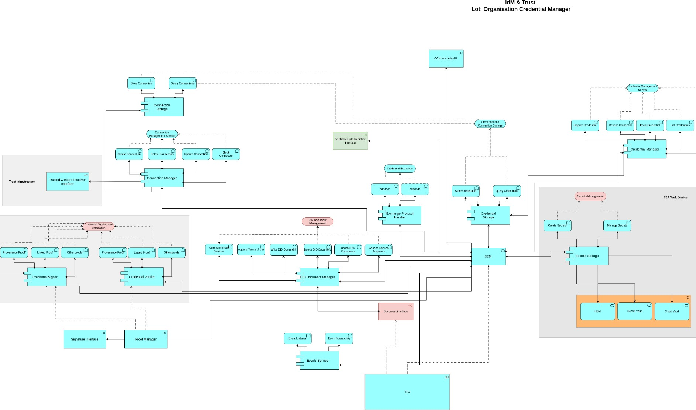
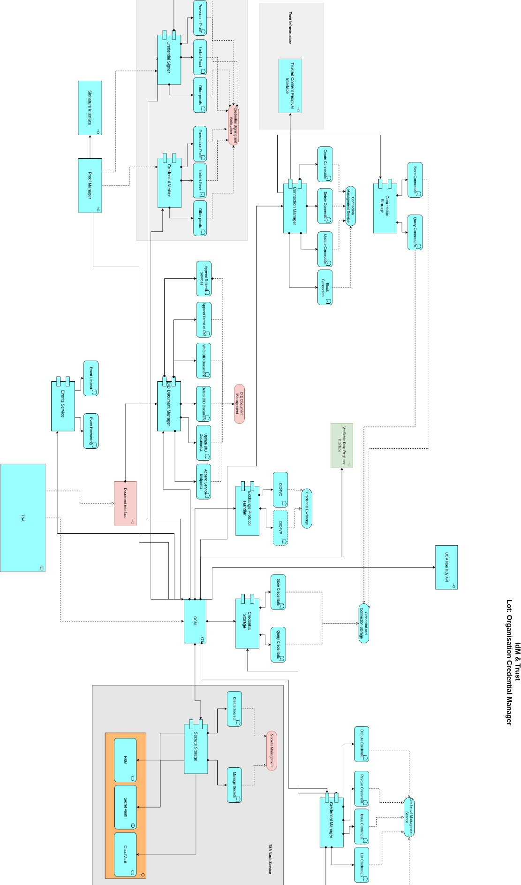

##  Software Requirements Specification for Gaia-X Federation Services Organization Credential Manager       W-STACK IDM.OCM.W-STACK

Published by

eco -- Association of the Internet Industry (eco -- Verband der Internetwirtschaft e.V.) Lichtstrasse 43h 50825 Cologne, Germany

Copyright 

© 2023 eco -- Association of the Internet Industry
This work is licensed under the Creative Commons attribution 4.0nInternational License. To view a copy of this license, visit <http://creativecommons.org/licenses/by/4.0/> or send a letter to Creative Commons, PO Box 1866, Mountain View, CA 94042, USA

#### 1  [Introduction ](#introduction)

>##### 1.1  [Document Purpose ](#document-purpose)

>##### 1.2  [Product Scope ](#product-scope)

>##### 1.3  [Definitions, Acronyms and Abbreviations](#definitions-acronyms-and-abbreviations)

>##### 1.4  [References ](#references)

>##### 1.5  [Document Overview ](#document-overview)

#### 2  [Product Overview ](#product-overview)

>##### 2.1  [Product Perspective ](#product-perspective)

>##### 2.2  [Product Functions ](#product-functions)

>##### 2.3  [Product Constraints ](#product-constraints)

>##### 2.4  [User Classes and Characteristics](#user-classes-and-characteristics)

>##### 2.5  [Operating Environment ](#operating-environment)

>##### 2.6  [User Documentation ](#user-documentation)

>##### 2.7  [Assumptions and Dependencies ](#assumptions-and-dependencies)

#### 3  [Requirements ](#requirements)

>##### 3.1  [External Interfaces ](#external-interfaces)

>>###### 3.1.1  [Software Interfaces ](#software-interfaces)

>>###### 3.1.2  [Communications Interfaces ](#communications-interfaces)

>>###### 3.1.3  [Hardware Interfaces ](#hardware-interfaces)

>##### 3.2  [Functional ](#functional)

>>###### 3.2.1  [General ](#general)

>##### 3.3  [Nonfunctional Requirements ](#nonfunctional-requirements)

>>###### 3.3.1  [Performance Requirements ](#performance-requirements)

>>###### 3.3.2  [Safety Requirements ](#safety-requirements)

>>###### 3.3.3  [Security Requirements ](#security-requirements)

>>###### 3.3.4  [Software Quality Attributes](#software-quality-attributes)

>>###### 3.3.5  [Business Rules ](#business-rules)

>##### 3.4  [Compliance ](#compliance)

>##### 3.5  [Design and Implementation ](#design-and-implementation)

>>###### 3.5.1  [Installation ](#installation)

>>###### 3.5.2  [Configuration ](#configuration)

>>###### 3.5.3  [Distribution ](#distribution)

>>###### 3.5.4  [Service Meshing ](#service-meshing)

>>###### 3.5.5  [Standard Technology ](#standard-technology)

>>###### 3.5.6  [Metrics ](#metrics)

>>###### 3.5.7  [Configurability ](#configurability)

>>###### 3.5.8  [Maintainability ](#maintainability)

>>###### 3.5.9  [Reusability ](#reusability)

>>###### 3.5.10 [Runtime Stability ](#runtime-stability)

>>###### 3.5.11 [High Availability Concepts ](#high-availability-concepts)

>>###### 3.5.12 [Proof of Concept ](#proof-of-concept)

#### 4  [System Features ](#system-features)

>##### 4.1  [Connection Management Service](#connection-management-service)

>>###### 4.1.1  [Description  ](#description-connection-management-service)

>>###### 4.1.2  [Functional Requirements ](#functional-requirements-connection-management-service)

>##### 4.2  [Credential Management Service](#credential-management-service)

>>###### 4.2.1  [Description ](#description-credential-management-service)

>>###### 4.2.2  [Functional Requirements ](#functional-requirements-connection-management-service)

>##### 4.3  [Credential and Connection Storage ](#credential-and-connection-storage)

>>###### 4.3.1  [Description ](#description-credential-and-connection-storage)

>>###### 4.3.2  [Functional Requirements ](#functional-requirements-credential-and-connection-storage)

>##### 4.4  [DID Document Management Service](#did-document-management-service)

>>###### 4.4.1  [Description ](#description-did-document-management-service)

>>###### 4.4.2  [Functional Requirements ](#functional-requirements-did-document-management-service)

>##### 4.5  [Credential Signing and Verification Service](#credential-signing-and-verification-service)

>>###### 4.5.1  [Description ](#description-credential-signing-and-verification-service)

>>###### 4.5.2  [Functional Requirements ](#functional-requirements-credential-signing-and-verification-service)

>##### 4.6  [Schema Management Service ](#schema-management-service)

>>###### 4.6.1  [Description ](#description-schema-management-service)

>>###### 4.6.2  [Functional Requirements ](#functional-requirements-schema-management-service)

#### 5  [Verification ](#verification)

>##### 5.1  [Acceptance Criteria ](#acceptance-criteria)

>>###### 5.1.1  [General ](#general-acceptance-criteria)

>>###### 5.1.2  [Connection Manager ](#connection-manager-acceptance-criteria)

>>###### 5.1.3  [Credential Manager ](#credential-manager-acceptance-criteria)

>>###### 5.1.4  [Issue Credential ](#issue-credential-acceptance-criteria)

>>###### 5.1.5  [Dispute Credential ](#dispute-credential-acceptance-criteria)

>>###### 5.1.6  [Revoke Credential ](#revoke-credential-acceptance-criteria)

>>###### 5.1.7  [Prove Credential ](#prove-credential-acceptance-criteria)

>>###### 5.1.8  [Credential Types ](#credential-types-acceptance-criteria)

>>###### 5.1.9  [Credential and Connection Storage](#credential-and-connection-storage-acceptance-criteria)

>>###### 5.1.10 [DID Document Manager ](#did-document-manager-acceptance-criteria)

>>###### 5.1.11 [Credential Signing and Verification](#credential-signing-and-verification-acceptance-criteria)

>>###### 5.1.12 [Secrets Management ](#secrets-management-acceptance-criteria)

>>###### 5.1.13 [Schema Management ](#schema-management-acceptance-criteria)

>>###### 5.1.14 [Nonfunctional ](#nonfunctional-acceptance-criteria)

[Appendix A: Glossary ](#appendix-a-glossary)

[Appendix B: Architecture ](#appendix-b-architecture)

## List of Figures 

>Figure 1: Architecture (also see appendix B)
>
>Figure 2: Architecture Block Diagram 

## List of Tables 

> Table 1: References 
>
> Table 2: User Classes and Characteristics
>
> Table 3: Technology Stack
>
> Table 4: Functional Requirements Connection Manager 
>
> Table 5: Functional Requirements Credential Manager 
>
> Table 6: Functional Requirements Connection Manager 
>
> Table 7: Functional Requirements DID Document Manager
>
> Table 8: Functional Requirements Credential Signing and Verification Service 
>
>Table 9: Functional Requirements Schema Management Service

# Introduction

> To get general information regarding Gaia-X and the Gaia-X Federation Services please refer to \[TAD\] and \[PRD\].

## Document Purpose

> The purpose of this document is to specify the requirements of the Identity Management and Trust Subcomponent "Organization Credential Manager W-STACK" with the intention of a European wide public tender for implementing this software extension. Main audience for this document are attendees of the public tender, which are able to supply an open-source software solution for the area of identity and document verification with the purpose to provide digital support for existing certification bodies within Gaia-X.

## Product Scope

> The purpose of these products is to provide all necessary components for the extension of the administration of the digital identity of a participant in the Gaia-X context. The Organization Credential Manager W-STACK (IDM.OCM.W-STACK) enhances the participant's interaction with the SSI-based ecosystem in a trustful and secure way. This comprises the utilization of the participants digital identity for different functionalities:

-   Implementation of Full W3C DID/VC/VP Support for Credential Exchange and Trust

-   Implementation of OpenID Standards

    -   OpenId4VC/VP

    -   SIOP

    -   VC Issuance Protocol Extension

-   Establishment of secure and trustable connections with other parties

-   Request and reception of verifiable credentials from attesting parties (e.g., Gaia-X Membership credential from a verified notary) in JSON-LD Format

-   Attestation of attributes to principals in the form of verifiable credentials (e.g., employees, technical assets)

-   Validation of received verifiable presentations from other parties (e.g., validation of Gaia-X membership of other participants)

-   Maintenance of the verifiable Public Profile

-   Scalable VC/VP Storage

-   Graph Indexing for Linking VC/VP

> The described functionalities allow other components in the Identity Management context to interact with the SSI-based ecosystem.

-----
> 

>Please note, that it is explicitly required to deliver the software up and running. Responsibility for existing code cannot be shifted to previous development teams.
-------

## Definitions, Acronyms and Abbreviations

> The IDM and Trust Architecture Overview Document \[IDM.AO\] MUST be considered and applied as the core technical concept that also includes the Terminology and Glossary.

## References

| **Reference** | **Title**                                                                                                   | **Status**      |
|---------------|-------------------------------------------------------------------------------------------------------------|-----------------|
| [BDD]         | [Getting Started with Behavior Driven Development](https://specflow.org/bdd/) (Specflow, n.D.)            | 03-17-2023      |
| [Cloud Events]| [CloudEvents Specification](https://cloudevents.io/) (CloudEvents Authors, The Linux Foundation, 2021)  | 03-17-2023      |
| [EBSI]        | [EBSI](https://ec.europa.eu/digital-building-blocks/wikis/display/EBSI/Home) (CEF Digital, 2021)          | 08-15-2023      |
| [EIDAS]       | [SSI eIDAS Legal Report](https://joinup.ec.europa.eu/sites/default/files/document/2020-04/SSI_eIDAS_legal_report_final_0.pdf) (Dr. Ignacio Alamillo Domingo, 2020) | 07-13-2023 |
| [GDPR]        | [General Data Protection Regulation GDPR](https://gdpr-info.eu/) (Intersoft Consulting, 2019)           | 03-17-2023      |
| [IDM.AA]      | Authentication/Authorization Document (Gaia-X, European Association for Data and Cloud, AISBL, 2021)    | -               |
| [IDM.AO]      | Architecture Overview (GAIA-X WP1, 2021)                                                                 | -               |
| [IDM.TSA]     | Trusted Services API (Gaia-X, European Association for Data and Cloud, AISBL, 2021)                     | -               |
| [OIDC]        | [OpenID working groups specifications](https://openid.net/developers/specs/)                           | -               |
| [OID4VC]      | [OpenID for Verifiable Credential Issuance](https://openid.net/specs/openid-4-verifiable-credential-issuance-1_0.html) | 03-17-2023 |
| [OID4VP]      | [OpenID for Verifiable Presentations](https://openid.net/specs/openid-4-verifiable-presentations-1_0.html) | 03-17-2023 |
| [PRD]         | [Gaia-X Policy Rules Document](https://docs.gaia-x.eu/policy-rules-committee/policy-rules-labelling/22.11/) (Gaia-X, European Association for Data and Cloud, AISBL, 2022) | 08-14-2023 |
| [RFC2119]     | [Key words for use in RFCs to Indicate Requirement Levels](https://tools.ietf.org/html/rfc2119)         | 07-04-2023      |
| [TAD]         | [Gaia-X Architecture Document](https://docs.gaia-x.eu/technical-committee/architecture-document/22.10/federation_service/) (Gaia-X, European Association for Data and Cloud, AISBL, 2022) | - |
| [TDR]         | GXFS_Technical_Development_Requirements (Gaia-X Federation Services Technical Development Requirements) | -               |
| [W3C]         | [Verifiable Credentials Data Model](https://www.w3.org/TR/vc-data-model/) (W3C)                         | 03-17-2023      |

> Table 1: References

## Document Overview

> This document describes the product perspective, functions, and constraints. It furthermore lists the functional and non-functional requirements and defines the system features in detail. The listed requirements are binding. Requirements as an expression of normative specifications are identified by a unique ID (e.g. **IDM.ID.Number**) and the keywords MUST, MUST NOT, SHOULD, SHOULD NOT, MAY, corresponding to RFC 2119 \[RFC 2119\], are written in capital letters (see also \[IDM.AO\] - Methodology).

# Product Overview

## Product Perspective

> The product is necessary to establish trust and credential exchange between the different participants within the Gaia-X ecosystem and to create a level of trust using a decentralized approach.
>
> The product fulfills parts of the functionality that an identity provider provides for centralized or federated identity approaches but in a decentralized fashion using concepts of decentralized identity, verifiable credentials, and verifiable presentations.
>
> To achieve this goal, components are required that on the one hand allow the management of a participant identity for the creation of signatures for various properties, attributes, and documents, and on the other hand enable the verification of external documents. This includes the creation of verifiable credentials with a corresponding digital signature based on an identity, the issuing of verifiable presentations based on existing and already received verifiable credentials, the requesting of verifiable credentials from third parties for the attestation of own attributes, for example, as well as the validation of incoming connection requests and proof requests. The format used for communication is based on the RFCs described in the W3C [1,2] and OpenID specifications \[OIDC\] to guarantee a uniform process flow and exchange formats.

###### [1] [<u>[https://www.w3.org/TR/did-core/]</u>](https://www.w3.org/TR/did-core/)
###### [2] [<u>[https://www.w3.org/TR/vc-data-model/]</u>](https://www.w3.org/TR/vc-data-model/)

## Product Functions

>The functions of the Organization Credential Manager W-Stack (OCM.W-STACK) component are provided as a runtime component and MUST expose endpoints as REST services and made accessible over the network using encrypted connections (e.g., HTTPS). The scalability of these services MUST be taken into consideration using well-known and tested concepts like a microservice based architecture and load balancing. Security measures MUST be in place accordingly. This includes the protection of exposed service endpoints, data storage protection and access control. The overall functionality of the OCM.W-STACK component and exposed services MUST be auditable (in compliance with \[GDPR\]).
>
> 

>Figure 1: Architecture (also see appendix B)
>
-------
> 

> Please be aware that red boxes have the possibility to be either modified from existing functionality in the Trust Service API (TSA) \[IDM.TSA\], or can interface directly with the TSA to achieve the required result. Orange boxes encompass external services or components outside the GXFS (GAIA-X Federation Services).
>
>Please be aware, that changes on the
> TSA Signer Service[3] are in scope as well, when the
> implementation requires it.

###### [3] [<u>[https://gitlab.eclipse.org/eclipse/xfsc/tsa/signer]</u>](https://gitlab.eclipse.org/eclipse/xfsc/tsa/signer)

-------

> The core functions of the OCM.W-STACK are:
>

-   Establishing and managing trusted connections between entities (Connections in this context are private, secured, and persistent channels between entities)

    -   Creation of connection invitations

    -   Handling of incoming connection invitations

    -   Managing of existing connections

    -   Association of a connection and proven attributes, allowing for a connection that is trusted according to the scope of Gaia-X

-   Handling of verifiable credentials exchanges by using
    OIDC4VP/VC[4,5]

    -   Issuing credentials to participants, principals, assets etc.

    -   Handling of incoming Credential proposals

-   Handling of verifiable proof exchanges by using OIDC4VP/VC

    -   Requesting and verifying proofs from other entities (e.g.,
        participants) in the ecosystem

    -   Handling of incoming proof requests

    -   Secure storage of credentials

    -   Checking the validity of proof presentations

-   Schema Handling

    -   Using JSON LD Schemas from Public Sources and Creating Credential Definitions for it

-   Providing publicly visible and verifiable service endpoints

    -   Public Profile: Company information that is made publicly available (e.g., imprint). One aspect that has to be served is the self-description according to Gaia-X, other aspects can be served according to the trust policies of the Participant

    -   TrustedList: A list of participants that are trusted by this instance of OCM An architecture for the OCM W-Stack SHOULD look like the following block diagram:

###### [4] [<u>[https://openid.net/specs/openid-4-verifiable-credential-issuance-1_0.html]</u>](https://openid.net/specs/openid-4-verifiable-credential-issuance-1_0.html)
###### [5] [<u>[https://openid.net/specs/openid-4-verifiable-presentations-1_0.html]</u>](https://openid.net/specs/openid-4-verifiable-presentations-1_0.html)

> 
>
>Figure 2: Architecture Block Diagram

## Product Constraints

##### \[IDM.OCM.W-STACK.00000\] The document IDM.AO is the common basis for this functional specification 

> The architecture document \"IDM.AO\" \[IDM.AO\] is an essential part of this specification and a prerequisite for understanding the context. The specifications and requirements from the Architecture Document MUST be considered during implementation. 

##### \[IDM.OCM.W-STACK.00001\] Micro Service Architecture 

> For a better scale out and decentralization, the product architecture MUST be a micro service architecture. The modules MUST NOT be tightly integrated into the IAM solution, as Plugin or Extensions, rather should interact with the said system through standard APIs and Protocols.

##### \[IDM.OCM.W-STACK.00002\] TSA Signer Service 

> The signer service of TSA [6] is reused in this solution, therefore it could be required to do code changes on this solution for implementing the W-Stack functionality. A separate signing implementation is not allowed.

###### [6] [<u>[https://gitlab.eclipse.org/eclipse/xfsc/tsa/signer]</u>](https://gitlab.eclipse.org/eclipse/xfsc/tsa/signer)

## User Classes and Characteristics

| **User Class**               | **Attributes**                             |
|------------------------------|--------------------------------------------|
| Administrator                | - Setup, organize, and monitor the system. Integration into the company systems and networks wherever necessary. Low frequency, high expertise, high privilege. Maintenance. |
| Principal                    | - Principals receive credentials to prove affiliation to the organization. Low frequency, low expertise, low privilege. Trusted Connections and Information Exchange. |
| Trust Services               | - Controls the usage of most OCM functions via policies. High frequency, high expertise, high privilege. Administration of trusted connections and information exchange. |
| Organization Internal Systems| - Internal systems provide and consume data to/from the OCM. High frequency, high expertise, low privilege. Information / Trust Sources. |
| External Participants/Principals| - Provides data or requests Proofs. High frequency, high expertise, low privilege. Trusted Connections and Information Exchange. |

> Table 2: User Classes and Characteristics

## Operating Environment

> Please refer to \[TDR\] for further binding requirements regarding the operating environment.

##### \[IDM.OCM.W-STACK.00003\] Kubernetes Environment 

> The product MUST be operable on standard Kubernetes based environments without any hardware restrictions. The reference environment for demonstration and development purposes MUST be on the provided SCS cluster (Sovereign Cloud Stack), which will be provided by the Client.

## User Documentation

##### \[IDM.OCM.W-STACK.00004\] Participant Administration Documentation 

> The documentation MUST contain:

-   Installation Manuals

-   Cryptographic Initialization (if applicable)

-   Description of Deployment

-   Description of the Automatic Tests / Verification

-   How to build the products from source code 

##### \[IDM.OCM.W-STACK.00005\] Participant Documentation 

> The documentation MUST contain:

-   Short Software Description/Usage

-   Usage Guide

-   GDPR Design Decisions

-   Security Concept

-   Operations Concept

-   FAQ

-   Keyword Directory 

## Assumptions and Dependencies

> An understanding of the overall Gaia-X architecture and philosophy is necessary as well as understanding of the OCM architecture and implementation details. Please refer to \[TAD\] and \[PRD\].

> Attendees of the public tender MUST assume responsibility of:

-   The existing code used and improvements upon the existing code

-   Extending or contributing to the used frameworks in order to provision a way in which realization of the requirements can be achieved

-   Updating dependencies to the latest stable version

# Requirements

## External Interfaces

### Software Interfaces

#### General

##### \[IDM.OCM.W-STACK.00006\] General Operation Requirements 

> Every component must be able to run as a container. For scalable deployment e.g., a helm chart SHOULD be provided.
>
> If database connections are used, it must provide options to run the container "stand-alone", e.g., in-memory and with an external, configurable database.

##### \[IDM.OCM.W-STACK.00007\] Protocol and Definition Requirements 

> All component functions MUST be compliant with W3C standards. Credential exchange MUST follow the \[OIDC\] SIOP and \[OID4VC\] specifications. Proof exchange MUST follow \[OIDC\] SIOP and \[OID4VP\] specifications. Exchange protocols MUST be developed with extensibility considerations for the purpose of supporting multiple
> protocols in future iterations.

### Communications Interfaces

#### General

##### \[IDM.OCM.W-STACK.00008\] Event Handling 

> A lot of services within the OCM.W-STACK are publishing and receiving events, mostly events in the scope of SSI for the different protocol flows. The way to publish and subscribe these events MUST be consistent throughout the functionality of the OCM.W-STACK and the other lots by using NATS.

##### \[IDM.OCM.W-STACK.00009\] External Schemas 

> All schemas MUST be defined in the predefined identity network.

##### \[IDM.OCM.W-STACK.00010\] Rest API 

> All components MUST provide an internal and external Rest API which provides the functionality. External APIs MUST be protected by a JWT mechanism.

### Hardware Interfaces

##### \[IDM.OCM.W-STACK.00011\] Hardware Encryption 

> An option to securely create, store and access cryptographic material MUST be provided (e.g., HSM, Vault, Keymanager).

## Functional

> The Implementer MUST fill the functional gaps between different components, even if they are not specified, to ensure a fluent workflow for

-   administration,

-   security,

-   operation,

-   compliance of the OCM.W-STACK.

### General

##### \[IDM.OCM.W-STACK.00012\] Authenticate Endpoints 

> The use of endpoints provided by the OCM.W-STACK should be available by providing valid authentication that is in consideration with the \[IDM.AA\] services especially for using the OIDC flows.

##### \[IDM.OCM.W-STACK.00013\] DID Configuration Provision 

> The OCM MUST provide to a configured URL an DID Configuration according to the Identity Foundation specification [7].

###### [7] [<u>[https://identity.foundation/specs/did-configuration/]</u>](https://identity.foundation/specs/did-configuration/)

##### \[IDM.OCM.W-STACK.00014\] DID Document Resolving 

> The DID Document of the OCM MUST be resolvable by the Universal Resolver and it MUST contain all key material used by the OCM including all endpoints following this service configuration format by enhancing the W3C spec [8]:
>
###### [8] [<u>[https://www.w3.org/TR/did-core/#example-usage-of-the-service-property]</u>](https://www.w3.org/TR/did-core/#example-usage-of-the-service-property)

                > {
                >
                > id: {idName}
                >
                > type: {typeName},
                >
                > accept: \["didcomm/v2","didcomm/v1",{otherProtocols}\],
                >
                > serviceEndpoint:\["https://..."\]
                >
                > }
                >

#####   \[IDM.OCM.W-STACK.00015\] NATS Eventing 

> All actions of the OCM MUST be published via NATS to support external consumers in their actions. The event names and payloads MUST follow one standardized structure for eventing (e.g., cloud events pattern)  

#####   \[IDM.OCM.W-STACK.00016\] General Microservice Structure 

> All functional blocks MUST be encapsulated in microservices to ensure that the system asymmetrically scales. It MUST be ensured, that for example querying credentials can be outscaled without scaling the resources for issuing. The outage protection MUST be designed in the same way. It MUST be possible to switch off for example the issuing, without affecting the reading. The architecture for this structure MUST be clarified with the principal.  

#####   \[IDM.OCM.W-STACK.00017\] Multi Tenancy 

> The component MUST support multi tenancy with possibility to scale down to zero.  

#####   \[IDM.OCM.W-STACK.00018\] Selective Disclosure JWT 

> The component MUST support Selective Disclosure JWT described in the specification [9]. 

###### [9] [<u>[https://datatracker.ietf.org/doc/draft-ietf-oauth-selective-disclosure-jwt/]</u>](https://datatracker.ietf.org/doc/draft-ietf-oauth-selective-disclosure-jwt/)

#### Connection Manager

#####   \[IDM.OCM.W-STACK.00019\] Create Connection Endpoints 

> The Connection Manager MUST provide a Create Invitation endpoint as well as a connection acceptance endpoint. The response body is composed of JSON content. A connection SHOULD be accepted and made consumable only if the Trusted Content Resolver responds accordingly.
>

#####   \[IDM.OCM.W-STACK.00020\] Connection Information Endpoint/s 

> The Connection Manager MUST provide a connection information endpoint where other components can request if a connection for a specific DID/ID already exists. The endpoint supports as input a ConnectionID or a DID as well as a flag for "all-information" which also covers all received presentations and issued credentials and responds with existing information (connection status, ConnectionID, if requested additional information) or nothing if it does not exist. An endpoint or the same endpoint without parameters must be provided to return all connections.  

#####   \[IDM.OCM.W-STACK.00021\] Connection Status 

> The Connection Manager MUST provide a function that allows a component to subscribe/unsubscribe for connection events to receive updates when the status changes. A list of subscribers MUST be in place and maintained based on the respective implementation. (subscribe, unsubscribe MUST be possible). This functionality of publishing events SHOULD be provided via a REST service, but a message bus system can also be considered.  

#####   \[IDM.OCM.W-STACK.00022\] Connection Update 

> The Connection Manager MUST provide an endpoint that allows a component to update a connection entry by connectionID or DID.  

#####   \[IDM.OCM.W-STACK.00023\] Connection Deletion 

> The Connection Manager MUST provide an endpoint that allows a component to delete a connection entry by connectionID or DID. If a connection is deleted, it MUST not affect Verifiable Credential or Verifiable Presentation exchanges that have already taken place over it.  

#####   \[IDM.OCM.W-STACK.00024\] Block Connection 

> The Connection Manager MUST provide a Block Connection endpoint. The endpoint should accept either connection ID or DID. It should mark the connection as 'blocked' in the Connection storage.  

#####   \[IDM.OCM.W-STACK.00025\] Refuse blocked connections 

> The Connection Manager MUST refuse connections if they match the connection ID or DID of a connection in the storage, which has been marked as 'blocked'. The response of an unsuccessful connection in this case should include the reason for refusal in the response message.  

#####   \[IDM.OCM.W-STACK.00026\] TSA Interface 

> The Connection Manager MUST support the interface with the TSA in order to get a decision whether a connection should be accepted or not.  

#### Credential Manager

#####   \[IDM.OCM.W-STACK.00027\] Get Credentials 

> The Credential Manager MUST provide an endpoint to request existing credentials inside the storage of the OCM. This request MUST support a simple query language or offer query/path parameters to query for credentials based on schemas, issuer DIDs, attribute names, attribute values, or an internal CredentialID.  

#####   \[IDM.OCM.W-STACK.00028\] Open Credential Requests/Offerings 

> The Credential Manager MUST provide an endpoint to list the open requests and offerings by connection.  

#### Issue Credential

#####   \[IDM.OCM.W-STACK.00029\] Credential Issue Endpoint 

> The Credential Manager MUST provide an endpoint to allow the request for issuing a credential for a specific subject DID from another component. The endpoint expects the following attributes as payload

-   Subject DID

-   Schema

-   Claims for Credential

-   Additional Information like expiration date, dispute endpoints etc.

-   What is specified in \[W3C\]

-   Whether the credential should be automatically refreshed

> Constraints:
>
> A connection for the provided subject DID MUST be established before.
>
> Issuance of credentials to external subject DIDs require a "trusted"
> state of the connection existing (by utilizing the Trustlist Manager).
>
> It MUST follow the \[OIDC\] credential exchange specification.  

#####   \[IDM.OCM.W-STACK.00030\] Credential Status 

> The Credential Manager MUST provide a way to receive updates for an ongoing issue credential process.
>
> Constraints:
>
> A credential issue process already has been started  

#### Dispute Credential

#####   \[IDM.OCM.W-STACK.00031\] Credential Dispute 

> The Credential Manager MUST provide an Endpoint or a function to allow the request for disputing a credential for a specific subject DID from another component.
>
> Reissuance of credentials to external subject DIDs still require a "trusted" state of the connection existing (by utilizing the Trusted Content Resolver Interface).  

#### Revoke Credential

#####   \[IDM.OCM.W-STACK.00032\] Credential Revocation 

> The Credential Manager MUST provide a function to allow the revocation of a credential for a specific issuer DID from another component once the expiration condition has been met. The endpoint SHOULD follow the [\[W3C\]].
>
> Reissuance of credentials to external subject DIDs still require a "trusted" state of the connection existing (by utilizing the Trustlist Manager).
>
> Additionally, the component MUST prepare an hash-based revocation which is calculated over the proof of the credential in the following way:

-   For RSA signature a SHA256 hash is calculated over the entire signature in raw byte format

-   For EC-DSA Signature the SHA256 hash is calculated over the r value of the proof signature

> The revocation endpoint MUST provide this calculated hash of W3C credentials [10] to an internal storage grouped by Issuer DID which has an internal interface to read the hashes for later integration (later integration is out of scope for this tender).
>  

###### [10] [<u>[www.w3.org/TR/vc-data-model/]</u>](www.w3.org/TR/vc-data-model/)

#####   \[IDM.OCM.W-STACK.00033\] Credential Refresh Endpoint 

> The Credential Manager MUST provide an Endpoint to allow the reissuance of a revoked credential for a specific subject DID from another component once the expiration condition has been met. The credential MUST follow the exact structure of the previously issued credential. The refresh endpoint can be included in the VC.
>
> Reissuance of credentials to external subject DIDs still require a "trusted" state of the connection existing (by utilizing the Trustlist Manager).  

#####   \[IDM.OCM.W-STACK.00034\] Credential Refresh Function 

> The Credential Manager MUST provide a function to allow the reissuance of a revoked credential for a specific subject DID from another component once the expiration condition has been met and the credential has been marked as valid for automatic reissuance. The credential MUST follow the exact structure of the previously issued credential.
>
> Reissuance of credentials to external subject DIDs still require a "trusted" state of the connection existing (by utilizing the Trustlist Manager).  

#### Prove Credential

#####   \[IDM.OCM.W-STACK.00035\] Presentation Request 

> The Credential Manager MUST provide an endpoint to request a presentation over an existing connection. If the holder DID for the request is a Participant and no connection exists, a trusted connection MUST be established beforehand. The relevant payload or attributes for the request as well as the connection or a DID for the request MUST be provided. The Credential Manager can also receive presentation requests and MUST respond with the respective Verifiable Presentation/s. All presentations must be checked for revocation state.
>
>  

#####   \[IDM.OCM.W-STACK.00036\] Presentation Status 

> The Credential Manager MUST provide a way for a component to subscribe/unsubscribe for Presentation event updates when new Presentations are received or the status changes. A list of subscribers for a specific connectionID MUST be in place and maintained based on the respective implementation. This functionality of publishing events SHOULD be provided via a REST service, but a message bus system can also be considered.  

#### Credential Types

#####   \[IDM.OCM.W-STACK.00037\] Public Credential 

> The Credential Manager MUST provide an endpoint for a component to modify a credential to contain a value which configures whether credentials can be public or not (e.g., the participant credential). It MUST be allowed to be public through a policy in the Trust Services.
>
>  

#####   \[IDM.OCM.W-STACK.00038\] Credential Type 

> The Credential Manager MUST provide an endpoint to configure credential types used for issuing. The type refers to a specific schema that is used for the issuing of the credential. Its intended purpose is ease of use in the process of operating the organization.  

#### Credential and Connection Storage

#####   \[IDM.OCM.W-STACK.00039\] Credential / Connection Storing 

> Once a connection has been created it MUST be stored in a database. Once a credential has been issued, the resulting JSON structure with its corresponding values MUST also be stored in the database.  

#####   \[IDM.OCM.W-STACK.00040\] Credential / Connection Querying 

> The Credential and Connection Storage MUST provide a way for components to query the storage with the Create, Read, Update, Delete operations.  

#####   \[IDM.OCM.W-STACK.00041\] Credential Storage Scaling 

> The Credential Storage MUST be highly scalable for read operations to allow high intensive parallel reads (e.g., for reporting or analysis similar to Digital Product Pass or Supply Chain Tracking/Tracing).  

#####   \[IDM.OCM.W-STACK.00042\] Credential Storage Graph Indexing 

> The Credential Storage MUST support the chaining of VCs by using Graph Technologies and Queries to support the chaining of credentials e.g., for provenance proofs.  

#####   \[IDM.OCM.W-STACK.00043\] Storage Microservice Structure 

> The Credential Storage functionality MUST be separated in a micro service for the graph functionality as well for high scalable storage for VCs/VP. Especially the chaining of VCs, SHOULD be a separated service to avoid the mixing of Graph Technology, Proof Formats and Common Database Technology. If this is not possible, an alternative solution MUST be provided which fulfills the goal of splitting the functionality in specialized services. The general goal MUST be to provide microservices which are able to extract a graph of Json objects belonging to a key (e.g. ID), provide high scalable storage to read Json objects (e.g. a document based storage), provide an component which is able to sign a graph, provide a component which is able to visualize and filter the existing content, provide credential encryption and an appropriate key management solution (e.g. Hashicorp Vault).  

#####   \[IDM.OCM.W-STACK.00044\] Storage Content 
> All credentials or presentations MUST be stored as JSON-LD. It's not allowed to serialize the JSON objects by using (ORM) Mappers e.g., NHibernate. Technical optimizations of storing the documents is allowed (e.g., by using BSON), but it MUST be ensured that the graph building and data analysis is not lacking in performance (e.g., by using postgres JSON Objects, which support just basic queries, but no JSON object aggregation/manipulation).  

#### DID Document Manager

#####   \[IDM.OCM.W-STACK.00045\] Create DID 

> Creates a DID that will be used for identifying and resolving to a DID Document.  

#####   \[IDM.OCM.W-STACK.00046\] Create Public Profile Endpoint 

> Creates and publishes the Public Profile Endpoint. It serves the Self-Description of the organization. It is composed of all the Verifiable Credentials that the administrators or the Trust Services mark as "public".  

#####   \[IDM.OCM.W-STACK.00047\] Update Public Profile Endpoint 

> Updates the Public Profile Endpoint.  

#####   \[IDM.OCM.W-STACK.00048\] Delete Public Profile Endpoint 

> Deletes the Public Profile Endpoint.  

#####   \[IDM.OCM.W-STACK.00049\] Append Terms of Use 

> Each Participant should have terms of use listed in the public DID Document. It can be achieved through exposing an endpoint that appends a link to the terms of use.  

#####   \[IDM.OCM.W-STACK.00050\] Append Service Endpoints 

> Each Participant should have service endpoints listed in the public DID Document. Another Service Endpoints MUST dynamically addable by an interface e.g., a refresh service endpoint that allows refreshing of credentials issued by the OCM.  

#####   \[IDM.OCM.W-STACK.00051\] Write, Update, Delete DID Document Endpoints 

> The DID Document Manager MUST have three endpoints that allow writing, updating, and deleting of the public DID Document.  

#####   \[IDM.OCM.W-STACK.00052\] TSA Interface 

> The DID Document Manager should interface with the TSA for choosing what information is listed in the public DID Document.  

#####   \[IDM.OCM.W-STACK.00053\] DID Document Storage 

> The DID Document Storage MUST provide interfaces for \[EBSI\] and IPFS to anchor DID Documents within these systems when the features are enabled. In the case of not using these features DID Web as a Service [11] (generating DID Documents on the fly) built on TSA basis MUST be the default for generating and managing DID documents. 

###### [11] [<u>[https://gitlab.com/gaia-x/gaia-x-community/gx-hackathon/gx-hackathon-6/-/tree/main/DIDAsAService]</u>](https://gitlab.com/gaia-x/gaia-x-community/gx-hackathon/gx-hackathon-6/-/tree/main/DIDAsAService)

#### Credential Signing and Verification

> This component must implement and extend the needed functionality of the Trust Services API.

#####   \[IDM.OCM.W-STACK.00054\] Credential Signer 

> The Credential Signer MUST be an endpoint that allows signing of Verifiable Credentials and other messages with different types of proof:

-   QES proof

-   Linked proof

-   Provenance proof

-   Selective Disclosure proofs (e.g., BBS+ [12])

-   Other proofs  

###### [12] [<u>[https://identity.foundation/bbs-signature/draft-irtf-cfrg-bbs-signatures.html]</u>](https://identity.foundation/bbs-signature/draft-irtf-cfrg-bbs-signatures.html)

#####   \[IDM.OCM.W-STACK.00055\] Credential Verifier 

> The Credential Verifier MUST be an endpoint that allows verifying of Verifiable Credentials and other messages with different types of proof:

-   QES proof

-   Linked proof

-   Provenance proof

-   Selective Disclosure proof (e.g., BBS+)

-   Other proofs  

#### Secrets Management

> This component MUST be modified from the already existing "signing" service in the Trust Services API. All cryptographic material MUST be \[eIDAS\] compliant.

#####   \[IDM.OCM.W-STACK.00056\] QES Signatures 

> A concept to support QES MUST be implemented and documented.  
>

#####   \[IDM.OCM.W-STACK.00057\] Create Secrets 

> The Secrets Management Service MUST be able to create and store secret cryptographic material without releasing the private key or using seeds which can be leaked. In general, the secret handling MUST be adoptable by HSMs or other existing IT security infrastructure.  

#####   \[IDM.OCM.W-STACK.00058\] HSM modularity 

> The Secrets Management Service MUST be able to use interchangeably or allow the modular replacement of different Hardware Security Modules and/or secret storages by implementing the signing/verification of signatures in separate modules.  

#### Schema Manager

#####   \[IDM.OCM.W-STACK.00059\] Trusted Schema Content API 
> The Schema Manager Service MUST expose endpoint/s that allow the management of schemas (e.g., Create, Update, Get, Resolve schema) to dock different APIs for schema creation like EBSI.  

#####   \[IDM.OCM.W-STACK.00060\] Trusted Schema Management 

> The Schema Manager MUST be able to Create, Update, Get and Resolve schema content through the Verifiable Ledger Abstraction.  

#####   \[IDM.OCM.W-STACK.00061\] Verifiable Ledger Abstraction 

> The Verifiable Ledger Abstraction interfaces with and links Schema Manager and the Credential Schema Verifier. It must implement a level of abstraction that allows interchangeability and, if possible, interoperability between different verifiable ledgers. \[EBSI\] MUST be one of the options for a verifiable ledger.  

## Nonfunctional Requirements

### Performance Requirements

#####   \[IDM.OCM.W-STACK.00062\] Up/Down Scale 

> All components MUST be able to scale up/down their functionality for a undefined number of instances. This requires a parallel execution possibility.  

### Safety Requirements

#####   \[IDM.OCM.W-STACK.00063\] Major Releases 

> All used software components MUST use the major releases with Long Term Support. If no LTS is available, all components MUST use the latest major releases with security hardening.
>
>  

### Security Requirements

#####   \[IDM.OCM.W-STACK.00064\] CVE Patches 

> All software components MUST have applied CVE patches, which are available for major releases.  

### Software Quality Attributes

#####   \[IDM.OCM.W-STACK.00065\] Software Quality Requirements 

> All software components MUST be compliant to the requirements within the quality assurance repository [13]. This includes testing on different layers (unit, component, integration), branch model that support stages, patch management, and code quality verification with adequate reporting. In addition, all requirements and quality attributes MUST demonstrated by automated behavior driven testing \[BDD\] methodology. 

###### [13] [<u>[https://gitlab.com/gaia-x/data-infrastructure-federation-services/quality-assurance/-/issues]</u>](https://gitlab.com/gaia-x/data-infrastructure-federation-services/quality-assurance/-/issues)

### Business Rules

#####   \[IDM.OCM.W-STACK.00066\] Software Consistency 

> The used technologies MUST have consistency. Standard technologies e.g., Databases MUST be abstracted over JDBC, authentication over OIDC etc.  

#####   \[IDM.OCM.W-STACK.00067\] Cherry Picking 

> All components and the entire software architecture MUST be checked for the necessity for deployment of each single feature, to allow an enterprise deployment customization.  

## Compliance

#####   \[IDM.OCM.W-STACK.00068\] GDPR Audit Logging 

> All GDPR relevant access to personal relevant data MUST be logged for a later audit.  

#####   \[IDM.OCM.W-STACK.00069\] GDPR Data Processing 

> It is necessary to process person-relevant data, it MUST be earmarked to a clearly defined business process, which has to be described in the GDPR design decisions. All relevant data MUST be deleted after the processing, if applicable.  

## Design and Implementation

### Installation

#####   \[IDM.OCM.W-STACK.00070\] Helm/Argo CD Deployment 

> All installations MUST be scripted/templated to ensure automated deployment. This MUST be ensured over HELM templates which MUST follow uniform rules across all lots. The charts MUST be integrable in a Argo CD Pipeline defined in the gxfs-integration repository [14].  

###### [14] [<u>[https://gitlab.eclipse.org/eclipse/xfsc/integration]</u>](https://gitlab.eclipse.org/eclipse/xfsc/integration)

### Configuration

#####   \[IDM.OCM.W-STACK.00071\] Configuration 

> All components MUST support one of the major configuration formats (yaml, Json, ini, environment variables) wherever configuration is required. If environment variables are overwriting an actively set configuration, a warning SHOULD be logged.  

### Distribution

#####   \[IDM.OCM.W-STACK.00072\] Helm Repositories 

> All component helm charts MUST be available under a helm repository hosted in the GitLab, with different channels for distribution [15].

###### [15] [<u>[https://gitlab.com/api/v4/projects/41175300/packages/helm/Integration/index.yaml]</u>](https://gitlab.com/api/v4/projects/41175300/packages/helm/Integration/index.yaml)

#####   \[IDM.OCM.W-STACK.00073\] Istio Resources 

> Additionally, the Charts MUST provide Istio Resource (e.g., Authorization Rules, Virtual Services etc. ) following the integration pattern specified in the gxfs-integration repo [16].  

###### [16] [<u>[https://gitlab.eclipse.org/eclipse/xfsc/integration]</u>](https://gitlab.eclipse.org/eclipse/xfsc/integration)

#### Service Meshing

#####   \[IDM.OCM.W-STACK.00074\] Istio Support 

> All HELM charts MUST be provided with Istio support aligned together with the project team. This consists of Authorization Rules, Virtual Service Definitions and other relevant Istio Definitions which are required for integration in a Istio Environment.  

#### Standard Technology

#####   \[IDM.OCM.W-STACK.00075\] Default Toolstack 

> Each development MUST consider the following standard technologies if nothing else is explicitly requested:

| **Area**                   | **Technology**                                   |
|---------------------------|--------------------------------------------------|
| Service Meshing           | Istio                                            |
| Databases                 | Redis, Mongo, Postgres                           |
| Messaging                 | CloudEvents                                      |
| Continuous Integration    | Argo CD, Gitlab                                  |
| Installation Templates    | HELM                                             |
| Container                 | Docker Images (ARM64/AMD64)                      |
| Secret Storage            | Hashicorp Vault, k8s Secret                      |
| UI Technology             | React[17](#_bookmark61)                        |
| Ingress Controller        | Nginx/Istio                                      |
| API Testing               | Postman (manual)                                |
| Kubernetes                | v1.26+                                           |
| API Design                | OpenAPI                                          |

###### [17] [<u>[https://react-bootstrap.github.io/]</u>](https://react-bootstrap.github.io/)

> Table 3: Technology Stack
>
-------
> 

> The technology stack is mandatory to avoid integration impact.
>

------

#### Metrics

#####   \[IDM.OCM.W-STACK.00076\] Opentelemtry Support 

> All helm charts/services MUST provide metrics endpoints in opentelemetry [18] format.

###### [18] [<u>[https://opentelemetry.io/docs/]</u>](https://opentelemetry.io/docs/)

#### Configurability

#####   \[IDM.OCM.W-STACK.00077\] Configuration Profiles 

> Environment specific parameters MUST be configurable over the helm templates by using profiles. Each component MUST be delivered minimum for profile:

-   DEV, a local environment for round trip development and testing

-   Acceptance, a restricted resource environment (with minimal system requirements) which can be deployed in cluster (remote or locally)

-   Prod, a scalable environment with fault tolerance, HA settings and security hardening

>  

#####   \[IDM.OCM.W-STACK.00078\] Secret References in Helm Charts 

> The configuration secrets within Helm Charts MUST use secretRefs to support external Secretmanagement. Clear text secrets within the Helm Charts are not allowed.  

#### Maintainability

#####   \[IDM.OCM.W-STACK.00079\] Micro Service Architecture 

> For a better scale out, maintainability and decentralization, the product architecture MUST have a micro service architecture. Each microservice MUST NOT be limited on the lines of code or number of days to implement it. The service "size" SHOULD be oriented on the fine granular business capabilities. (e.g., Order, ListMenu, Payment).  

#####   \[IDM.OCM.W-STACK.00080\] Domain Driven Design 

> To support the micro service architecture within the maintainability, it MUST be declared a domain model before realization. The software description MUST explain which domain model was chosen, which services contain it and how it scales. This MUST be documented in the public code repository to support future enhancements for new developers.  

#### Reusability

#####   \[IDM.OCM.W-STACK.00081\] Enterprise Environments 

> All components MUST be reusable in different enterprise environments by customization and whitelabeling. Means all components MUST be able to customize and white label the components by configuration settings (e.g., UIs, text labels, endpoints etc.)  

### Runtime Stability

#####   \[IDM.OCM.W-STACK.00082\] Readiness Check Ups 

> All components MUST reflect after bootstrap and during runtime the correctness of the service functionality by reflecting it over health endpoints. The health endpoint MUST return failure (red), if any internal behavior failure or misconfiguration occurs (not just the software running state). This means for instance to check continuously during the runtime:

-   An unreachable configured Services results in failed state

-   Configured Service Endpoints needs to be checked for readiness during runtime, if not reachable, it results in failure state

-   Check depending components (Database, Microservice etc.) behind it, if not reachable, it results in failed state  

### High Availability Concepts

#####   \[IDM.OCM.W-STACK.00083\] Redundant Deployment 

> Each deployment MUST be configured for a minimum fault tolerance of 2 instances.  

### Proof of Concept

#####   \[IDM.OCM.W-STACK.00084\] Architecture Changes 

> All Architecture Changes MUST be aligned with the Principal before implementation.  

# System Features

## Connection Management Service

### Description - Connection Management Service

> The Connection Management Service should contain all the needed functions for establishing, maintaining, querying, and using connections to other organizational and personal agents. The individual requests are forwarded to the trust service component for validation and assessment of whether corresponding connections may be established and processed. The other components of the OCM.W-STACK can retrieve information regarding existing connection requests and inform themselves about the current status of the connections.

### Functional Requirements - Connection Management Service

| **Endpoints**              | 
|-----------------------------|
| Create Connection Endpoint |
| Connection Information Endpoint |
| Connection Update          |
| Connection Deletion    |
| Block Connection           |

| **Functions**              |
| ---------------------------|
| Connection Status          |
| Refuse blocked connections |
| Trusted Content Resolver Interface |

> Table 4: Functional Requirements Connection Manager

## Credential Management Service

### Description - Credential Management Service

> The Credential Management Service is the component responsible for issuing, managing, revoking, and maintaining all credentials, as well as managing their proofs.

### Functional Requirements - Credential Management Service

| Credential Dispute        |
|-------------------------------|
||
| **Endpoints**                |
| Get Credentials          |
| Credential Issue Endpoint |
| Credential Refresh Endpoint |
| Presentation Request     |
| Public Credential        |
| Credential Type         |

| **Functions**                 |
|-------------------------------|
| Credential Status         |
| Credential Revocation     |
| Credential Refresh Function |
| Presentation Status       |

> Table 5: Functional Requirements Credential Manager

## Credential and Connection Storage 

### Description - Credential and Connection Storage

> The Credential and Connection Storage is a secure storage for the credential and connection JSON structures.

### Functional Requirements - Credential and Connection Storage

 | **Credential / Connection Storing** |
|------------------------------------|
| **Credential / Connection Querying** |

> Table 6: Functional Requirements Connection Manager

## DID Document Management Service

### Description - DID Document Management Service

> The DID Document of the Participant is the description that is publicly available and consists of data such as (but not limited to):

-   Participant Public profile,

-   Terms of use,

-   Service endpoint,

-   other necessary information for the purposes of integration with the  other lots.

> The Public Profile is an endpoint listed in the DID Document of the Participant. It returns a JSON-LD Verifiable Presentation that contains various Verifiable Credentials - those VC, the Participant marked as publicly available. The Self-Description served by the Public Profile can be extended through additional JSON-LD contexts.

### Functional Requirements - DID Document Management Service

 | **Endpoints / Functions**            |
|-------------------------------------|
| **Endpoints**                        |
| Create Public Profile Endpoint      |
| Update Public Profile Endpoint      |
| Delete Public Profile Endpoint      |
| Append Terms of Use                 |
| Append Service Endpoint             |
| Write, Update, Delete DID Document Endpoints |
| **Functions**                        |
| Create DID                          |
| TSA Interface                        |

> Table 7: Functional Requirements DID Document Manager

## Credential Signing and Verification Service

### Description - Credential Signing and Verification Service

> The Credential Signing and Verification Service should be able to generate different types of proofs on Verifiable Credentials and other messages as well as verify them.

### Functional Requirements - Credential Signing and Verification Service

  | **Endpoints**          |
|------------------------|
| **Credential Signer**  |
| **Credential Verifier**|

> Table 8: Functional Requirements Credential Signing and Verification Service

## Schema Management Service

### Description - Schema Management Service

> The Schema Management Service is responsible for interfacing with the external Verifiable Ledgers.

### Functional Requirements - Schema Management Service

  | **Endpoints**                  |
|-------------------------------|
| **Trusted Schema Content API** |

| **Functions**                  |
|-------------------------------|
| **Trusted Schema Management**  |
| **Verifiable Ledger Abstraction** |

> Table 9: Functional Requirements Schema Management Service

# Verification

#####   \[IDM.OCM.W-STACK.00085\] Behavior Driven Design 

> Verification of fulfillment of the requirements and characteristics MUST be done using automated tests which are part of the deliverables. They SHOULD be done by patterns of the Behavior Driven Development \[BDD\] using the "Gherkin Syntax".  

#####   \[IDM.OCM.W-STACK.00086\] Test Environment 

> All functionalities MUST be demonstrated in a test environment within a sandbox, with the following infrastructure components:
>
> Load Balancer, e.g., HAProxy API Gateway, e.g., Kong
>
> Service Mesh, e.g., Linkerd/Istio DNS
>
> Multiple Servers Firewalls
>
> All tests MUST be passed in this test environment.  

#####   \[IDM.OCM.W-STACK.00087\] Load Tests 

> Scalability and Performance around the high workload scenarios MUST be demonstrated, by using any kind of Load Test Framework for HTTP APIs.
>  

#####   \[IDM.OCM.W-STACK.00088\] Automated Integration Tests 

> Automation Integration tests must be created, and they must be runnable by a CI job.  

#####   \[IDM.OCM.W-STACK.00089\] Kubernetes Deployment 

>If the verification is related to software components, it must be deployed in a Kubernetes test cluster and the components must be deployable in a Kubernetes cluster with automated package manager deployment (e.g., Helm).
>
------
> 
> Docker Compose and other local systems can be used for local development and testing, but it's NOT allowed for a final acceptance demonstration.  

------

#####   \[IDM.OCM.W-STACK.00090\] Eventing 

> All eventings must be demonstrated on basis of cloud events \[Cloud Events\] specifications together with the kNative [19] broker together with NATS in a KKubernetes environment.  

###### [19] [<u>[https://knative.dev/docs/eventing/]</u>](https://knative.dev/docs/eventing/)

#####   \[IDM.OCM.W-STACK.00091\] Config Map Support 

> Each service must be demonstrated up and running in kubernetes, configured by config maps.  

#####   \[IDM.OCM.W-STACK.00092\] Helm Installation 

> The service installation MUST be demonstrated during HELM install.  

#####   \[IDM.OCM.W-STACK.00093\] ArgoCD Integration 

> The helm chart MUST be able to install inside of Argo CD. This includes the usage of the postgres hooks [20]and the providing of usable values.yaml(s) for all developed services.  

###### [20] [<u>[https://gitlab.eclipse.org/eclipse/xfsc/integration/-/tree/main/helm/charts/postgresql-hook]</u>](https://gitlab.eclipse.org/eclipse/xfsc/integration/-/tree/main/helm/charts/postgresql-hook)

#####   \[IDM.OCM.W-STACK.00094\] SCS Environment 

> All HELM installations MUST run on SCS (Sovereign Cloud Stack). The final acceptance demonstration cannot be realized on azure, google cloud etc.  
>

## Acceptance Criteria

### General - Acceptance Criteria

#####   \[IDM.OCM.W-STACK.00095\] General Operation Requirements 

Components run as containers and a helm chart is provided.  

#####   \[IDM.OCM.W-STACK.00096\] Protocol and Definition Requirements 

> All relevant components and functions are compliant with \[W3C\], and \[OIDC\] specifications.
>
>  

#####   \[IDM.OCM.W-STACK.00097\] Event Handling 

> Events are published and consumed to enable the needed functionality.
>  

#####   \[IDM.OCM.W-STACK.00098\] External Schemas 

> Schemas are defined in the external network and are resolvable.  

#####   \[IDM.OCM.W-STACK.00099\] Hardware Encryption 

> An interface with an HSM is provided.  

#####   \[IDM.OCM.W-STACK.00100\] Authenticate Endpoints 

> A middleware for authentication in order to use the exposed endpoints is provided as well as the possibility to be integrated with the \[IDM.AA\] Services.  

### Connection Manager - Acceptance Criteria

#####   \[IDM.OCM.W-STACK.00101\] Create Connection Endpoint 

> A connection is created and validated.  

#####   \[IDM.OCM.W-STACK.00102\] Connection Information Endpoint/s 

> By providing identifiable data for a specific connection all relevant information and metainformation is returned, or alternatively - by not providing identifiable data, all connections are returned with the minimum identifiable data to allow the specific search of information.
>  

#####   \[IDM.OCM.W-STACK.00103\] Connection Status 

> The connection status attribute exists and when changed is handled through events.  

#####   \[IDM.OCM.W-STACK.00104\] Connection Update 

> The required connection field is updated and reflected properly.  

#####   \[IDM.OCM.W-STACK.00105\] Connection Deletion 

> A specific connection or a group of connections based on a condition are deleted from the connection storage.  

#####   \[IDM.OCM.W-STACK.00106\] Block Connection 

> The specified connection is marked as 'blocked'.  

#####   \[IDM.OCM.W-STACK.00107\] Refuse blocked connections 

> Interactions over the connections marked as 'blocked' are not fulfilled.  

#####   \[IDM.OCM.W-STACK.00108\] Trusted Content Resolver Interface 

> The Connection Manager interfaces with the Trusted Content Resolver at the appropriate place/s. But at least for resolving DIDs and trust lists.  

### Credential Manager - Acceptance Criteria

#####   \[IDM.OCM.W-STACK.00109\] Get Credentials 

> Credentials in the Credential Storage are returned, and filtering based on a condition is possible. 

### Issue Credential - Acceptance Criteria

#####   \[IDM.OCM.W-STACK.00110\] Credential Issue Endpoint 

> Credentials are issued and are compliant with the \[OID4VC\] specifications.  

#####   \[IDM.OCM.W-STACK.00111\] Credential Status 

> Credentials' statuses exist, are updated, and handled through events.
>  

### Dispute Credential - Acceptance Criteria

#####   \[IDM.OCM.W-STACK.00112\] Credential Dispute 

> Credential dispute is available and done according to \[W3C\] specifications.  

### Revoke Credential - Acceptance Criteria

#####   \[IDM.OCM.W-STACK.00113\] Credential Revocation 

> Credential revocation is available and done according to \[W3C\] specifications.  

#####   \[IDM.OCM.W-STACK.00114\] Credential Refresh Endpoint 

> Existing credentials can be reissued with the same attributes to the same DID / wallet.  

#####   \[IDM.OCM.W-STACK.00115\] Credential Refresh Function 

> Existing credentials can be automatically reissued based on a property of the previously issued credential.  

### Prove Credential - Acceptance Criteria

#####   \[IDM.OCM.W-STACK.00116\] Presentation Requests 

> A presentation request is sent, and if no connection to the presenter exists, it is created. A presentation can also be sent as a response to a request. 

#####   \[IDM.OCM.W-STACK.00117\] Presentation Status 

> Presentation status attribute exists and is handled accordingly through events.  

### Credential Types - Acceptance Criteria

#####   \[IDM.OCM.W-STACK.00118\] Public Credential 

> Credentials can be marked as public and be able to access from outside the cluster.  

#####   \[IDM.OCM.W-STACK.00119\] Credential Type 

> Credential types are existing and are bound to specific schemas. The issuing is able to use it.
>
>  

### Credential and Connection Storage - Acceptance Criteria

#####   \[IDM.OCM.W-STACK.00120\] Credential / Connection Storing 

> Credentials and Connections are stored.  

#####   \[IDM.OCM.W-STACK.00121\] Credential / Connection Querying 

> Credentials and Connections can be queried.  

### DID Document Manager - Acceptance Criteria

#####   \[IDM.OCM.W-STACK.00122\] Create DID 

> A DID is created and the document is resolvable over the universal resolver. The document contains valid key material of the OCM.  

#####   \[IDM.OCM.W-STACK.00123\] Create Public Profile Endpoint 

> A Public Profile Endpoint exists and serves the Self-Declaration of the organization in the format of signed VP.  

#####   \[IDM.OCM.W-STACK.00124\] Update Public Profile Endpoint 

> The Public Profile Endpoint can be updated successfully, and the endpoints are available in the DID Documents during resolving.  

#####   \[IDM.OCM.W-STACK.00125\] Delete Public Profile Endpoint 

> The Public Profile Endpoint can be deleted successfully and the did document does not contain the endpoint anymore after resolving.  

#####   \[IDM.OCM.W-STACK.00126\] Append Terms of Use 

> The Terms of Use can be linked successfully to a trust zone and a credential contains the correct values during issuing.  

#####   \[IDM.OCM.W-STACK.00127\] Append Evidence 

> The Evidence Section can be linked successfully, and a credential contains the correct values during issuing.  

#####   \[IDM.OCM.W-STACK.00128\] Append Dispute 

> The Dispute Section can be linked successfully, and a credential contains the correct values during issuing.  

#####   \[IDM.OCM.W-STACK.00129\] Append Service Endpoints 

> Service Endpoints can be linked successfully, and the document contains the configured type and the configured endpoints.  

#####   \[IDM.OCM.W-STACK.00130\] Write, Update, Delete DID Document Endpoints 

> Endpoints for the manipulation of the DID Document exist and the did document contains the configured service endpoints after the endpoint was used.  

#####   \[IDM.OCM.W-STACK.00131\] TSA Interface 

> The DID Document Manager interfaces with the TSA at the appropriate times / places, if applicable. TSA is used to verify incoming connection for blacklist entries, incoming DID, IP address etc. and TSA is used for issuing/receiving credentials for trusted parties and connections. 

### Credential Signing and Verification - Acceptance Criteria

#####   \[IDM.OCM.W-STACK.00132\] Credential Signer 

> The Credential Signer successfully signs a Credential with an eIDAS compliant signature which is verifiable with the DSS framework[21]. 

###### [21] [<u>[https://ec.europa.eu/digital-building-blocks/DSS/webapp-demo/doc/dss-documentation.html]</u>](https://ec.europa.eu/digital-building-blocks/DSS/webapp-demo/doc/dss-documentation.html)

#####   \[IDM.OCM.W-STACK.00133\] Credential Verifier 

> The Credential Verifier successfully proves the signature on a Credential by using the DSS Framework.  

### Secrets Management - Acceptance Criteria

#####   \[IDM.OCM.W-STACK.00134\] Create Secrets 

> The Secrets Management Service successfully creates and stores secret cryptographic material.  

#####   \[IDM.OCM.W-STACK.00135\] QES Signatures 

> The concept is prepared, and connectable to a QES TSP.  

#####   \[IDM.OCM.W-STACK.00136\] Secret Engine Selection 

> The implementation MUST be able to support multiple secret engines to
> support multi tenancy. This SHOULD be realized by inserting the used
> hashicorp vault secret engine name into the rest API calls.  

#####   \[IDM.OCM.W-STACK.00137\] TSA Service 

> All signing and verification operations MUST be done over the TSA Signing/Verification Service. These services using the hashicorp vault transit engine, which MUST be in any case the solution for signing and verification purposes.  

### Schema Management - Acceptance Criteria

#####   \[IDM.OCM.W-STACK.00138\] Trusted Schema Content API 

> The exposed endpoints are demonstrated to effectively and securely create, update, get and resolve schemas.  

#####   \[IDM.OCM.W-STACK.00139\] Trusted Schema Management 

> The create, update, get and resolve functionality is securely accessible through the endpoints.  

#####   \[IDM.OCM.W-STACK.00140\] Verifiable Ledger Abstraction 

> Schemas are created, resolvable and read on the verifiable ledger, one of which is \[EBSI\]. Schemas are also creatable and resolvable from IPFS Gateways and from Webservers.  

### Nonfunctional - Acceptance Criteria

#####   \[IDM.OCM.W-STACK.00141\] Performance Scalability 

> The services are demonstrated to be scalable.  

#####   \[IDM.OCM.W-STACK.00142\] GDPR Audit Logging 

> Access to \[GDPR\] specific personal data is specified.  

#####   \[IDM.OCM.W-STACK.00143\] GDPR Data Processing 

> \[GDPR\] relevant personal data used in business processes is described and deleted (if applicable).  

# Appendix A: Glossary 

> For the glossary refer to IDM.AO Glossary/Terminology \[IDM.AO\]

# Appendix B: Architecture 

