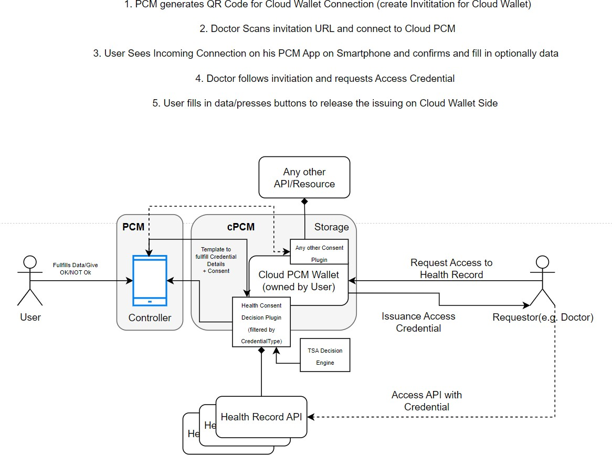
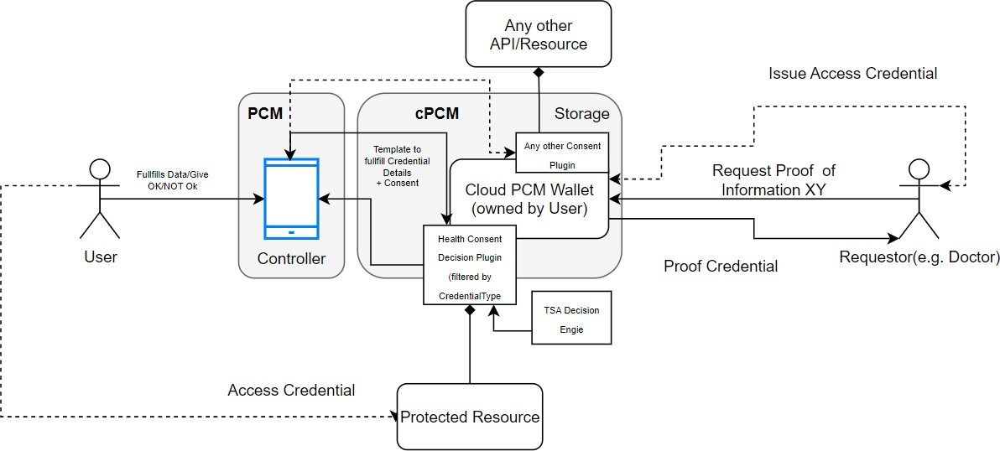

## Software Requirements Specification for Gaia-X Federation Services Cloud Personal Credential Manager IDM.PCM.CLOUD

Published by

eco -- Association of the Internet Industry (eco -- Verband der Internetwirtschaft e.V.) Lichtstrasse 43h 50825 Cologne, Germany

Copyright 

© 2023 eco -- Association of the Internet Industry
This work is licensed under the Creative Commons attribution 4.0nInternational License. To view a copy of this license, visit <http://creativecommons.org/licenses/by/4.0/> or send a letter to Creative Commons, PO Box 1866, Mountain View, CA 94042, USA

#### 1  [Introduction ](#introduction)

>##### 1.1  [Document Purpose ](#document-purpose)

>##### 1.2  [Product Scope ](#product-scope)

>##### 1.3  [Definitions, Acronyms and Abbreviations](#definitions-acronyms-and-abbreviations)

>##### 1.4  [References ](#references)

>##### 1.5  [Document Overview ](#document-overview)

#### 2  [Product Overview ](#product-overview)

>##### 2.1  [Product Perspective ](#product-perspective)

>##### 2.2  [Product Functions ](#product-functions)

>>###### 2.2.1  [Overview ](#overview)

>>###### 2.2.2  [Frontend ](#frontend)

>>###### 2.2.3  [cPCM Core ](#cpcm-core)

>>###### 2.2.4  [cPCM Form Factors ](#cpcm-form-factors)

>##### 2.3  [Product Constraints ](#product-constraints)

>##### 2.4  [User Classes and Characteristics](#user-classes-and-characteristics)

>##### 2.5  [Operating Environment ](#operating-environment)

>##### 2.6  [User Documentation ](#user-documentation)

>##### 2.7  [Assumptions and Dependencies ](#assumptions-and-dependencies)

#### 3  [Requirements ](#requirements)

>##### 3.1  [External Interfaces ](#external-interfaces)

>>###### 3.1.1  [User Interfaces ](#user-interfaces)

>>###### 3.1.2  [Software Interfaces ](#software-interfaces)

>>###### 3.1.3  [Communications Interfaces ](#communications-interfaces)

>##### 3.2  [Functional ](#functional)

>>###### 3.2.1  [General ](#general)

>>###### 3.2.2  [Managing Connections ](#managing-connections)

>>###### 3.2.3  [Managing Credentials ](#managing-credentials)

>>###### 3.2.4  [Wallet Backup ](#wallet-backup)

>>###### 3.2.5  [Credential Wallet synchronization](#credential-wallet-synchronization)

>>###### 3.2.6  [End User Authentication ](#end-user-authentication)

>>###### 3.2.7  [DIDComm Login Support ](#didcomm-login-support)

>>###### 3.2.8  [SIOP Login Support ](#siop-login-support)

>>###### 3.2.9  [App Settings Configuration (personalization)](#app-settings-configuration-personalization)

>>###### 3.2.10 [Consent Management ](#consent-management)

>>###### 3.2.11 [Visualization/UI ](#visualizationui)

>>###### 3.2.12 [Remote Control Protocol ](#remote-control-protocol)

>>###### 3.2.13 [Plugin System ](#plugin-system)

>>###### 3.2.14 [Mediator ](#mediator)

>##### 3.3  [Other Nonfunctional Requirements](#other-nonfunctional-requirements)

>>###### 3.3.1  [HTTP Requirements ](#http-requirements)

>>###### 3.3.2  [User Feedback / Logging Requirements](#user-feedback-logging-requirements)

>>###### 3.3.3  [Security Requirements ](#security-requirements)

>>>###### 3.3.3.1  [General Security Requirements](#general-security-requirements)

>>>###### 3.3.3.2  [Service Specific Security Requirements](#service-specific-security-requirements) 

>>###### 3.3.4  [Software Quality Attributes](#software-quality-attributes)

>##### 3.4  [Compliance ](#compliance)

>##### 3.5  [Design and Implementation ](#design-and-implementation)

>>##### 3.5.1  [Installation ](#installation)

>>##### 3.5.2  [Usability ](#usability)

>>##### 3.5.3  [Maintainability ](#maintainability)

>>##### 3.5.4  [Interoperability ](#interoperability)

>>##### 3.5.5  [Distribution ](#distribution)

>>##### 3.5.6  [Service Meshing ](#service-meshing)

>>##### 3.5.7  [Standard Technology ](#standard-technology)

>>##### 3.5.8  [Metrics ](#metrics)

>>##### 3.5.9  [Configurability ](#configurability)

>>##### 3.5.10 [Runtime Stability ](#runtime-stability)

>>##### 3.5.11 [Deployment ](#deployment)

#### 4  [System Features ](#system-features)

>##### 4.1  [Managing Connections ](#managing-connections-system-features)

>##### 4.2  [Managing Credentials ](#managing-credentials-system-features)

>##### 4.3  [Wallet Backup ](#wallet-backup-system-features)

>##### 4.4  [Credential Wallet synchronization](#credential-wallet-synchronization-system-features)

>##### 4.5  [End User Authentication ](#end-user-authentication-system-features)

>##### 4.6  [DID Input ](#did-input)

>##### 4.7  [SIOP Login ](#siop-login)

>##### 4.8  [App Settings Configuration (personalization)](#app-settings-configuration-personalization-system-features)

>##### 4.9  [Browser-based application/addon for stationary PCs and notebooks](#browser-based-applicationaddon-for-stationary-pcs-and-notebooks)

>##### 4.10 [Cloud based User Agent/Wallet](#cloud-based-user-agentwallet)

#### 5  [Verification ](#verification)

>##### 5.1  [Acceptance criteria ](#acceptance-criteria)

>>##### 5.1.1  [Connections ](#connections)

>>##### 5.1.2  [Managing credentials ](#managing-credentials-verification)

>>##### 5.1.3  [Wallet Backup ](#wallet-backup-verification)

>>##### 5.1.4  [Credential Wallet synchronization](#credential-wallet-synchronization-verification)

>>##### 5.1.5  [End User Authentication ](#end-user-authentication-verification)

>>##### 5.1.6  [Consent Management ](#consent-management-verification)

>>##### 5.1.7  [Plugin System ](#plugin-system-verification)

>>##### 5.1.8  [Remote Control ](#remote-control)

>##### 5.2  [Support for Kubernetes ](#support-for-kubernetes)

[Appendix A: Glossary ](#appendix-a-glossary)

[Appendix B: Example Consent Management](#appendix-b-example-consent-management)

# List of Figures 

> Figure 1: Block Overview 
>
> Figure 2: Communication Overview 
>
> Figure 3: Personal Credentials Manager: Application Cooperation View 

# List of Tables 

> Table 1: References 
>
> Table 2: User Classes and Characteristics
>
> Table 3: Toolstack 
>
> Table 4: Functional Requirements Connection Management
> 
> Table 5: Functional Requirements Credential Management
> 
> Table 6: Functional Requirements Wallet Backup 
>
> Table 7: Functional Requirements Credential Wallet
> Importing/Exporting 
>
> Table 8: Functional Requirements End User Authentication
>
> Table 9: Functional Requirements QR Code Scanning (DID Input)
>
> Table 10: Functional Requirements SIOP Login 
>
> Table 11: Functional Requirements App Settings Configuration (personalization) 

# Introduction

> To get general information regarding Gaia-X and the Gaia-X Federation Services please refer to \[TAD\] and \[PRD\].

## Document Purpose

> The purpose of the document is to specify the requirements of the Identity Management and Trust Subcomponent "Cloud Personal Credential Manager" with the intention of a European wide public tender for implementing this software. Main audience for this document is attendees of the public tender, which are able to supply an open-source software solution for the area of identity and document verification with the purpose to provide a credential manager application to be used by natural people to participate in the Gaia-X trust structure.

## Product Scope

> The purpose of these products is to provide all necessary components for the self-sovereign administration of the digital identity of a principal in the Gaia-X context. The Cloud Personal Credential Manager enables a natural person to act as a *principal* of an organization within the SSI-based Gaia-X ecosystem in a privacy-preserving, trustful and secure way from a computer browser. This comprises the following main functionalities:

-   Remote Management of a Cloud Wallet or multiple Wallets which are connected to the cPCM

-   Reception and management of verifiable credentials from other parties (e.g., a principal credential from a Gaia-X participant) by using the web frontend

-   Presenting Verifiable Presentations to other parties in an automated or manual manner by using plugins

-   Secure storage and management of respective secrets

-   Consent Management

-   Policy Based Decisions about Issuing/Presentations

-   Plugin System which extends the Holder Capabilities

> The Cloud Personal Credential Manager(cPCM) must be implemented as a cloud component which provides the end user a web front- end for managing the connected OCM \[IDM.OCM\], OCM W-Stack \[IDM.OCM.W-STACK\] and TSA \[TSA\] by providing an integration layer for various use cases of Holders.

>In general, the cPCM acts as an integration layer between OCM, OCM W-Stack and TSA to orchestrate for the user various use cases by using plugins e.g., "ID Card Proof Plugin" which provides the function "Automatically prove that you own a valid id card".

-------
>
> 
>
> It's strictly required to use OCM, OCM W-Stack and TSA for this purpose. Building a new agent and reimplementing protocols like aries is not foreseen here! cPCM acts strictly as an integration layer, with a connection to the PCM and must provide just a REST API. All SSI related protocols must be realized over OCM and OCM W-Stack.

----
>

>
>Furthermore, the necessary tools to operate and maintain the created software components in an enterprise environment with focus on high-availability, security, monitoring, and logging based on common standards. Documentation for developer, operator and user MUST be written in markdown format and have to be published in the provided public repository.
------

> 
>
> If it's required to do code restructurings, modifying the current solution by adding new microservices etc. then this is explicitly allowed.
>
> Please note, that it is explicitly required to deliver the software up and running. Responsibility for existing code cannot be shifted to previous development teams.
---------

## Definitions, Acronyms and Abbreviations

> The IDM and Trust Architecture Overview Document \[IDM.AO\] MUST be considered and applied as the core technical concept that also includes the Terminology and Glossary.
>
> All requirements from other documents are referenced by\[IDM.\<document-id\>.XXXXX\] as defined in the chapter "Methodology" in the document \[IDM.AO\].

## References

| Reference   | Title                                                                                                               | Status         |
|-------------|---------------------------------------------------------------------------------------------------------------------|----------------|
| [BDD]       | Getting Started with Behavior Driven Development - [Specflow](https://specflow.org/bdd/)                             | Status 07-19-2023 |
| [DIDAAS]    | DID as a Service - [DID Management Service](https://gitlab.eclipse.org/eclipse/xfsc/por/did-management-service)  | Status 08-22-2023 |
| [DID SIOP]  | OpenID, Self-Issued OpenID Connect Provider DID Profile - [OpenID Connect Self-Issued Profile](https://openid.net/specs/openid-connect-self-issued-v2-1_0.html) | Status 07-19-2023 |
| [IDM.AO]    | Gaia-X WP1 (2021), Architecture Overview (Base of functional specification)                                          |                |
| [IDM.PCM]   | Personal Credential Manager Document (Refer to "annex_IDM_PCM")                                                      |                |
| [IDM.TSA]   | Trust Services API Document (Refer to "annex_IDM_TSA")                                                             |                |
| [IDM.OCM]   | Organization Credential Manager Document (Refer to "annex_IDM_OCM")                                                |                |
| [IDM.OCM.W-STACK] | Organization Credential Manager W-Stack Document (Refer to "annex_IDM.OCM.W-STACK")                              |                |
| [NF.SPBD]   | Gaia-X Federation Service Non-functional Requirements: Security & Privacy by Design (Refer to annex "GXFS_Nonfunctional_Requirements_SPBD") | |
| [OIDC]      | OpenID working groups specifications - [OpenID Specifications](https://openid.net/developers/specs/)             |                |
| [OID4VC]    | OpenID for Verifiable Credential Issuance - [OpenID Verifiable Credential Issuance](https://openid.net/specs/openid-4-verifiable-credential-issuance-1_0.html) | Status 07-19-2023 |
| [OID4VP]    | OpenID for Verifiable Presentations - [OpenID Verifiable Presentations](https://openid.net/specs/openid-4-verifiable-presentations-1_0.html) | Status 07-19-2023 |
| [PRD]       | Gaia-X Policy Rules Document - [Gaia-X Policy Rules](https://docs.gaia-x.eu/policy-rules-committee/policy-rules-labelling/22.11/) | Status 07-19-2023 |
| [TAD]       | Gaia-X Architecture Document - [Gaia-X Architecture Document](https://docs.gaia-x.eu/technical-committee/architecture-document/22.10/) | Status 07-19-2023 |
| [TDR]       | Gaia-X Federation Services Technical Development Requirements (Refer to annex "GXFS_Technical_Development_Requirements") | |
| [W3C]       | Verifiable Credentials Data Model - [Verifiable Credentials Data Model](https://www.w3.org/TR/vc-data-model/) | Status 07-19-2023 |

> Table 1: References

## Document Overview

> The document describes the product perspective, functions, and constraints. It furthermore lists the functional and non-functional requirements and defines the system features in detail. The listed requirements are binding. Requirements as an expression of normative specifications are identified by a unique ID in square brackets (e.g. **\[IDM.ID.Number\]**).

# Product Overview

## Product Perspective

> The Cloud Personal Credential Manager is an integration layer to existing OCM/OCM-W Stack/TSA for natural persons. Within the Gaia-X terminology, such a natural person is named *principal*. The principal utilizes the cPCM in the respective form factor to manage stored VCs issued to her/him as well as to prove the statements necessary to obtain a service.
>
> The cPCM must support the following overall use cases:

-   Managing Credentials over an Web front-end

-   New Business Functionality (e.g., Plugin for Fitness Studio, Plugin for ID Card, Plugin for eID etc.) for the users key material by using Plugins

-   Strong key management, which is connected to OCM, OCM W-Stack and TSA (Hashicorp Vault) which can be used for authentication, consent and creating new DIDs by utilizing the OCM, TSA and OCM W-Stack

-   Providing a Web Socked Based Remote Control Protocol which allows the user to give consent, trigger backups and observe the connected cloud wallets

-   Define Rules and Policies for Credential Acceptance, Credential Issuing and Credential Rejection by using the TSA over the Web front-end

-   Consent Management and Consent Notifications (in general: proof notifications)

-   Event Notifications

-----------
>
>
> All of the features described in this document, MUST be set on top of the OCM, OCM W- Stack and the TSA. New Agents are not allowed, but additional microservices to provide the required Features are allowed.
-----------

> The entire software stack is then an aggregation of cPCM Backend, OCM(W-Stack), TSA and PCM as in this block picture:

> Figure 1: Block Overview
>
> As presented in the cPCM big picture layering overview, cPCM consists of different components which effectively comprise the following layers:

-   The front-end layer

-   cPCM Backend

-   Mediator Component

In this case the backend has the task to orchestrate the functionality between the components and to provide extension functionality like consent management, credential visualization and control about connections, presentations and issuings.
>
-------------------
> 
>
> The block diagram above, is the setup for ONE single user. Multi Tenancy is not considered. For the deployment of the Cloud PCM, each tenant needs the entire setup, which makes it strictly required to reduce the footprints of the components and identify improvements for reducing the number of components to deploy. Also, strategies to shutdown components during inactivities etc. must be developed.
----------

> From communication perspective, the architecture MUST consider the following concept:

> Figure 2: Communication Overview

## Product Functions

### Overview

> The Cloud PCM acts as an integration layer for the OCM, OCM W-Stack and TSA to support an end user for handling his/her credentials in the cloud. This means from a functional perspective that all features must be securely remotely controllable by the WEB UI or by the PCM app. This requires the establishment of a secure web socket channel between the PCM App/Web UI and the Cloud PCM by developing pairing mechanisms on SSI basis. In general, the cPCM receives commands over the web socket channel and orchestrates the work in the background by utilizing the OCM/OCM W-Stack and the TSA to provide a value add for the end user. The end user doesn\'t care about credential formats or connections, so the cPCM must be able to provide an UX which hides all agent information from the user by providing core functions and plugin-based extensions.

> Figure 3: Personal Credentials Manager: Application Cooperation View

### Frontend

> In detail **the front-end layer** is comprised of the following features and components:

-   End User Authentication: component provides for the implementation of secure user authentication policies which can include but are not limited to PIN, password, etc.

-   Graphical User Interface (GUI): enables end users to interact with the cPCM and use the cPCM functions.

-   Local Input Interfaces: comprise link processing. And that provides communication initiation, indirect, or peer-to-peer (contact).

### cPCM Core

> **The cPCM Core (Wallet) layer** consists of the following features and components:

-   Managing Connections (where applicable)

-   App Settings Configuration (Personalization)

-   Managing Credentials

-   Wallet Backup

-   Credential Wallet Importing/Exporting

-   Secret Storage

-   Plugin System

-   Consent Management

> The *Managing Connections* service within the backend establishes the connection with the communication entities outside cPCM (such as a Service Provider or a Credentials Issuer) by using the OCM provided REST APIs. For instance, after receiving the bootstrapping request from the *Local Input Interfaces* in the *Frontend*.
>
> *App Settings Configuration* abstracts the implementation of possible personalization properties that tailor the respective cPCM instance to the needs and requirements of a specific end user.
>
> The *Managing Credentials* feature provides the functionality for managing credentials in the UI, receiving credentials issued by other participants, enabling the user to view and inspect his/her credentials, and the basic functionality for providing credential attributes to other participants according to the SSI paradigm. The credential manager ensures that the user is always in control, which credentials with which content is presented and issued, and which credentials from which party were received. This includes the UI visualization, notifications and as well the orchestration between different components as OCM(s), TSA and PCM mobile.
>
> The *Wallet Backup* feature provides a secure backup for the received credentials on the smartphone. A web socket function realizes the secure transfer of backup files of the PCM App to the cPCM backend.
>
> The *Credential Wallet Importing/Exporting* feature allows to securely export the credentials from cPCM or PCM, and to import the credentials into other PCM or cPCM. Through this, the so-called cross-wallet compatibility can be ensured in future (that is, the compatibility between different implementations of PCM that share the same standard for credentials definition and management). It should be also possible to store created PCM backups versioned into the cPCM for later usage and restore functionality. This feature is just applicable for W3C credentials \[W3C\]. Aries credentials are out of scope.
>
> *Secret storage* provides for secure persistent storage of the backuped credentials and files. A separate key management handles the user generate secrets such as private keys or seeds to use it later for the generation of JWT tokens, requesting or issuing credentials by utilizing the connected OCMs.
>
> The plugin system provides the capability to develop and enable new plugins for the cPCM, which can interact with the orchestration flow of the linked TSA and the OCMs. This MUST be realized over an eventing pattern which allows developers to integrate their processes into the raised events.
>
> *Consent Management* provides an additional plugin event pattern which observes presentations and issues requests to the underlying OCM(s) which are handled then type by type over a consent plugin. For each type, the plugin executes a flow which forces the user to fill in more required data and to give consents acceptions. Either by accepting conditions, filling in data, adding pins etc. The precise flows of each plugin are out of scope. But the plug-in system must establish a frame, which allows the communication to the PCM mobile and provides basic tools like "Request Additional Data" or "Accept Conditions" or similar.
>
> **The Mediator (Relay) layer** is represented by the Mediator/Relay component which effectively provides notification management and therefore dispatches the externally received notifications for connection establishment to the respective cPCM where it is applicable.

### cPCM Form Factors

> The cPCM frontend MUST be a React Native web page based on bootstrap to support different Form Factors and Responsive Design.

## Product Constraints

####   \[IDM.PCM.CLOUD.00000\] The document IDM.AO is the common basis for this functional specification 

> The architecture document \[IDM.AO\] is an essential part of this specification and a prerequisite for understanding the context. The specifications and requirements from the Architecture Document MUST be considered during implementation.  

####   \[IDM.PCM.CLOUD.00001\] User restriction 

> The cPCM MUST be designed in a way so that one cPCM instance is to be used by a single personal user. One cPCM instance MUST NOT be shared by multiple users.  

####   \[IDM.PCM.CLOUD.00002\] Aries Independency 

> The cPCM backend MUST be a stand-alone backend which is providing rest interfaces as integration layer for OCM, TSA and W-Stack, which means that this backend provides a kind of business layer to the OCM/OCM W-Stack and the TSA stack. Aries RFCs MUST not be implemented, because the cPCM backend MUST NOT act as agent as such.  

####   \[IDM.PCM.CLOUD.00003\] No Agent Implementation 

> The Cloud PCM MUST NOT Implement an Agent framework to avoid complexity. OCM and OCM W-Stack are already SSI Agents where all SSI Agent related things MUST be addressed.  

####   \[IDM.PCM.CLOUD.00004\] Mediator Foundation 

> The aries mediator service [1] MUST be used as the foundation for the mediator service for W3C functionality.

###### [1] [<u>[https://github.com/hyperledger/aries-mediator-service]</u>](https://github.com/hyperledger/aries-mediator-service)

####   \[IDM.PCM.CLOUD.00005\] Deployment 

> The entire product is an assembling of OCM Indy/OCM W-Stack, TSA and new microservices for backends. Because of this, the deployment is essential to have the right setup for each user.
>
> Therefore, the entire product relies very hard on Helm Charts and Deployment Setups.  

####   \[IDM.PCM.CLOUD.00006\] k8s Operator 

> To simplify the deployment a Kubernetes Operator MUST be developed to support an easier deployment for multi tenancy purposes. The operator MUST ensure that instances are reused, shut down etc.  

####   \[IDM.PCM.CLOUD.00007\] Resource Consumption 

> To have multiple instances of the Cloud PCM can result in very big resource consumption. For this purpose, the architecture MUST be planned in a way that instances per user are less required or just hosted when a user is actively using it. E.g., serverless functions or by bootstrapping postgres database storage just in time when a credential for a user is received or must be presented or bootstrapping a OCM microservice just, when an attestation is required. Main goal of this requirement is to keep the operational costs as low as possible.  

## User Classes and Characteristics

| User Class  | Description                              | Expertise | Privilege Level | Product Usage |
|-------------|------------------------------------------|-----------|-----------------|---------------|
| Personal User | The person in possession of the personal credential manager using all functionality of the product | Low | High | Frontend |
| Cloud Operator | The cloud operator naturally has some sort of access to the cloud wallet and its infrastructure. The cloud wallet must be implemented in a way so that the cloud operator cannot access or use secrets/credentials stored in the OCM instances or in the cPCM storage. | High | Operator | Backend/Cloud |

> Table 2: User Classes and Characteristics

## Operating Environment

> Please refer to \[TDR\] for further binding requirements regarding the operating environment.

####   \[IDM.PCM.CLOUD.00008\] Browser Support 

> The product part for the browser extension/app MUST be available for the common browsers: Firefox, Chromium based and Safari.  

####   \[IDM.PCM.CLOUD.00009\] Operating Environments 

> For the Web Frontend the common browsers Chrome, Firefox, Safari and Microsoft Edge must be supported. The cPCM backend MUST be runnable on the open Linux standard in the current LTS version.  

####   \[IDM.PCM.CLOUD.00010\] Kubernetes Environment 

> The product MUST be operable on standard Kubernetes based environments without any hardware restrictions. The reference environment for demonstration and development purposes MUST be on a provided SCS cluster (Sovereign Cloud Stack).  

## User Documentation

> Please refer to \[TDR\] for further requirements regarding documentation.

####   \[IDM.PCM.CLOUD.00011\] Participant Administration Documentation 

> The documentation MUST contain:

-   Installation Manuals(if applicable)

-   Cryptographic Initialization (if applicable)

-   Description of Deployment/Compile Process

-   Description of the Automatic Tests/Verification

-   How to build the product/services from source code  

####   \[IDM.PCM.CLOUD.00012\] Participant Documentation 

> The documentation MUST contain:

-   Short Software Description/Usage

-   Usage Guide

-   GDPR Design Decisions(extended version of the existing one)

-   Security Concept

-   Operations Concept

-   Keyword Directory  

####   \[IDM.PCM.CLOUD.00013\] Cloud Operator Documentation 

> The documentation MUST contain:

-   Operational Handbook

-   Installation

-   Footprint Reduction  

## Assumptions and Dependencies

> An understanding of the overall Gaia-X architecture and philosophy is necessary. Please refer to \[TAD\] and \[PRD\].
>
> The attendees of the public tender must get an understanding of the current implemented features of the PCM \[IDM.PCM\], OCM \[IDM.OCM\], OCM W-Stack \[IDM.OCM.W-Stack\] and TSA \[IDM.TSA\].
>
> Additionally, knowledge in OIDC4VC/VP \[OID4VC\] \[OID4VP\] and SSI is given.

# Requirements

## External Interfaces

### User Interfaces

####   \[IDM.PCM.CLOUD.00014\] Web Interface for Browser-based Applications 

> The cPCM MUST provide a web interface based react native for browser-based applications. All functions available to the PCM user MUST be available via this web interface (except those which are not applicable such as camera scanning and NFC).  

### Software Interfaces

####   \[IDM.PCM.CLOUD.00015\] Secure Storage 

> The cPCM implementation MUST be able to use secure storage (internal storage, encrypted storage, dedicated key storage) provided by the target platform for storing cPCM data e.g., backup files.  

####   \[IDM.PCM.CLOUD.00016\] Key Management 

> The cPCM implementation MUST have a secure key management with hashicorp vault to control the used key engine for TSA Signings, OCM W-Stack Signings etc.  

### Communications Interfaces

####   \[IDM.PCM.CLOUD.00017\] DIDComm Interface 

> The cPCM backend utilizes for all Credential associated DIDComm communications the OCM and the OCM W-Stack and don\'t implement by itself a DIDComm Communication.

####   \[IDM.PCM.CLOUD.00018\] OIDC4VC/VP Interface 

> The cPCM backend utilizes for all OIDC4VC/VP communications \[OID4VC\] \[OID4VP\] the OCM and the OCM W-Stack and don\'t implement by itself a OIDC4VC/VP Communication.

####   \[IDM.PCM.CLOUD.00019\] DIDComm v2 Messaging 

> All interfaces from the PCM to the cPCM backend MUST be implemented as didcomm v2 messages. For instance: List Credentials, Delete Credential, Request Credential etc. The protocol MUST NOT reflect OCM protocols 1:1. e.g., List Connection or List Proofs. The cPCM Backend MUST encapsulate this for a UX by creating an integration layer which speaks an simplified didcomm v2 protocol for notification, consent and remote control. The developed didcomm protocol has to be defined as an architecture diagram and documented in the git repos similar to the Aries RFC documentation pattern.  

####   \[IDM.PCM.CLOUD.00020\] Backup/restore interface for Personal Wallet 

> The cPCM MUST provide an interface for backup and restore of the cPCM data (which is stored in the wallet) based on the didcomm protocol and cPCM Rest API.  

####   \[IDM.PCM.CLOUD.00021\] Import/Export interface for Personal Wallet 

> To provide flexibility and interoperability between Applications and PCM Form Factors, the cPCM MUST provide interfaces for securely Exporting the personal wallet W3C content, as well as interfaces for securely Importing the personal wallet W3C content and restoring them in another application or PCM Form Factor. This includes the key material for using them. A scenario can be that a participant credential is transferred from the OCM W-Stack (which is linked to the cPCM), is transferred to a tablet to use the tablet within an secured area of a manufacturing side without internet access (but WIFI).  

####   \[IDM.PCM.CLOUD.00022\] Personal Wallet Synchronization 

> The cPCM must provide functionality for automatic secure synchronization with a PCM. The synchronization must be bi-directional and is just belonging to W3C credentials (No Aries). The synchronization MUST be configurable in the cPCM backend over an Configuration Endpoint which the user can use to select the connected devices and the content which needs to be synced.
>
>  

####   \[IDM.PCM.CLOUD.00023\] PCM management 

> The cPCM backend MUST provide functionality to be managed via PCM or the Web UI. An initial linking between PCM and the cPCM backend works just over the Web UI. All paired devices MUST be visible in the cPCM UI to manage the devices (add, remove, block etc.).  

####   \[IDM.PCM.CLOUD.00024\] Eventing 

> If it is required to use events within the software architecture, it is mandatory to use software abstraction according to cloud event specification [2] for publishing and subscription. The minimal supported protocol binding MUST be HTTP Protocol Binding [3].  

###### [2] [<u>[https://cloudevents.io/]</u>](https://cloudevents.io/)
###### [3] [<u>[https://github.com/cloudevents/spec/blob/v1.0.2/cloudevents/bindings/http-protocol-binding.md]</u>](https://github.com/cloudevents/spec/blob/v1.0.2/cloudevents/bindings/http-protocol-binding.md)

####   \[IDM.PCM.CLOUD.00025\] Eventing Infrastructure 

> The event broker for the eventing MUST abstract the storage and delivery infrastructure. In Kubernetes environments, the event broker MUST be uniform across all lots by using NATS [4] and/or kNative.  

###### [4] [<u>[https://nats.io/]</u>](https://nats.io/)

####   \[IDM.PCM.CLOUD.00026\] Login Support 

> The cPCM MUST support OIDC flows for login, such as DID SIOP and Authorization Code Grants by Standard IAM Systems. For a pairing of devices, a separate flow MUST be developed to initiate it.  

####   \[IDM.PCM.CLOUD.00027\] Web Sockets 
> For syncing the Wallets, Web Sockets MUST be used. Each didcomm message structure within the channel MUST be aligned with the technical lead.  
>

## Functional

### General

####   \[IDM.PCM.CLOUD.00028\] DID Document Provisioning 

> To highlight the existing endpoints the cPCM MUST be able to provide DID (Web) Documents for himself which contain the used endpoints and his key material. These DID Documents MUST be configurable in the cPCM database to generate multiple DIDs by TSA DID Web as a Service. Over these DID documents, the cPCM can act as proxy DID for each user and can variate the endpoints which are used by the user. The endpoints themselves are pointing to the OCM instances and TSA endpoints/mediator belonging to the cPCM.
>
> Note: Others will resolve this DID to find the communication endpoints, so it MUST be publicly available over an GET endpoint.
>
> All service endpoints MUST be configurable as Json to inject it in the TSA policy.
>
>  

####   \[IDM.PCM.CLOUD.00029\] DID Document Resolving 

> The DID Document of the cPCM MUST be resolvable by the Universal Resolver and it MUST contain all key material used by the cPCM including all endpoints following this service configuration format by enhancing the W3C spec [5]:
>
                > {
                >
                > id: {idName}
                >
                > type: {typeName},
                >
                > accept: \["didcomm/v2","didcomm/v1",{otherProtocols}\],
                >
                > serviceEndpoint:\["https://..."\]
                >
                > }  

###### [5] [<u>[https://www.w3.org/TR/did-core/#example-usage-of-the-service-property]</u>](https://www.w3.org/TR/did-core/#example-usage-of-the-service-property)

####   \[IDM.PCM.CLOUD.00030\] Multi Tenancy 
> The Cloud PCM MUST support Scale Down to 0 to avoid high operational costs.  

####   \[IDM.PCM.CLOUD.00031\] Browser Wallet Protocol 

> The Cloud PCM MUST provide a protocol which integrates with external web sites to offer credential presentations triggered by the user/website.  

### Managing Connections

####   \[IDM.PCM.CLOUD.00032\] Connection invitation 

> Connection requests can be provided to the cPCM user via Text input (URL), and by regular messages. The function can be activated by

1.  the cPCM user via the GUI by uploading an QR or pasting an invitation link.

2.  An invitation message is received via the PCM app, and the user can decide either take it directly in the PCM app or push it to the cloud app (just in case of aries)  

####   \[IDM.PCM.CLOUD.00033\] List connections 
> The cPCM user can view a list of connections stored in the underlying OCM(s).  

####   \[IDM.PCM.CLOUD.00034\] Search connections 

> The user can search connections stored in the underlying OCM(s). A full text search in all information available for the connection must be provided. The search result MUST be shown at the GUI.  

####   \[IDM.PCM.CLOUD.00035\] Display connection details 

> The cPCM user can view detailed information about a connection. The information shown MUST include the DID document describing the connection contact.  

####   \[IDM.PCM.CLOUD.00036\] Display connection communication history 

> The cPCM user can view detailed information about the communication history of a given connection (Activities where are applicable).  

####   \[IDM.PCM.CLOUD.00037\] Delete connection 

> The cPCM user delete a connection from OCM(s).  

####   \[IDM.PCM.CLOUD.00038\] Block connection 
> The cPCM users delete a connection from OCM(s).  

####   \[IDM.PCM.CLOUD.00039\] Connection Details 

> The user MUST be able to define details to a connection e.g., Name, Company etc. together with details about credentials.  

### Managing Credentials

####   \[IDM.PCM.CLOUD.00040\] Receive a Verifiable Credential (VC) 

> Within an established connection, a VC can be issued to the user. The cPCM is in the role of the "Holder" within this protocol.
>
> The request is validated, and the information is notified to the user via the GUI or App. The user MUST get the possibility to accept or to reject the request by using his PCM App or the Web UI. The cPCM orchestrates these requests and notifications and tracks the history in his internal storage. Over the UI the user can see which credentials were received and from whom (displayed as cards). A differentiation between aries, ipfs or w3c MUST not be made. The user MUST see just one card per credential with some hints that his credential type exists multiple times (grouped by schema name).

####   \[IDM.PCM.CLOUD.00041\] Display/inspect a VC 

> The cPCM user SHOULD view detailed information about a VC per card. The information shown MUST include all VC data items and MUST be integrated in a details view.  

####   \[IDM.PCM.CLOUD.00042\] List VCs 

> The cPCM user can view a list of VCs stored in the connected OCM(s).  

####   \[IDM.PCM.CLOUD.00043\] Search VCs 

> The user can search VCs stored in the OCM(s). A full text search in all information available for the VCs must be provided.  

####   \[IDM.PCM.CLOUD.00044\] Answer Request Verifiable Presentation (VP) 

> The cPCM MUST be able to notify and process Presentation requests received via any OCM. This includes the selection of the credentials which match the criteria, the selective disclosure of attributes (indy based), and the verification of the requestor (train). All of these points need to be controlled by the user either by PCM App or Web UI. If the user has selected his preferred attributes and credentials, he is able to confirm the presentation and the request is processed by the cPCM backend which completes the process in the requesting OCM. If a plugin is listening on the events, the plugin MUST interrupt the process before it is further processed.  

####   \[IDM.PCM.CLOUD.00045\] Display history of presenting Verifiable Presentations (VPs) 

> The user can view detailed information about the history of showing/proofing identity information to other participants. For each presentation, the information MUST be logged including all information contained in the VP shown to a verifier, to which verifier it has been shown, and transaction date/time etc..  

####   \[IDM.PCM.CLOUD.00046\] Accepting Rules 

> The user MUST be able to define for connections/DIDs, presentations, and issuings, rules to accept/reject automatically. e.g., by Type, Claims etc. For these rules the TSA in the background MUST be used.  

### Wallet Backup

####   \[IDM.PCM.CLOUD.00047\] Create Backup 

> The cPCM MUST provide a function to backup all information sent by the PCM. The backup file MUST be confidentiality and integrity protected. Protection MUST follow current standards regarding protocols and cryptographic artifacts (refer to section "Security Requirements").
>
> The cPCM MUST provide a method for protecting access to the data within the backup with at least two authentication factors.  

####   \[IDM.PCM.CLOUD.00048\] Restore Backup 

> The cPCM MUST provide a function to restore a backup file(s) containing all information stored from the PCM App. The Backup/Restore format MUST be compatible to guarantee PCM interoperability between form factors and between different providers, browsers or Smartphone Application as GXFS PCM.  

### Credential Wallet synchronization

####   \[IDM.PCM.CLOUD.00049\] Sync Wallets 

> The cPCM provides a functionality to synchronize different personal wallets, e.g., synchronize a cloud wallet with a smartphone wallet GXFS PCM \[IDM.PCM\] to support offline usage. Secure methods for Importing the GXFS PCM Secrets MUST be provided.  

####   \[IDM.PCM.CLOUD.00050\] Block Wallets 

> If a Device was stolen, the cPCM MUST be able to block devices to stop syncing.  

### End User Authentication

####   \[IDM.PCM.CLOUD.00051\] Initial user onboarding 

> The cPCM MUST provide a function for the initial user onboarding, when the cPCM is initialized. Additionally, this function also initializes the wallet. For this onboarding the PCM Wallet MUST be used. A user MUST be able to onboard in his PCM App potentially multiple cPCM (e.g., hosted by different providers). 

####   \[IDM.PCM.CLOUD.00052\] User Authentication 

> The cPCM MUST provide a function which performs user authentication to open the cPCM for the user.  

####   \[IDM.PCM.CLOUD.00053\] Configure login credentials 

> The cPCM MUST provide a function, where the user can modify his/her login verifiable credential.
>
>  

####   \[IDM.PCM.CLOUD.00054\] Secure Restore of authentication credentials 

> The cPCM MUST provide a function for securely restoring the users' authentication credentials (e.g., forgotten password/pin).  

####   \[IDM.PCM.CLOUD.00055\] Second Factor 

> The cPCM MUST provide a function for second factor login support by using the PCM functionality.  

### DIDComm Login Support

####   \[IDM.PCM.CLOUD.00056\] DIDComm Login Support 

> *Description*
>
> To login the user with existing Indy Credentials, the cPCM MUST utilize the OCM to request proofs for identification. This is an alternative login variant next to OIDC methods \[OIDC\]. The detailed process for this is as follows:

1.  cPCM provides the indy based login method

2.  If user selects it, cPCM requests from OCM an Invitation Link and presents it to the user

3.  The user scans it with his cPCM and accepting the connection invitation presented by an QR code

4.  The PCM app establishes a DIDComm connection to the cPCM OCM, which will reply with an proof request and the user presents the proof

5.  After presenting the proof, and event will be raised and the cPCM can check the presented attributes of the underlying OCM  

### SIOP Login Support

####   \[IDM.PCM.CLOUD.00057\] SIOP Login Support 

> The cPCM MUST implement a function to process SIOP requests \[DID SIOP\] in the role of the Self- Issued OpenID Provider (SIOP). Applications (RPs (Relying Parties) in SIOP terminology) can send SIOP requests to the PCM. The PCM will process such requests and reply with a SIOP response. This is also the preferred method to pair PCM App and cPCM if applicable.  

### App Settings Configuration (personalization)

####   \[IDM.PCM.CLOUD.00058\] Configure Application Preferences 
> The PCM MUST enable the user to configure his/her application preferences. Application preferences MUST include language settings, device names, device groups, OCM connections, rules and policies for TSA and history limits. The default language is English, but the correct localization of the cPCM MUST be demonstrated.  

### Consent Management

####   \[IDM.PCM.CLOUD.00059\] Consent Management Plugins 

> The product MUST provide the possibility to add Consent Plugins based on the plugin framework, which observe a special type of requested presentations/credentials to establish the consent flow in the direction of the linked PCM wallets. The result of the consent flow MUST be recorded in the consent records of the wallet. The plugins itself MUST be able to interact with the notification channel to the connected wallets, to pick up added data from the consent on the smartphone, to add it later on in disputes for credentials or in audit logs before presentation etc. All activities MUST be aligned with the PCM development Team. An example could be found in Appendix B.
>
>  

####   \[IDM.PCM.CLOUD.00060\] Consent Auditability 

> All given consents MUST be logged for audits.  

### Visualization/UI

####   \[IDM.PCM.CLOUD.00061\] General 
> The entire UI MUST be an user-friendly dashboard, where the user gets a quick overview. It's not allowed to provide command line behavior or just lists or tables. It MUST be graphically designed for end-users e.g., a doctor, a manager or any other non-IT users and well optimized for touch screens (for example for an iPad).  

####   \[IDM.PCM.CLOUD.00062\] Credential Management 

> The web UI MUST provide a dashboard UI for the user which shows the credentials of the connected wallets, and details like containing attributes, DID, Technology etc. The presentation MUST be as cards like "Credit Cards" or similar to give the user maximum UX.  

####   \[IDM.PCM.CLOUD.00063\] DID Creation/DID as Service[6] 

> The web UI MUST provide for the user an UI which allows it to generate new DIDs. This includes DID:Key, DID:WEB, DID:Indy and DID:IPFS. The generated DIDs MUST be linked to the underlying technology, means DID:INDY to the OCM and the others to OCM W-Stack. In the case of DID:WEB the DID as a Service approach \[DIDAAS\] over TSA MUST be used. 

###### [6] [<u>[https://gitlab.eclipse.org/eclipse/xfsc/por/did-management-service]</u>](https://gitlab.eclipse.org/eclipse/xfsc/por/did-management-service)

####   \[IDM.PCM.CLOUD.00064\] Connection Management 

> The web UI MUST provide for the user an UI which shows the connections, the rules for accepting, blocking, and deleting connections with details about the DID, trust zones, which credentials are attached to it etc..  

####   \[IDM.PCM.CLOUD.00065\] Presentation 

> An incoming presentation request MUST be visualized, and possible credentials highlighted which are fitting to the request. If there is any fitting credential, the user MUST be enabled to present or ignore it.  

####   \[IDM.PCM.CLOUD.00066\] Issuance 
> The web UI MUST provide a functionality where an user can pick a schema from a list (e.g., the schema registrar) and start issuing credentials for it by providing Invitation Links with auto issuance options. These links MUST be sendable by email.
>
>  

####   \[IDM.PCM.CLOUD.00067\] Onboarding Flow 

> The UI MUST provide a flow to initialize the Cloud PCM for a new User by utilizing the PCM as authentication tool. The linking of multiple wallets MUST be supported and demonstrated for two smartphones/tablets.  

### Remote Control Protocol

####   \[IDM.PCM.CLOUD.00068\] PCM Remote Control 

> The Cloud PCM Backend MUST provide a protocol over websockets and didcomm, to control over the PCM things like accepting connections, start issuances, confirm presentations, creating dids, rotating keys etc. The remote control MUST work over didcomm messages which needs to be defined together with the cPCM API.  
>

### Plugin System

####   \[IDM.PCM.CLOUD.00069\] Plugin Framework 

> The cPCM backend and the Web UI MUST support the adding of plugins by providing an infrastructure and a template. This includes an interface definition for defining plugins, an integrated event pattern for observing events and encapsulations for using the PCM App Communication channel to send notifications, receive triggers and use the internal PCM storage. If a plugin is created, it MUST be hostable without any reboot of the cPCM backend. The preferred solution SHOULD be a separate microservice per plugin to shutdown/enable/monitor plugins easily. If this is not possible, it MUST be another solution provided.  

####   \[IDM.PCM.CLOUD.00070\] Visualization 

> All Plugins MUST be visualized in a plugin overview, where plugins can be configured, disabled or enabled. The available plugins MUST be provided by a service discovery, where the user can select which plugins are relevant.  

####   \[IDM.PCM.CLOUD.00071\] Plugin Secrets 

> Plugins MUST have a dedicated secret engine per plugin which allows the plugin to create keys for signing, encryption and verification. The implementation MUST be abstract, but for the initial version the hashicorp vault transitengine [7] MUST be used (default stack). Other engines MAY be supported in the first version. 

###### [7] [<u>[https://developer.hashicorp.com/vault/docs/secrets/transit]</u>](https://developer.hashicorp.com/vault/docs/secrets/transit)

####   \[IDM.PCM.CLOUD.00072\] Plugin Based Well Known Url 

> Each Plugin is able to define its own key material per tenant next to an well-known jwks url/did which resolves to the key material.  

####   \[IDM.PCM.CLOUD.00073\] Plugin Based Rules 
> Each Plugin is able to use TSA rules.  

####   \[IDM.PCM.CLOUD.00074\] Plugin Based Configuration 

> The user can enable/disable and configure Plugins which are available within the cPCM.  

####   \[IDM.PCM.CLOUD.00075\] Plugin Eventing 

> Plugins can be created which listen on cPCM events. Plugins can intercept them to stop/resume internal processes like issuing/presentation/connections.  

####   \[IDM.PCM.CLOUD.00076\] Plugin to App Communication 

> Plugins can use the internal communication channel from cPCM Backend to paired App to notify changes and receive remote commands.  

### Mediator

####   \[IDM.PCM.CLOUD.00077\] Relay implementation 

> The product MUST provide the hyperledger mediator as a core component of the cPCM. The endpoints for this mediator MUST be configured in the documents of the cPCM. If necessary, potential didcomm mediation MUST be routed over this component as well.  

## Other Nonfunctional Requirements

### HTTP Requirements

####   \[IDM.PCM.CLOUD.00078\] HTTPS 

> All HTTP Endpoints MUST be protected by TLS 1.2 (all protocol version numbers SHOULD be superseded by upcoming standards) Each endpoint of the product MUST support TLS certificates which are configurable by the administrator of the system.  

####   \[IDM.PCM.CLOUD.00079\] HTTP Protocol Definitions 

> All HTTP Endpoints MUST follow \[RFC7231\] and \[RFC5789\], but it MAY be chosen what of the protocols is necessary to realize the functionality. For problem reports the \[RFC7807\] MUST be used in combination with Standard HTTP Error Codes. 

### User Feedback / Logging Requirements

####   \[IDM.PCM.CLOUD.00080\] Data Minimization 

> From GDPR perspective the product MUST NOT log data which is related to personal information. (e.g., usernames, birth dates etc.) The product MUST only log data, which is relevant to technical operations, except for the purpose that, in the event of an incident, enable reconstruction of the sequence of the message exchange for establishing the place and the nature of the incident. The data shall be stored for a period of time in accordance with national requirements and, as a minimum, shall consist of the following elements:

(a) node\'s identification

(b) message identification

(c) message data and time

> All logged data/information MUST be documented in the GDPR design decisions for a GDPR review.  

####   \[IDM.PCM.CLOUD.00081\] Logging Frameworks 

> The product MUST support logging frameworks e.g., graylog, fluentD or logstash to support logging and analysis by enterprise infrastructures. The supported framework MAY be chosen for the first version, but it MUST support potentially the most common open-source logging solutions. The final solution MUST be aligned with the other subcomponents. It MUST be sketched in the operations concept how the support of multiple solutions is given in the future.
>
>  

####   \[IDM.PCM.CLOUD.00082\] User Feedback information 

> The cPCM user should receive relevant messages regarding events, successes, and failures during the operation of the cPCM. The user should be notified in a timely, descriptive and privacy preserving manner.  

### Security Requirements

### General Security Requirements

> Each Gaia-X Federation Service SHALL meet the requirements stated in the document "Specification of non-functional Requirements Security and Privacy by Design" \[NF.SPBD\].
>
> Federation Services specific requirements will be documented in the next chapter.

### Service Specific Security Requirements

> This chapter will describe the service specific requirements, which will extend the requirements defined in the chapter above.

####   \[IDM.PCM.CLOUD.00083\] Secure user authentication 

> To ensure that only allowed entities can access the cPCM authentication methods MUST be implemented to grant access to the cPCM.  
>
> **  \[IDM.PCM.CLOUD.00084\] Protection of Secrets (Wallet) and Security for the Restore process** The cPCM secrets must be stored and processed securely. There MUST be additional security procedures in place to guarantee that the secret key can be recovered when the holder requires it, even in case the holder himself has lost access to his unlock key.  
>
> **  \[IDM.PCM.CLOUD.00085\] Secure communication between frontend and cloud agent/wallet** The communication interface in case of the cloud agent/Wallet must be protected according to the latest security standards.  

####   \[IDM.PCM.CLOUD.00086\] TLS Certificate Validity Periods

> In general, the recommended validity period for a certificate used in the system should be one year or less. Under some circumstances (for example RootCA) the certificate validity can be extended. Certificate owners MUST ensure that valid certificates are renewed and replaced before their expiration to prevent service outages.  

####   \[IDM.PCM.CLOUD.00087\] Security by Design 

> T Security MUST be a design principle from the beginning. Means separation of concerns, different administrative roles, especially for private key material and separate access to the data MUST be covered. It MUST be described in the security concept, what are the different security risks of the product and how they are mitigated (e.g., by Threat Modeling Protocols)  

####   \[IDM.PCM.CLOUD.00088\] Pentesting 

> All parts of the product have to be penetration tested, at least for the following criteria:

1.  Unauthorized Access to the System MUST be tested

2.  Unauthorized Actions MUST be triggered without a user action

3.  All interfaces MUST be tested  

####   \[IDM.PCM.CLOUD.00089\] Storage of Secrets 

> The storage of secret information such as private keys MUST take place in state-of-the-art secure environments to protect secret data confidentiality and integrity. Examples of this are Secure Enclaves, TPMs, HSM or Secure Vaults. In case (Personal) Agents are not equipped with a secure storage it may also be possible to store the secrets in a third party (e.g., Cloud) provider (e.g., Secure Wallet) that MUST provide overall the same level of security as the aforementioned methods.  

####   \[IDM.PCM.CLOUD.00090\] Support for Potential Requirements for Secret Storages 

> Devices that hold cryptographic information and perform cryptographic functions MUST be compliant with standard PKCS #11 [8] or other comparable cryptography standards.

###### [8] [<u>[https://www.oasis-open.org/committees/tc_home.php?wg_abbrev=pkcs11]</u>](https://www.oasis-open.org/committees/tc_home.php?wg_abbrev=pkcs11)

####   \[IDM.PCM.CLOUD.00091\] Special Availability and Scalability Requirements for Secret Storage Components 

> Secret Storage components play a central role in storage, encryption, and digital signing in the Gaia-X ecosystem, thus they can become a single point of failure for a Gaia-X participant, for example an organization. Therefore, methods and procedures to ensure the availability and scalability of the Secret Storage functionality MUST be implemented.  

####   \[IDM.PCM.CLOUD.00092\] CVE Patches 

> All software components MUST have applied CVE patches, which are available for major releases.  

####   \[IDM.PCM.CLOUD.00093\] Major Releases 

> All used software components MUST use the major releases with Long Term Support. If no LTS is available, all components MUST use the latest major releases with security hardening.  

### Software Quality Attributes

####   \[IDM.PCM.CLOUD.00094\] Quality Aspects 

> The software MUST meet the following requirements:

-   The quality standards MUST meet ISO 25010 [9]

-   Robustness / Reliability

-   Performance

-   Interoperability with the other work packages from GAIA-X project

-   Security

-   Adaptability / expandability

-   Maintainability and Code Quality 

###### [9] [<u>[https://iso25000.com/index.php/en/iso-25000-standards/iso-25010]</u>](https://iso25000.com/index.php/en/iso-25000-standards/iso-25010)

####   \[IDM.PCM.CLOUD.00095\] Software Quality Requirements 

> All software components MUST be compliant to the requirements within the quality assurance repository [10]. This includes testing on different layers (unit, component, integration), branch model that support stages, patch management, and code quality verification with adequate reporting. In addition, all requirements and quality attributes MUST demonstrated by automated behavior driven testing \[BDD\] methodology. 

###### [10] [<u>[https://gitlab.com/gaia-x/data-infrastructure-federation-services/quality-assurance/-/issues]</u>](https://gitlab.com/gaia-x/data-infrastructure-federation-services/quality-assurance/-/issues)

## Compliance

####   \[IDM.PCM.CLOUD.00096\] GDPR Audit Logging 

> All GDPR relevant access to personal relevant data MUST be logged for a later audit.  

####   \[IDM.PCM.CLOUD.00097\] GDPR Data Processing 

> If it is necessary to process person-relevant data, it MUST be earmarked to a clearly defined business process, which has to be described in the GDPR design decisions. All relevant person data MUST be deleted after the processing, if applicable.  

## Design and Implementation

> Please also refer to \[TDR\] for further requirements.

####   \[IDM.PCM.CLOUD.00098\] Architecture Changes 

> All Architecture Changes MUST be aligned with the technical lead and approved by the principal before implementation.  

### Installation

####   \[IDM.PCM.CLOUD.00099\] Wallet Installation 

> cPCM products must be made available for the common browsers. Wallet should be accessible on internal or publicly available url.  

####   \[IDM.PCM.CLOUD.00100\] Helm/Argo CD Deployment 

> All installations, where applicable, MUST be scripted/templated to ensure automated deployment. This MUST be ensured over HELM templates which MUST follow uniform rules across all lots. The charts MUST be integrable in a ARGO CD Pipeline defined in the gxfs- integration repository [11].  

###### [11] [<u>[https://gitlab.eclipse.org/eclipse/xfsc/integration]</u>](https://gitlab.eclipse.org/eclipse/xfsc/integration)

### Usability

####   \[IDM.PCM.CLOUD.00101\] Configuration 

> All components MUST support one of the major configuration formats (yaml, Json, ini, environment variables) wherever configuration is required. If environment variables are overwriting an actively set configuration, a warning SHOULD be logged.  

####   \[IDM.PCM.CLOUD.00102\] GUI usability 

> GUI design MUST comply with common GUI recommendations for the target platforms.  

####   \[IDM.PCM.CLOUD.00103\] cPCM accessibility 

> The product must comply with the accessibility requirements depending on the target platforms.  

####   \[IDM.PCM.CLOUD.00104\] Internationalization Support 

> The cPCM MUST support internationalization. At least the following languages MUST be supported: English.  

### Maintainability

####   \[IDM.PCM.CLOUD.00105\] Continuous Integration 

> All tests MUST be coded in a continuous tool to ensure the software quality in a further development. All the necessary scripts and setups MUST be provided on the public code repository to make it possible for everyone to compile and execute the product.  

### Interoperability

####   \[IDM.PCM.CLOUD.00106\] Interoperability of IT security features and algorithms 

> The following interoperability requirements of the respective IT security features and algorithms MUST be ensured across the system components:

-   Interoperability of crypto algorithms and protocols (including the novel peer-reviewed ones through the established bodies and communities)

-   Interoperability of secure secret transfer protocols (such as the holistic usage of PKCS#11 [12]for HSM communication, etc.)

-   Format interoperability of crypto material (such as the holistic usage of PKCS#12 for relevant cases) 

###### [12] [<u>[https://www.oasis-open.org/committees/tc_home.php?wg_abbrev=pkcs11]</u>](hhttps://www.oasis-open.org/committees/tc_home.php?wg_abbrev=pkcs11)

### Distribution

####   \[IDM.PCM.CLOUD.00107\] Helm Repositories 
> All component helm charts MUST be available under a helm repository hosted in the GitLab, with different channels for distribution [13].  

###### [13] [<u>[https://gitlab.com/api/v4/projects/41175300/packages/helm/Integration/index.yaml]</u>](https://gitlab.com/api/v4/projects/41175300/packages/helm/Integration/index.yaml)

####   \[IDM.PCM.CLOUD.00108\] Istio Resources 

> Additionally, the Charts MUST provide Istio Resource (e.g., Authorization Rules, Virtual Services etc. ) following the integration pattern specified in the gxfs-integration repo [14].

###### [14] [<u>[https://gitlab.eclipse.org/eclipse/xfsc/integration]</u>](https://gitlab.eclipse.org/eclipse/xfsc/integration)

### Service Meshing

####   \[IDM.PCM.CLOUD.00109\] Istio Support 

> All HELM charts MUST be provided with Istio support aligned together with the technical lead. This consists of Authorization Rules, Virtual Service Definitions and other relevant Istio Definitions which are required for integration in a Istio Environment.  

### Standard Technology

####   \[IDM.PCM.CLOUD.00110\] Default Toolstack 

> Each development MUST consider the following standard technologies, if nothing else is explicitly requested:

| Area                      | Technology                                |
|---------------------------|-------------------------------------------|
| Service Meshing           | Istio                                     |
| Databases                 | Redis, Mongo, Postgres                    |
| Messaging                 | CloudEvents                               |
| Continuous Integration    | Argo CD, Gitlab                           |
| Installation Templates    | HELM                                      |
| Container                 | Docker Images (ARM64/AMD64)               |
| Secret Storage            | Hashicorp Vault, k8s Secret               |
| UI Technology             | React [15]                 |
| Ingress Controller        | Nginx                                     |
| API Testing               | Postman (manual)                          |
| Kubernetes                | v1.26+                                    |
| API Design                | OpenAPI                                   |

> Table 3: Toolstack

###### [15] [<u>[https://react-bootstrap.github.io/]</u>](https://react-bootstrap.github.io/)

-------
 

The technology stack is mandatory to avoid integration impact.

-------

### Metrics

####   \[IDM.PCM.CLOUD.00111\] Opentelemetry Support 

> All helm charts/services MUST provide metrics endpoints in opentelemetry [16]format. 

###### [16] [<u>[https://opentelemetry.io/docs/]</u>](https://opentelemetry.io/docs/)

### Configurability

####   \[IDM.PCM.CLOUD.00112\] Configuration Profiles 

> Environment specific parameters MUST be configurable over the helm templates by using profiles. Each component MUST be delivered minimum for profile:

-   DEV, a local environment for round trip development and testing

-   Acceptance, a restricted resource environment (with minimal system requirements) which can be deployed in cluster (remote or locally)

-   Prod, a scalable environment with fault tolerance, HA settings and security hardening

>  

####   \[IDM.PCM.CLOUD.00113\] Secret References in Helm Charts 
> The configuration secrets within Helm Charts MUST use secretRefs to support external Secretmanagement. Clear text secrets within the Helm Charts are not allowed.  

### Runtime Stability

####   \[IDM.PCM.CLOUD.00114\] Readiness Check Ups 

> All components MUST reflect after bootstrap and during runtime the correctness of the service functionality by reflecting it over health endpoints. The health endpoint MUST return failure (red), if any internal behavior failure or misconfiguration occurs (not just the software running state). This means for instance to check continuously during the runtime:

-   A unreachable configured Services results in failed state

-   Configured Service Endpoints needs to be checked for readiness during runtime, if not reachable, it results in failure state

-   Check depending components (Database, Microservice etc.) behind it, if not reachable, it results in failed state  

### Deployment

####   \[IDM.PCM.CLOUD.00115\] Deployment Footprint 

> The entire deployment footprint MUST be reduced in that way, that Pods of inactive components are **reused** or **destroyed.** For this purpose, strategies MUST be implemented to organize this in the Kubernetes Cluster. E.g., by providing in some component deep multi-tenancy, or shutting down all services up to an activity on a connection etc. The strategies MUST be implemented and demonstrated.  

####   \[IDM.PCM.CLOUD.00116\] Deployment Security 

> The credential storage and the secret storage MUST be protected. All helm charts MUST have the maximum-security settings to support this.  

####   \[IDM.PCM.CLOUD.00117\] Deployment Delivery 

> The product MAY contain additional components like KONG, Nginx etc. which MUST be part of the delivery of the deployment HELM charts. The entire software stack MUST be delivered within an running k8s cluster.
>  

####   \[IDM.PCM.CLOUD.00118\] Kubernetes Operator 

> The product MUST provide a Kubernetes operator to host multiple instances of the Cloud PCM stack for multi-tenancy. This operator MUST provide an REST API which allows it to configure the instance deployments from inside the cluster. The Operator MUST provide an internal UI to configure the basic settings.  

# System Features

## Managing Connections - System Features

> Using this product, the user shall be enabled to manage his Gaia-X connections. Technically, connections are represented by DID-based connections to other Gaia-X participants. Connection data includes the contact DID, DID Document, DIDComm connection status data, and communication history (e.g., VPs exchanged).
>
> Via the PCM, the user must be able to establish DIDComm connections based on invitations, which can be input to the PCM by scanning QR-Codes, Text input (URL), NFC, and by regular DIDComm Messages.
>
> The following functions are required for connection management:

| Functional Requirement                                             |
|-------------------------------------------------------------------|
| Functions                                                          |
| Connection invitation                                              |
| List connections                                                   |
| Search connections                                                 |

| Display connection details                                         |
|-------------------------------------------------------------------|
| Functions                                                          |
| Display connection communication history                           |
| Delete connection                                                  |

> Table 4: Functional Requirements Connection Management

## Managing Credentials - System Features

> The product shall enable the user to manage his verifiable credentials (VCs). Other Gaia-X participants can issue VCs to the user in possession of the personal credential manager. The user must be enabled to inspect his VCs and to show/proof VC information via verifiable presentations (VPs) to other Gaia-X participants.
>
> Within the Gaia-X environment, persons in the role of Gaia-X principals need to be able to receive a VC onboarding them as a principal to an organization. Within the PCM, the function "receive a VC" can be used for this purpose.
>
> The following functions are required for management of VCs:

| Functional Requirement                                               |
|---------------------------------------------------------------------|
| Functions                                                            |
| Receive a Verifiable Credential (VC)                                 |
| Display/inspect a VC                                                 |
| List VCs                                                             |
| Search VCs                                                           |
| Answer Request for Identity Information (VP)                         |
| Display history of presenting identity information (VPs) to other participants |

> Table 5: Functional Requirements Credential Management

## Wallet Backup - System Features

> The product must provide the functionality to create backups of the information stored within the PCM. Backups must be stored in a secure way, so that only the PCM user, who created the backup, can restore the backup. Backups must contain the full status of the PCM.
>
> The following functions are required for backup:

| Functional Requirement |
|-----------------------|
| Functions              |
| Create Backup         |
| Restore Backup        |

> Table 6: Functional Requirements Wallet Backup

## Credential Wallet synchronization - System Features

> The application and form factors implement a procedure to synchronize Verifiable credentials between cPCM and GXFS PCM.
>
> The following functions are required for this feature:

| Functional Requirement |
|-----------------------|
| Functions              |
| Sync Wallets          |

> Table 7: Functional Requirements Credential Wallet Importing/Exporting

## End User Authentication - System Features

> The product must ensure that only the intended user can use his PCM. the product must require secure user authentication. The user must be enabled to configure authentication methods and artifacts.
>
> The following functions are required for user management and authentication:

| Functional Requirement                            |
|--------------------------------------------------|
| Functions                                         |
| Initial user onboarding                           |
| User Authentication                               |
| Configure login credentials                        |
| Secure Restore of authentication credentials       |

> Table 8: Functional Requirements End User Authentication

## DID Input

> The product must be able to read DIDComm messages via url, to support DIDComm login.

| Functional Requirement |
|-----------------------|
| Functions              |
| DIDComm Login Support |

> Table 9: Functional Requirements QR Code Scanning (DID Input)

## SIOP Login

> The product must provide support for applications to login into services via the SIOP protocol. The following functions are required for this:

| Functional Requirement |
|-----------------------|
| Functions              |
| SIOP Login Support |

> Table 10: Functional Requirements SIOP Login

## App Settings Configuration (personalization) - System Features

> The product must provide means to the PCM user to configure and save PCM application preferences. The following functions are required for this:

| Functional Requirement                   |
|-----------------------------------------|
| Functions                                |
| Configure Application Preferences       |

> Table 11: Functional Requirements App Settings Configuration (personalization)

## Browser-based application/addon for stationary PCs and notebooks

####   \[IDM.PCM.CLOUD.00119\] Browser-based application/addon for stationary PCs and notebooks 

> The product MUST implement the form factor "Browser-based application/addon for stationary PCs and notebooks", so that the cPCM can be used as a full-featured browser-based application that implements the GUI functionalities, the connectivity functionalities and credential and personal wallet management locally on the user's PC/notebook. The backup/restore mechanisms and the configuration management are handled as well locally on the user's PC/notebook.
>
> Because PCs/Notebooks do not usually have a fixed communication endpoint an SSI-Mediator needs to remain in the Cloud for PCM Notifications.
>
> The Browser-based application/addon for stationary PCs and notebooks MUST include the following system features:

-   Managing Connections

-   Managing Credentials

-   Wallet Backup

-   End User Authentication

-   Notification Support

-   App Settings Configuration

-   Credential Wallet Importing/Exporting  

## Cloud based User Agent/Wallet

> The product must provide an implementation of a cloud wallet.

####   \[IDM.PCM.CLOUD.00120\] Cloud based User Agent/Wallet 

> The product MUST implement the form factor "cloud-based user agent/wallet".
>
> In this form factor, the cPCM Core (Wallet) is implemented as a cloud application. This application implements connection, credential and personal wallet management, backup/restore mechanisms, user authentication and personal configuration mechanisms.
>
> As the cloud application of the PCM Core/Wallet has a fixed communication endpoint the SSI- Mediator functionality for PCM Notifications may be included in that application.
> The PCM in this form factor MUST include the following system features:

-   Managing Connections

-   Managing Credentials

-   Wallet Backup

-   End User Authentication

-   Notification Support

-   App Settings Configuration

-   Ledger Selection

-   Credential Wallet Importing/Exporting

-   Consent Management

-   AIP 2.0  

# Verification

####   \[IDM.PCM.CLOUD.00121\] Behavior Driven Design 

> Verification of fulfillment of the requirements and characteristics MUST be done using automated tests which are part of the deliverables. They should be done by patterns of the [Behavior Driven](https://specflow.org/bdd/)
> [Development](https://specflow.org/bdd/) \[BDD\] using the "Gherkin Syntax".  

####   \[IDM.PCM.CLOUD.00122\] Kubernetes Deployment 

>
>If the verification is related to software components, it MUST be deployed in a provided Kubernetes test cluster and the components MUST be deployable in a Kubernetes cluster
> with automated package manager deployment (e.g., Helm).
>
--------

> 
>
> Docker Compose and other local systems can be used for local development and testing, but it's NOT allowed for a final acceptance demonstration.  

--------

## Acceptance criteria

### Connections

####   \[IDM.PCM.CLOUD.00123\] Connection invitation 

> When users are authenticated, then they can receive notification for "Connection" . The information is shown to the users via the GUI and requests can be validated. The users can accept or to reject the request. When the request is accepted, then the cPCM performs over the OCM the DIDComm protocol required to establish the connection. The connection must be established and stored in the OCM(s) storage, so that it can be used later.
>
> *Interfaces*
>
> GUI, Local DIDComm Input interface, DIDComm interface, DIDComm external endpoint interface
>
>  

####   \[IDM.PCM.CLOUD.00124\] List connections 

> When user is logged and select listing connection option, then all the stored connections are listed on the browser GUI.  

####   \[IDM.PCM.CLOUD.00125\] Search connections 

> When users are authenticated, then they should be able to enter characters in the "Search" field. Upon entering minimum 3 characters the system should return the result. The system should perform the search based on DID, ConnectionID, and Alies(if exist).  

####   \[IDM.PCM.CLOUD.00126\] Display connection details 

> When users are authenticated, then they should be able to view detailed information about a connection. The information shown must include the DID document describing the connection contact.  

####   \[IDM.PCM.CLOUD.00127\] Display connection communication history 

> When users are authenticated, then they can view detailed information about the communication history of a given connection(Activities).  

####   \[IDM.PCM.CLOUD.00128\] Delete connection 

> When users are authenticated, then via GUI they can delete a stored connection from cPCM storage. 

### Managing credentials - Verification

####   \[IDM.PCM.CLOUD.00129\] Receive a Verifiable Credential (VC) 

> When a user is authenticated and within an established connection, the user must get notification for VC issuing. The user must get the possibility to accept or to reject the request. The request is validated, and the information is shown to the user via the GUI. The user MUST get the possibility to accept or to reject the request. The issued credential MUST be stored in the OCM(s) storage.
>
> *Interfaces*
>
> GUI, Local DIDComm Input interface, DIDComm interface, DIDComm external endpoint interface  

####   \[IDM.PCM.CLOUD.00130\] Display/inspect a VC 

> When users are authenticated , then via GUI they can view detailed information about a VC. The users must get the possibility to review all VC data items.  

####   \[IDM.PCM.CLOUD.00131\] List VCs 

> When users are authenticated and they select the opening the VCs dashboard, then all the stored VCs are listed via the browser GUI in card format.  

####   \[IDM.PCM.CLOUD.00132\] Search VCs 
> When users are authenticated, then they should be able to enter characters via dashboard in the "Search" field. A full text search in all information available for the VCs must be provided by filtering the cards.  

####   \[IDM.PCM.CLOUD.00133\] Answer Request for Verifiable Presentation (VP) 

> When users are authenticated and Connection established, then:

-   If the user has given his consent, a VP has been proved to the verifier.

-   If the presentation has not been completed successfully, problems have been reported to the users via GUI.

> Interfaces: Local DIDComm Input interface, DIDComm interface, DIDComm external endpoint interface  

####   \[IDM.PCM.CLOUD.00134\] Display history of verifiable presentations (VPs) to other participants 

> When users are authenticated, then they can view detailed information about the history of showing/proofing identity information to other participants. History information must list information about the transaction date and time, and to whom has been presented.  

####   \[IDM.PCM.CLOUD.00135\] Usage with external Web Sites 

> When a website requests an credential presentation, the website must be able to redirect to the cloud wallet solution (e.g., by help of the PCM mobile). The protocol decision must be aligned with the technical lead.  

### Wallet Backup - Verification

####   \[IDM.PCM.CLOUD.00136\] Create Backup 

> When users are authenticated, then they can select a backup option. Upon selecting the backup option, the system must archive all stored information in a secure manner. The backup file MUST be confidentiality and integrity protected.  

####   \[IDM.PCM.CLOUD.00137\] Restore Backup 
> When users are authenticated, they must have a function to restore a backup containing all information stored in the cPCM. When users select the backup file, the restore must be performed only after confirming the security authentication. When successful restoration is completed, users should be informed about the status and they must see all their data (such as VC, Connections, etc.).  

### Credential Wallet synchronization - Verification

####   \[IDM.PCM.CLOUD.00138\] Sync Wallets 

> When users are authenticated, then they must be able to configure synchronization with GXFS PCM. After successfully establishing a secure connection, then bi-directional synchronization should be triggered.  

### End User Authentication - Verification

####   \[IDM.PCM.CLOUD.00139\] Initial user creation 

> When a user selects an option for account creation, then he is guided via GUI to set up a cPCM wallet. User must receive an option to restore access to his wallet in case he wants to move to another laptop/PC. During the registration process, the user must set up a secure method(authentication credentials) for authenticating upon next login.  

####   \[IDM.PCM.CLOUD.00140\] User Authentication 

> When users want to access all data in their cPCM, then they must enter authentication credentials. The protected cPCM functions can be used by the user only if authentication was successful.  

####   \[IDM.PCM.CLOUD.00141\] Configure login credentials 

> When users are authenticated, then they can modify their authentication credentials. Users must receive information for successfully changed authentication credentials.  

####   \[IDM.PCM.CLOUD.00142\] SIOP Login Support 
> The cPCM implement a function to process SIOP requests \[DID SIOP\] in the role of the Self- Issued OpenID Provider (SIOP). Applications (RPs (Relying Parties) in SIOP terminology) can send SIOP requests to the PCM. The PCM will process such requests and reply with a SIOP response.
>
>  

####   \[IDM.PCM.CLOUD.00143\] Configure Application Preferences 

> When users are authenticated, they can configure their application preferences such as language.
>
>  

### Consent Management - Verification

####   \[IDM.PCM.CLOUD.00144\] Presentation Request 

> When an external party is requesting a credential proof, the consent plugin must intercept this request by sending to the mobile app a consent request. If this consent is successfully answered, the presentation with the existing credentials in the OCM/OCM W-Stack is fulfilled with the credential selected/attribute selection of the user to the requestor. This consent action can be reviewed then in the consent history.  

####   \[IDM.PCM.CLOUD.00145\] Consent Based Issuing 

> When an external party requests and issues credentials for accessing a service belonging to the user, the consent plugin system must be able to forward this request to the user. After giving his consent, the consent plugin will create a credential for the configured service (e.g., by creating a token) and issue this credential to the requestor. The requestor uses this credential to access the service.  

####   \[IDM.PCM.CLOUD.00146\] Consent Based Authorization 

> Each consent plugin must provide an OIDC compliant well known JKWS url next to an consent plugin DID that an external service can rely on this key material for verifying the consent credentials. The external service will insert this JWKS url or this DID to its API so that the user can provide consents for accessing the data. This can be demonstrated by configuring an Rest API by did auth or jwt auth. After the consent issues a credential (either JWT or W3C VC), the API must be able to allow or deny the access based on the DID/JWKS information of the consent plugin.
>
>  

### Plugin System - Verification

####   \[IDM.PCM.CLOUD.00147\] Plugin Token 

> The user is able to generate a plugin and a token, and the token can be used for an external service. The external service is able to verify over the DID or the jwks well known url the token.
>
>  

### Remote Control

####   \[IDM.PCM.CLOUD.00148\] Remote Commands 

> The cPCM backend integrates OCM and OCM W-Stack to a simplified layer to answer remote commands for: listing, deleting and blocking of connections and credentials. Additionally, the remote control can activate TSA rules for (consent) plugins, viewing the history, triggering the backups, viewing the backups, viewing keys, creating keys, deleting keys, enabling plugins, disable plugins, viewing devices, and removing devices.  

## Support for Kubernetes

####   \[IDM.PCM.CLOUD.00149\] Eventing 

> All eventings must be demonstrated on basis of cloud events specifications [17] together with the kNative [18] broker together with NATS in a Kubernetes environment. 

###### [17] [<u>[https://cloudevents.io/]</u>](https://cloudevents.io/)
###### [18] [<u>[https://knative.dev/docs/eventing/]</u>](https://knative.dev/docs/eventing/)

####   \[IDM.PCM.CLOUD.00150\] Config Map Support 

> Each service must be demonstrated up and running in the provided Kubernetes environment, configured by config maps.  

####   \[IDM.PCM.CLOUD.00151\] Helm Installation 

> The service installation MUST be demonstrated during HELM install.  

####   \[IDM.PCM.CLOUD.00152\] ArgoCD Integration 

> The helm chart MUST be able to install inside of ArgoCD. This includes the usage of the postgres hooks [19] and the providing of usable values.yaml(s) for all developed services.

###### [19] [<u>[https://gitlab.eclipse.org/eclipse/xfsc/integration/-/tree/main/helm/charts/postgresql-hook/]</u>](https://gitlab.eclipse.org/eclipse/xfsc/integration/-/tree/main/helm/charts/postgresql-hook)

####   \[IDM.PCM.CLOUD.00153\] SCS Environment 

> All HELM installations MUST run on SCS (Sovereign Cloud Stack). The final acceptance demonstration cannot be realized on azure, google cloud etc.  

####   \[IDM.PCM.CLOUD.00154\] Kubernetes Operator 

> The Kubernetes Operator MUST be controllable over an API to deploy/destroy multiple instances of the cPCM on demand.  
>

# Appendix A: Glossary 

> For the glossary refer to IDM.AO Glossary/Terminology \[IDM.AO\]

# Appendix B: Example Consent Management 

> 

> The flows are just for example. Flow optimizations can be proposed.
>
> **Flow 1: External Actor requests Access to Protected API**

> **Flow 2: External Actor gives Access to protected Resources**

