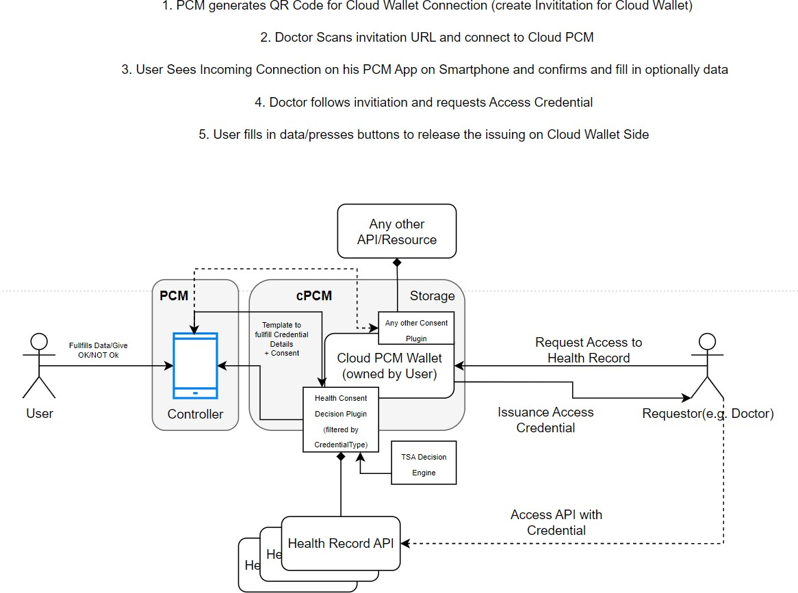
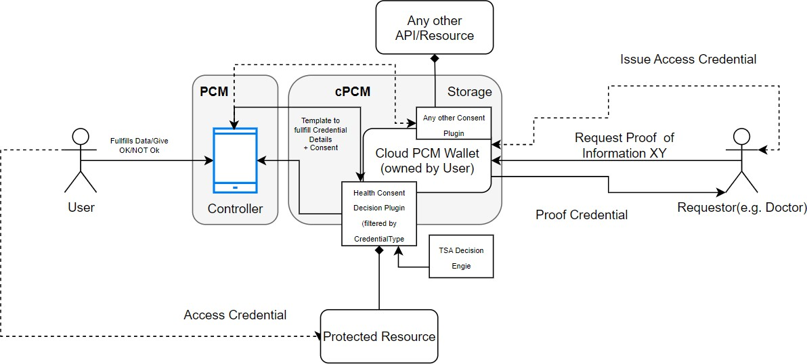

## Software Requirements Specification for Gaia-X Federation Services Personal Credential Manager Extension 1 IDM.PCM.E1

Published by

eco -- Association of the Internet Industry (eco -- Verband der Internetwirtschaft e.V.) Lichtstrasse 43h 50825 Cologne, Germany

Copyright 

© 2023 eco -- Association of the Internet Industry
This work is licensed under the Creative Commons attribution 4.0nInternational License. To view a copy of this license, visit <http://creativecommons.org/licenses/by/4.0/> or send a letter to Creative Commons, PO Box 1866, Mountain View, CA 94042, USA

#### 1  [Introduction ](#introduction)

>##### 1.1  [Document Purpose ](#document-purpose)

>##### 1.2  [Product Scope ](#product-scope)

>##### 1.3  [Definitions, Acronyms and Abbreviations](#definitions-acronyms-and-abbreviations)

>##### 1.4  [References ](#references)

>##### 1.5  [Document Overview ](#document-overview)

#### 2  [Product Overview ](#product-overview)

>##### 2.1  [Product Perspective ](#product-perspective)

>##### 2.2  [Product Functions ](#product-functions)

>##### 2.3  [Product Constraints ](#product-constraints)

>##### 2.4  [User Classes and Characteristics](#user-classes-and-characteristics)

>##### 2.5  [Operating Environment ](#operating-environment)

>##### 2.6  [User Documentation ](#user-documentation)

>##### 2.7  [Assumptions and Dependencies ](#assumptions-and-dependencies)

>##### 2.8  [Apportioning of Requirements](#apportioning-of-requirements)

#### 3  [Requirements ](#requirements)

>##### 3.1  [External Interfaces ](#external-interfaces)

>>###### 3.1.1  [User Interfaces ](#user-interfaces)

>>###### 3.1.2  [Hardware Interfaces ](#hardware-interfaces)

>>###### 3.1.3  [Software Interfaces ](#software-interfaces)

>>###### 3.1.4  [Communications Interfaces ](#communications-interfaces)

>##### 3.2  [Functional ](#functional)

>>###### 3.2.1  [Managing Connections ](#managing-connections)

>>###### 3.2.2  [Managing Credentials ](#managing-credentials)

>>###### 3.2.3  [Wallet Backup ](#wallet-backup)

>>###### 3.2.4  [Credential Wallet Importing/Exporting](#credential-wallet-importingexporting)

>>###### 3.2.5  [DIDComm Login Support ](#didcomm-login-support)

>>###### 3.2.6  [NFC Scanning (DID Input) ](#nfc-scanning-did-input)

>>###### 3.2.7  [SIOP Login ](#siop-login)

>>###### 3.2.8  [App Settings Configuration (personalization)](#app-settings-configuration-personalization)

>>###### 3.2.9  [Ledger Selection ](#ledger-selection)

>>###### 3.2.10 [Mediator Selection ](#mediator-selection)

>>###### 3.2.11 [DID Document Service Endpoint Support](#did-document-service-endpoint-support)

>>###### 3.2.12 [Cloud wallet management ](#cloud-wallet-management)

>##### 3.3  [Other Nonfunctional Requirements](#other-nonfunctional-requirements)

>>###### 3.3.1  [HTTP Requirements ](#http-requirements)

>>###### 3.3.2  [Logging Requirements ](#logging-requirements)

>>###### 3.3.3  [Security Requirements ](#security-requirements)

>>###### 3.3.4  [Safety Requirements ](#safety-requirements)

>>###### 3.3.5  [Security Requirements ](#security-requirements-1)

>>###### 3.3.6  [Software Quality Attributes](#software-quality-attributes)

>>###### 3.3.7  [Business Rules ](#business-rules)

>##### 3.4  [Compliance ](#compliance)

>##### 3.5  [Design and Implementation ](#design-and-implementation)

>>###### 3.5.1  [Installation ](#installation)

>>###### 3.5.2  [Distribution ](#distribution)

>>###### 3.5.3  [Usability ](#usability)

>>###### 3.5.4  [Maintainability ](#maintainability)

>>###### 3.5.5  [Portability ](#portability)

>>###### 3.5.6  [Interoperability ](#interoperability)

#### 4  [System Features ](#system-features)

>##### 4.1  [Managing Connections ](#managing-connections-system-features)

>##### 4.2  [Managing Credentials ](#managing-credentials-system-features)

>##### 4.3  [Wallet Backup ](#wallet-backup-system-features)

>##### 4.4  [Credential Wallet Importing/Exporting ](#credential-wallet-importingexporting-system-features)

>##### 4.5  [DIDComm Login support ](#didcomm-login-support-system-features)

>##### 4.6  [NFC Scanning (DID Input) ](#nfc-scanning-did-input-system-features)

>##### 4.7  [SIOP Login ](#siop-login-system-features)

>##### 4.8  [App Settings Configuration (personalization)](#app-settings-configuration-personalization-system-features)

>##### 4.9  [Ledger Selection ](#ledger-selection-system-features)

>##### 4.10 [Smartphone Application ](#smartphone-application)

#### 5  [Verification ](#verification)

>##### 5.1  [Core Verification Requirements](#core-verification-requirements)

>##### 5.2  [Functionality Acceptance Criteria](#functionality-acceptance-criteria)

>>###### 5.2.1  [Connections ](#connections)

>>###### 5.2.2  [Managing credentials ](#managing-credentials-verification)

>>###### 5.2.3  [Credential Wallet synchronization](#credential-wallet-synchronization)

>>###### 5.2.4  [NFC ](#nfc)

>>###### 5.2.5  [SIOP Login Support ](#siop-login-support)

>>###### 5.2.6  [App Settings Configuration (personalization)](#app-settings-configuration-personalization-verification)

>>###### 5.2.7  [Ledger Selection ](#ledger-selection-verification)

>>###### 5.2.8  [Mediator Selection ](#mediator-selection-verification)

>>###### 5.2.9  [Cloud Wallet Management ](#cloud-wallet-management-verification)

[Appendix A: Glossary ](#appendix-a-glossary)

[Appendix B: Consent Management ](#appendix-b-consent-management)

Appendix C: Personal Credential Manager Layering overview

## List of Figures 

> Figure 1: Personal Credentials Manager. Layering overview (s. appendix C) 
>
> Figure 2: Personal Credentials Manager: Component View
> 

## List of Tables 

> Table 1: References 
>
> Table 2: User Classes and Characteristics 
>
> Table 3: Apportioning of Requirements 
>
> Table 4: Functional Requirements Connection Management
> 
> Table 5: Functional Requirements Credential Management
>
> Table 6: Functional Requirements Wallet Backup 
>
> Table 7: Functional Requirements Credential Wallet Importing/Exporting 
>
> Table 8: Functional Requirements DIDComm Login support
>
> Table 9: Functional Requirements NFC Scanning (DID Input)
>
> Table 10: Functional Requirements SIOP Login 
>
> Table 11: Functional Requirements App Settings Configuration (personalization) 
>
> Table 12: Functional Requirements Ledger Selection 

# Introduction

> To get general information regarding Gaia-X and the Gaia-X Federation Services please refer to \[TAD\] and \[PRD\].

## Document Purpose

> The purpose of the document is to specify the requirements of the Identity Management and Trust Subcomponent "Personal Credential Manager" with the intention of a European wide public tender for implementing this software. Main audience for this document is attendees of the public tender, which are able to supply an open-source software solution for the area of identity and document verification with the purpose to provide a credential manager application to be used by natural persons to participate in the Gaia-X trust structure.

## Product Scope

> The purpose of this product is to provide all necessary components for the self-sovereign administration of the digital identity of a principal in the Gaia-X context on a mobile device. The Personal Credential Manager enables a natural person to act as a *principal* of an organization within the SSI-based Gaia-X ecosystem in a privacy-preserving, trustful and secure way. This comprises the following main functionalities:

-   AIP 2.0 Support

-   Reception and management of W3C verifiable credentials

-   Presenting W3C and AIP 2.0 Verifiable Presentations to other parties in a proved manner

-   Secure storage and management of respective secrets

-   Remote Management of the PCM Cloud Solution

-   Support of the Cloud PCM functionality

-   Enhancements in QR Code Support Reading and Presentation

> Extension of the Personal Credential Manager must be developed as additional features of the existing smartphone-based application for Android and iPhone platforms.

> Furthermore, the scope includes the provision of the developed software in a usable format for end users including the respective distribution channels (e.g., App Stores).

------

> 
>
> If it's required to do code restructurings, modifying the current solution by adding new microservices etc. then this is explicitly allowed.
>
> Please note, that it is explicitly required to deliver the software up and running. Responsibility for existing code cannot be shifted to previous development teams.

-------

## Definitions, Acronyms and Abbreviations

> All requirements from other documents are referenced by \[IDM.\<document-id\>.XXXXX\] as defined in the chapter "Methodology" in the document \[IDM.AO\].

## References

| Concept                                             | Source                                                                                                                                                                               | Status       |
|----------------------------------------------------|--------------------------------------------------------------------------------------------------------------------------------------------------------------------------------------|--------------|
| Hyperledger Aries Concepts (AIP2.0)                | [GitHub](https://github.com/hyperledger/aries-rfcs/tree/main/concepts/0302-aries-interop-profile)                                                                                    | 03-17-2023   |
| Specflow (Getting Started with BDD)                | [Specflow](https://specflow.org/bdd/)                                                                                                                                              | 03-18-2023   |
| Cryptographic Key Length Recommendation (CryptoLen) | [KeyLength](https://www.keylength.com/en)                                                                                                                                          | 03-18-2023   |
| DIDComm Messaging (Daniel Hardman)                 | [Identity Foundation](https://identity.foundation/didcomm-messaging/spec/#out-of-band-messages)                                                                                 | 03-18-2023   |
| OpenID Self-Issued OpenID Connect Provider DID     | [OpenID](https://openid.net/specs/openid-connect-self-issued-v2-1_0.html)                                                                                                         | -            |
| FIPS 140-2 (Federal Information Processing Standard) | [Wikipedia](https://en.wikipedia.org/wiki/FIPS_140-2)                                                                                                                               | 03-17-2023   |
| Gaia-X WP1 (Architecture Overview)                | Refer to "annex_IDM.AO" (Base of functional specification)                                                                                                                         | -            |
| GXFS Organization Credential Manager W-Stack       | Refer to "annex_IDM.OCM.W-STACK"                                                                                                                                                    | -            |
| Gaia-X Federation Service Non-functional Requirements (NF.SPBD) | Refer to annex "GXFS_Nonfunctional_Requirements_SPBD"                                                | -            |
| OpenID for Verifiable Credential Issuance (OID4VC)  | [OpenID](https://openid.net/specs/openid-4-verifiable-credential-issuance-1_0.html)                                                                                                 | 03-17-2023   |
| OpenID for Verifiable Presentations (OID4VP)       | [OpenID](https://openid.net/specs/openid-4-verifiable-presentations-1_0.html)                                                                                                      | 03-17-2023   |
| Gaia-X Policy Rules (PRD)                         | [Gaia-X Docs](https://docs.gaia-x.eu/policy-rules-committee/policy-rules-labelling/22.11/)                                                                                         | -            |
| SOG-IS Crypto Evaluation Scheme (SOG-IS)          | [SOG-IS Document](https://www.sogis.eu/documents/cc/crypto/SOGIS-Agreed-Cryptographic-Mechanisms-1.2.pdf)                                                                      | 03-18-2023   |
| Gaia-X Architecture Document (TAD)                | [Gaia-X Docs](https://docs.gaia-x.eu/technical-committee/architecture-document/22.10/#new_tab)                                                                                   | 03-17-2023   |

> Table 1: References

## Document Overview

> The document describes the product perspective, functions, and constraints. It furthermore lists the functional and non-functional requirements and defines the additional system features in detail. The listed requirements are binding. Requirements as an expression of normative specifications are identified by a unique ID in square brackets (e.g. **\[IDM.ID.EX.Number\]**) and the keywords MUST, MUST NOT, SHOULD, SHOULD NOT, MAY, corresponding to RFC 2119 \[RFC 2119\], are written in capital letters (see also \[IDM.AO\] - Methodology).

# Product Overview

## Product Perspective

> The personal credential manager is used by a natural person. Within the Gaia-X terminology, such a natural person is named *principal*. The principal utilizes the PCM in the respective form factor to store VCs issued to her/him as well as to prove the statements necessary to obtain a service.
>
> The PCM must extend the support of following overall processes:

-   DIDComm Authentication as the generic way to authenticate a principal

-   Secure backup and restore by file

-   SIOP DID as a method to implement SSI based Login Methods \[DID SIOP\]

-   Consent Management

-   OIDC4VP for presenting Credentials

-   OIDC4VC to receive Credentials

-   Remote Management and Usage of cPCM

-   DID Document Based Protocol Selection

-   AIP 1.0 Protocol

-   AIP 2.0 Protocol \[AIP2.0\]

-   Bi-directional synchronization with Cloud Personal Credential Wallet

-   Train Selection

---------

> The existing code base MUST be reused and further improved. Other microservices MAY have different languages and architectures.
----------

## Product Functions

> Personal Credentials Manager (PCM) enables end-users to interact with the DID-based ecosystem in a privacy-preserving way. PCM acts as a user representative tool which is securely holding the acquired distributed identities and identity attributes and provides the technical means to selectively disclose the aforementioned attributes for authentication and service consumption. The following represents the high-level functional architecture of the PCM.

> Figure 1: Personal Credentials Manager. Layering overview (s. appendix C)
>
> As presented in the PCM big picture layering overview, PCM consists of different components which effectively comprise the following layers:

-   The front-end layer

-   PCM Core (Wallet) layer

-   as well as the Mediator (Relay) layer

> **The front-end layer** is comprised of the following features and components:

-   End User Authentication

-   Graphical User Interface (GUI)

-   Local Input Interfaces

> *End User Authentication* component provides for the implementation of secure user authentication policies which can include but are not limited to fingerprint authentication in the smart phone case, PIN, password, etc.
>
> *The GUI component* enables end users to interact with the PCM and use the PCM functions. *Local Input Interfaces* comprise QR-code processing, bootstrapping over Near Field Communication (NFC), etc., and by that provides communication initiation, direct, or peer-to-peer (contact) exchange as well as credentials presentation ensuring the
> direct proximity requirements.
>
> **PCM Core (Wallet) layer** consists of the following features and components:

-   W3C VC synchronization with cPCM for offline Presentation

-   Consent Management over cPCM

-   Remote Management of cPCM

-   Backup/Restore over cPCM

-   Remote Control of the Cloud PCM by using a didcomm protocol over the websocket connection

> The *Managing Credentials* feature provides the functionality for receiving credentials issued by other participants, enabling the user to view and inspect his/her credentials, and the basic functionality for proofing credential attributes to other participants according to the SSI paradigm. The credential manager ensures that the user is always in control, which attributes are provided to which participant. It further enables to create and check proofs according to the SSI paradigm to, for example, achieve DIDComm or SIOP Login, etc.
>
> The *Wallet Backup* feature provides for the secure backup and restore capabilities of the obtained credentials and possibly the app settings.
>
> The automatic synchronization feature enables the users to configure a unique channel of communication between PCM and cPCM. Which enables the und users to synchronize W3C VC from PCM to cPCM and via versa.
>
> The figure below is the planned component structure which are a matter of this tender (derivations allowed from SW perspective):
>
> 
>

>Figure 2: Personal Credentials Manager: Component View
-------------
>
> 
>
> The existing code base contains partially the components on this picture. In a planned software architecture for this tender all of these components MUST be considered for restructuring the code.

--------------

## Product Constraints

#####   \[IDM.PCM.E1.00000\] OID4VP/VC Compatibility 

> The PCM MUST support exchange over OID4VP protocol \[OID4VP\] and all other applicable standards needed for communication with the Organization Credential Manager and OCM W- Stack \[IDM.OCM.W-STACK\].
>  

#####   \[IDM.PCM.E1.00001\] AIP 2.0 Compatibility 

> The PCM MUST support AIP 2.0 as specified in Aries Interop Profile \[AIP2.0\].  

#####   \[IDM.PCM.E1.00002\] Offline Presentation 

> All W3C credentials in the wallet (including the synced one) MUST be available for the offline presentation. "Offline" is in this case defined as "No third Party involved" which is able to track the data. Means the presentation MUST be possible by QR Code, NFC or Bluetooth peer to peer from one Smartphone to the other. This includes a capability to identify trusted verifiers and issuers on the smartphone before presentation e.g., by using Bloom Filters.  

#####   \[IDM.PCM.E1.00003\] Cloud PCM 

> The Cloud PCM (also part oft his tender) MUST be used as Integration Layer and as remote backend to store and synchronize W3C credentials including the remote management/control of the cPCM agents and backup storage. The cPCM connection MUST NOT implement Aries
>
> Protocols or Aries RFCs, because the PCM and cPCM connection acts as private connection of the PCM Smartphone App with its private backend (cPCM).  

## User Classes and Characteristics

  | User Class | Description | Expertise | Privilege Level | Product Usage |
|------------ | ---------------- | ---------- | ----------------- | -------------- |
| Personal User | The person in possession of the personal credential manager using all functionality of the product | Low | High | Frontend |

> Table 2: User Classes and Characteristics

## Operating Environment

> Please refer to \[TDR\] for further binding requirements regarding the operating environment.

#####   \[IDM.PCM.E1.00003\] Operating Environments 
> The product needs to support different operating environments.

-   Android operating system versions which are still supported by Google (as of now \> Android version 9) MUST be supported.

-   iOS operating system versions which are still supported by Apple MUST be supported.

>  

## User Documentation

> Please refer to \[TDR\] for further requirements regarding documentation.

#####   \[IDM.PCM.E1.00004\] Participant Administration Documentation 

> The documentation MUST contain:

-   Installation Manuals

-   Cryptographic Initialization (if applicable)

-   Description of Deployment/Compile Process

-   Description of the Automatic Tests / Verification

-   How to build the product from source code  

#####   \[IDM.PCM.E1.00005\] Participant Documentation 

> The documentation MUST contain:

-   Short Software Description/Usage

-   Usage Guide

-   GDPR Design Decisions

-   Security Concept

-   Operations Concept

-   FAQ

-   Keyword Directory  

## Assumptions and Dependencies

> An understanding of the overall Gaia-X architecture and philosophy is necessary. Please refer to \[TAD\] and \[PRD\].

## Apportioning of Requirements

  | Feature                     | Priority |
| ---------------------------- | -------- |
| OIDV4VP/VC support           | 1        |
| AIP 2.0 support              | 1        |
| Cloud wallet synchronization  | 1        |
| QR generation                | 1        |
| NFC tag generation           | 1        |
| NFC Scanning (DID Input)     | 1        |
| SIOP Login                   | 1        |
| cPCM Remote Control          | 1        |
| Consent Management           | 1        |

> Table 3: Apportioning of Requirements

# Requirements

> Further binding requirements can be found in \[TDR\].

## External Interfaces

### User Interfaces

#####   \[IDM.PCM.E1.00006\] Smartphone GUI 

> The PCM MUST provide a GUI for the PCM user to support the enhancements for the Cloud PCM. This requires support for Consent Management, as well for Notifications and the support of W3C credentials provided by the OCM W-Stack \[IDM.OCM.W-STACK\].  

### Hardware Interfaces

#####   \[IDM.PCM.E1.00007\] Camera 

> The PCM MUST be able to use the Smartphone's camera to scan QR-Codes for W3C credentials and OpenID4VC issuing Proposals \[OID4VC\].  

#####   \[IDM.PCM.E1.00008\] NFC 

> The PCM must be able to use the Smartphone's NFC communication to receive DIDComm invitation messages, OpenID4VC Issuing Proposals and W3C Credentials.  

### Software Interfaces

#####   \[IDM.PCM.E1.00009\] Secure Storage 

> The PCM implementation MUST be able to use secure storage (internal storage, encrypted storage, dedicated key storage) by using enclaves provided by the target platform/smartphone operating system for storing PCM data within the smartphone. Especially for key exchange between the Cloud PCM and the PCM App is this required to protect the keys safely. It's highly recommended to use asymmetric encryption protocols by utilizing internal enclaves to exchange the keys (e.g., CMS or other schemes)  

### Communications Interfaces

#####   \[IDM.PCM.E1.00010\] DIDComm v2 Interface 
> The DIDComm interface MUST be provided to send DIDComm messages to be processed by the PCM and the PCM Cloud.  

#####   \[IDM.PCM.E1.00011\] NFC 

> The PCM App MUST support the exchange of W3C VCs/VPs and Connection invitations by using NFC (reading and presentation).  

#####   \[IDM.PCM.E1.00011\] Local SIOP Endpoint 

> The PCM MUST provide an endpoint for SIOP requests \[DID SIOP\]. Within the SIOP protocol, the PCM implements the role of the Self-Issued OpenID Provider (SIOP). Applications (PRs (Relying Parties) in SIOP terminology can send SIOP requests to the PCM. The PCM will process such requests and reply with a SIOP response. The SIOP process MUST be triggerable via an URL scheme which is registered during the App Installation (e.g., gxfspcm://siop?\...)  

#####   \[IDM.PCM.E1.00012\] Personal Wallet and Secrets Synchronization 

> Given that PCM users for security reasons import or export their Personal Wallet and secrets, an interface MUST be provided so that Synchronization between PCM and Cloud Wallet (cPCM) can be established by using web socket protocols. This feature is dedicated to W3Cs and is not relevant for Aries based credentials. All secrets relevant for presentation of W3C credentials MUST be transferred encrypted and in an approach that the private key isn't transmitted at once and just "activatable" by user knowledge. For instance, by using key derivation functions.  

#####   \[IDM.PCM.E1.00013\] Mediator selection based on DID document 

> PCM needs to be able to find the correct mediator, based on the record in the DID document as well the other endpoints for communication MUST be discovered by the DID document. All endpoint types MUST be configurable with the following format by enhancing the W3C spec [1]:
>
                    > {
                    >
                    > id: {idName}
                    >
                    > type: {typeName},
                    >
                    > accept: \["didcomm/v2","didcomm/v1",{otherProtocols}\],
                    >
                    > serviceEndpoint:\["https://..."\]
                    >
                    > }
                    >
                    >  

###### [1] [<u>[https://www.w3.org/TR/did-core/#example-usage-of-the-service-property]</u>](https://www.w3.org/TR/did-core/#example-usage-of-the-service-property)

#####   \[IDM.PCM.E1.00014\] cPCM Connection 
> The mobile application needs a secure communication web socket channel to the PCM Cloud to synchronize Credentials, receiving Consent Notifications, Credential Requests etc. The application MUST implement for this purpose WebSockets and didcomm v2. The message protocol provided by the cPCM MUST be implemented and documented as "RFC" similar to Hyperledger Aries RFC documentation format [2].  

###### [2] [<u>[https://github.com/hyperledger/aries-rfcs/blob/main/concepts/0074-didcomm-best-practices/README.md#rfc-naming]</u>](https://github.com/hyperledger/aries-rfcs/blob/main/concepts/0074-didcomm-best-practices/README.md#rfc-naming)

## Functional

### Managing Connections

#####   \[IDM.PCM.E1.00015\] Connection creation via invitation 

> DIDComm connection requests can be provided to the PCM user via QR-Code, Text input (URL), NFC (Out of band messages according to DIDComm Messaging specification \[DIDComm\]), and by regular DIDComm messages received. Especially for the device pairing between PCM and Cloud OCM MUST be process described and developed (e.g., by a special invitation protocol)  

### Managing Credentials

#####   \[IDM.PCM.E1.00016\] Receive a Verifiable Credential (VC) 

> The PCM MUST be able to receive VCs according to AIP 2.0 and OpenId4VC Standards for the underlying issuing protocols. The AIP 1.0 functionality MUST remain and still be supported in the App.  

#####   \[IDM.PCM.E1.00017\] Answer Request for Verifiable Presentation (VP) 

>
> The PCM MUST be able to answer presentation requests according to AIP 2.0 and OpenId4VC Standards for the underlying issuing protocols. The AIP 1.0 functionality MUST remain and still be supported in the App.  

#####   \[IDM.PCM.E1.00018\] Display history of presenting verifiable Presentations (VPs) to other participants 

> The PCM user can view detailed information about the history of showing/proofing identity information to other participants. For each run of the Proof protocol, the information shown MUST include all information contained in the VP shown to a verifier including the remote one from the cPCM, to which verifier it has been shown, and transaction date/time.  

### Wallet Backup

#####   \[IDM.PCM.E1.00019\] Restore Backup 
> The PCM MUST provide a function to restore a backup containing all information stored in the PCM.
>
> The Backup/Restore format MUST be compatible to guarantee PCM App interoperability between form factors and between different providers or Smartphone Applications and Cloud Wallet (cPCM). This MUST be for W3C credentials an encrypted JSON-LD file or for Aries Credentials just a file.  

### Credential Wallet Importing/Exporting

#####   \[IDM.PCM.E1.00020\] Sync Wallets 

> The PCM MUST provide a functionality to synchronize different personal cloud wallet instances (Cloud PCM), e.g., synchronize a cloud wallet (cPCM) with a smartphone wallet. Secure methods for Importing the PCM Secrets MUST be provided. The synchronization MUST consist of W3C Credentials, Aries credentials are out of scope for syncing.  

### DIDComm Login Support

#####   \[IDM.PCM.E1.00021\] DIDComm Login Support 

> The PCM MUST support the Login via DIDComm by using the DIDComm Login protocol of the cPCM (no aries protocol, internal protocol of cPCM).  

### NFC Scanning (DID Input)

#####   \[IDM.PCM.E1.00024\] NFC 

> The PCM MUST support scanning of W3C Credentials and Invitations via NFC. The Presentation of Credentials and Presentations MUST be provided via NFC as well. 

### SIOP Login

#####   \[IDM.PCM.E1.00022\] SIOP Login Support 

> The PCM MUST implement a function to process SIOP requests \[DID SIOP\] in the role of the Self- Issued OpenID Provider (SIOP). Applications (RPs (Relying Parties) in SIOP terminology) can send SIOP requests to the PCM. The PCM will process such requests and reply with a SIOP response.
>
>  

### App Settings Configuration (personalization)

#####   \[IDM.PCM.E1.00023\] Configure Cloud wallet linking 

> The PCM MUST enable the user to configure a secure connection for data synchronization by realizing a prior pairing to the Cloud PCM via DIDComm.  

### Ledger Selection

#####   \[IDM.PCM.E1.00024\] Select Ledger 

> The PCM MUST NOT be enabled to select compatible Ledgers. The selection is pre-configured from a list of supported ledgers and all other Information MUST be extracted from DID Documents.  

### Mediator Selection

#####   \[IDM.PCM.E1.00025\] Select Mediator 

> The mediator MUST be selected by using the DID Document (resolved over DID) to find the right endpoints.  

### DID Document Service Endpoint Support

#####   \[IDM.PCM.E1.00026\] Service Endpoint Usage 

> The DID Document Service Endpoints MUST be used for the PCM functionality, and the formats and accept attributes MUST be considered next to the key material provided by the document.
>
>  

### Cloud wallet management

#####   \[IDM.PCM.E1.00027\] Remote controller of the Cloud PCM 

> The PCM user MUST be able to control the basic functions of the Cloud PCM (cPCM) such as Consent management and Credential management. The proofs requested by an external actor, can be consented by the user by using the PCM.
>
> A Diagram for the Consent Management is in Appendix B and MUST be realized on SSI based W3C mechanisms.  

#####   \[IDM.PCM.E1.00028\] Selective Disclosure JWT 

> The component MUST support Selective Disclosure JWT described in the specification [3]. 

###### [3] [<u>[https://datatracker.ietf.org/doc/draft-ietf-oauth-selective-disclosure-jwt/]</u>](https://datatracker.ietf.org/doc/draft-ietf-oauth-selective-disclosure-jwt/)

## Other Nonfunctional Requirements

#####   \[IDM.PCM.E1.00029\] Architecture Changes 

> All Architecture Changes MUST be aligned with the Principal before implementation.  

### HTTP Requirements

#####   \[IDM.PCM.E1.00030\] HTTPS 

> All HTTP communication MUST be protected by state-of-the-art transport security algorithms such as TLS 1.2 / TLS 1.3 (all protocol version numbers may be superseded by upcoming standards). Each endpoint of the product MUST support TLS certificates which are configurable by the administrator of the system.  

#####   \[IDM.PCM.E1.00031\] HTTP Protocol Definitions 

> All HTTP Endpoints MUST follow RFC 7231 [4] and RFC 5789 [5], but it MAY be chosen what of the protocols is necessary to realize the functionality. For problem reports the RFC7807 [6] MUST be used in combination with Standard HTTP Error Codes.

###### [4] [<u>[https://tools.ietf.org/html/rfc7231]</u>](https://tools.ietf.org/html/rfc7231)
###### [5] [<u>[https://tools.ietf.org/html/rfc5789]</u>](https://tools.ietf.org/html/rfc5789)
###### [6] [<u>[https://tools.ietf.org/html/rfc7807]</u>](https://tools.ietf.org/html/rfc7807)

### Logging Requirements

#####   \[IDM.PCM.E1.00032\] Data Minimization 

> The data minimization principle is expressed in Article 5(1)(c) of the GDPR and Article 4(1)(c) of Regulation (EU) 2018/1725, which provide that personal data must be \"adequate, relevant and limited to what is necessary in relation to the purposes for which they are processed\". The data shall be stored for a period of time in accordance with national requirements and, as a minimum, shall consist of the following elements:

(a) node\'s identification

(b) message identification

(c) message data and time

> All logged data/information MUST be documented in the GDPR design decisions for a GDPR review.  

### Security Requirements

#### General Security Requirements

> Each Gaia-X Federation Service SHALL meet the requirements stated in the document "Specification of non-functional Requirements Security and Privacy by Design" \[NF.SPBD\].
>
> Federation Services specific requirements will be documented in the next chapter.

#### Service Specific Security Requirements

> This chapter will describe the service specific requirements, which will extend the requirements defined in the chapter above.

#####   \[IDM.PCM.E1.00033\] Secure user authentication 

> To ensure that only allowed entities can access the PCM authentication methods MUST be implemented to grant access to the PCM. The PCM MUST provide a method for securing user login with at least two authentication factors.  

#####   \[IDM.PCM.E1.00034\] Multimodal biometric authentication 

> The PCM MAY provide (multimodal) biometric authentication methods to improve the usability of the PCM.  

#####   \[IDM.PCM.E1.00035\] Protection of Secrets (Wallet) and Security for the Restore process 

> The PCM secrets MUST be stored and processed securely. There MUST be additional security procedures in place to guarantee that the secret key can be recovered when the holder requires it, even in case the holder himself has lost access to his unlock key. State of the art methods that MAY be applied are for example Shamir's Secret Sharing.  

#####   \[IDM.PCM.E1.00036\] Secure communication between frontend and cloud agent/wallet 

> The communication interface in case of the cloud agent/Wallet form factor must be protected according to the latest security standards.  

#####   \[IDM.PCM.E1.00037\] Cryptographic Algorithms and Cipher Suites 

> Cryptographic algorithms and TLS cipher suites SHALL be chosen based on the recommendation from the German Federal Office for Information Security (BSI) or SOG-IS. These recommendations and the recommendations of other institutions and standardization organization are quite similar [7] \[CryptoLen\]. The recommendations can be found in the technical guidelines [8] TR 02102- 1 \[TR02102-1\] and TR 02102-2 \[TR02102-2\] or SOG-IS Agreed Cryptographic Mechanisms [9] \[SOG- IS\].  

###### [7] See [<u>[https://www.keylength.com/en]</u>](https://www.keylength.com/en) for a comparison
###### [8] See [<u>[https://www.bsi.bund.de/EN/Service-Navi/Publications/TechnicalGuidelines/tr02102/tr02102_node.html]</u>](https://www.bsi.bund.de/EN/Service-Navi/Publications/TechnicalGuidelines/tr02102/tr02102_node.html) for a comparison
###### [9] See [<u>[https://www.sogis.eu/documents/cc/crypto/SOGIS-Agreed-Cryptographic-Mechanisms-1.2.pdf]</u>](https://www.sogis.eu/documents/cc/crypto/SOGIS-Agreed-Cryptographic-Mechanisms-1.2.pdf) for a comparison

#####   \[IDM.PCM.E1.00038\] Security by Design 

> The software security MUST be from the beginning a design principle. Means separation of concerns, different administrative roles, especially for private key material and separate access to the data MUST be covered from the first second. It MUST be described in the security concept, what are the different security risks of the product and how they are mitigated (e.g., by Threat Modeling Protocols)  

#####   \[IDM.PCM.E1.00039\] Installation of Critical Security Updates 

> Node operators SHALL deploy security critical updates without undue delay.  

#####   \[IDM.PCM.E1.00040\] Avoid HTTP Request Smuggling 

> To avoid Request Smuggling attacks, the product MUST implement a standard which handles this kind of attack by design, because the attack vector results in an insufficient implementation of the header handling. The chosen way to handle it MUST be shared with the Principal for further alignment with the other implementers of all other subcomponents within the GXFS project and MUST be described in the security concept.  

#####   \[IDM.PCM.E1.00041\] Pentesting 
> All parts of the product have to be pentested, at least for the following criteria:

1.  Unauthorized Access to the System MUST be tested

2.  Unauthorized Actions MUST be triggered without a user action

3.  All Interfaces MUST be tested

> It's RECOMMENDED to test more attack vectors and document it for the purpose to mitigate it in later versions.  

#####   \[IDM.PCM.E1.00042\] Storage of Secrets 

> The storage of secret information such as private keys MUST take place in state-of-the-art secure environments to protect secret data confidentiality and integrity. Examples of this are Secure Enclaves, TPMs, HSM or Secure Vaults. In case (Personal) Agents are not equipped with a secure storage it MAY also be possible to store the secrets in a third party (e.g., Cloud) provider (e.g., Secure Wallet) that MUST provide overall the same level of security as the aforementioned methods. 

#####   \[IDM.PCM.E1.00043\] Secret Distribution and Usage 

> The product MUST ensure interoperability of cryptographic primitives and components by public standards and MUST use secure state of the art methods to create and import secrets into the secure storage, as well as performing cryptographic operations (e.g., encryption or digital signatures). For Key distribution, state of the art DKMS methods MUST be implemented. 

#####   \[IDM.PCM.E1.00044\] Support for Potential Requirements for Secret Storages 

> Devices that hold cryptographic information and perform cryptographic functions MUST be compliant with standard PKCS #11 or other comparable cryptography standards. Moreover, the products MUST be potentially eligible for a FIPS-140-2 or ETSI/Common Criteria certification with the minimum-security level necessary to operate securely in the Gaia-X ecosystem. Security Levels in FIPS-140-2 range from 1 to 4. Current HSM Cloud Service offerings (AWS, Azure, GCP) are Level 3 (Source: \[FIPS\]).

#####   \[IDM.PCM.E1.00045\] Special Availability and Scalability Requirements for Secret Storage Components 

> Secret Storage components play a central role in storage, encryption and digital signing in the Gaia-X ecosystem, thus they can become a single point of failure for a Gaia-X participant, for example an organization. Therefore, methods and procedures to ensure the availability and scalability of the Secret Storage functionality MUST be implemented.

### Safety Requirements

#####   \[IDM.PCM.E1.00046\] Major Releases 

> All used software components MUST use the major releases with Long Term Support. If no LTS is available, all components MUST use the latest major releases with security hardening.  

### Security Requirements

#####   \[IDM.PCM.E1.00047\] CVE Patches 

> All software components MUST have applied CVE patches, which are available for major releases.  

### Software Quality Attributes

#####   \[IDM.PCM.E1.00048\] Software Quality Requirements

> All software components MUST be compliant to the requirements within the quality assurance repository [10]. This includes continuing testing, branch models which verify the code quality at check in time and automated behavior testing of all defined quality attributes.  

###### [10] [<u>[https://gitlab.com/gaia-x/data-infrastructure-federation-services/quality-assurance/-/issues]</u>](https://gitlab.com/gaia-x/data-infrastructure-federation-services/quality-assurance/-/issues) 

### Business Rules

#####   \[IDM.PCM.E1.00049\] Software Consistency 

> The used technologies MUST have consistency. Standard technologies e.g., Databases MUST be abstracted over JDBC, authentication over OIDC etc.  

## Compliance

#####   \[IDM.PCM.E1.00050\] GDPR Audit Logging 

> All GDPR relevant access to personal relevant data MUST be logged for a later audit.  

#####   \[IDM.PCM.E1.00051\] GDPR Data Processing 

> If it is necessary to process person-relevant data, it MUST be earmarked to a clearly defined business process, which has to be described in the GDPR design decisions. All relevant personally identifiable data MUST be deleted after the processing, if applicable.
>  

## Design and Implementation

> Please also refer to \[TDR\] for further requirements.

### Installation

#####   \[IDM.PCM.E1.00052\] iOS and Android Installation 

> The product must be easily installable and comply with the installation requirements depending on the target platforms.  

### Distribution

> There are no dedicated distribution requirements for the PCM.

### Usability

#####   \[IDM.PCM.E1.00053\] GUI usability 

> GUI design MUST comply with common GUI recommendations for the target platforms.  

#####   \[IDM.PCM.E1.00054\] PCM accessibility 

> The product MUST comply with the accessibility requirements depending on the target platforms. 

#####   \[IDM.PCM.E1.00055\] Internationalization Support 

> The PCM MUST support internationalization. At least the following languages MUST be supported: English.  

### Maintainability

#####   \[IDM.PCM.E1.00056\] Continuous Integration 

> All tests MUST be coded in a continuous tool to ensure the software quality in a further development. All the necessary scripts and setups MUST be provided on the public code repository to make it possible for everyone to compile and execute the product.  

### Portability

#####   \[IDM.PCM.E1.00057\] App Portability 

> The product MUST be portable to different devices, e.g., tablets. This includes as well lower end devices (Moto G3, Pixel 4a etc.) to support non-discriminatory all users without consideration of the purchasing power.  

### Interoperability

#####   \[IDM.PCM.E1.00058\] Interoperability of IT security features and algorithms 

> The following interoperability requirements of the respective IT security features and algorithms MUST be ensured across the system components:

-   Interoperability of crypto algorithms and protocols (including the novel peer-reviewed ones through the established bodies and communities)

-   Interoperability of secure secret transfer protocols (such as the holistic usage of PKCS#11 for HSM communication, etc.)

-   Format interoperability of crypto material (such as the holistic usage of PKCS#12 for relevant cases)  

# System Features

## Managing Connections - System Features

> Using this product, the user shall be enabled to manage his Gaia-X connections. Technically, connections are represented by DID-based connections to other Gaia-X participants. Connection data includes the contact DID, DID Document, DIDComm connection status data, and communication history (e.g., VPs exchanged).
>
> Via the PCM, the user must be able to establish DIDComm connections based on invitations, which can be input to the PCM by scanning QR-Codes, Text input (URL), NFC, and by regular DIDComm Messages.
>
> The following functions are required for connection management:

  | Functional Requirement                        |
| --------------------------------------------- |
| **Functions**                                 |
| <u>- Connection creation via invitation </u>        |

> Table 4: Functional Requirements Connection Management

## Managing Credentials - System Features

> The product shall enable the user to manage his verifiable credentials (VCs). Other Gaia-X participants can issue VCs to the user in possession of the personal credential manager. The user must be enabled to inspect his VCs and to show/proof VC information via verifiable presentations (VPs) to other Gaia-X participants.
>
> Within the Gaia-X environment, persons in the role of Gaia-X principals need to be able to receive a VC onboarding them as a principal to an organization. Within the PCM, the function "receive a VC" can be used for this purpose.
>
> The following functions are required for management of VCs:

  | Functional Requirement                                                  |
| ----------------------------------------------------------------------- |
| **Functions**                                                           |                                                                   |
| - [Receive a Verifiable Credential (VC)]                                |
| - [Answer Request for Identity Information (VP)]                        |
| - [Display history of presenting identity information (VPs) to other participants] |

> Table 5: Functional Requirements Credential Management

## Wallet Backup - System Features

> The product must provide the functionality to create backups of the information stored within the PCM. Backups must be stored in a secure way, so that only the PCM user, who created the backup, can restore the backup. Backups must contain the full status of the PCM.
>
> The following functions are required for backup:

  | Functional Requirement |
| ---------------------- |
| **Functions**         |
|                      |
| - <u> [Restore Backup] </u> |

> Table 6: Functional Requirements Wallet Backup

## Credential Wallet Importing/Exporting - System Features

> To ensure interoperability between providers, applications and form factors, the PCM must implement a procedure to export and import
> personal wallet data and secret information.
>
> The following functions are required for this feature:

  | Functional Requirement |
| ---------------------- |
| **Functions**         |
| - <u> [Sync Wallets]</u>|

> Table 7: Functional Requirements Credential Wallet Importing/Exporting

## DIDComm Login support - System Features

> The product must be able to scan DIDComm messages via NFC, to support DIDComm login.

  | Functional Requirement |
| ---------------------- |
| **Functions**         |
| - <u> [DIDComm Login Support] </u> |

> Table 8: Functional Requirements DIDComm Login support

## NFC Scanning (DID Input) - System Features

> The product must be able to scan DIDComm messages via NFC, to support DIDComm login.

  | Functional Requirement |
| ---------------------- |
| **Functions**         |
| - <u>[Scan NFC] </u> |

> Table 9: Functional Requirements NFC Scanning (DID Input)

## SIOP Login - System Features

> The product must provide support for applications to login into services via the SIOP protocol. The following functions are required for this:

  | Functional Requirement |
| ---------------------- |
| **Functions**         |
| - <u>[SIOP Login Support] </u> |
>
> Table 10: Functional Requirements SIOP Login

## App Settings Configuration (personalization) - System Features

> The product must provide means to the PCM user to configure and save PCM application preferences. The following functions are required for this:

  | Functional Requirement |
| ---------------------- |
| **Functions**         |
| - <u>[Configure Cloud wallet linking] </u> |

> Table 11: Functional Requirements App Settings Configuration (personalization)

## Ledger Selection - System Features

#####   \[IDM.PCM.E1.00059\] Ledger Support (DID) and Ledger-agnostic behavior 

> The product MUST support multiple Ledgers according to the Architecture Overview \[IDM.AO\] , e.g., it MUST NOT be bound to a dedicated Ledger by design and the PCM user should not be able to select ledgers - It\'s pre-configured .  

    | Functional Requirement |
| ---------------------- |
| **Functions**         |
| - <u>[Select Ledger] </u> |

> Table 12: Functional Requirements Ledger Selection

## Smartphone Application

##### Smartphone Application 

> The product MUST implement the form factor "Smartphone Application", so that the PCM can be used as a full-featured app that implements the GUI functionalities, the connectivity functionalities and credential and personal wallet management locally on the smartphone. The backup/restore mechanisms and the configuration management are handled as well in the mobile Smartphone app. This alternative can benefit from all physical input and output interfaces present in a Smartphone, such as cameras for scanning QR-Codes for connection invitations or the NFC communication. Because Smartphones do not usually have a fixed communication endpoint an SSI-Mediator needs to remain in the Cloud for PCM Notifications.
>
> The smartphone application MUST include the following system features:

-   Managing Connections

-   Managing Credentials

-   Wallet Backup

-   End User Authentication

-   QR-Code scanning (DID Input)

-   Notification Support

-   App Settings Configuration

-   Ledger Selection

> The smartphone application additionally include the following system features:

-   Credential Wallet Importing/Exporting/Syncing

-   NFC tag generation and scanning

-   SIOP Login

# Verification

## Core Verification Requirements

#####   \[IDM.PCM.E1.00060\] Behavior Driven Design 

> Verification of fulfillment of the requirements and characteristics MUST be done using automated tests which are part of the deliverables. They SHOULD be done by patterns of the Behavior Driven Development \[BDD\] using the "Gherkin Syntax".  

## Functionality Acceptance Criteria

### Connections

#####   \[IDM.PCM.E1.00063\] Connection invitation 

> When users are authenticated, then they can receive notification for "Connection" via QR-Code, Text input (URL), NFC. The information is shown to the users via the GUI and requests can be validated. The users can accept or to reject the request. When the request is accepted, then the PCM performs the DIDComm protocol required to establish the connection. The connection must be established and stored in the PCM storage, so that it can be used later.  

### Managing credentials - Verification

#####   \[IDM.PCM.E1.00064\] Receive a Verifiable Credential (VC) 

> When a user is authenticated and within an established connection, the user must get notification for VC issuing requests. The user must get the possibility to accept or to reject the request. The request is validated, and the information is shown to the user via the GUI. The issued credential MUST be stored in connected OCM(s) of the cPCM and synced to PCM in the case of a W3C credential. In the case of an Indy credential, the App MUST show the credential by using the remote functionality but MUST NOT sync the indy credential physically. In both cases, two credentials are visible in the PCM App, the indy one is highlighted as "cloud credential", the other one as "Local Credential". When the PCM App receives a Indy/W3C credential directly from an OCM, the credential MUST be also marked as "Local Credential". Is any "cloud credential" removed from an connected OCM within the cPCM, the App will sync those changes and push the credential to history overview.  

#####   \[IDM.PCM.E1.00065\] Answer Request for Verifiable Presentation (VP) 

> When users are authenticated and Connection established, then:

-   If the user has given his consent, a VP has been proved to the verifier.

-   If the presentation has not been completed successfully, problems have been reported to the users via GUI.

> The App MUST demonstrate that (synced) W3C or Indy Credentials can be presented offline without any connection to the cPCM. In the online case, the App MUST demonstrate that a credential can be presented via the remote control of the cPCM.  

#####   \[IDM.PCM.E1.00066\] Display history of presenting verifiable presentations (VPs) 

> When users are authenticated, then they can view detailed information about the history of showing/proofing identity information to other participants. History information must list information about the transaction date and time, and to whom has been presented.  

#####   \[IDM.PCM.E1.00067\] Restore Backup 

> When users are authenticated, they must have a function to restore a backup containing all information stored in the PCM and Cloud wallet (cPCM). When users select the backup file, the restore must be performed only after confirming the security authentication. When successful restoration is completed, users should be informed about the status and they must see all their data(such as VC, Connections, etc.).  

#####   \[IDM.PCM.E1.00068\] Card View 

> The PCM MUST present all credentials as cards (like credit cards), with a logo if the credential is in the cloud available or local. The view MUST support easy selection and combination of credentials for the different remote and local use cases.  

### Credential Wallet synchronization

#####   \[IDM.PCM.E1.00069\] Sync Wallets 

> When users are authenticated, then they must be able to configure synchronization with Cloud Wallet(cPCM). After successfully establishing a secure connection, then bi-directional synchronization MUST be triggered by using DIDComm v2 messages. A DIDComm v2 protocol is provided an documented for each use case of the cPCM (e.g., list VCs)  

### NFC

#####   \[IDM.PCM.E1.00070\] Scan NFC 

> A user MUST be able to scan an active NFC tag which can contain W3C VC/VP or Connection Invitations. The App MUST successfully process that.  

#####   \[IDM.PCM.E1.00071\] Write NFC 

> A user MUST be able to write an NFC tag which can contain W3C VC/VP or Connection Invitations. Another PCM on a mobile device MUST accept that presentation.  

### SIOP Login Support

#####   \[IDM.PCM.E1.00072\] SIOP Login Support 

> The cPCM MUST implement a function to process SIOP requests \[DID SIOP\] in the role of the Self- Issued OpenID Provider (SIOP). Applications (RPs (Relying Parties) in SIOP terminology) can send SIOP requests to the PCM. The PCM will process such requests and reply with a SIOP response.  

### App Settings Configuration (personalization) - Verification

#####   \[IDM.PCM.E1.00073\] Configure cloud wallet linking 

> When users are authenticated, the PCM MUST enable the users to configure secure connection(management link) to Cloud wallet. 

### Ledger Selection - Verification

#####   \[IDM.PCM.E1.00074\] Select Ledger 

> The PCM MUST not be enabled to select compatible Ledgers from the PCM GUI. The selection is pre-configured from a list of supported ledgers during the build process.  

### Mediator Selection - Verification

#####   \[IDM.PCM.E1.00075\] Select Mediator 

> The PCM MUST be able to work with different Mediators by using the DID Document, without recompiling the app.  

### Cloud Wallet Management - Verification

#####   \[IDM.PCM.E1.00076\] Remote controller of the Cloud PCM (cPCM) 

> The PCM user MUST be able to control the basic functions of the Cloud PCM(cPCM) such as Consent management, Connection Acceptance, Presentation Allowance, Issuing and Credential management. When users are authenticated and secure management connection is established with cPCM, then the users must be able to consent and access to existing documents.  

#####   \[IDM.PCM.E1.00077\] Plugin Management 

> The plugin management of the cPCM MUST be supported in the App. It MUST be possible to use the plugins, configured and enable/disable them remotely. The remote protocol MUST be used to request from plugins a token, present that token to verifiers or holders. All other standard functionality like issuing of credentials, consent etc. which the plugin framework of the cPCM offers, must be supported as well. 

## Appendix A: Glossary 

> For the glossary refer to IDM.AO Glossary/Terminology \[IDM.AO\]

## Appendix B: Consent Management 

--------
>  
>
>The flows are just for example. Flow optimizations can be proposed. 

---------
**Flow 1: External Actor requests Access to Protected API**

> **Flow 2: External Actor gives Access to protected Resources**

## Appendix C: Personal Credential Manager Layering overview

